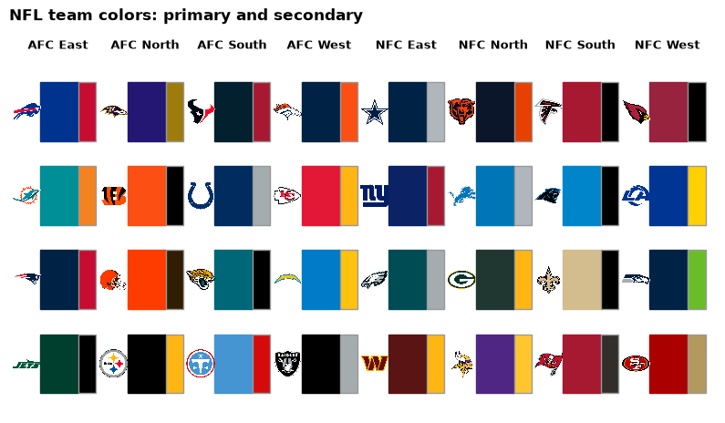
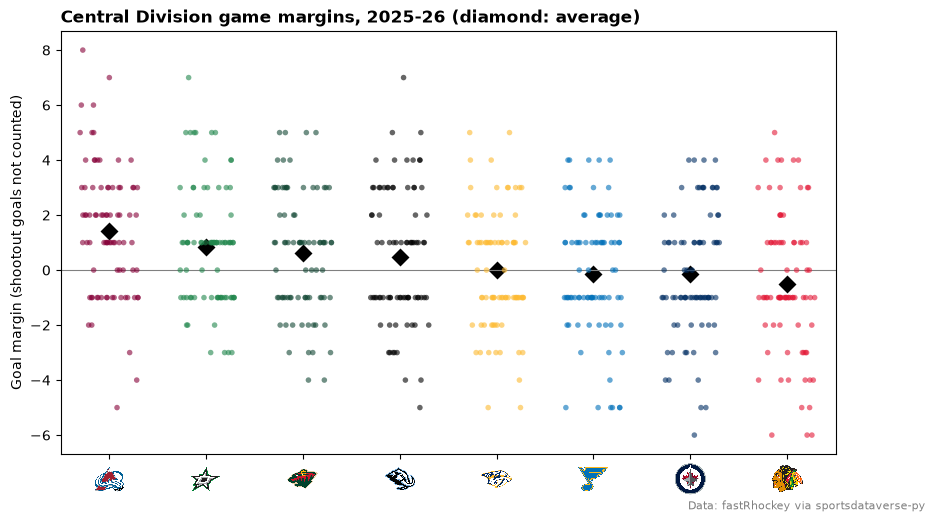
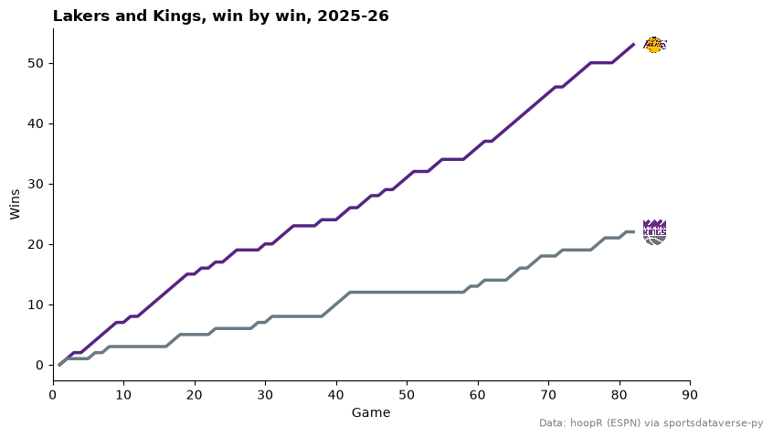
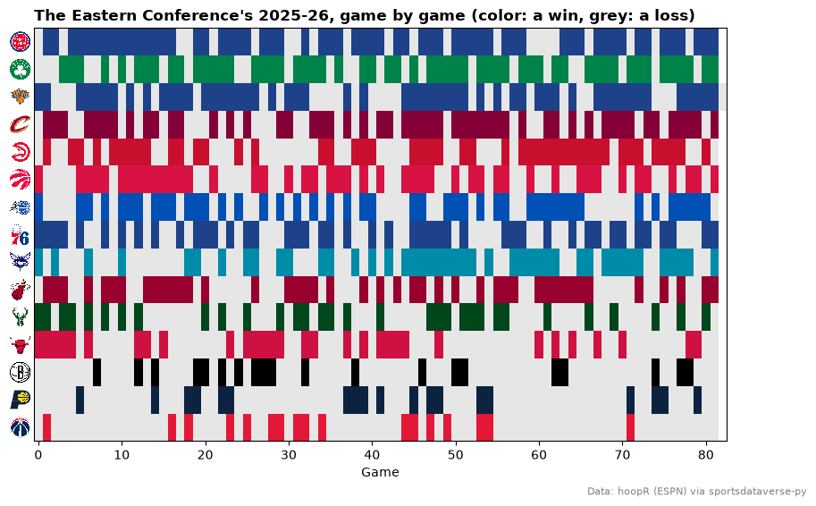
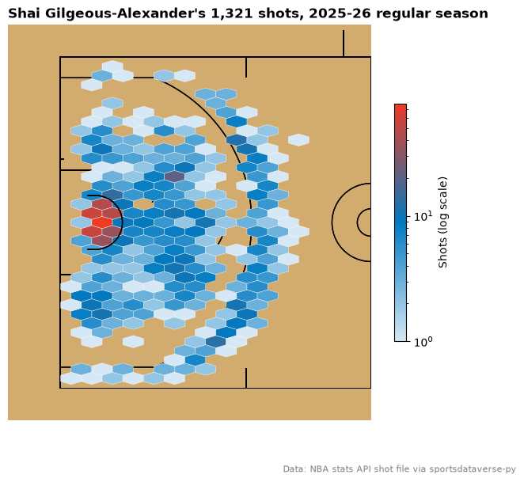
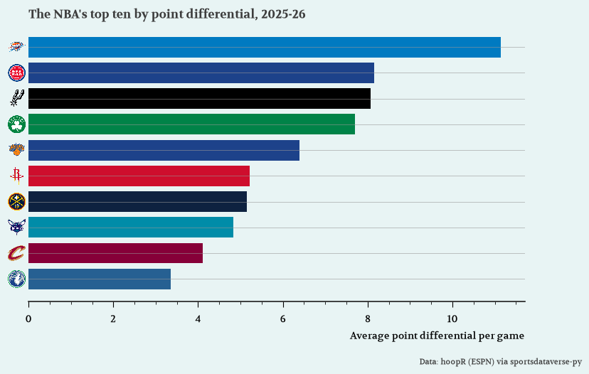
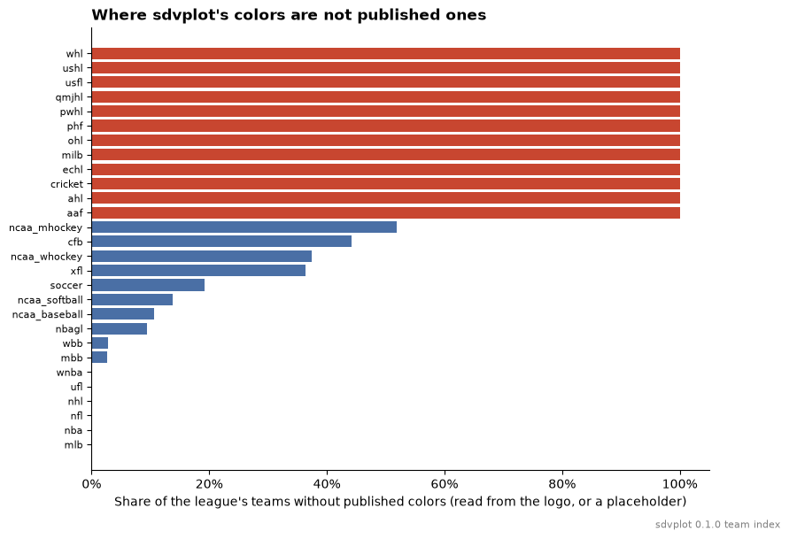

# Colors and themes

Nine recipes for team colors: a league's palette at a glance, one color per row of your data, readable text
on team-colored cells, seaborn, colors that clash, a league-wide colormap, PyPalettes colormaps, morethemes
styles, and where a team's colors come from. The data is one season each from the NFL (nflverse), the NBA
(hoopR and the stats-API shot file the SportsDataverse publishes on GitHub) and the NHL (fastRhockey), all
through sportsdataverse-py.

```python
import matplotlib.pyplot as plt
import numpy as np
import polars as pl
import seaborn as sns
import sportsdataverse.nba as nba
import sportsdataverse.nfl as nfl
import sportsdataverse.nhl as nhl
from matplotlib.colors import ListedColormap, to_rgb

import sdvplot

NFL_SEASON = 2025  # nflverse names a season by the year it starts
SEASON = 2026  # the 2025-26 NBA and NHL season, named by the year it ends
HOOPR = "Data: hoopR (ESPN) via sportsdataverse-py"
FASTRHOCKEY = "Data: fastRhockey via sportsdataverse-py"

nba_box = nba.load_nba_team_boxscore(seasons=[SEASON]).filter(pl.col("season_type") == 2)
nhl_box = nhl.load_nhl_team_box(seasons=[SEASON]).filter(pl.col("game_id") // 10_000 % 100 == 2)
nba_box.height, nhl_box.height
```

<div class="sdv-output">

```text
(2470, 2624)
```

</div>

## 1. See a league's palette

`palette(league)` is a plain `{team: "#hex"}` dict, `which="secondary"` the other color. Laid out by division,
with each team's logo, it is a quick check of what a chart will look like:

```python
divisions = nfl.load_nfl_teams().select(team="team_abbr", division="team_division")
primary, secondary = sdvplot.palette("nfl"), sdvplot.palette("nfl", which="secondary")
teams = divisions.filter(pl.col("team").is_in(list(primary))).sort("division", "team")

fig, ax = plt.subplots(figsize=(10, 5.5))
for col, (division, group) in enumerate(teams.group_by("division", maintain_order=True)):
    ax.text(col * 1.25 + 0.55, 4.25, division[0], ha="center", fontsize=9, fontweight="bold")
    for row, team in enumerate(group["team"]):
        y = 3 - row
        ax.add_patch(plt.Rectangle((col * 1.25 + 0.3, y + 0.15), 0.55, 0.7, color=primary[team]))
        ax.add_patch(plt.Rectangle((col * 1.25 + 0.85, y + 0.15), 0.25, 0.7, color=secondary[team], ec="#999999"))
        sdvplot.add_logos(ax, [col * 1.25 + 0.1], [y + 0.5], [team], league="nfl", height=0.08)
ax.set_xlim(-0.15, 10)
ax.set_ylim(-0.1, 4.5)
ax.axis("off")
ax.set_title("NFL team colors: primary and secondary", loc="left", fontweight="bold")
plt.show()
```

<div class="sdv-output">



</div>

## 2. One color per row of your data

`team_colors` returns one color per value, in the container it was given: a polars Series in gives a Series
out, ready for `with_columns`. Values in any id system work, and a team that does not resolve gets `None`.
There are two colors per team; ask for any other and you get a `ValueError` that says which exist.

```python
top = (
    nhl_box.group_by("team_abbrev", maintain_order=True)
    .agg(gf=pl.col("goals").mean())
    .sort(["gf", "team_abbrev"], descending=[True, False])
    .head(5)
)
top = top.with_columns(
    primary=sdvplot.team_colors("nhl", top["team_abbrev"]),
    secondary=sdvplot.team_colors("nhl", top["team_abbrev"], which="secondary"),
)
try:
    sdvplot.team_colors("nhl", top["team_abbrev"], which="alternate")
except ValueError as e:
    print(e)
top
```

<div class="sdv-output">

```text
which must be one of ['primary', 'secondary'], got 'alternate'
```

| team_abbrev | gf       | primary | secondary |
|-------------|----------|---------|-----------|
| COL         | 3.682927 | #860038 | #005ea3   |
| CAR         | 3.609756 | #e30426 | #000000   |
| PIT         | 3.573171 | #000000 | #fdb71a   |
| TBL         | 3.536585 | #003e7e | #ffffff   |
| BUF         | 3.512195 | #00468b | #fdb71a   |

</div>

## 3. Readable text on team-colored cells

Text on a team color needs the right ink: white on navy, black on gold. great_tables' `data_color` picks it
for you (`autocolor_text`, on by default), so fill a team column from `palette` and let it choose. sdvplot's
own team-colored outputs do the same: `gt_theme_sdv_team`, `gt_tiers` and `surface()` choose a readable ink
for each fill.

```python
from great_tables import GT

west_ids = sdvplot.teams("nba").filter(pl.col("conference") == "Western Conference").select("team_id")
west = (
    nba_box.with_columns(pl.col("team_id").cast(pl.Int64).cast(pl.Utf8))
    .join(west_ids, on="team_id")
    .group_by("team_abbreviation", "team_display_name", maintain_order=True)
    .agg(wins=pl.col("team_winner").sum(), diff=(pl.col("team_score") - pl.col("opponent_team_score")).mean())
    .sort(["wins", "team_abbreviation"], descending=[True, False])
)
colors = sdvplot.palette("nba", teams=west["team_abbreviation"])
(
    GT(west)
    .tab_header("Western Conference, 2025-26", "Each team's cell in its primary color")
    .cols_label(team_abbreviation="", team_display_name="Team", wins="W", diff="Point diff.")
    .fmt_number("diff", decimals=1, force_sign=True)
    .data_color("team_abbreviation", palette=list(colors.values()), domain=list(colors))
    .tab_source_note(HOOPR)
)
```

<div class="sdv-output">

<iframe class="sdv-frame" src="/outputs/cookbooks/colors-and-themes/7_0.html" title="HTML output" height="480" loading="lazy"></iframe>

</div>

## 4. A seaborn palette

seaborn takes the `palette` dict for `hue`; key it by the same values as the hue column. Every regular-season
goal margin of the Central Division, with each team's average:

```python
CENTRAL = ["CHI", "COL", "DAL", "MIN", "NSH", "STL", "UTA", "WPG"]
central = nhl_box.filter(pl.col("team_abbrev").is_in(CENTRAL)).with_columns(
    margin=pl.col("goals") - pl.col("goals_against")
)
means = central.group_by("team_abbrev", maintain_order=True).agg(pl.col("margin").mean())
order = means.sort(["margin", "team_abbrev"], descending=[True, False])["team_abbrev"]
palette = sdvplot.palette("nhl", teams=central["team_abbrev"])

np.random.seed(2026)  # seaborn jitters from numpy's global random state: a seed keeps the chart the same each run
fig, ax = plt.subplots(figsize=(10, 5.5))
sns.stripplot(central.to_pandas(), x="team_abbrev", y="margin", hue="team_abbrev", order=order.to_list(),
              palette=palette, jitter=0.3, alpha=0.6, size=4, legend=False, ax=ax)  # fmt: skip
sns.pointplot(central.to_pandas(), x="team_abbrev", y="margin", order=order.to_list(), color="black",
              linestyle="none", markers="D", errorbar=None, ax=ax)  # fmt: skip
ax.axhline(0, color="grey", linewidth=0.8)
ax.set_xlabel("")
ax.set_ylabel("Goal margin (shootout goals not counted)")
ax.set_title("Central Division game margins, 2025-26 (diamond: average)", loc="left", fontweight="bold")
sdvplot.axis_logos(ax, "x", league="nhl", height=0.08)
fig.text(0.99, 0.01, FASTRHOCKEY, ha="right", fontsize=8, color="grey")
plt.show()
```

<div class="sdv-output">



</div>

## 5. When two teams' colors clash

Some rivals share a color: the Lakers' and Kings' primaries are both purple. Measure the gap between two
colors (a plain RGB distance does the job) and fall back to one team's secondary when it is too small.

```python
def distance(a: str, b: str) -> float:
    return sum((x - y) ** 2 for x, y in zip(to_rgb(a), to_rgb(b), strict=True)) ** 0.5


lal, sac = sdvplot.team_colors("nba", ["LAL", "SAC"])
print(f"primaries {lal} vs {sac}: distance {distance(lal, sac):.2f}")
if distance(lal, sac) < 0.25:
    sac = sdvplot.team_colors("nba", "SAC", which="secondary")
    print(f"using the Kings' secondary {sac}: distance {distance(lal, sac):.2f}")

race = (
    nba_box.filter(pl.col("team_abbreviation").is_in(["LAL", "SAC"]))
    .sort("game_date")
    .with_columns(
        game_no=pl.int_range(1, pl.len() + 1).over("team_abbreviation"),
        wins=pl.col("team_winner").cast(pl.Int32).cum_sum().over("team_abbreviation"),
    )
)
fig, ax = plt.subplots(figsize=(9, 5))
for team, color in {"LAL": lal, "SAC": sac}.items():
    run = race.filter(pl.col("team_abbreviation") == team)
    ax.plot(run["game_no"], run["wins"], color=color, linewidth=2.5)
    sdvplot.add_logos(ax, [run["game_no"][-1] + 3], [run["wins"][-1]], [team], league="nba", height=0.09)
ax.set_xlim(0, 90)
ax.set_xlabel("Game")
ax.set_ylabel("Wins")
ax.spines[["top", "right"]].set_visible(False)
ax.set_title("Lakers and Kings, win by win, 2025-26", loc="left", fontweight="bold")
fig.text(0.99, 0.01, HOOPR, ha="right", fontsize=8, color="grey")
plt.show()
```

<div class="sdv-output">

```text
primaries #552583 vs #5a2d81: distance 0.04
using the Kings' secondary #6a7a82: distance 0.34
```



</div>

A secondary is not always safe either: the Celtics' is white, which vanishes on a white chart. Check it the same
way against the background.

## 6. A league-wide colormap

For an image (`imshow`) or anything else that maps numbers to colors, build a `ListedColormap` from the
palette, one entry per team. Here every Eastern Conference game is one cell, in the team's color for a win
and light grey for a loss: each team's season as a barcode, best record on top.

```python
east_ids = sdvplot.teams("nba").filter(pl.col("conference") == "Eastern Conference").select("team_id")
east = (
    nba_box.with_columns(pl.col("team_id").cast(pl.Int64).cast(pl.Utf8))
    .join(east_ids, on="team_id")
    .sort("game_date")
    .with_columns(game_no=pl.int_range(pl.len()).over("team_abbreviation"))
)
order = (
    east.group_by("team_abbreviation", maintain_order=True)
    .agg(pl.col("team_winner").sum())
    .sort(["team_winner", "team_abbreviation"], descending=[True, False])
)["team_abbreviation"].to_list()
cmap = ListedColormap(sdvplot.team_colors("nba", order) + ["#e6e6e6"])  # one color per team, then a loss

grid = [[float("nan")] * (east["game_no"].max() + 1) for _ in order]
for team, game_no, won in east.select("team_abbreviation", "game_no", "team_winner").iter_rows():
    row = order.index(team)
    grid[row][game_no] = row if won else len(order)

fig, ax = plt.subplots(figsize=(10, 6))
ax.imshow(grid, cmap=cmap, vmin=-0.5, vmax=len(order) + 0.5, aspect="auto", interpolation="nearest")
ax.set_yticks(range(len(order)), order)
ax.tick_params(axis="y", length=0)
sdvplot.axis_logos(ax, "y", league="nba", height=0.055)
ax.set_xlabel("Game")
ax.set_title("The Eastern Conference's 2025-26, game by game (color: a win, grey: a loss)", loc="left",
             fontweight="bold")  # fmt: skip
fig.text(0.99, 0.01, HOOPR, ha="right", fontsize=8, color="grey")
plt.show()
```

<div class="sdv-output">



</div>

## 7. A colormap from a team's colors with PyPalettes

PyPalettes' `create_cmap` turns a list of colors into a matplotlib colormap; built from a pale tint and a
team's two colors, it shades a density chart in that team. Shai Gilgeous-Alexander's shots, from the stats-API
shot file the SportsDataverse publishes as a GitHub release (no stats.nba.com call), moved onto sportypy's
court with `court_coords`:

```python
from pypalettes import create_cmap

shots = nba.load_nba_stats_shots(seasons=SEASON - 1)  # this loader takes the season's start year
sga = sdvplot.court_coords(shots.filter((pl.col("person_id") == 1628983) & (pl.col("season_type_id") == "2")))
okc_primary, okc_secondary = sdvplot.team_colors("nba", "OKC"), sdvplot.team_colors("nba", "OKC", which="secondary")
cmap = create_cmap(["#d6e8f5", okc_primary, okc_secondary], cmap_type="continuous")

fig, ax = plt.subplots(figsize=(7.5, 6.5))
sdvplot.surface("nba", ax=ax, display_range="defense")
hb = ax.hexbin(sga["court_x"], sga["court_y"], gridsize=(15, 18), extent=(-47, 0, -25, 25), mincnt=1,
               bins="log", cmap=cmap, linewidths=0.3, edgecolors="white", zorder=20)  # fmt: skip
fig.colorbar(hb, ax=ax, shrink=0.6, label="Shots (log scale)")
ax.set_title(f"Shai Gilgeous-Alexander's {sga.height:,} shots, 2025-26 regular season", loc="left", fontweight="bold")
fig.text(0.99, 0.01, "Data: NBA stats API shot file via sportsdataverse-py", ha="right", fontsize=8, color="grey")
plt.show()
```

<div class="sdv-output">



</div>

## 8. A matplotlib theme from morethemes, with team colors on top

morethemes styles the whole figure: background, grid and a Google font that `set_theme` downloads and
registers. `set_theme` changes matplotlib's global settings, so call it inside `plt.rc_context()` to style one
chart and restore your defaults afterwards. Team colors and logos draw over the theme as usual.

```python
import morethemes as mt

net = (
    nba_box.group_by("team_abbreviation", maintain_order=True)
    .agg(games=pl.len(), diff=(pl.col("team_score") - pl.col("opponent_team_score")).mean())
    .filter(pl.col("games") > 10)
    .sort(["diff", "team_abbreviation"], descending=[True, False])
    .head(10)
    .reverse()
)
with plt.rc_context():
    mt.set_theme("economist")
    fig, ax = plt.subplots(figsize=(9, 5.5))
    ax.barh(net["team_abbreviation"], net["diff"], color=sdvplot.team_colors("nba", net["team_abbreviation"]))
    sdvplot.axis_logos(ax, "y", league="nba", height=0.07)
    ax.set_xlabel("Average point differential per game")
    ax.set_title("The NBA's top ten by point differential, 2025-26", loc="left", fontweight="bold")
    fig.subplots_adjust(bottom=0.17)
    fig.text(0.99, 0.01, HOOPR, ha="right", fontsize=8)
    plt.show()
```

<div class="sdv-output">



</div>

## 9. Check where a color comes from, and supply your own

`color_source` says where a team's colors come from. Most are published, by nflverse or ESPN. A team no source
publishes colors for gets the two dominant colors of its current logo (`"logo"`), which approximate the team's
own, and two men's college hockey teams with no archived logo get placeholders (`"fallback"`) that only keep teams
apart. Check it before you call a color a team's own; for a published chart, put any color you know better in your
own dict.

```python
share = (
    sdvplot.teams()
    .group_by("league", maintain_order=True)
    .agg(teams=pl.len(), derived=pl.col("color_source").is_in(["logo", "fallback"]).mean())
    .sort("derived", "league")
)
fig, ax = plt.subplots(figsize=(9, 6.5))
ax.barh(share["league"], share["derived"], color=["#c84630" if f == 1 else "#4a6fa5" for f in share["derived"]])
ax.xaxis.set_major_formatter(lambda v, _: f"{v:.0%}")
ax.set_xlabel("Share of the league's teams without published colors (read from the logo, or a placeholder)")
ax.tick_params(axis="y", labelsize=8)
ax.spines[["top", "right"]].set_visible(False)
ax.set_title("Where sdvplot's colors are not published ones", loc="left", fontweight="bold")
fig.text(0.99, 0.01, f"sdvplot {sdvplot.__version__} team index", ha="right", fontsize=8, color="grey")
plt.show()

city = sdvplot.teams("soccer").filter(pl.col("team_id") == "382")  # ESPN's id for Manchester City
print(city.select("name", "color_primary", "color_source").row(0))
print(sdvplot.palette("soccer", teams=["382"]) | {"382": "#6CABDD"})  # your own color wins
```

<div class="sdv-output">



```text
('Manchester City', '#99c5ea', 'espn')
{'382': '#6CABDD'}
```

</div>

## Run it yourself

<a href="pathname:///notebooks/cookbooks/colors-and-themes.ipynb" download>Download the notebook</a> (outputs cleared) or [open it on GitHub](https://github.com/sportsdataverse/sdvplot/blob/main/examples/notebooks/cookbooks/colors-and-themes.ipynb).
