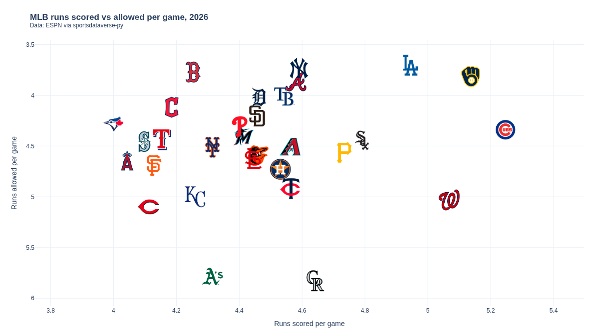
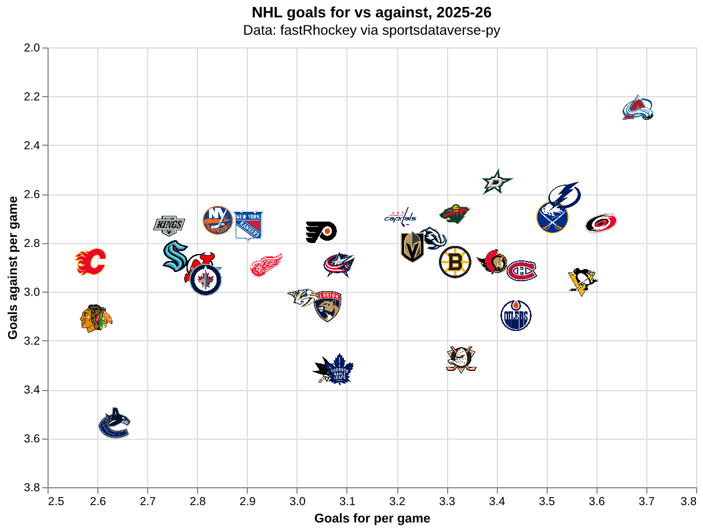

# Interactive charts

Eleven recipes for team logos on web charts: Plotly, Altair, Bokeh and HoloViews scatters and bars with hover
details, logos on axes where the library allows it, a Folium map of team locations, self-contained HTML, and
static PNG exports for social posts. Every adapter shares the `add_logos(target, x, y, teams, league=...)`
call. The data is one season each from the NFL (nflverse), MLB (ESPN), the WNBA and NBA (wehoop and hoopR),
the NHL (fastRhockey), and men's college basketball and college football (hoopR and cfbfastR), all through
sportsdataverse-py.

```python
import tempfile
from pathlib import Path

import altair as alt
import folium
import holoviews as hv
import plotly.graph_objects as go
import polars as pl
import sportsdataverse.cfb as cfb
import sportsdataverse.mbb as mbb
import sportsdataverse.mlb as mlb
import sportsdataverse.nba as nba
import sportsdataverse.nfl as nfl
import sportsdataverse.nhl as nhl
import sportsdataverse.wnba as wnba
from bokeh.io import output_notebook, show
from bokeh.models import ColumnDataSource, HoverTool
from bokeh.plotting import figure
from IPython.display import Image, display

import sdvplot

output_notebook(hide_banner=True)
hv.extension("bokeh", logo=False)
NFL_SEASON = CFB_SEASON = 2025  # football names a season by the year it starts
SEASON = 2026  # the 2026 MLB and WNBA seasons, and the 2025-26 NBA, NHL and college basketball season
```

`output_notebook` and `hv.extension` load BokehJS once for the whole notebook. The shared tables, each one
small: NFL EPA per play, MLB final standings from ESPN, WNBA and NHL scoring per game (more than ten games
drops the WNBA All-Star Game's teams), NBA three-point attempts and the Big 12's adjusted efficiency.

```python
nfl_weeks = nfl.load_nfl_team_stats([NFL_SEASON]).filter(pl.col("season_type") == "REG")
plays = pl.col("attempts") + pl.col("sacks_suffered") + pl.col("carries")
epa = pl.col("passing_epa") + pl.col("rushing_epa")
nfl_epa = (
    nfl_weeks.group_by("team", maintain_order=True)
    .agg(off_epa=epa.sum() / plays.sum())
    .join(
        nfl_weeks.group_by(team=pl.col("opponent_team"), maintain_order=True).agg(def_epa=epa.sum() / plays.sum()),
        on="team",
    )
    .sort("team")
)

mlb_standings = (
    mlb.espn_mlb_standings(season=SEASON)
    .with_columns(
        rs=pl.col("points_for") / pl.col("games_played"), ra=pl.col("points_against") / pl.col("games_played")
    )
    .sort("team_abbreviation")
)

wnba_teams = (
    wnba.load_wnba_team_boxscore(seasons=[SEASON])
    .filter(pl.col("season_type") == 2)
    .group_by("team_abbreviation", maintain_order=True)
    .agg(games=pl.len(), scored=pl.col("team_score").mean(), allowed=pl.col("opponent_team_score").mean())
    .filter(pl.col("games") > 10)
    .sort("team_abbreviation")
)

nhl_teams = (
    nhl.load_nhl_team_box(seasons=[SEASON])
    .filter(pl.col("game_id") // 10_000 % 100 == 2)
    .group_by("team_abbrev", maintain_order=True)
    .agg(gf=pl.col("goals").mean(), ga=pl.col("goals_against").mean(), sv=pl.col("save_pctg").mean())
    .sort("team_abbrev")
)

nba_threes = (
    nba.load_nba_team_boxscore(seasons=[SEASON])
    .filter(pl.col("season_type") == 2)
    .group_by("team_id", "team_abbreviation", maintain_order=True)
    .agg(
        games=pl.len(),
        fg3a=pl.col("three_point_field_goals_attempted").mean(),
        fg3_pct=pl.col("three_point_field_goals_made").sum() / pl.col("three_point_field_goals_attempted").sum(),
    )
    .filter(pl.col("games") > 10)
    .with_columns(pl.col("team_id").cast(pl.Int64).cast(pl.Utf8))
    .sort("team_abbreviation")
)

big12 = (
    mbb.load_mbb_ratings(SEASON)
    .join(
        sdvplot.teams("mbb").filter(pl.col("conference") == "Big 12 Conference").select("team_id", "name"),
        on="team_id",
    )
    .sort("team_id")
)
mlb_standings["games_played"].max(), nfl_epa.height, wnba_teams.height, nhl_teams.height, big12.height
```

<div class="sdv-output">

```text
(162.0, 32, 15, 32, 16)
```

</div>

## 1. Plotly: logos as markers, with hover details

Plotly draws the logos as layout images, which have no hover, so put the hover text on a transparent marker
trace at the same points. Call `add_logos` after the traces: it works out the axis ranges (with room for the
logos) and pins them, and the logos then zoom with the data. A reversed range set before the call is kept.

```python
fig = go.Figure(
    go.Scatter(
        x=nfl_epa["off_epa"],
        y=nfl_epa["def_epa"],
        mode="markers",
        marker={"size": 30, "opacity": 0},
        customdata=nfl_epa["team"],
        hovertemplate="%{customdata}<br>Offense %{x:+.3f} EPA/play<br>Defense %{y:+.3f}<extra></extra>",
    )
)
pad = 0.03
fig.update_yaxes(range=[nfl_epa["def_epa"].max() + pad, nfl_epa["def_epa"].min() - pad])  # good defense up
fig.update_xaxes(range=[nfl_epa["off_epa"].min() - pad, nfl_epa["off_epa"].max() + pad])
sdvplot.add_logos(fig, nfl_epa["off_epa"], nfl_epa["def_epa"], nfl_epa["team"], league="nfl", height=0.08)
fig.update_layout(
    title=f"NFL offense vs defense, {NFL_SEASON}<br><sup>Data: nflverse via sportsdataverse-py</sup>",
    xaxis_title="Offense: EPA per play",
    yaxis_title="Defense: EPA per play allowed",
    template="plotly_white",
    width=850,
    height=560,
)
fig
```

<div class="sdv-output">

<iframe class="sdv-frame" src="/outputs/cookbooks/interactive-web/5_0.html" title="Interactive Plotly figure" height="480" loading="lazy"></iframe>

</div>

## 2. Plotly: logos on a category axis

`axis_logos` replaces the category labels with logos under the axis and grows the margin to fit. ESPN's
abbreviations (`ATH`, `CHW`, `WSH`) resolve as they are. Every MLB team's run differential:

```python
ranked = mlb_standings.sort(["point_differential", "team_abbreviation"], descending=[True, False])
fig = go.Figure(
    go.Bar(
        x=ranked["team_abbreviation"],
        y=ranked["point_differential"],
        marker_color=sdvplot.team_colors("mlb", ranked["team_abbreviation"]),
        customdata=ranked["team_display_name"],
        hovertemplate="%{customdata}<br>Run differential %{y:+d}<extra></extra>",
    )
)
sdvplot.axis_logos(fig, "x", league="mlb", height=0.05)
fig.update_layout(
    title=f"MLB run differential, {SEASON} regular season<br><sup>Data: ESPN via sportsdataverse-py</sup>",
    yaxis_title="Runs scored minus runs allowed",
    template="plotly_white",
    width=900,
    height=480,
)
fig
```

<div class="sdv-output">

<iframe class="sdv-frame" src="/outputs/cookbooks/interactive-web/7_0.html" title="Interactive Plotly figure" height="480" loading="lazy"></iframe>

</div>

## 3. Altair: logos with tooltips

`add_logos` returns a new layered chart: the base chart plus an image layer that reuses its encodings. Put the
tooltip on the base marks (nearly transparent, so they still catch the pointer). Reverse the y scale in the
base chart; the logo layer follows it.

```python
base = (
    alt.Chart(wnba_teams)
    .mark_circle(size=900, opacity=0.01)
    .encode(
        x=alt.X("scored:Q", scale=alt.Scale(zero=False, padding=30), title="Points scored per game"),
        y=alt.Y("allowed:Q", scale=alt.Scale(zero=False, reverse=True, padding=30), title="Points allowed per game"),
        tooltip=[
            alt.Tooltip("team_abbreviation:N", title="Team"),
            alt.Tooltip("scored:Q", format=".1f"),
            alt.Tooltip("allowed:Q", format=".1f"),
        ],
    )
    .properties(width=620, height=420)
)
chart = sdvplot.add_logos(
    base, wnba_teams["scored"], wnba_teams["allowed"], wnba_teams["team_abbreviation"], league="wnba", height=0.1
)
chart.properties(title=alt.Title(f"WNBA scoring, {SEASON}", subtitle="Data: wehoop (ESPN) via sportsdataverse-py"))
```

<div class="sdv-output">

<iframe class="sdv-frame" src="/outputs/cookbooks/interactive-web/9_0.html" title="HTML output" height="480" loading="lazy"></iframe>

</div>

## 4. Altair: logos on a discrete axis

`axis_logos` blanks the axis labels that became logos and draws the logos as a layer just outside the plot.
Keep the data's order with `sort=None`. The Western Conference's three-point volume, with accuracy in the
tooltip:

```python
west_ids = sdvplot.teams("nba").filter(pl.col("conference") == "Western Conference").select("team_id")
west = nba_threes.join(west_ids, on="team_id").sort(["fg3a", "team_abbreviation"], descending=[True, False])
colors = sdvplot.palette("nba", teams=west["team_abbreviation"])
bars = (
    alt.Chart(west)
    .mark_bar()
    .encode(
        x=alt.X("team_abbreviation:N", sort=None, title=None),
        y=alt.Y("fg3a:Q", title="Three-point attempts per game"),
        color=alt.Color(
            "team_abbreviation:N", scale=alt.Scale(domain=list(colors), range=list(colors.values())), legend=None
        ),  # fmt: skip
        tooltip=[alt.Tooltip("fg3a:Q", format=".1f"), alt.Tooltip("fg3_pct:Q", format=".1%", title="3P%")],
    )
    .properties(width=640, height=320, title="Western Conference three-point volume, 2025-26")
)
sdvplot.axis_logos(bars, "x", league="nba", height=0.09)
```

<div class="sdv-output">

<iframe class="sdv-frame" src="/outputs/cookbooks/interactive-web/11_0.html" title="HTML output" height="480" loading="lazy"></iframe>

</div>

## 5. Bokeh: logos with a hover tool

Bokeh sizes logos in screen pixels, as a fraction of `frame_height`, so they stay the same size when you zoom.
A transparent scatter renderer carries the `HoverTool`. NHL goals for and against per game:

```python
source = ColumnDataSource(nhl_teams.to_pandas())
p = figure(
    frame_width=620,
    frame_height=420,
    title="NHL goals for vs against per game, 2025-26 (data: fastRhockey via sportsdataverse-py)",
    x_axis_label="Goals for per game",
    y_axis_label="Goals against per game (reversed)",
)
dots = p.scatter("gf", "ga", source=source, size=28, alpha=0)
p.add_tools(
    HoverTool(
        renderers=[dots],
        tooltips=[("Team", "@team_abbrev"), ("For", "@gf{0.00}"), ("Against", "@ga{0.00}"), ("SV%", "@sv{0.000}")],
    )
)
p.y_range.flipped = True
p.x_range.range_padding = p.y_range.range_padding = 0.15  # room for the logos at the edges
sdvplot.add_logos(p, nhl_teams["gf"], nhl_teams["ga"], nhl_teams["team_abbrev"], league="nhl", height=0.07)
show(p)
```

<div class="sdv-output">

<iframe class="sdv-frame" src="/outputs/cookbooks/interactive-web/13_0.html" title="Interactive Bokeh figure" height="480" loading="lazy"></iframe>

</div>

## 6. Bokeh has no axis logos: put them inside the plot

Bokeh glyphs cannot sit outside the plot frame, so `axis_logos` raises on Bokeh (and HoloViews) with a
`TypeError` that says what to do instead: draw the logos with `add_logos` at a y just below the bars.

```python
top = nhl_teams.sort(["gf", "team_abbrev"], descending=[True, False]).head(12)
teams = top["team_abbrev"].to_list()
p = figure(x_range=teams, frame_width=700, frame_height=360, title="NHL goals per game, 2025-26 (top 12)")
p.vbar(x=teams, top=top["gf"].to_list(), width=0.7, color=sdvplot.team_colors("nhl", teams))
try:
    sdvplot.axis_logos(p, "x", league="nhl")
except TypeError as e:
    print(e)
p.y_range.start = -0.45
sdvplot.add_logos(p, teams, [-0.22] * len(teams), teams, league="nhl", height=0.1)
p.xaxis.major_label_text_font_size = "0pt"  # the logos are the labels now
p.xgrid.grid_line_color = None
show(p)
```

<div class="sdv-output">

```text
Bokeh has no axis logos yet: draw them inside the plot with add_logos (e.g. at a y just below the bars), or use matplotlib, Plotly or Altair for axis logos
```

<iframe class="sdv-frame" src="/outputs/cookbooks/interactive-web/15_1.html" title="Interactive Bokeh figure" height="480" loading="lazy"></iframe>

</div>

## 7. HoloViews: logos on an element

On HoloViews (Bokeh backend) `add_logos` returns a copy of the element with a plot hook that draws the logos
when it renders; give the element a `frame_height` so the logos have a size to scale from. The Big 12:

```python
points = hv.Scatter(big12.to_pandas(), "adj_o", ["adj_d", "name", "adj_em"]).opts(
    frame_width=600,
    frame_height=420,
    size=28,
    alpha=0,
    tools=["hover"],
    invert_yaxis=True,
    xlabel="Adjusted offense (points per 100)",
    ylabel="Adjusted defense (points allowed per 100)",
    title="Big 12 adjusted efficiency, 2025-26 (data: hoopR via sportsdataverse-py)",
)
sdvplot.add_logos(points, big12["adj_o"], big12["adj_d"], big12["team_id"], league="mbb", height=0.08)
```

<div class="sdv-output">

<iframe class="sdv-frame" src="/outputs/cookbooks/interactive-web/17_1.html" title="Interactive HoloViews figure" height="480" loading="lazy"></iframe>

</div>

## 8. Folium: a map of team locations

On a Folium map, x is longitude and y is latitude; each logo is a marker with the team's name as its tooltip.
cfbfastR's team info carries every stadium's coordinates, and its ESPN team ids resolve once cast from the
integer column to strings. The SEC:

```python
sec = cfb.load_cfb_team_info([CFB_SEASON]).filter(pl.col("conference") == "SEC")
m = folium.Map(location=[33.3, -88.5], zoom_start=5, height=520)
sdvplot.add_logos(
    m, sec["longitude"], sec["latitude"], sec["team_id"].cast(pl.Utf8), league="cfb", season=CFB_SEASON, height=0.08
)
m
```

<div class="sdv-output">

<iframe class="sdv-frame" src="/outputs/cookbooks/interactive-web/19_0.html" title="HTML output" height="480" loading="lazy"></iframe>

</div>

## 9. Share a chart that works offline

By default the web adapters link each logo by URL, which keeps the HTML small but needs the network when it is
opened. `embed=True` inlines every image as a data URI: a larger file that renders anywhere, including in
static exports.

```python
out = Path(tempfile.mkdtemp())
for embed in (False, True):
    fig = go.Figure(go.Scatter(x=mlb_standings["rs"], y=mlb_standings["ra"], mode="markers", marker={"opacity": 0}))
    sdvplot.add_logos(
        fig, mlb_standings["rs"], mlb_standings["ra"], mlb_standings["team_abbreviation"], league="mlb",
        height=0.08, embed=embed,
    )  # fmt: skip
    path = out / f"mlb_embed_{embed}.html"
    fig.write_html(path, include_plotlyjs="cdn")
    print(f"embed={embed}: {path.stat().st_size / 1024:,.0f} KB")
```

<div class="sdv-output">

```text
embed=False: 20 KB
embed=True: 1,606 KB
```

</div>

## 10. Export a Plotly chart as a PNG for social

`fig.write_image` renders through kaleido (and a headless Chrome). Build the figure with `embed=True` so the
renderer does not have to fetch each logo, and set the canvas to a social size: 1200 x 675 px here.

```python
fig = go.Figure(go.Scatter(x=mlb_standings["rs"], y=mlb_standings["ra"], mode="markers", marker={"opacity": 0}))
pad = 0.25
fig.update_xaxes(range=[mlb_standings["rs"].min() - pad, mlb_standings["rs"].max() + pad])
fig.update_yaxes(range=[mlb_standings["ra"].max() + pad, mlb_standings["ra"].min() - pad])  # fewer allowed is up
sdvplot.add_logos(
    fig, mlb_standings["rs"], mlb_standings["ra"], mlb_standings["team_abbreviation"], league="mlb",
    height=0.085, embed=True,
)  # fmt: skip
fig.update_layout(
    title=f"<b>MLB runs scored vs allowed per game, {SEASON}</b><br><sup>Data: ESPN via sportsdataverse-py</sup>",
    xaxis_title="Runs scored per game",
    yaxis_title="Runs allowed per game",
    template="plotly_white",
    margin={"l": 70, "r": 30, "t": 80, "b": 60},
)
png = out / "mlb_runs.png"
fig.write_image(png, width=1200, height=675)
display(Image(filename=png, width=800))
```

<div class="sdv-output">



</div>

## 11. Export an Altair chart as a PNG

`chart.save("x.png")` renders through vl-convert, no browser needed. The image layer must carry the pictures
themselves, so again use `embed=True`; `scale_factor` sets the pixel density.

```python
base = (
    alt.Chart(nhl_teams)
    .mark_circle(opacity=0)
    .encode(
        x=alt.X("gf:Q", scale=alt.Scale(zero=False, padding=30), title="Goals for per game"),
        y=alt.Y("ga:Q", scale=alt.Scale(zero=False, reverse=True, padding=30), title="Goals against per game"),
    )
    .properties(width=560, height=380)
)
chart = sdvplot.add_logos(
    base, nhl_teams["gf"], nhl_teams["ga"], nhl_teams["team_abbrev"], league="nhl", height=0.08, embed=True
).properties(title=alt.Title("NHL goals for vs against, 2025-26", subtitle="Data: fastRhockey via sportsdataverse-py"))
png = out / "nhl_goals.png"
chart.save(png, scale_factor=2)
display(Image(filename=png, width=700))
```

<div class="sdv-output">



</div>

## Run it yourself

<a href="pathname:///notebooks/cookbooks/interactive-web.ipynb" download>Download the notebook</a> (outputs cleared) or [open it on GitHub](https://github.com/sportsdataverse/sdvplot/blob/main/examples/notebooks/cookbooks/interactive-web.ipynb).
