# Logos in matplotlib

Twelve short recipes for putting team logos, headshots and other images on matplotlib charts: points, bar ends,
axes, line ends, titles and tier lists, plus the sizing, overlap, era and export questions that come up along
the way. Each recipe answers one "how do I ...?" with real data from one season: NFL team stats from nflverse,
NBA and men's college basketball from hoopR, and NHL from fastRhockey, all read from GitHub release files by
sportsdataverse-py.

```python
import tempfile
from pathlib import Path

import matplotlib.pyplot as plt
import polars as pl
import sportsdataverse.mbb as mbb
import sportsdataverse.nba as nba
import sportsdataverse.nfl as nfl
import sportsdataverse.nhl as nhl
from IPython.display import Image, display
from matplotlib import patheffects

import sdvplot
from sdvplot.matplotlib import add_images, team_tiers, title_image

NFL_SEASON = 2025  # nflverse names a season by the year it starts
SEASON = 2026  # the 2025-26 NBA, NHL and college basketball season, named by the year it ends
NFLVERSE = "Data: nflverse via sportsdataverse-py"
HOOPR = "Data: hoopR (ESPN) via sportsdataverse-py"
FASTRHOCKEY = "Data: fastRhockey via sportsdataverse-py"
```

The recipes share four small tables, each loaded once. NFL offense and defense EPA per play come from
nflverse's weekly team stats (passes, sacks and runs). For the NBA, ESPN's team box score gives point
differential per game; keeping teams with more than ten games drops the All-Star Game's three teams. The NHL
team box score is one row per team per game, and the college ratings carry ESPN team ids, which is all
sdvplot needs.

```python
def epa_per_play(stats: pl.DataFrame) -> pl.DataFrame:
    plays = pl.col("attempts") + pl.col("sacks_suffered") + pl.col("carries")
    epa = pl.col("passing_epa") + pl.col("rushing_epa")
    offense = stats.group_by("team", maintain_order=True).agg(off_epa=epa.sum() / plays.sum())
    defense = stats.group_by(team=pl.col("opponent_team"), maintain_order=True).agg(def_epa=epa.sum() / plays.sum())
    return offense.join(defense, on="team").sort("team")


nfl_weeks = nfl.load_nfl_team_stats([NFL_SEASON]).filter(pl.col("season_type") == "REG")
nfl_epa = epa_per_play(nfl_weeks)

nba_box = nba.load_nba_team_boxscore(seasons=[SEASON]).filter(pl.col("season_type") == 2)
nba_teams = (
    nba_box.group_by("team_abbreviation", maintain_order=True)
    .agg(games=pl.len(), diff=(pl.col("team_score") - pl.col("opponent_team_score")).mean())
    .filter(pl.col("games") > 10)
    .sort("team_abbreviation")
)

nhl_games = nhl.load_nhl_team_box(seasons=[SEASON]).filter(pl.col("game_id") // 10_000 % 100 == 2)

mbb_ratings = (
    mbb.load_mbb_ratings(SEASON)
    .join(sdvplot.teams("mbb").select("team_id", "conference"), on="team_id")
    .sort("team_id")
)
nfl_epa.height, nba_teams.height, nhl_games["team_abbrev"].n_unique(), mbb_ratings.height
```

<div class="sdv-output">

```text
(32, 30, 32, 365)
```

</div>

## 1. Use logos as scatter points

`add_logos` draws each team's logo centered on its (x, y). It does not move the axis limits, so set them
first (here from the data, with a margin for the logos).

```python
fig, ax = plt.subplots(figsize=(9, 6))
ax.set_xlim(nfl_epa["off_epa"].min() - 0.03, nfl_epa["off_epa"].max() + 0.03)
ax.set_ylim(nfl_epa["def_epa"].max() + 0.03, nfl_epa["def_epa"].min() - 0.03)  # inverted: good defense is up
ax.axvline(nfl_epa["off_epa"].mean(), color="grey", linewidth=0.8, linestyle=":")
ax.axhline(nfl_epa["def_epa"].mean(), color="grey", linewidth=0.8, linestyle=":")
sdvplot.add_logos(ax, nfl_epa["off_epa"], nfl_epa["def_epa"], nfl_epa["team"], league="nfl", height=0.08)
ax.set_xlabel("Offense: EPA per play")
ax.set_ylabel("Defense: EPA per play allowed")
ax.set_title(f"NFL offense vs defense, {NFL_SEASON} regular season", loc="left", fontweight="bold")
fig.text(0.99, 0.01, NFLVERSE, ha="right", fontsize=8, color="grey")
plt.show()
```

<div class="sdv-output">

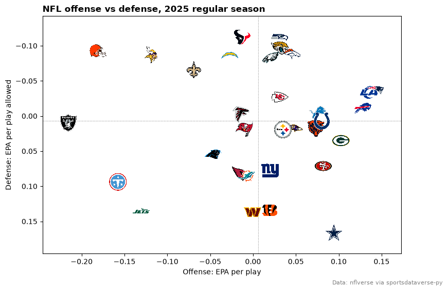

</div>

## 2. Put a logo at the end of each bar

Place each logo just past its bar's end: above a positive bar, below a negative one. Bar colors come from
`team_colors`, which returns one color per team in the order given.

```python
ranked = nba_teams.sort(["diff", "team_abbreviation"], descending=[True, False])
x = list(range(ranked.height))
ends = [d + 1.4 if d >= 0 else d - 1.4 for d in ranked["diff"]]

fig, ax = plt.subplots(figsize=(10, 5.5))
ax.bar(x, ranked["diff"], color=sdvplot.team_colors("nba", ranked["team_abbreviation"]), width=0.75)
ax.axhline(0, color="black", linewidth=0.8)
ax.set_ylim(ranked["diff"].min() - 3.5, ranked["diff"].max() + 3.5)
sdvplot.add_logos(ax, x, ends, ranked["team_abbreviation"], league="nba", height=0.055)
ax.set_xticks([])
ax.set_ylabel("Average point differential per game")
ax.spines[["top", "right", "bottom"]].set_visible(False)
ax.set_title("NBA point differential, 2025-26 regular season", loc="left", fontweight="bold")
fig.text(0.99, 0.01, HOOPR, ha="right", fontsize=8, color="grey")
plt.show()
```

<div class="sdv-output">

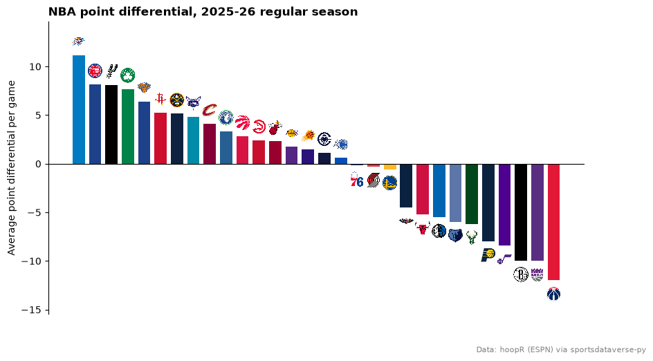

</div>

## 3. Swap axis labels for logos (x and y)

`axis_logos` replaces the tick labels of a team axis with logos. It reads the labels when called, so draw
the chart first; the labels just need to be team values `resolve` understands (here the data's own NHL and
NFL abbreviations).

```python
nhl_scoring = (
    nhl_games.group_by("team_abbrev", maintain_order=True)
    .agg(gpg=pl.col("goals").mean())
    .sort(["gpg", "team_abbrev"], descending=[True, False])
    .head(10)
)
nfl_sacks = (
    nfl_weeks.group_by("team", maintain_order=True).agg(pl.col("def_sacks").sum()).sort("def_sacks", "team").tail(10)
)

fig, (left, right) = plt.subplots(1, 2, figsize=(10, 5))
colors = sdvplot.team_colors("nhl", nhl_scoring["team_abbrev"])
left.bar(nhl_scoring["team_abbrev"], nhl_scoring["gpg"], color=colors)
left.set_ylim(2.5, nhl_scoring["gpg"].max() + 0.2)
left.set_title("NHL goals per game, 2025-26 (top 10)", loc="left", fontsize=10, fontweight="bold")
sdvplot.axis_logos(left, "x", league="nhl", height=0.08)

right.barh(nfl_sacks["team"], nfl_sacks["def_sacks"], color=sdvplot.team_colors("nfl", nfl_sacks["team"]))
right.set_title(f"NFL sacks, {NFL_SEASON} (top 10)", loc="left", fontsize=10, fontweight="bold")
sdvplot.axis_logos(right, "y", league="nfl", height=0.07)
fig.text(0.99, 0.01, f"{FASTRHOCKEY} | {NFLVERSE}", ha="right", fontsize=8, color="grey")
plt.show()
```

<div class="sdv-output">

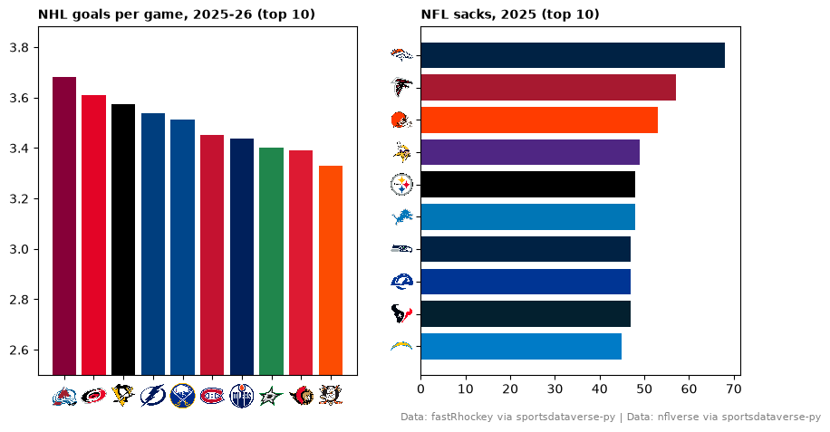

</div>

## 4. Label each line's last point with a logo

A logo at the end of a line replaces a legend. Leave room on the right with `set_xlim`, then put each logo a
little past the team's last point. Teams that finish close together would stack their logos, so walk up the
finishing order and keep each logo at least one logo-height above the one below, with a thin leader line back
to its point. The Pacific Division's season, as cumulative goal differential:

```python
PACIFIC = ["ANA", "CGY", "EDM", "LAK", "SEA", "SJS", "VAN", "VGK"]
runs = (
    nhl_games.filter(pl.col("team_abbrev").is_in(PACIFIC))
    .sort("game_date")
    .with_columns(
        game_no=pl.int_range(1, pl.len() + 1).over("team_abbrev"),
        goal_diff=(pl.col("goals") - pl.col("goals_against")).cum_sum().over("team_abbrev"),
    )
)
last = (
    runs.group_by("team_abbrev", maintain_order=True)
    .agg(pl.all().sort_by("game_no").last())
    .sort("goal_diff", "team_abbrev")
)
gap = 9  # goals: about one logo height on this axis
spots = []
for y in last["goal_diff"]:
    spots.append(max(y, spots[-1] + gap) if spots else y)
end = last["game_no"].max()

fig, ax = plt.subplots(figsize=(10, 6))
for team in PACIFIC:
    run = runs.filter(pl.col("team_abbrev") == team)
    ax.plot(run["game_no"], run["goal_diff"], color=sdvplot.team_colors("nhl", team), linewidth=2)
for y, spot in zip(last["goal_diff"], spots, strict=True):
    ax.plot([end, end + 4], [y, spot], color="grey", linewidth=0.6)
ax.axhline(0, color="grey", linewidth=0.8)
ax.set_xlim(0, end + 10)
sdvplot.add_logos(ax, [end + 6] * last.height, spots, last["team_abbrev"], league="nhl", height=0.07)
ax.set_xlabel("Game")
ax.set_ylabel("Cumulative goal differential (no shootout goals)")
ax.spines[["top", "right"]].set_visible(False)
ax.set_title("The Pacific Division's 2025-26 season", loc="left", fontweight="bold")
fig.text(0.99, 0.01, FASTRHOCKEY, ha="right", fontsize=8, color="grey")
plt.show()
```

<div class="sdv-output">

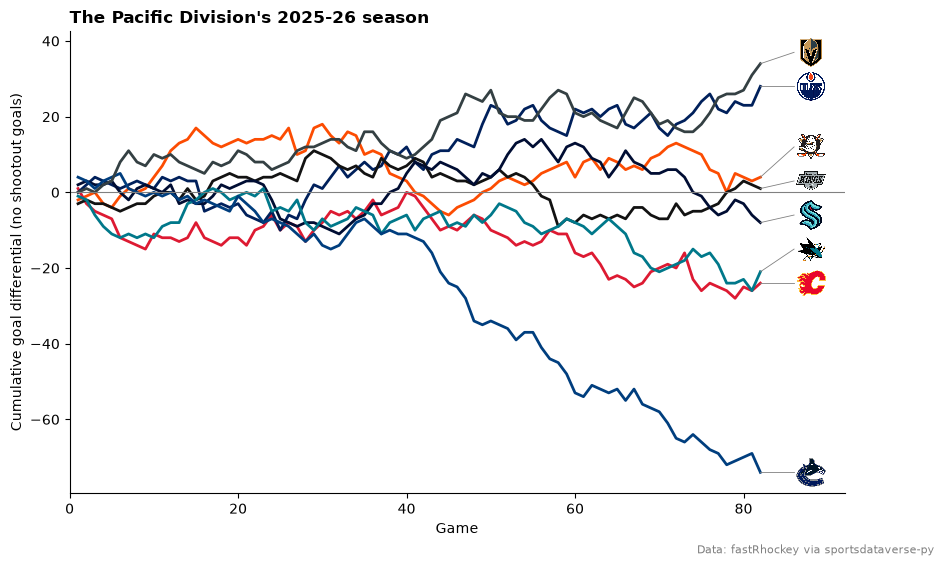

</div>

## 5. Size and fade logos to highlight a group

`height` is a fraction of the Axes height, so a logo keeps its size relative to the plot whatever the figure
size; `alpha` fades it. Two calls: the league faded and small, then the AFC West large and opaque.

```python
AFC_WEST = ["DEN", "KC", "LAC", "LV"]
focus = nfl_epa.filter(pl.col("team").is_in(AFC_WEST))
rest = nfl_epa.filter(~pl.col("team").is_in(AFC_WEST))

fig, ax = plt.subplots(figsize=(9, 6))
ax.set_xlim(nfl_epa["off_epa"].min() - 0.03, nfl_epa["off_epa"].max() + 0.03)
ax.set_ylim(nfl_epa["def_epa"].max() + 0.03, nfl_epa["def_epa"].min() - 0.03)
sdvplot.add_logos(ax, rest["off_epa"], rest["def_epa"], rest["team"], league="nfl", height=0.06, alpha=0.25)
sdvplot.add_logos(ax, focus["off_epa"], focus["def_epa"], focus["team"], league="nfl", height=0.12)
ax.set_xlabel("Offense: EPA per play")
ax.set_ylabel("Defense: EPA per play allowed")
ax.set_title(f"The AFC West against the league, {NFL_SEASON}", loc="left", fontweight="bold")
fig.text(0.99, 0.01, NFLVERSE, ha="right", fontsize=8, color="grey")
plt.show()
```

<div class="sdv-output">

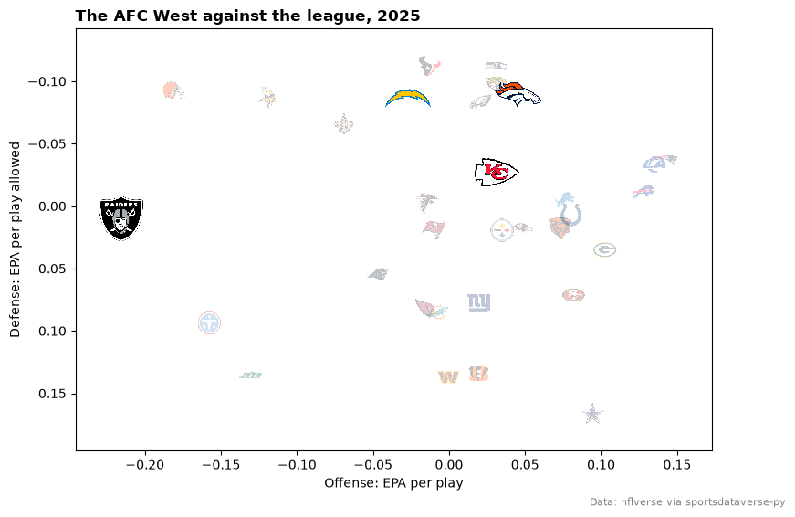

</div>

## 6. Keep overlapping logos readable

Logos are drawn in row order, so the last row ends on top. On the left, the Big Ten in the data's order (by
team id) hides some of its best teams; on the right, sorting weakest to strongest puts the contenders on top,
and a smaller `height` cuts the overlap.

```python
big_ten = mbb_ratings.filter(pl.col("conference") == "Big Ten Conference")

fig, axes = plt.subplots(1, 2, figsize=(10, 5), sharex=True, sharey=True)
for ax, frame, height, label in [
    (axes[0], big_ten, 0.13, "Data order, height 0.13"),
    (axes[1], big_ten.sort("adj_em"), 0.09, "Best drawn last, height 0.09"),
]:
    ax.set_xlim(big_ten["adj_o"].min() - 3, big_ten["adj_o"].max() + 3)
    ax.set_ylim(big_ten["adj_d"].max() + 3, big_ten["adj_d"].min() - 3)  # inverted: good defense is up
    sdvplot.add_logos(ax, frame["adj_o"], frame["adj_d"], frame["team_id"], league="mbb", height=height)
    ax.set_title(label, loc="left", fontsize=10)
    ax.set_xlabel("Adjusted offense (points per 100)")
axes[0].set_ylabel("Adjusted defense (points allowed per 100)")
fig.suptitle("Big Ten adjusted efficiency, 2025-26", x=0.01, ha="left", fontweight="bold")
fig.subplots_adjust(bottom=0.15)
fig.text(0.99, 0.01, HOOPR, ha="right", fontsize=8, color="grey")
plt.show()
```

<div class="sdv-output">

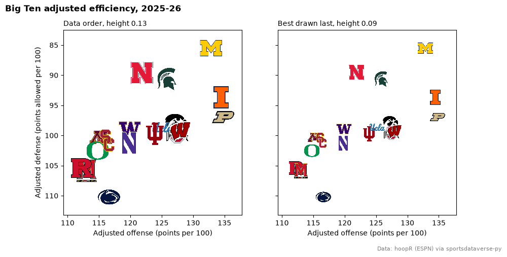

</div>

For a single team that must stay visible, draw it in its own `add_logos` call with a higher `zorder`.

## 7. Show the logo a team wore that season

nflverse files past seasons under today's codes (`LV`, `LAC`, `LA`), but `season=` still picks the mark in
use that year: 2012 brings back the Oakland, San Diego and St. Louis logos. Teams with no older mark in the
archive keep today's.

```python
epa_2012 = epa_per_play(nfl.load_nfl_team_stats([2012]).filter(pl.col("season_type") == "REG"))
moved = {"LV": ("Oakland", -26), "LAC": ("San Diego", 24), "LA": ("St. Louis", -26)}  # label, offset (pt)
then = epa_2012.filter(pl.col("team").is_in(list(moved)))
rest = epa_2012.filter(~pl.col("team").is_in(list(moved)))

fig, ax = plt.subplots(figsize=(9, 6))
ax.set_xlim(epa_2012["off_epa"].min() - 0.03, epa_2012["off_epa"].max() + 0.03)
ax.set_ylim(epa_2012["def_epa"].max() + 0.03, epa_2012["def_epa"].min() - 0.03)
x, y = "off_epa", "def_epa"
sdvplot.add_logos(ax, rest[x], rest[y], rest["team"], league="nfl", season=2012, height=0.06, alpha=0.3)
sdvplot.add_logos(ax, then[x], then[y], then["team"], league="nfl", season=2012, height=0.1)
for team, xi, yi in then.select("team", x, y).iter_rows():
    label, dy = moved[team]
    ax.annotate(label, (xi, yi), xytext=(0, dy), textcoords="offset points", ha="center", fontweight="bold")
ax.set_xlabel("Offense: EPA per play")
ax.set_ylabel("Defense: EPA per play allowed")
ax.set_title("NFL offense vs defense, 2012 regular season", loc="left", fontweight="bold")
fig.text(0.99, 0.01, NFLVERSE, ha="right", fontsize=8, color="grey")
plt.show()
```

<div class="sdv-output">

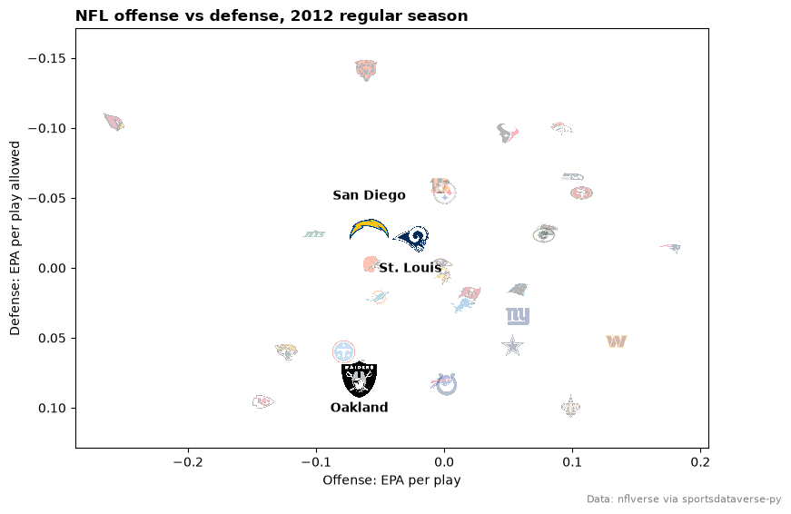

</div>

## 8. Put a logo beside the title

`title_image` sets the title and draws a team's logo (or any image) beside it. `height` is in points, so give
a tall image room with `pad=`. One team's season, week by week:

```python
plays = pl.col("attempts") + pl.col("sacks_suffered") + pl.col("carries")
kc = (
    nfl_weeks.filter(pl.col("team") == "KC")
    .with_columns(epa=(pl.col("passing_epa") + pl.col("rushing_epa")) / plays)
    .sort("week")
)
good, bad = sdvplot.team_colors("nfl", "KC"), sdvplot.team_colors("nfl", "KC", which="secondary")

fig, ax = plt.subplots(figsize=(9, 5))
ax.bar(kc["week"], kc["epa"], color=[good if e >= 0 else bad for e in kc["epa"]], edgecolor="black")
ax.axhline(0, color="black", linewidth=0.8)
ax.set_xticks(kc["week"].to_list(), kc["opponent_team"].to_list(), fontsize=8)
bye = sorted(set(range(1, kc["week"].max() + 1)) - set(kc["week"]))
ax.set_xlabel(f"Opponent, by week (bye: week {bye[0]})")
ax.set_ylabel("Offense EPA per play")
ax.spines[["top", "right"]].set_visible(False)
title = f"Chiefs offense, week by week, {NFL_SEASON}"
title_image(ax, "KC", title, league="nfl", height=28, loc="left", fontweight="bold", pad=12)
fig.subplots_adjust(bottom=0.15)
fig.text(0.99, 0.01, NFLVERSE, ha="right", fontsize=8, color="grey")
plt.show()
```

<div class="sdv-output">

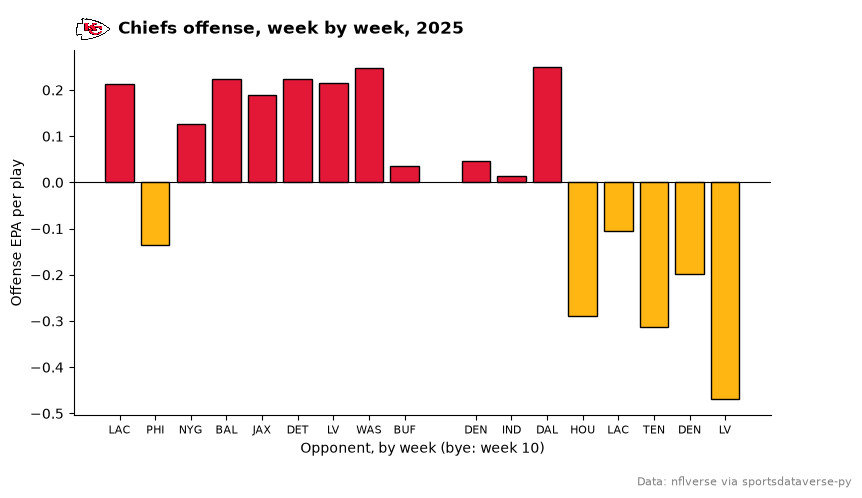

</div>

## 9. Build a tier list

`team_tiers` takes a frame with `team` and `tier_no` (1 on top) and returns a finished figure on sdvplotR's
Tiermaker theme; `tier_desc` names the tiers. NBA teams tiered by point differential:

```python
tiers = nba_teams.sort(["diff", "team_abbreviation"], descending=[True, False]).with_columns(
    team=pl.col("team_abbreviation"),
    tier_no=pl.when(pl.col("diff") >= 6)
    .then(1)
    .when(pl.col("diff") >= 2)
    .then(2)
    .when(pl.col("diff") >= -2)
    .then(3)
    .when(pl.col("diff") >= -6)
    .then(4)
    .otherwise(5),
)
fig = team_tiers(
    tiers,
    "nba",
    title="NBA tiers, 2025-26",
    subtitle="By average point differential per game",
    caption=HOOPR,
    tier_desc={1: "+6 or better", 2: "+2 to +6", 3: "-2 to +2", 4: "-6 to -2", 5: "Below -6"},
)
fig.set_size_inches(9, 6)
plt.show()
```

<div class="sdv-output">

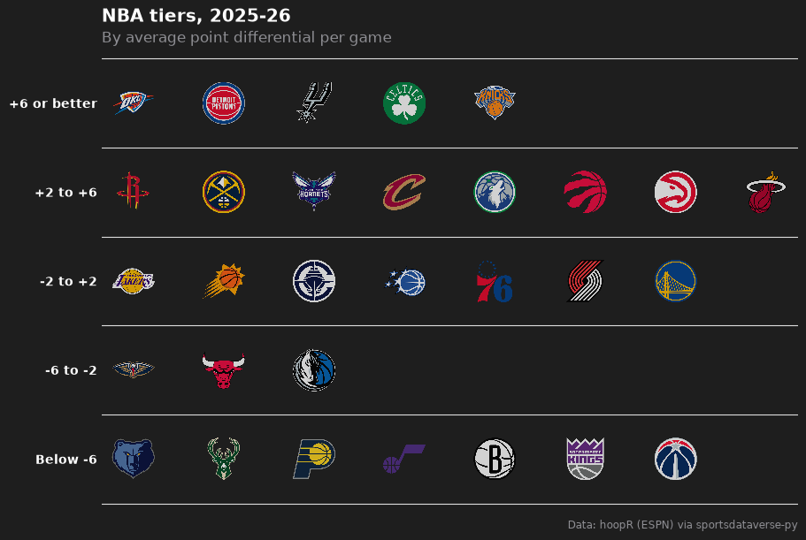

</div>

## 10. Place any image: conference logos

`add_images` is `add_logos` for any picture, by URL or local path, with the same `height`. Conferences are not
teams, so their marks come from ESPN's conference logo URLs, one per bar.

```python
CONFERENCES = {
    "Southeastern Conference": "sec",
    "Big Ten Conference": "big_ten",
    "Big 12 Conference": "big_12",
    "Big East Conference": "big_east",
    "Atlantic Coast Conference": "acc",
    "Mountain West Conference": "mountain_west",
    "West Coast Conference": "west_coast",
    "Atlantic 10 Conference": "atlantic_10",
    "American Conference": "american",
    "Missouri Valley Conference": "missouri_valley",
}
conf = (
    mbb_ratings.filter(pl.col("conference").is_in(list(CONFERENCES)))
    .group_by("conference", maintain_order=True)
    .agg(pl.col("adj_em").mean())
    .sort("adj_em")
)
urls = [f"https://a.espncdn.com/i/teamlogos/ncaa_conf/500/{CONFERENCES[c]}.png" for c in conf["conference"]]
y = list(range(conf.height))

fig, ax = plt.subplots(figsize=(9, 6))
ax.barh(y, conf["adj_em"], color="#4a6fa5", height=0.6)
ax.set_xlim(0, conf["adj_em"].max() + 5)
add_images(ax, conf["adj_em"] + 2.5, y, urls, height=0.08)
ax.set_yticks([])
ax.set_xlabel("Average adjusted efficiency margin (points per 100 possessions)")
ax.spines[["top", "right", "left"]].set_visible(False)
ax.set_title("How strong is the average team? Ten conferences, 2025-26", loc="left", fontweight="bold")
fig.text(0.99, 0.01, f"{HOOPR}; conference logos: ESPN", ha="right", fontsize=8, color="grey")
plt.show()
```

<div class="sdv-output">

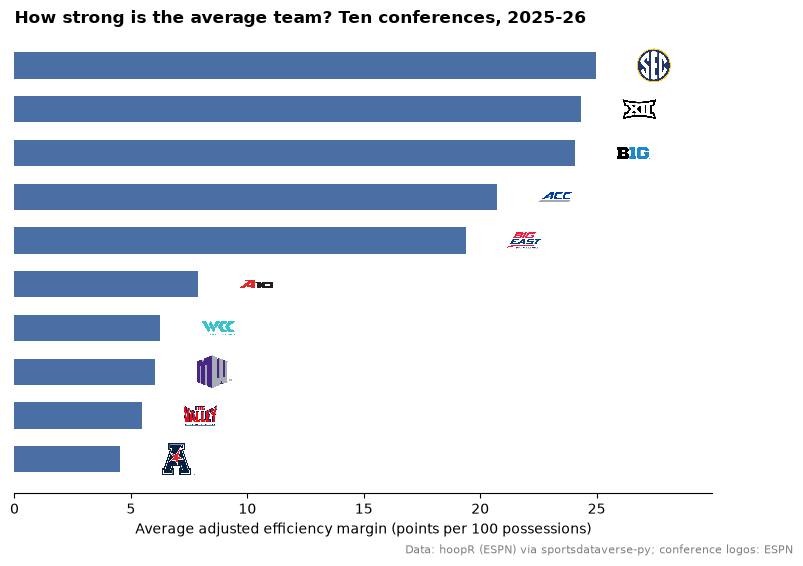

</div>

## 11. Put headshots on a scatter

`add_headshots` works like `add_logos` with player ids instead of teams; ESPN athlete ids, as in hoopR's player
box score, work directly. The season's top scorers (50+ games), by volume and efficiency:

```python
players = nba.load_nba_player_boxscore(seasons=[SEASON]).filter((pl.col("season_type") == 2) & ~pl.col("did_not_play"))
scorers = (
    players.group_by("athlete_id", "athlete_display_name", maintain_order=True)
    .agg(
        games=pl.len(),
        ppg=pl.col("points").mean(),
        ts=pl.col("points").sum()
        / (2 * (pl.col("field_goals_attempted").sum() + 0.44 * pl.col("free_throws_attempted").sum())),
    )
    .filter(pl.col("games") >= 50)
    .sort("ppg", descending=True)
    .head(10)
)

fig, ax = plt.subplots(figsize=(9, 6))
ax.set_xlim(scorers["ppg"].min() - 1, scorers["ppg"].max() + 2)
ax.set_ylim(scorers["ts"].min() - 0.015, scorers["ts"].max() + 0.015)
sdvplot.add_headshots(ax, scorers["ppg"], scorers["ts"], scorers["athlete_id"], league="nba", height=0.1)
halo = [patheffects.withStroke(linewidth=3, foreground="white")]  # keeps a name readable over a photo
for name, ppg, ts in scorers.select("athlete_display_name", "ppg", "ts").iter_rows():
    ax.annotate(name.split()[-1], (ppg, ts), xytext=(0, -24), textcoords="offset points", ha="center",
                fontsize=8, path_effects=halo, zorder=4)  # fmt: skip
ax.yaxis.set_major_formatter(lambda v, _: f"{v:.0%}")
ax.set_xlabel("Points per game")
ax.set_ylabel("True shooting %")
ax.set_title("The NBA's top scorers, 2025-26: volume vs efficiency", loc="left", fontweight="bold")
fig.text(0.99, 0.01, HOOPR, ha="right", fontsize=8, color="grey")
plt.show()
```

<div class="sdv-output">

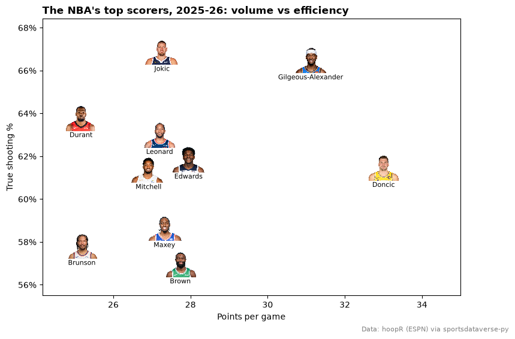

</div>

## 12. Save at social media sizes

Size the figure in inches times dpi: 10.8 x 10.8 in at 100 dpi is 1080 x 1080 px (square), 12 x 6.75 in is
1200 x 675 px (a landscape card). Skip `bbox_inches="tight"`, which trims the canvas to a different size;
logos scale with the Axes, so nothing needs resizing.

```python
out = Path(tempfile.mkdtemp())
for name, size in {"square": (10.8, 10.8), "landscape": (12, 6.75)}.items():
    fig, ax = plt.subplots(figsize=size, dpi=100, layout="constrained")
    ax.set_xlim(nfl_epa["off_epa"].min() - 0.03, nfl_epa["off_epa"].max() + 0.03)
    ax.set_ylim(nfl_epa["def_epa"].max() + 0.03, nfl_epa["def_epa"].min() - 0.03)
    sdvplot.add_logos(ax, nfl_epa["off_epa"], nfl_epa["def_epa"], nfl_epa["team"], league="nfl", height=0.08)
    ax.set_xlabel("Offense: EPA per play")
    ax.set_ylabel("Defense: EPA per play allowed")
    ax.set_title(f"NFL offense vs defense, {NFL_SEASON}", loc="left", fontweight="bold", fontsize=16)
    fig.text(0.99, 0.005, NFLVERSE, ha="right", fontsize=9, color="grey")
    fig.savefig(out / f"{name}.png", dpi=100)
    plt.close(fig)
    print(name, plt.imread(out / f"{name}.png").shape[1::-1])

display(Image(filename=out / "landscape.png", width=600))
```

<div class="sdv-output">

```text
square (1080, 1080)
landscape (1200, 675)
```

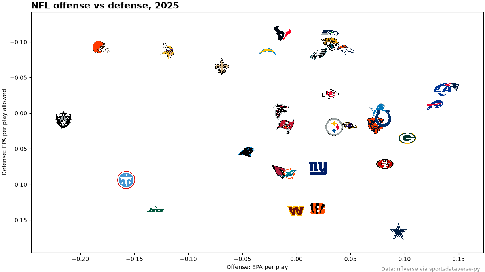

</div>

## Run it yourself

<a href="pathname:///notebooks/cookbooks/matplotlib-logos.ipynb" download>Download the notebook</a> (outputs cleared) or [open it on GitHub](https://github.com/sportsdataverse/sdvplot/blob/main/examples/notebooks/cookbooks/matplotlib-logos.ipynb).
