# plotnine

Twelve recipes for team marks in plotnine, the Python grammar of graphics: logo, wordmark and headshot layers,
team color scales, facets, logo axes, title images, any image by URL, reference lines, tier lists and themes.
Every sdvplot layer is an ordinary plotnine layer, so it composes with `+` like `geom_point`. The data is one
season each from the WNBA and NBA (wehoop and hoopR), the NFL (nflverse), the NHL (fastRhockey) and men's
college basketball, read from GitHub release files by sportsdataverse-py.

```python
import polars as pl
import sportsdataverse.mbb as mbb
import sportsdataverse.nba as nba
import sportsdataverse.nfl as nfl
import sportsdataverse.nhl as nhl
import sportsdataverse.wnba as wnba
from plotnine import (
    aes,
    coord_flip,
    element_blank,
    element_line,
    element_rect,
    element_text,
    facet_wrap,
    geom_col,
    geom_hline,
    geom_line,
    geom_point,
    geom_text,
    ggplot,
    labs,
    scale_fill_manual,
    scale_x_continuous,
    scale_y_continuous,
    scale_y_reverse,
    theme,
    theme_bw,
    theme_minimal,
)

import sdvplot
from sdvplot.plotnine import (
    geom_from_path,
    geom_mean_lines,
    geom_median_lines,
    geom_sdv_headshots,
    geom_sdv_logos,
    geom_sdv_wordmarks,
    scale_color_sdv,
    scale_fill_sdv,
    team_tiers,
    title_image,
)

NFL_SEASON = 2025  # nflverse names a season by the year it starts
SEASON = 2026  # the 2026 WNBA season and the 2025-26 NBA, NHL and college season
NFLVERSE = "Data: nflverse via sportsdataverse-py"
HOOPR = "Data: hoopR (ESPN) via sportsdataverse-py"
WEHOOP = "Data: wehoop (ESPN) via sportsdataverse-py"
FASTRHOCKEY = "Data: fastRhockey via sportsdataverse-py"
```

The shared tables: WNBA team scoring per game (more than ten games drops the All-Star Game's teams), NFL EPA
per play on offense and defense with each team's division, the NHL team box score, NBA team box scores and
college basketball's adjusted efficiency with each team's conference.

```python
wnba_games = wnba.load_wnba_team_boxscore(seasons=[SEASON]).filter(pl.col("season_type") == 2)
wnba_teams = (
    wnba_games.group_by("team_abbreviation", maintain_order=True)
    .agg(games=pl.len(), scored=pl.col("team_score").mean(), allowed=pl.col("opponent_team_score").mean())
    .filter(pl.col("games") > 10)
    .sort("team_abbreviation")
)

nfl_weeks = nfl.load_nfl_team_stats([NFL_SEASON]).filter(pl.col("season_type") == "REG")
plays = pl.col("attempts") + pl.col("sacks_suffered") + pl.col("carries")
epa = pl.col("passing_epa") + pl.col("rushing_epa")
nfl_epa = (
    nfl_weeks.group_by("team", maintain_order=True)
    .agg(off_epa=epa.sum() / plays.sum())
    .join(
        nfl_weeks.group_by(team=pl.col("opponent_team"), maintain_order=True).agg(def_epa=epa.sum() / plays.sum()),
        on="team",
    )
    .join(nfl.load_nfl_teams().select(team="team_abbr", division="team_division"), on="team")
    .sort("team")
)

nhl_games = nhl.load_nhl_team_box(seasons=[SEASON]).filter(pl.col("game_id") // 10_000 % 100 == 2)
nba_box = nba.load_nba_team_boxscore(seasons=[SEASON]).filter(pl.col("season_type") == 2)
mbb_ratings = (
    mbb.load_mbb_ratings(SEASON)
    .join(sdvplot.teams("mbb").select("team_id", "conference"), on="team_id")
    .sort("team_id")
)
wnba_teams.height, nfl_epa.height, nhl_games.height, nba_box.height, mbb_ratings.height
```

<div class="sdv-output">

```text
(15, 32, 2624, 2470, 365)
```

</div>

## 1. Logos as points

Map the team column to the `team` aesthetic and add `geom_sdv_logos(league=...)`. `height` is a fraction of
the panel height. The layer trains the scales on the points, not on the images, so widen `expand` to keep the
logos at the edges inside the panel.

```python
(
    ggplot(wnba_teams, aes("scored", "allowed", team="team_abbreviation"))
    + geom_sdv_logos(league="wnba", height=0.1)
    + scale_x_continuous(expand=(0.06, 0))
    + scale_y_reverse(expand=(0.08, 0))
    + labs(
        x="Points scored per game",
        y="Points allowed per game (reversed: better is up)",
        title=f"WNBA scoring, {SEASON} regular season",
        caption=WEHOOP,
    )
    + theme_minimal()
    + theme(figure_size=(9, 6))
)
```

<div class="sdv-output">

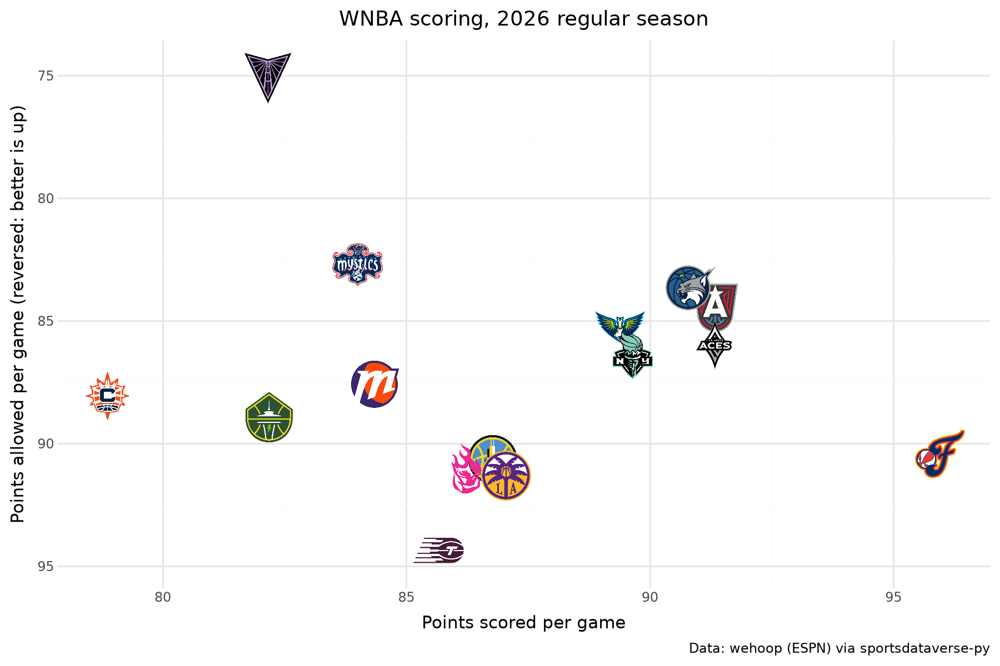

</div>

## 2. Wordmarks instead of logos

`geom_sdv_wordmarks` takes the same aesthetics; wordmarks are wide, so give them a smaller `height`. The archive
has wordmarks for NFL and MLB teams; a team without one is skipped with a warning. Two NFC divisions:

```python
(
    ggplot(
        nfl_epa.filter(pl.col("division").is_in(["NFC North", "NFC West"])),
        aes("off_epa", "def_epa", team="team"),
    )
    + geom_sdv_wordmarks(league="nfl", height=0.06)
    + scale_y_reverse()
    + scale_x_continuous(expand=(0.15, 0))
    + labs(
        x="Offense: EPA per play",
        y="Defense: EPA per play allowed",
        title=f"The NFC North and West, {NFL_SEASON}",
        caption=NFLVERSE,
    )
    + theme_minimal()
    + theme(figure_size=(9, 5))
)
```

<div class="sdv-output">

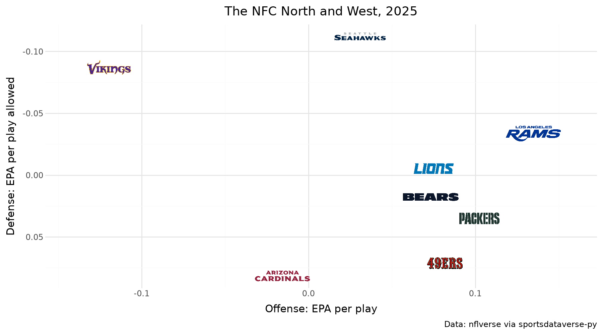

</div>

## 3. Headshots as points

`geom_sdv_headshots` maps `player_id` (ESPN athlete ids by default; NFL gsis ids with `id_system="gsis"`).
`geom_text`, nudged to the right, names each one. The WNBA's top scorers:

```python
players = wnba.load_wnba_player_boxscore(seasons=[SEASON]).filter(
    (pl.col("season_type") == 2) & ~pl.col("did_not_play")
)
scorers = (
    players.group_by("athlete_id", "athlete_display_name", maintain_order=True)
    .agg(
        games=pl.len(),
        ppg=pl.col("points").mean(),
        ts=pl.col("points").sum()
        / (2 * (pl.col("field_goals_attempted").sum() + 0.44 * pl.col("free_throws_attempted").sum())),
    )
    .filter(pl.col("games") >= 25)
    .sort("ppg", descending=True)
    .head(10)
    .with_columns(name=pl.col("athlete_display_name").str.split(" ").list.last())
)
(
    ggplot(scorers, aes("ppg", "ts", player_id="athlete_id"))
    + geom_sdv_headshots(league="wnba", height=0.1)
    + geom_text(aes(label="name"), nudge_x=0.3, ha="left", size=8)
    + scale_x_continuous(expand=(0.1, 0))
    + scale_y_continuous(labels=lambda bs: [f"{b:.0%}" for b in bs], expand=(0.12, 0))
    + labs(
        x="Points per game",
        y="True shooting %",
        title=f"WNBA top scorers, {SEASON} (25+ games)",
        caption=WEHOOP,
    )
    + theme_bw()
    + theme(figure_size=(9, 6))
)
```

<div class="sdv-output">

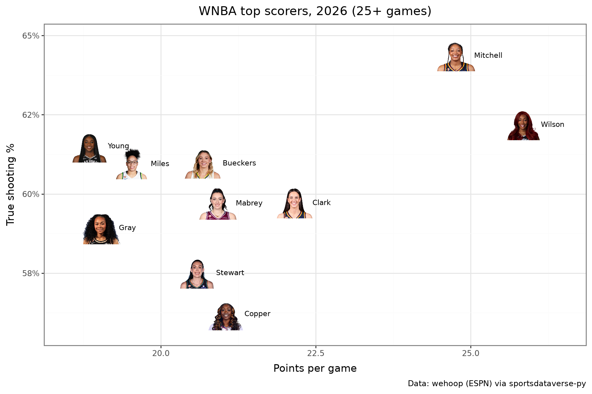

</div>

## 4. Fill bars with team colors

`scale_fill_sdv(league)` maps any team value to its primary color (`which="secondary"` for the other one);
`guide=None` drops the legend the bars don't need. NHL power-play goals, top 12:

```python
power_play = (
    nhl_games.group_by("team_abbrev", maintain_order=True)
    .agg(pl.col("power_play_goals").sum())
    .sort(["power_play_goals", "team_abbrev"], descending=[True, False])
    .head(12)
)
(
    ggplot(power_play, aes("reorder(team_abbrev, power_play_goals)", "power_play_goals", fill="team_abbrev"))
    + geom_col(width=0.7)
    + coord_flip()
    + scale_fill_sdv("nhl", guide=None)
    + labs(x="", y="Power-play goals", title="NHL power-play goals, 2025-26 (top 12)", caption=FASTRHOCKEY)
    + theme_minimal()
    + theme(figure_size=(8, 5.5))
)
```

<div class="sdv-output">

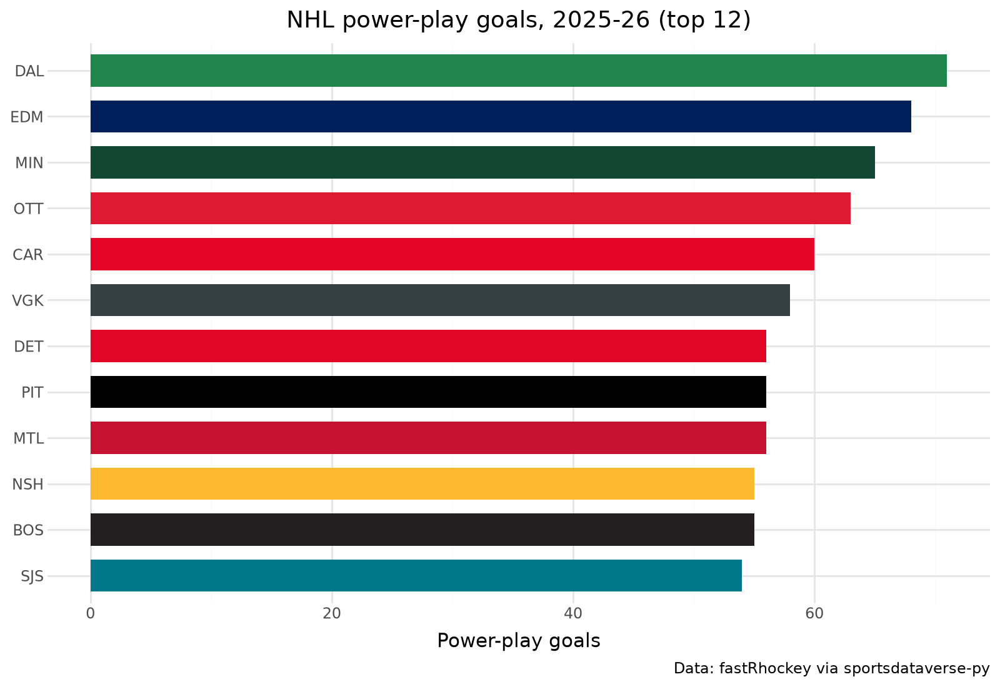

</div>

## 5. Color lines with team colors

`scale_color_sdv` does the same for `color`, and keeps a legend when you want one. The AFC West's season as
cumulative offensive EPA:

```python
afc_west = (
    nfl_weeks.filter(pl.col("team").is_in(["DEN", "KC", "LAC", "LV"]))
    .sort("week")
    .with_columns(cum_epa=epa.cum_sum().over("team"))
)
(
    ggplot(afc_west, aes("week", "cum_epa", color="team"))
    + geom_hline(yintercept=0, color="grey")
    + geom_line(size=1.2)
    + geom_point(size=2)
    + scale_color_sdv("nfl", name="")
    + labs(
        x="Week",
        y="Cumulative offensive EPA",
        title=f"The AFC West's offenses, {NFL_SEASON}",
        caption=NFLVERSE,
    )
    + theme_minimal()
    + theme(figure_size=(9, 5.5))
)
```

<div class="sdv-output">

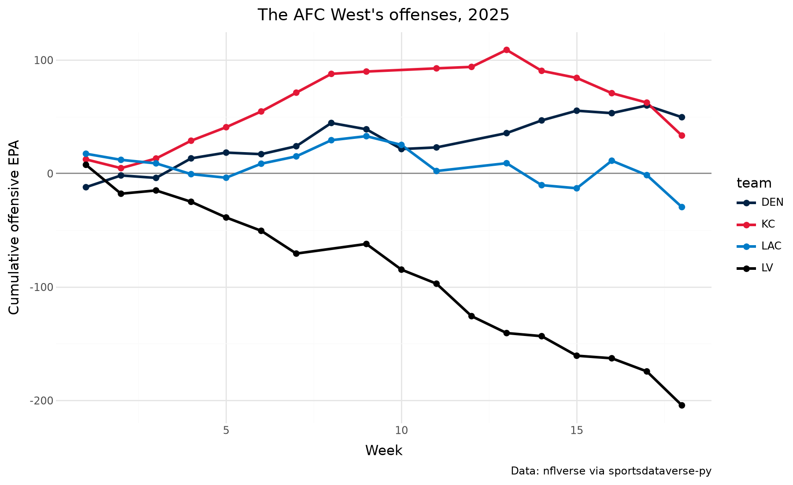

</div>

## 6. Facet a logo plot

The logo layer facets like any geom; each panel draws its own teams, and `height` is relative to the panel.
Every NFL division:

```python
(
    ggplot(nfl_epa, aes("off_epa", "def_epa", team="team"))
    + geom_hline(yintercept=0, color="#dddddd")
    + geom_sdv_logos(league="nfl", height=0.17)
    + facet_wrap("division", ncol=4)
    + scale_x_continuous(expand=(0.15, 0))
    + scale_y_reverse(expand=(0.15, 0))
    + labs(
        x="Offense: EPA per play",
        y="Defense: EPA per play allowed",
        title=f"NFL offense vs defense by division, {NFL_SEASON}",
        caption=NFLVERSE,
    )
    + theme_bw()
    + theme(figure_size=(10, 6))
)
```

<div class="sdv-output">

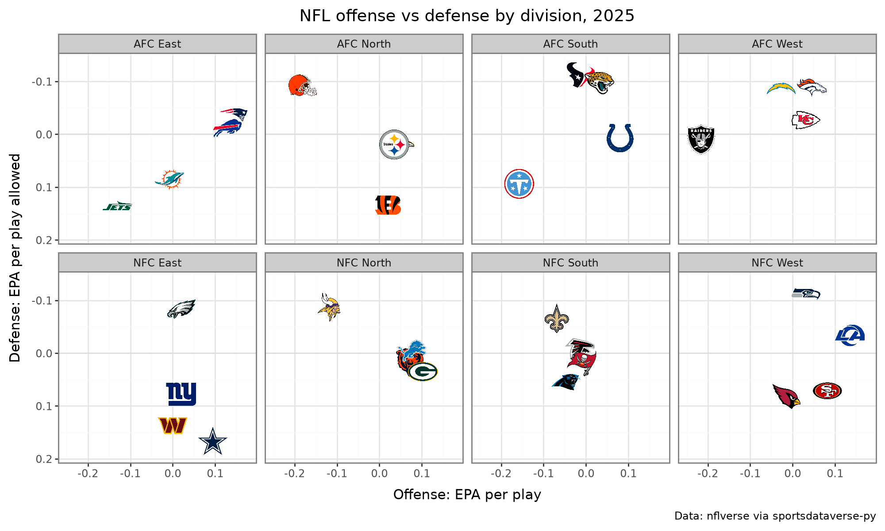

</div>

## 7. Logos on a discrete axis

`axis_logos` (the front door, or `sdvplot.plotnine.axis_logos`) returns a copy of the plot whose team axis
shows logos instead of labels. Map the team column to that axis; here ESPN team ids join the index's
conference, cast from the raw integer so the join keys agree.

```python
east = sdvplot.teams("nba").filter(pl.col("conference") == "Eastern Conference").select("team_id")
threes = (
    nba_box.group_by("team_id", "team_abbreviation", maintain_order=True)
    .agg(games=pl.len(), fg3a=pl.col("three_point_field_goals_attempted").mean())
    .filter(pl.col("games") > 10)
    .with_columns(pl.col("team_id").cast(pl.Int64).cast(pl.Utf8))
    .join(east, on="team_id")
    .sort("team_abbreviation")
)
p = (
    ggplot(threes, aes("reorder(team_abbreviation, -fg3a)", "fg3a", fill="team_abbreviation"))
    + geom_col(width=0.75)
    + scale_fill_sdv("nba", guide=None)
    + labs(
        x="", y="Three-point attempts per game", title="Eastern Conference three-point volume, 2025-26", caption=HOOPR
    )  # fmt: skip
    + theme_minimal()
    + theme(figure_size=(10, 5))
)
sdvplot.axis_logos(p, "x", league="nba", height=0.09)
```

<div class="sdv-output">

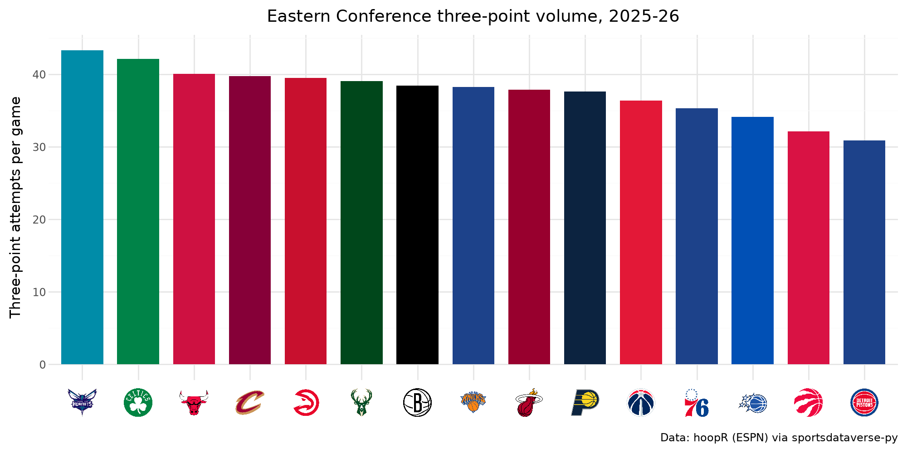

</div>

For leagues with wordmarks in the archive (NFL, MLB), `mark_type="wordmark"` puts those on the axis instead.

## 8. A logo beside the title

Add `title_image(team, title, league=...)` after any `labs`; it replaces the title. One team's season, game by
game:

```python
avs = (
    nhl_games.filter(pl.col("team_abbrev") == "COL")
    .sort("game_date")
    .with_columns(game_no=pl.int_range(1, pl.len() + 1), margin=pl.col("goals") - pl.col("goals_against"))
)
decided = avs.filter(pl.col("margin") != 0).with_columns(
    result=pl.when(pl.col("margin") > 0).then(pl.lit("Won")).otherwise(pl.lit("Lost"))
)
shootouts = avs.height - decided.height
colors = {"Won": sdvplot.team_colors("COL", "nhl"), "Lost": sdvplot.team_colors("COL", "nhl", "secondary")}
(
    ggplot(decided, aes("game_no", "margin", fill="result"))
    + geom_col(width=0.8)
    + geom_hline(yintercept=0)
    + scale_fill_manual(values=colors, breaks=["Won", "Lost"])
    + labs(x="Game", y="Goal margin", fill="", caption=f"{shootouts} games went to a shootout (no bar). {FASTRHOCKEY}")
    + title_image("COL", "Colorado's 2025-26, game by game", league="nhl", height=22)
    + theme_minimal()
    + theme(figure_size=(10, 4.5), legend_position="top")
)
```

<div class="sdv-output">

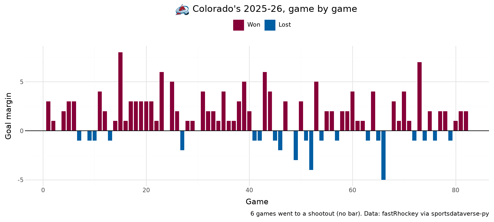

</div>

`result` is not a team column, so `scale_fill_sdv` does not apply; a manual scale takes the team's two colors
from `team_colors` instead. The box score's goals leave out the shootout, so those games (a margin of 0) are
left out and counted in the caption.

## 9. Mean and median reference lines

`geom_mean_lines(aes(x0=..., y0=...))` draws a vertical and a horizontal line at the means, per panel;
`geom_median_lines` does the same at the medians. Both on one SEC chart: dashed grey at the mean, dotted red
at the median.

```python
sec = mbb_ratings.filter(pl.col("conference") == "Southeastern Conference")
(
    ggplot(sec, aes("adj_o", "adj_d", team="team_id", x0="adj_o", y0="adj_d"))
    + geom_mean_lines(color="grey")
    + geom_median_lines(color="#c0392b", linetype="dotted")
    + geom_sdv_logos(league="mbb", height=0.09)
    + scale_y_reverse()
    + labs(
        x="Adjusted offense (points per 100)",
        y="Adjusted defense (points allowed per 100)",
        title="SEC adjusted efficiency, 2025-26",
        caption=HOOPR,
    )
    + theme_minimal()
    + theme(figure_size=(9, 6))
)
```

<div class="sdv-output">

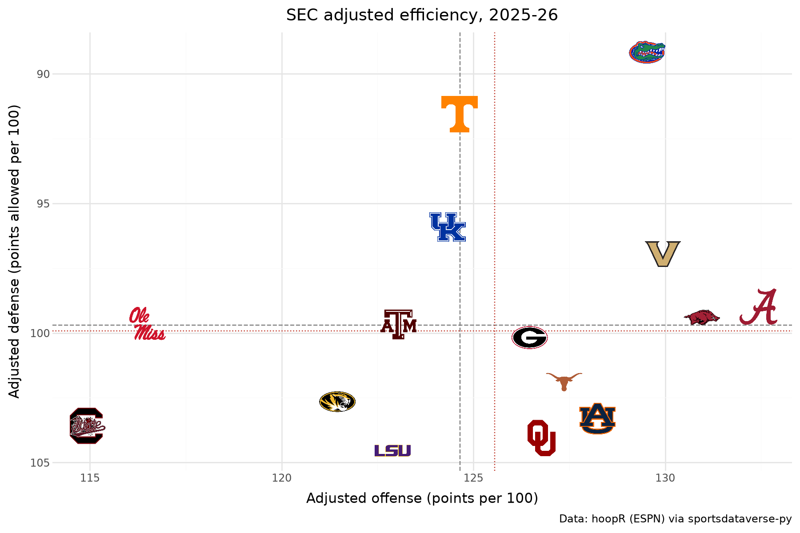

</div>

## 10. Any image, by URL: conference logos as row labels

`geom_from_path(aes(..., path=...))` draws any image by URL or local path, sized like the logo layers.
Conferences are not teams, so their marks are ESPN's conference logo URLs. Every team's efficiency margin is a
dot in its conference's row, and each row's logo sits at the left edge in place of a label. A polars `Enum`
fixes the row order in all three layers.

```python
CONFERENCES = {
    "Southeastern Conference": "sec",
    "Big Ten Conference": "big_ten",
    "Big 12 Conference": "big_12",
    "Big East Conference": "big_east",
    "Atlantic Coast Conference": "acc",
    "Mountain West Conference": "mountain_west",
    "West Coast Conference": "west_coast",
    "Atlantic 10 Conference": "atlantic_10",
    "American Conference": "american",
    "Missouri Valley Conference": "missouri_valley",
}
members = mbb_ratings.filter(pl.col("conference").is_in(list(CONFERENCES)))
means = members.group_by("conference", maintain_order=True).agg(pl.col("adj_em").mean()).sort("adj_em")
rows = pl.Enum(means["conference"].to_list())  # weakest at the bottom, strongest on top
members = members.with_columns(pl.col("conference").cast(rows))
means = means.with_columns(
    pl.col("conference").cast(rows),
    left=pl.lit(members["adj_em"].min() - 8),
    logo=pl.format(
        "https://a.espncdn.com/i/teamlogos/ncaa_conf/500/{}.png",
        pl.col("conference").cast(pl.String).replace_strict(CONFERENCES),
    ),
)
(
    ggplot(members, aes("adj_em", "conference"))
    + geom_point(color="#4a6fa5", alpha=0.45, size=2.5)
    + geom_point(data=means, shape="|", size=10, color="black")
    + geom_from_path(aes(x="left", path="logo"), data=means, height=0.075)
    + labs(
        x="Adjusted efficiency margin (each dot is a team; the bar is the conference average)",
        y="",
        title="Ten conferences, team by team, 2025-26",
        caption=f"{HOOPR}; conference logos: ESPN",
    )
    + theme_minimal()
    + theme(figure_size=(9, 6), axis_text_y=element_blank(), panel_grid_major_y=element_blank())
)
```

<div class="sdv-output">

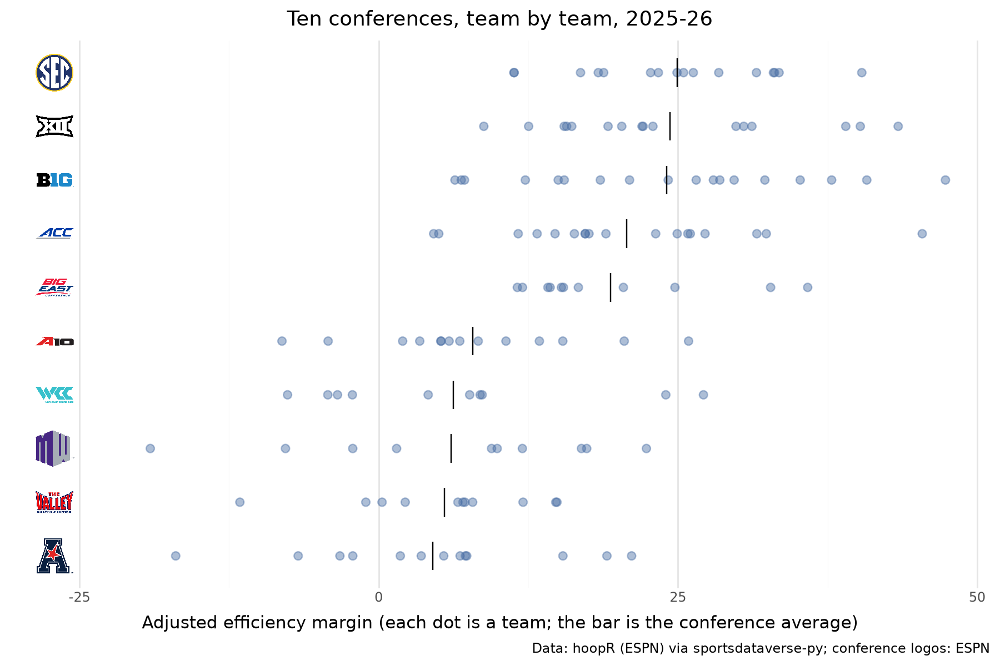

</div>

## 11. A tier list as a ggplot

`sdvplot.plotnine.team_tiers` is the plotnine twin of the matplotlib tier list: same `team` / `tier_no` input,
a ggplot out, so `+ theme(...)` still works. NHL teams by goal differential per game:

```python
nhl_tiers = (
    nhl_games.group_by("team_abbrev", maintain_order=True)
    .agg(gd=(pl.col("goals") - pl.col("goals_against")).mean())
    .sort(["gd", "team_abbrev"], descending=[True, False])
    .with_columns(
        team=pl.col("team_abbrev"),
        tier_no=pl.when(pl.col("gd") >= 0.5)
        .then(1)
        .when(pl.col("gd") >= 0.15)
        .then(2)
        .when(pl.col("gd") > -0.15)
        .then(3)
        .when(pl.col("gd") > -0.5)
        .then(4)
        .otherwise(5),
    )
)
(
    team_tiers(
        nhl_tiers,
        "nhl",
        title="NHL tiers, 2025-26",
        subtitle="Goal differential per game",
        caption=FASTRHOCKEY,
        tier_desc={1: "+0.5 or more", 2: "+0.15 to +0.5", 3: "About even", 4: "-0.5 to -0.15", 5: "-0.5 or worse"},
    )
    + theme(figure_size=(9, 6))
)
```

<div class="sdv-output">

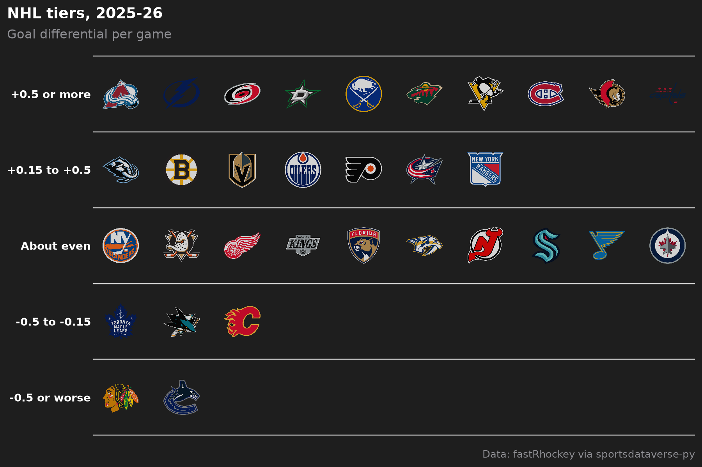

</div>

## 12. Dark themes and dark logo variants

Logos are drawn over whatever theme you use. On a dark background, `variant="dark"` picks marks made for dark
grounds where the archive has them (others keep their default mark). The WNBA chart from recipe 1, dark:

```python
ink, ground, grid = "#e8e8e8", "#16191f", "#2b3038"
(
    ggplot(wnba_teams, aes("scored", "allowed", team="team_abbreviation", x0="scored", y0="allowed"))
    + geom_mean_lines(color="#6b7380")
    + geom_sdv_logos(league="wnba", variant="dark", height=0.1)
    + scale_x_continuous(expand=(0.06, 0))
    + scale_y_reverse(expand=(0.08, 0))
    + labs(
        x="Points scored per game",
        y="Points allowed per game",
        title=f"WNBA scoring, {SEASON}",
        caption=WEHOOP,
    )
    + theme_minimal()
    + theme(
        figure_size=(9, 6),
        plot_background=element_rect(fill=ground, color=ground),
        panel_grid_major=element_line(color=grid),
        panel_grid_minor=element_blank(),
        text=element_text(color=ink),
        axis_text=element_text(color=ink),
        plot_title=element_text(weight="bold", size=14),
    )
)
```

<div class="sdv-output">

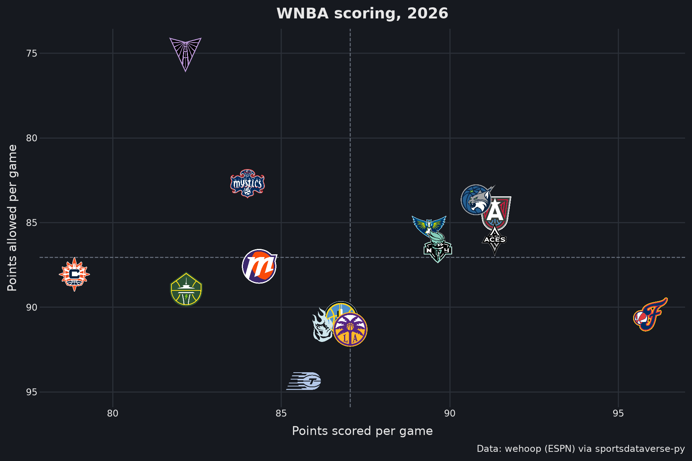

</div>

## Run it yourself

<a href="pathname:///notebooks/cookbooks/plotnine.ipynb" download>Download the notebook</a> (outputs cleared) or [open it on GitHub](https://github.com/sportsdataverse/sdvplot/blob/main/examples/notebooks/cookbooks/plotnine.ipynb).
