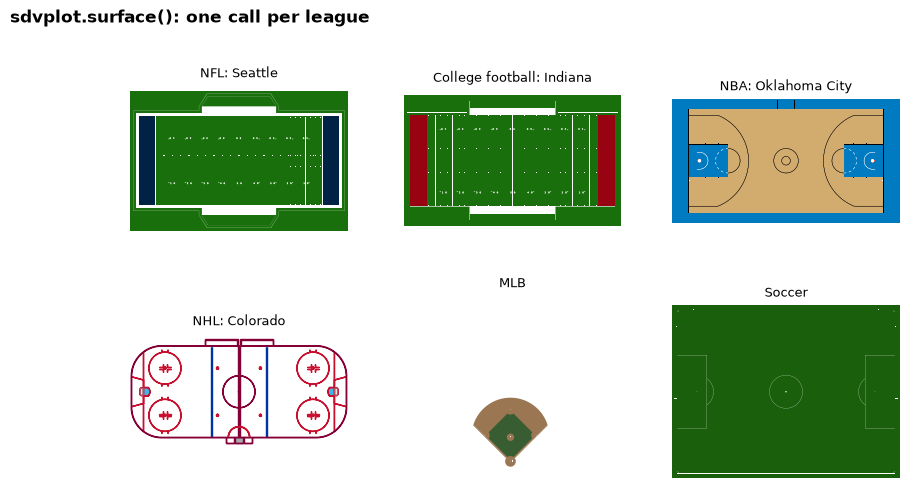
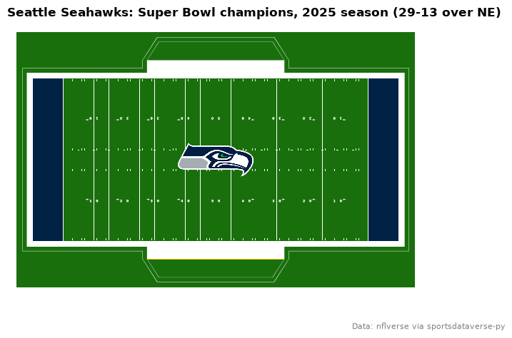
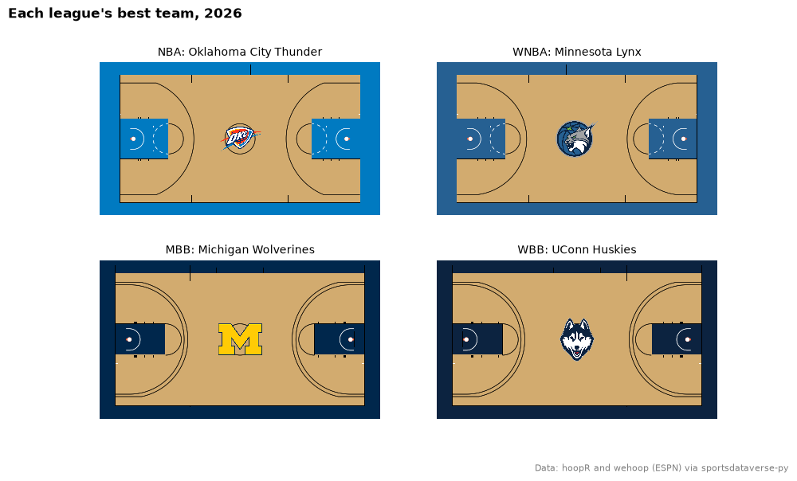
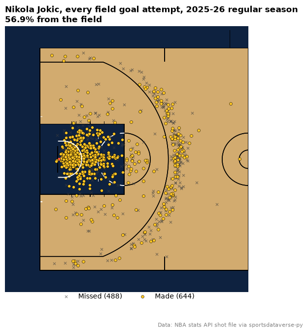
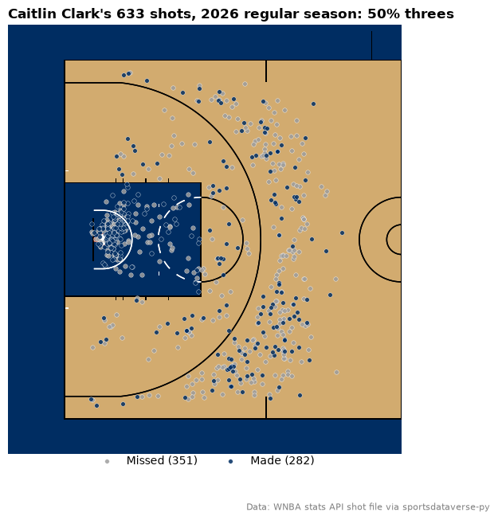
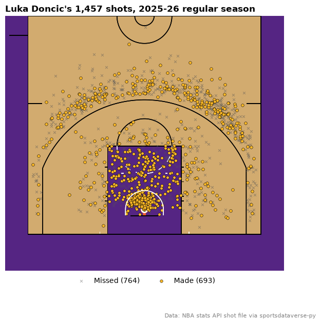
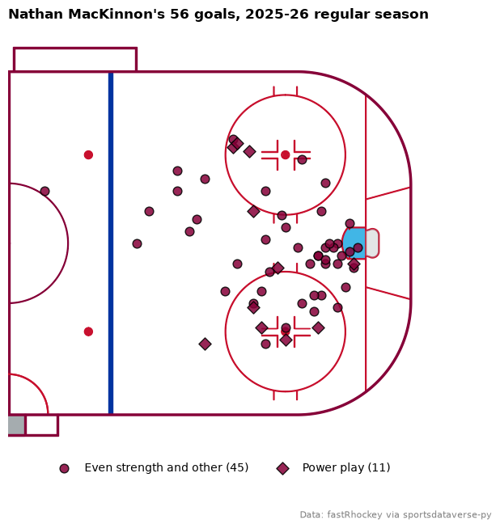
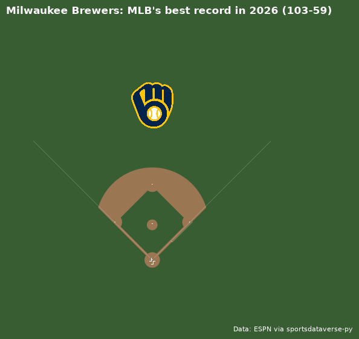
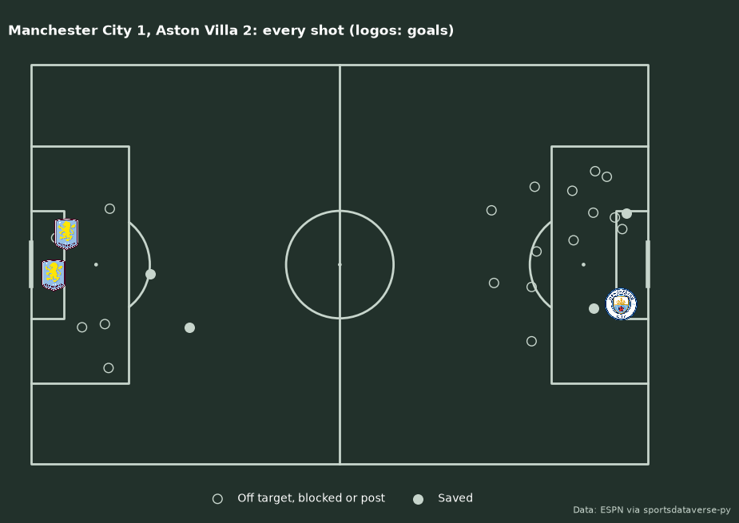

# Surfaces and shot charts

Nine recipes for playing surfaces and the charts drawn on them: `surface()` for every sport it supports, team
colors and a center logo, NBA and WNBA shot charts from the stats-API shot files (converted with
`court_coords`), a vertical half court, a hockey goal map, a baseball field and a soccer shot map on an
mplsoccer pitch. Surfaces are drawn by sportypy. The data is one season each from the NFL (nflverse), the NBA, WNBA and college
basketball (hoopR, wehoop and the stats-API shot files the SportsDataverse publishes on GitHub), the NHL
(fastRhockey) and the Premier League (ESPN), all through sportsdataverse-py; nothing calls stats.nba.com.

```python
import matplotlib.pyplot as plt
import polars as pl
import sportsdataverse.mbb as mbb
import sportsdataverse.nba as nba
import sportsdataverse.nfl as nfl
import sportsdataverse.nhl as nhl
import sportsdataverse.soccer as soccer
import sportsdataverse.wbb as wbb
import sportsdataverse.wnba as wnba

import sdvplot

NFL_SEASON = 2025  # nflverse names a season by the year it starts
SEASON = 2026  # the 2026 WNBA season and the 2025-26 NBA, NHL and college basketball season
```

## 1. Every surface sdvplot can draw

`surface(league, team)` picks sportypy's surface for the league and paints it in the team's colors where the
sport has team-colored parts: end zones, the lane and apron, the center line and boards. Baseball fields and
soccer pitches have none, so the team is left out there. (The WNBA and college courts are in recipe 3.)

```python
examples = [
    ("nfl", "SEA", "NFL: Seattle"),
    ("cfb", "84", "College football: Indiana"),
    ("nba", "OKC", "NBA: Oklahoma City"),
    ("nhl", "COL", "NHL: Colorado"),
    ("mlb", None, "MLB"),
    ("soccer", None, "Soccer"),
]
fig, axes = plt.subplots(2, 3, figsize=(10, 5.5))
for ax, (league, team, label) in zip(axes.flat, examples, strict=True):
    sdvplot.surface(league, team, ax=ax)
    ax.set_title(label, fontsize=9)
fig.suptitle("sdvplot.surface(): one call per league", x=0.01, ha="left", fontweight="bold")
plt.show()
```

<div class="sdv-output">



</div>

The college team is an ESPN id (84 is Indiana) and the pros are abbreviations; any value `resolve` understands
works.

## 2. The champion's field, with a logo at midfield

`center_logo=True` puts the team's logo at the center of the surface (a quarter of the Axes tall); a number
sets another height. The Super Bowl winner, read from nflverse's schedule:

```python
sb = nfl.load_nfl_schedule([NFL_SEASON]).filter(pl.col("game_type") == "SB").row(0, named=True)
home_won = sb["home_score"] > sb["away_score"]
winner, loser = (sb["home_team"], sb["away_team"]) if home_won else (sb["away_team"], sb["home_team"])
score = f"{max(sb['home_score'], sb['away_score'])}-{min(sb['home_score'], sb['away_score'])}"

fig, ax = plt.subplots(figsize=(8.5, 5))
sdvplot.surface("nfl", winner, ax=ax, center_logo=0.3)
name = sdvplot.teams("nfl").filter(pl.col("abbr") == winner)["name"].item()
ax.set_title(f"{name}: Super Bowl champions, {NFL_SEASON} season ({score} over {loser})", loc="left",
             fontweight="bold")  # fmt: skip
fig.text(0.99, 0.02, "Data: nflverse via sportsdataverse-py", ha="right", fontsize=8, color="grey")
plt.show()
```

<div class="sdv-output">



</div>

## 3. Every basketball court, in each league's top team

NBA, WNBA and college courts differ in their lines (the three-point arc, the lane width), and sportypy draws
each league's own. Each court here belongs to its league's best team: the most regular-season wins for the
pros, the highest adjusted efficiency margin in college.

```python
def most_wins(box: pl.DataFrame) -> str:
    regular = box.filter(pl.col("season_type") == 2)
    wins = regular.group_by("team_abbreviation", maintain_order=True).agg(pl.col("team_winner").sum())
    return wins.sort(["team_winner", "team_abbreviation"], descending=[True, False])["team_abbreviation"][0]


def top_rated(ratings: pl.DataFrame) -> str:
    return ratings.sort("adj_em", descending=True)["team_id"][0]


courts = [
    ("nba", most_wins(nba.load_nba_team_boxscore(seasons=[SEASON]))),
    ("wnba", most_wins(wnba.load_wnba_team_boxscore(seasons=[SEASON]))),
    ("mbb", top_rated(mbb.load_mbb_ratings(SEASON))),
    ("wbb", top_rated(wbb.load_wbb_ratings(SEASON))),
]
fig, axes = plt.subplots(2, 2, figsize=(10, 6))
for ax, (league, team) in zip(axes.flat, courts, strict=True):
    sdvplot.surface(league, team, ax=ax, center_logo=0.3)
    name = sdvplot.teams(league).filter(pl.col("team_id") == sdvplot.resolve(team, league))["name"].item()
    ax.set_title(f"{league.upper()}: {name}", fontsize=10)
fig.suptitle("Each league's best team, 2026", x=0.01, ha="left", fontweight="bold")
fig.text(0.99, 0.01, "Data: hoopR and wehoop (ESPN) via sportsdataverse-py", ha="right", fontsize=8, color="grey")
plt.show()
```

<div class="sdv-output">



</div>

## 4. An NBA shot chart from the stats-API frame

The stats API's shot locations (`LOC_X` / `LOC_Y`, `x_legacy` / `y_legacy` in sportsdataverse-py) are in tenths
of a foot with the hoop at the origin. sportypy's court has its origin at center court, in feet.
`court_coords` converts one to the other and adds `court_x` / `court_y`; every shot lands on the left half, so
draw that half with `display_range="defense"`. The shots come from the stats-API shot file the
SportsDataverse publishes on GitHub, so nothing calls stats.nba.com. Nikola Jokic's season:

```python
shots = nba.load_nba_stats_shots(seasons=SEASON - 1)  # this loader takes the season's start year
jokic = sdvplot.court_coords(shots.filter((pl.col("person_id") == 203999) & (pl.col("season_type_id") == "2")))
print(jokic.select("x_legacy", "y_legacy", "court_x", "court_y").head(3))
made, missed = jokic.filter(pl.col("shot_result") == "Made"), jokic.filter(pl.col("shot_result") == "Missed")

fig, ax = plt.subplots(figsize=(7.5, 7))
sdvplot.surface("nba", "DEN", ax=ax, display_range="defense")
ax.scatter(missed["court_x"], missed["court_y"], marker="x", s=14, linewidths=0.8, color="#3d3d3d", alpha=0.6,
           zorder=20, label=f"Missed ({missed.height})")  # fmt: skip
ax.scatter(made["court_x"], made["court_y"], s=18, color=sdvplot.team_colors("nba", "DEN", which="secondary"),
           edgecolors="black", linewidths=0.4, zorder=21, label=f"Made ({made.height})")  # fmt: skip
ax.legend(loc="upper center", bbox_to_anchor=(0.5, 0.02), ncols=2, frameon=False)
ax.set_title(f"Nikola Jokic, every field goal attempt, 2025-26 regular season\n"
             f"{made.height / jokic.height:.1%} from the field", loc="left", fontweight="bold")  # fmt: skip
fig.text(0.99, 0.01, "Data: NBA stats API shot file via sportsdataverse-py", ha="right", fontsize=8, color="grey")
plt.show()
```

<div class="sdv-output">

```text
| x_legacy | y_legacy | court_x | court_y |
|----------|----------|---------|---------|
| 47       | 32       | -38.55  | 4.7     |
| 37       | 16       | -40.15  | 3.7     |
| -2       | 0        | -41.75  | -0.2    |
```



</div>

## 5. The same for the WNBA

stats.wnba.com uses the same frame, so `court_coords` works unchanged; `surface("wnba")` draws the WNBA's
court, whose three-point arc sits closer to the basket than the NBA's. The file has no season-type column, but
the game id says it: `102...` is the regular season, `104...` the playoffs. Caitlin Clark's 2026 regular season:

```python
clark = sdvplot.court_coords(
    wnba.load_wnba_stats_shots(seasons=SEASON).filter(
        (pl.col("person_id") == 1642286) & pl.col("game_id").str.starts_with("102")  # 102: regular season
    )
).with_columns(three=pl.col("shot_value") == 3)
colors = {"Made": sdvplot.team_colors("wnba", "IND"), "Missed": "#9e9e9e"}

fig, ax = plt.subplots(figsize=(7.5, 7))
sdvplot.surface("wnba", "IND", ax=ax, display_range="defense")
for result in ("Missed", "Made"):
    group = clark.filter(pl.col("shot_result") == result)
    ax.scatter(group["court_x"], group["court_y"], s=16, color=colors[result], edgecolors="white",
               linewidths=0.3, alpha=0.85, zorder=20, label=f"{result} ({group.height})")  # fmt: skip
threes = clark.filter(pl.col("three"))
ax.legend(loc="upper center", bbox_to_anchor=(0.5, 0.02), ncols=2, frameon=False)
ax.set_title(f"Caitlin Clark's {clark.height} shots, 2026 regular season: {threes.height / clark.height:.0%} threes",
             loc="left", fontweight="bold")  # fmt: skip
fig.text(0.99, 0.01, "Data: WNBA stats API shot file via sportsdataverse-py", ha="right", fontsize=8, color="grey")
plt.show()
```

<div class="sdv-output">



</div>

## 6. A vertical half court: rotate the surface and the data

sportypy's `rotation=` turns the drawing; turn the points the same way. A quarter turn counterclockwise
(`rotation=90`) maps each point (x, y) to (-y, x) and puts the basket at the bottom, the way many shot charts
are drawn. `display_range` still names the half of the unrotated court. Luka Doncic's shots, made in the
Lakers' gold:

```python
luka = sdvplot.court_coords(shots.filter((pl.col("person_id") == 1629029) & (pl.col("season_type_id") == "2")))
luka = luka.with_columns(x=-pl.col("court_y"), y=pl.col("court_x"))  # (x, y) -> (-y, x): a quarter turn
made, missed = luka.filter(pl.col("shot_result") == "Made"), luka.filter(pl.col("shot_result") == "Missed")

fig, ax = plt.subplots(figsize=(7, 7))
sdvplot.surface("nba", "LAL", ax=ax, rotation=90, display_range="defense")
ax.scatter(missed["x"], missed["y"], marker="x", s=12, linewidths=0.7, color="#555555", alpha=0.5, zorder=20,
           label=f"Missed ({missed.height})")  # fmt: skip
ax.scatter(made["x"], made["y"], s=16, color=sdvplot.team_colors("nba", "LAL", which="secondary"), edgecolors="black",
           linewidths=0.4, zorder=21, label=f"Made ({made.height})")  # fmt: skip
ax.legend(loc="upper center", bbox_to_anchor=(0.5, 0.0), ncols=2, frameon=False)
ax.set_title(f"Luka Doncic's {luka.height:,} shots, 2025-26 regular season", loc="left", fontweight="bold")
fig.text(0.99, 0.01, "Data: NBA stats API shot file via sportsdataverse-py", ha="right", fontsize=8, color="grey")
plt.show()
```

<div class="sdv-output">



</div>

## 7. A hockey goal map on a team-colored rink

fastRhockey's `x_fixed` / `y_fixed` are in feet on the NHL rink's frame, the same one sportypy draws, with the
home team shooting right. Mirror the away goals (flip both signs) to put every goal at one net, then draw the
attacking half with `display_range="offense"`. Nathan MacKinnon's regular-season goals:

```python
pbp = nhl.load_nhl_pbp_lite(seasons=[SEASON]).select(
    "event_type", "event_player_1_name", "season_type", "strength_state", "x_fixed", "y_fixed"
)
goals = pbp.filter(
    (pl.col("event_player_1_name") == "Nathan MacKinnon")
    & (pl.col("event_type") == "GOAL")
    & (pl.col("season_type") == "R")
).with_columns(
    x=pl.col("x_fixed").abs(),
    y=pl.when(pl.col("x_fixed") < 0).then(-pl.col("y_fixed")).otherwise(pl.col("y_fixed")),
    power_play=pl.col("strength_state").is_in(["5v4", "5v3", "4v3"]),
)
fig, ax = plt.subplots(figsize=(7, 7))
sdvplot.surface("nhl", "COL", ax=ax, display_range="offense")
for pp, label, marker in [(False, "Even strength and other", "o"), (True, "Power play", "D")]:
    g = goals.filter(pl.col("power_play") == pp)
    ax.scatter(g["x"], g["y"], marker=marker, s=60, color=sdvplot.team_colors("nhl", "COL"),
               edgecolors="black", alpha=0.85, zorder=30, label=f"{label} ({g.height})")  # fmt: skip
ax.legend(loc="upper center", bbox_to_anchor=(0.5, 0.02), ncols=2, frameon=False)
ax.set_title(f"Nathan MacKinnon's {goals.height} goals, 2025-26 regular season", loc="left", fontweight="bold")
fig.text(0.99, 0.01, "Data: fastRhockey via sportsdataverse-py", ha="right", fontsize=8, color="grey")
plt.show()
```

<div class="sdv-output">



</div>

## 8. A baseball field with a logo in center field

Baseball fields have no team-colored lines, and the field's origin is home plate, so `center_logo` would put
the logo on the plate. Draw the field, then place the logo yourself with `add_logos`: here in center field,
for the team with MLB's best 2026 record (ESPN's final standings).

```python
import sportsdataverse.mlb as mlb

best = mlb.espn_mlb_standings(season=SEASON).sort("win_percent", descending=True).row(0, named=True)
ax = sdvplot.surface("mlb")
ax.figure.set_size_inches(7, 6)
sdvplot.add_logos(ax, [0], [260], [best["team_abbreviation"]], league="mlb", height=0.18, zorder=40)
ax.set_title(f"{best['team_display_name']}: MLB's best record in {SEASON} ({best['wins']:.0f}-{best['losses']:.0f})",
             loc="left", fontweight="bold", color="white")  # fmt: skip
ax.figure.text(0.98, 0.02, "Data: ESPN via sportsdataverse-py", ha="right", fontsize=8, color="white")
plt.show()
```

<div class="sdv-output">



</div>

## 9. A soccer shot map on an mplsoccer pitch

For soccer, mplsoccer draws the pitch and sdvplot's logos go on its matplotlib Axes. ESPN's play-by-play gives each
shot's position relative to the goal the shooter attacks: `field_position_x` is the distance from that goal line as a
fraction of **half** the pitch (the penalty spot is 0.23), and `field_position_y` runs across it, below 0.5 being the
shooter's left. An event with no recorded location is `(0, 0)`. The home team shoots right, so the shooter's left is
the top of the pitch; the away team shoots left, a half-turn of the same picture. Goals are the scorer's logo. The
Premier League's final day of 2025-26, Manchester City against Aston Villa (ESPN team ids 382 and 362):

```python
from mplsoccer import Pitch

EVENT, HOME, AWAY = 740970, "382", "362"
plays = soccer.espn_soccer_game_plays("eng.1", EVENT, cid=EVENT)
fx, fy, home = pl.col("field_position_x"), pl.col("field_position_y"), pl.col("team") == HOME
shots = (
    plays.filter(pl.col("type_text").str.contains("(?i)shot|goal") & (pl.col("type_text") != "Assists Shot"))
    .filter((fx > 0) | (fy > 0))  # (0, 0) is ESPN's "no location"
    .with_columns(team=pl.col("team_$ref").str.extract(r"/teams/(\d+)"))
    .with_columns(  # fractions of HALF the pitch from the attacked goal line; home attacks right, away left
        x=pl.when(home).then(105 - 52.5 * fx).otherwise(52.5 * fx),
        y=pl.when(home).then(68 * (1 - fy)).otherwise(68 * fy),
    )
)
goals = shots.filter(pl.col("scoring_play"))
on_target = shots.filter(pl.col("type_text") == "Shot On Target")
other = shots.filter(~pl.col("scoring_play") & (pl.col("type_text") != "Shot On Target"))

pitch = Pitch(pitch_type="custom", pitch_length=105, pitch_width=68, pitch_color="#22312b", line_color="#c7d5cc")
fig, ax = pitch.draw(figsize=(10, 6.5))
pitch.scatter(other["x"], other["y"], s=70, facecolors="none", edgecolors="#c7d5cc", ax=ax,
              label="Off target, blocked or post")  # fmt: skip
pitch.scatter(on_target["x"], on_target["y"], s=70, color="#c7d5cc", ax=ax, label="Saved")
sdvplot.add_logos(ax, goals["x"], goals["y"], goals["team"], league="soccer", height=0.08, zorder=5)
sdvplot.add_logos(ax, [8, 97], [74, 74], [AWAY, HOME], league="soccer", height=0.1, zorder=5)
ax.legend(loc="lower center", bbox_to_anchor=(0.5, -0.06), ncols=2, frameon=False, labelcolor="white")
home_goals = goals.filter(pl.col("team") == HOME).height
ax.set_title(f"Manchester City {home_goals}, Aston Villa {goals.height - home_goals}: every shot (logos: goals)",
             color="white", fontweight="bold", loc="left")  # fmt: skip
fig.set_facecolor("#22312b")
fig.text(0.99, 0.01, "Data: ESPN via sportsdataverse-py", ha="right", fontsize=8, color="#c7d5cc")
plt.show()
```

<div class="sdv-output">



</div>

## Run it yourself

<a href="pathname:///notebooks/cookbooks/surfaces-and-shot-charts.ipynb" download>Download the notebook</a> (outputs cleared) or [open it on GitHub](https://github.com/sportsdataverse/sdvplot/blob/main/examples/notebooks/cookbooks/surfaces-and-shot-charts.ipynb).
