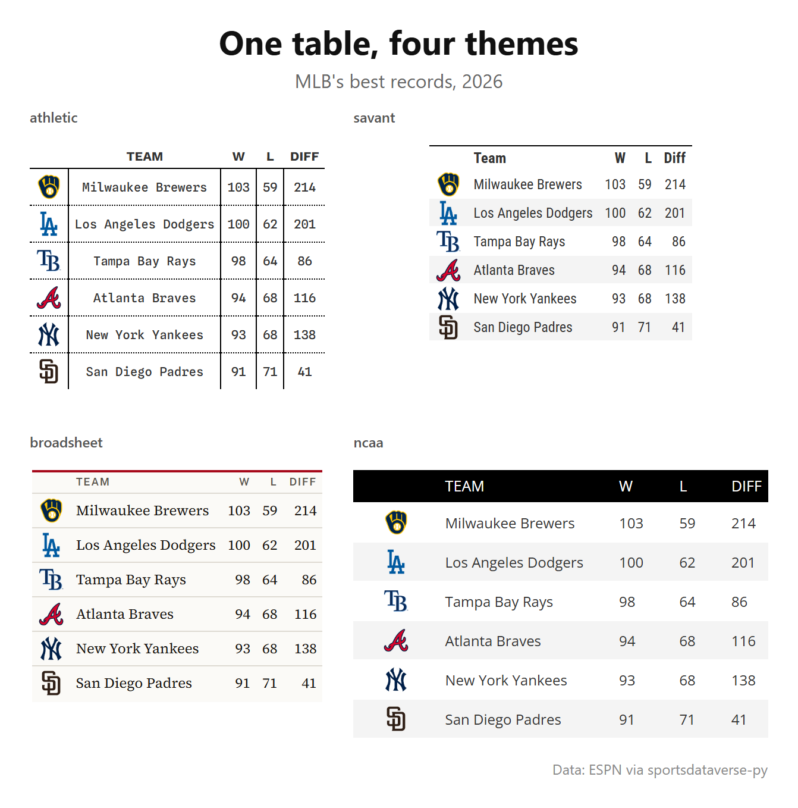
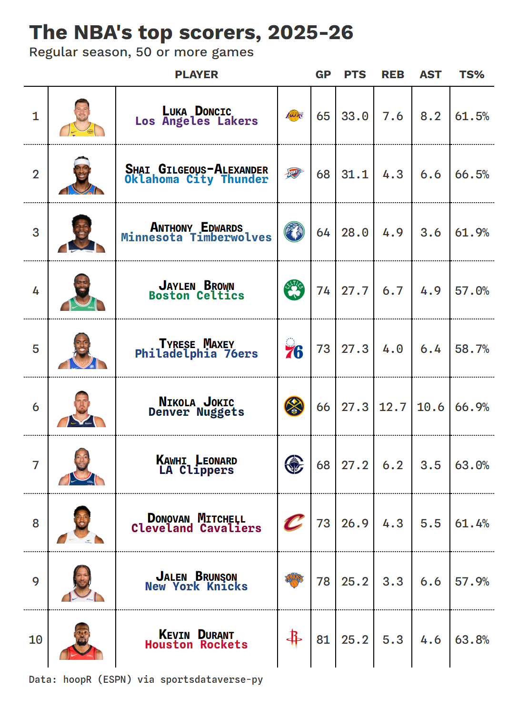
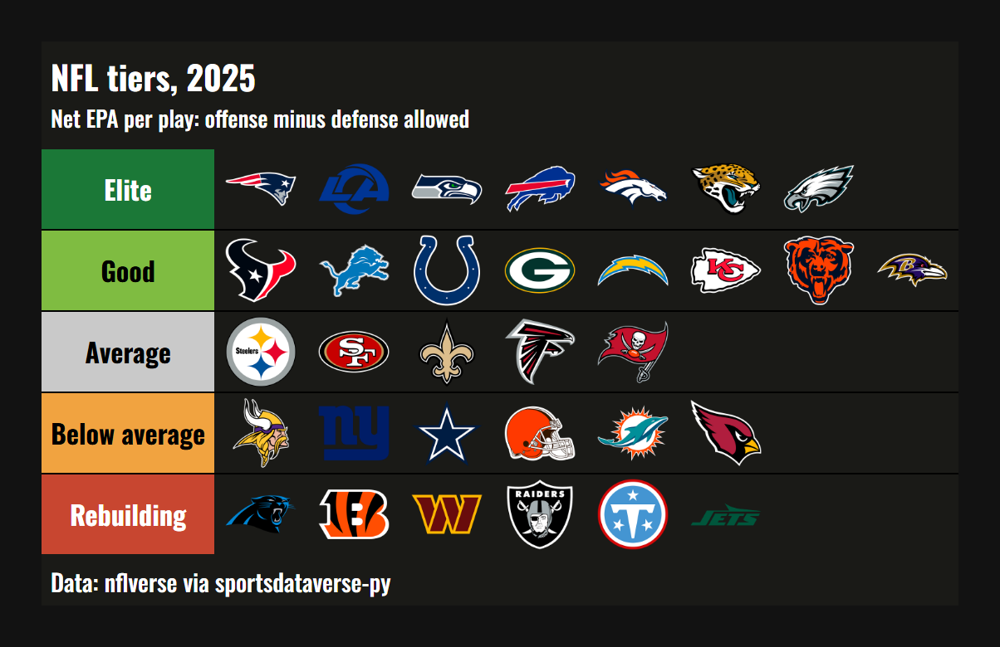
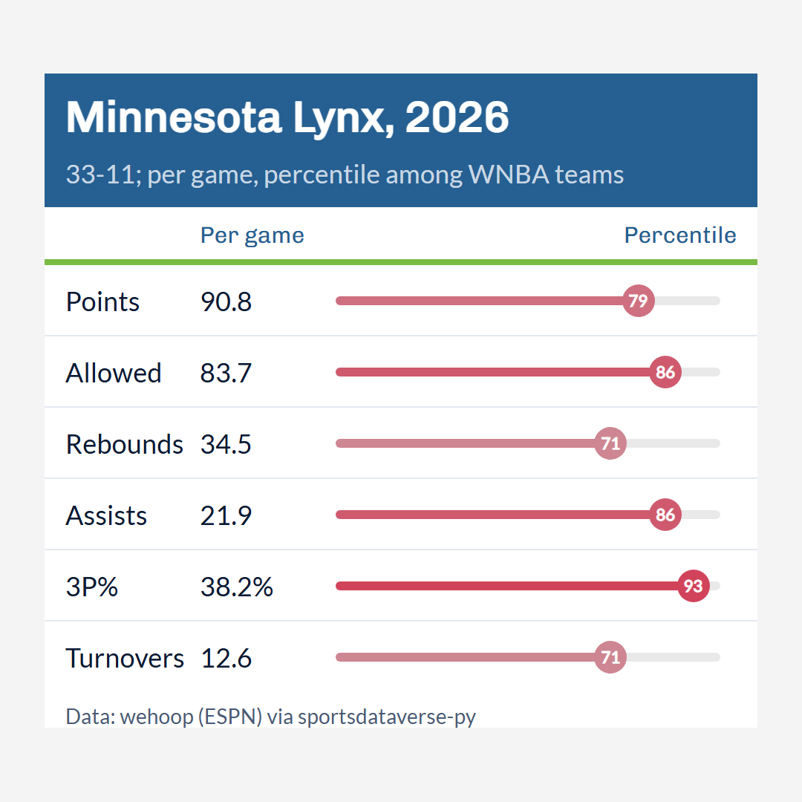
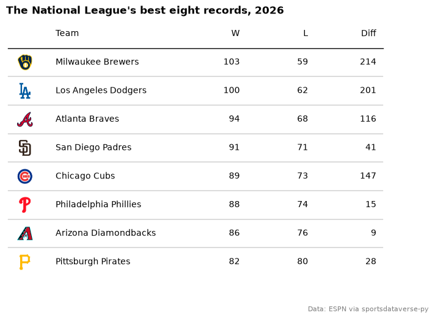

# Tables

Twelve recipes for team and player marks in tables: great_tables with sdvplot's logo and headshot cells, its
twenty themes, the cell helpers (color pills, percentile bars, indicator boxes, legends, tier lists, snaked
lists, captions) and image export for social posts, then the same marks in reactable and plottable. The data
is one season each from the NHL (its standings endpoint), MLB (ESPN), the NBA, WNBA and men's college basketball
(hoopR and wehoop) and the NFL (nflverse), all through sportsdataverse-py. Tables saved as images go to a
temporary folder.

```python
import tempfile
from pathlib import Path

import matplotlib.pyplot as plt
import polars as pl
import sportsdataverse.mbb as mbb
import sportsdataverse.mlb as mlb
import sportsdataverse.nba as nba
import sportsdataverse.nfl as nfl
import sportsdataverse.nhl as nhl
import sportsdataverse.wnba as wnba
from great_tables import GT
from IPython.display import Image, display

import sdvplot
from sdvplot.great_tables import (
    gt_538_caption,
    gt_color_pills,
    gt_grid,
    gt_indicator_boxes,
    gt_legend_continuous,
    gt_merge_stack_team_color,
    gt_percentile_bar,
    gt_save_crop,
    gt_sdv_headshots,
    gt_sdv_logos,
    gt_snake,
    gt_social_crop,
    gt_theme_almanac,
    gt_theme_athletic,
    gt_theme_kenpom,
    gt_theme_preview,
    gt_theme_savant,
    gt_theme_sdv,
    gt_theme_sdv_team,
    gt_tiers,
)

NFL_SEASON = 2025  # nflverse names a season by the year it starts
SEASON = 2026  # the 2026 MLB and WNBA seasons, and the 2025-26 NBA, NHL and college basketball season
OUT = Path(tempfile.mkdtemp())  # saved images go here, not into your working folder
```

The shared tables: the NHL's final 2025-26 standings (from the NHL's standings endpoint, as of the last day of
the regular season) and MLB's final 2026 standings from ESPN.

```python
nhl_standings = nhl.nhl_standings("2026-04-16")
mlb_standings = mlb.espn_mlb_standings(season=SEASON).with_columns(
    pl.col("wins", "losses", "points_for", "points_against", "point_differential").cast(pl.Int64)
)
nhl_standings["conference_name"].unique().sort().to_list(), mlb_standings["group_name"].unique().sort().to_list()
```

<div class="sdv-output">

```text
(['Eastern', 'Western'], ['American League', 'National League'])
```

</div>

## 1. Logos in a team column, with a theme

`gt_sdv_logos(gt, column, league=...)` turns each cell's team into its logo; any id the index knows works (here
the NHL's own abbreviations). `gt_theme_sdv` is the SportsDataverse house style: Chivo labels, a Lato body and
the SDV gradient under the column labels.

```python
east = (
    nhl_standings.filter(pl.col("conference_name") == "Eastern")
    .sort("division_name", "division_sequence")
    .select(
        division="division_name",
        logo="team_abbrev_default",
        team="team_name_default",
        gp="games_played",
        w="wins",
        l="losses",
        otl="ot_losses",
        pts="points",
        pct="point_pctg",
        diff="goal_differential",
    )
)
gt = (
    GT(east, groupname_col="division")
    .tab_header("Eastern Conference standings, 2025-26", "Final regular season, by division")
    .cols_label(logo="", team="Team", gp="GP", w="W", l="L", otl="OTL", pts="PTS", pct="PTS%", diff="DIFF")
    .fmt_number("pct", decimals=3)
    .tab_source_note("Data: NHL via sportsdataverse-py")
)
gt = gt_theme_sdv(gt_sdv_logos(gt, "logo", league="nhl", height=26))
gt
```

<div class="sdv-output">

<iframe class="sdv-frame" src="/outputs/cookbooks/tables/5_0.html" title="HTML output" height="480" loading="lazy"></iframe>

</div>

## 2. Compare themes, and save them as one image

`gt_theme_preview` gives the same rows in each theme you name; `gt_grid` lays tables out side by side and,
with `file=`, saves the grid as a PNG (through headless Chrome). MLB's six best records in four looks:

```python
best = (
    mlb_standings.sort(["win_percent", "team_abbreviation"], descending=[True, False])
    .head(6)
    .select(logo="team_abbreviation", Team="team_display_name", W="wins", L="losses", Diff="point_differential")
)
themes = gt_theme_preview(
    best, themes=["gt_theme_athletic", "gt_theme_savant", "gt_theme_broadsheet", "gt_theme_ncaa"], n=6
)
tables = [gt_sdv_logos(t.cols_label(logo=""), "logo", league="mlb", height=22) for t in themes.values()]
grid = gt_grid(
    tables,
    ncol=2,
    labels=[name.removeprefix("gt_theme_") for name in themes],
    title="One table, four themes",
    subtitle=f"MLB's best records, {SEASON}",
    source_note="Data: ESPN via sportsdataverse-py",
    file=OUT / "themes.png",
)
display(Image(filename=grid, width=760))
```

<div class="sdv-output">



</div>

## 3. Headshots and a two-line name cell

`gt_sdv_headshots` turns ESPN athlete ids into photos. `gt_merge_stack_team_color` stacks the player's name over
the team's, the second line in the team's color. The NBA's top scorers, saved with `gt_save_crop`, the way
you would post them:

```python
players = nba.load_nba_player_boxscore(seasons=[SEASON]).filter((pl.col("season_type") == 2) & ~pl.col("did_not_play"))
scorers = (
    players.sort("game_date")
    .group_by("athlete_id", "athlete_display_name")
    .agg(
        team=pl.col("team_abbreviation").last(),
        team_name=pl.col("team_display_name").last(),
        gp=pl.len(),
        ppg=pl.col("points").mean(),
        rpg=pl.col("rebounds").mean(),
        apg=pl.col("assists").mean(),
        ts=pl.col("points").sum()
        / (2 * (pl.col("field_goals_attempted").sum() + 0.44 * pl.col("free_throws_attempted").sum())),
    )
    .filter(pl.col("gp") >= 50)
    .sort("ppg", descending=True)
    .head(10)
    .with_columns(rank=pl.int_range(1, 11), photo=pl.col("athlete_id"), logo=pl.col("team"))
    .select("rank", "photo", "athlete_display_name", "team_name", "team", "logo", "gp", "ppg", "rpg", "apg", "ts")
)
gt = (
    GT(scorers)
    .tab_header("The NBA's top scorers, 2025-26", "Regular season, 50 or more games")
    .cols_label(
        rank="", photo="", athlete_display_name="Player", logo="", gp="GP", ppg="PTS", rpg="REB", apg="AST", ts="TS%"
    )
    .fmt_number(["ppg", "rpg", "apg"], decimals=1)
    .fmt_percent("ts", decimals=1)
    .tab_source_note("Data: hoopR (ESPN) via sportsdataverse-py")
)
gt = gt_merge_stack_team_color(gt, "athlete_display_name", "team_name", "team", league="nba")
gt = gt_sdv_headshots(gt, "photo", league="nba", height=44)
gt = gt_sdv_logos(gt, "logo", league="nba", height=24).cols_hide("team")
gt = gt_theme_athletic(gt)
display(Image(filename=gt_save_crop(gt, OUT / "scorers.png"), width=720))
```

<div class="sdv-output">



</div>

## 4. Color pills with a matching legend

`gt_color_pills` shows each value as a rounded pill filled from a palette, with black or white text, whichever
reads; give it a `domain` so the colors mean the same thing in every table. It records its scale, so
`gt_legend_continuous(gt)` draws a key that cannot disagree with the cells. The American League:

```python
al = (
    mlb_standings.filter(pl.col("group_name") == "American League")
    .sort(["win_percent", "team_abbreviation"], descending=[True, False])
    .select(
        logo="team_abbreviation",
        team="team_display_name",
        w="wins",
        l="losses",
        pct="win_percent",
        rs="points_for",
        ra="points_against",
        diff="point_differential",
    )
)
gt = (
    GT(al)
    .tab_header(f"American League, {SEASON}", "Final regular season")
    .cols_label(logo="", team="Team", w="W", l="L", pct="PCT", rs="RS", ra="RA", diff="DIFF")
    .fmt_number("pct", decimals=3)
    .tab_source_note("Data: ESPN via sportsdataverse-py")
)
gt = gt_theme_savant(gt_sdv_logos(gt, "logo", league="mlb", height=24))  # theme first, then the fills
gt = gt_color_pills(gt, "diff", palette=["#C84630", "#F4F4F4", "#2A7AB9"], domain=(-250, 250), digits=0)
gt_legend_continuous(gt, title="Run differential", labels=["-250", "0", "+250"])
```

<div class="sdv-output">

<iframe class="sdv-frame" src="/outputs/cookbooks/tables/11_0.html" title="HTML output" height="480" loading="lazy"></iframe>

</div>

## 5. Gotcha: stripes and themes can paint over your fills

Two rules keep cell fills (`data_color`, `gt_color_ranks`, `gt_color_results`) visible.

1. **Turn row striping off when you fill cells.** In a notebook, and on these pages, great_tables shows a table
   with every CSS rule marked `!important`, so a striped row's background beats the fill. Use
   `opt_row_striping(row_striping=False)` (or a theme's own switch, such as `row_striping_include_table_body`).
   Saved images and `as_raw_html()` keep the fills, so a table can look right in an export and wrong here.
2. **Apply a theme before the fills.** Some themes band their rows with cell styles: `gt_theme_kenpom` fills
   every body row. Applied after the fills, it replaces them, and turning striping off does not help, because
   those bands are cell styles, not striping.

The first two tables show rule 1; the pair at the end shows rule 2.

```python
top = (
    nhl_standings.sort(["goal_differential", "team_abbrev_default"], descending=[True, False])
    .head(8)
    .select(logo="team_abbrev_default", team="team_name_default", diff="goal_differential")
)


def fill(gt):
    return gt.data_color("diff", palette=["#FFFFFF", "#2E7D32"], domain=[0, 130])


base = gt_sdv_logos(GT(top).cols_label(logo="", team="Team", diff="Goal diff."), "logo", league="nhl", height=22)
display(fill(base.opt_row_striping()).tab_header("Striping on: every other fill is covered"))
display(fill(base.opt_row_striping(row_striping=False)).tab_header("Striping off: every fill shows"))
gt_grid(
    [gt_theme_kenpom(fill(base)), fill(gt_theme_kenpom(base))],
    labels=["Fill, then theme: the fill is gone", "Theme, then fill: the fill shows"],
    source_note="Data: NHL via sportsdataverse-py",
)
```

<div class="sdv-output">

<iframe class="sdv-frame" src="/outputs/cookbooks/tables/13_0.html" title="HTML output" height="480" loading="lazy"></iframe>

<iframe class="sdv-frame" src="/outputs/cookbooks/tables/13_1.html" title="HTML output" height="480" loading="lazy"></iframe>

<iframe class="sdv-frame" src="/outputs/cookbooks/tables/13_2.html" title="HTML output" height="480" loading="lazy"></iframe>

</div>

## 6. Percentile bars, in a team's colors

`gt_percentile_bar` draws each percentile as a track with a marker. Here the WNBA's best regular-season team
against the league, each stat ranked so 100 is best (fewest points allowed and turnovers count as high).
`gt_theme_sdv_team` themes the table in that team's colors.

```python
games = wnba.load_wnba_team_boxscore(seasons=[SEASON]).filter(pl.col("season_type") == 2)
made, tried = pl.col("three_point_field_goals_made"), pl.col("three_point_field_goals_attempted")
per_game = (
    games.group_by("team_abbreviation", "team_display_name")
    .agg(
        gp=pl.len(),
        wins=pl.col("team_winner").sum(),
        Points=pl.col("team_score").mean(),
        Allowed=pl.col("opponent_team_score").mean(),
        Rebounds=pl.col("total_rebounds").mean(),
        Assists=pl.col("assists").mean(),
        Turnovers=pl.col("turnovers").mean(),
        three=made.sum() / tried.sum(),
    )
    .rename({"three": "3P%"})
    .filter(pl.col("gp") > 10)
)
lower_is_better = {"Points": False, "Allowed": True, "Rebounds": False, "Assists": False, "3P%": False,
                   "Turnovers": True}  # fmt: skip
ranks = per_game.with_columns(
    ((pl.col(s).rank("average", descending=low) - 1) / (pl.len() - 1) * 100).alias(f"{s} pct")
    for s, low in lower_is_better.items()
)
team = ranks.sort(["wins", "team_abbreviation"], descending=[True, False]).row(0, named=True)
card = pl.DataFrame(
    {
        "stat": list(lower_is_better),
        "value": [f"{team[s]:.1%}" if s == "3P%" else f"{team[s]:.1f}" for s in lower_is_better],
        "pct": [team[f"{s} pct"] for s in lower_is_better],
    }
)
won_lost = f"{team['wins']}-{team['gp'] - team['wins']}"
gt = (
    GT(card)
    .tab_header(f"{team['team_display_name']}, {SEASON}", f"{won_lost}; per game, as a percentile among WNBA teams")
    .cols_label(stat="", value="Per game", pct="Percentile")
    .tab_source_note("Data: wehoop (ESPN) via sportsdataverse-py")
)
gt = gt_theme_sdv_team(gt, team["team_abbreviation"], league="wnba")
gt_percentile_bar(gt, "pct", width=260)
```

<div class="sdv-output">

<iframe class="sdv-frame" src="/outputs/cookbooks/tables/15_0.html" title="HTML output" height="480" loading="lazy"></iframe>

</div>

## 7. Indicator boxes: a season at a glance

`gt_indicator_boxes` swaps values for filled or empty boxes; `key_columns` keeps the columns that are not
boxes. One row per team, one box per week: green for a win, grey for a loss or tie, white for the bye. The
AFC North:

```python
schedule = nfl.load_nfl_schedule([NFL_SEASON]).filter(pl.col("game_type") == "REG")
results = pl.concat(
    [
        schedule.select("week", team="home_team", pts="home_score", opp="away_score"),
        schedule.select("week", team="away_team", pts="away_score", opp="home_score"),
    ]
).filter(pl.col("team").is_in(["BAL", "CIN", "CLE", "PIT"]))
record = results.group_by("team").agg(
    w=(pl.col("pts") > pl.col("opp")).sum(),
    l=(pl.col("pts") < pl.col("opp")).sum(),
    t=(pl.col("pts") == pl.col("opp")).sum(),
)
boxes = results.with_columns(win=(pl.col("pts") > pl.col("opp")).cast(pl.Int8)).pivot(
    on="week", index="team", values="win"
)
weeks = [str(w) for w in range(1, schedule["week"].max() + 1)]  # a team's bye week is a missing value
grid = (
    boxes.join(record, on="team")
    .sort(["w", "team"], descending=[True, False])
    .select(
        pl.col("team").alias("logo"),
        pl.when(pl.col("t") > 0)
        .then(pl.format("{}-{}-{}", "w", "l", "t"))
        .otherwise(pl.format("{}-{}", "w", "l"))
        .alias("record"),
        *weeks,
    )
)
gt = (
    GT(grid)
    .tab_header(f"The AFC North, week by week, {NFL_SEASON}", "Green: a win. White: the bye week.")
    .cols_label(logo="", record="Record")
    .tab_source_note("Data: nflverse via sportsdataverse-py")
)
gt = gt_sdv_logos(gt_theme_sdv(gt), "logo", league="nfl", height=28)
gt = gt_indicator_boxes(gt, key_columns=["logo", "record"], color_yes="#2E7D32", color_na="#FFFFFF", box_width=22)
gt.cols_move_to_start(["logo", "record"])
```

<div class="sdv-output">

<iframe class="sdv-frame" src="/outputs/cookbooks/tables/17_0.html" title="HTML output" height="480" loading="lazy"></iframe>

</div>

## 8. A tier list as a table

`gt_tiers` takes one row per tier, a tier column and image columns (URLs or paths); `logo_url` supplies each
team's logo. NFL teams tiered by net EPA per play (offense minus defense allowed), saved as an image:

```python
weeks_stats = nfl.load_nfl_team_stats([NFL_SEASON]).filter(pl.col("season_type") == "REG")
plays = pl.col("attempts") + pl.col("sacks_suffered") + pl.col("carries")
epa = pl.col("passing_epa") + pl.col("rushing_epa")
net = (
    weeks_stats.group_by("team")
    .agg(off=epa.sum() / plays.sum())
    .join(weeks_stats.group_by(team=pl.col("opponent_team")).agg(dfn=epa.sum() / plays.sum()), on="team")
    .with_columns(net=pl.col("off") - pl.col("dfn"))
    .sort("net", descending=True)
    .with_columns(
        tier=pl.when(pl.col("net") >= 0.1)
        .then(pl.lit("Elite"))
        .when(pl.col("net") >= 0.03)
        .then(pl.lit("Good"))
        .when(pl.col("net") > -0.03)
        .then(pl.lit("Average"))
        .when(pl.col("net") > -0.1)
        .then(pl.lit("Below average"))
        .otherwise(pl.lit("Rebuilding"))
    )
)
levels = {
    "Elite": "#1B7837",
    "Good": "#7FBC41",
    "Average": "#C9C9C9",
    "Below average": "#F1A340",
    "Rebuilding": "#C84630",
}
by_tier = net.group_by("tier", maintain_order=True).agg(pl.col("team"))
width = by_tier["team"].list.len().max()
rows = {"tier": by_tier["tier"].to_list()}
for i in range(width):
    rows[f"t{i}"] = [sdvplot.logo_url(t[i], "nfl") if i < len(t) else None for t in by_tier["team"]]
gt = (
    gt_tiers(GT(pl.DataFrame(rows)), levels, img_height="46px")
    .tab_header(f"NFL tiers, {NFL_SEASON}", "Net EPA per play: offense minus defense allowed")
    .tab_source_note("Data: nflverse via sportsdataverse-py")
)
display(Image(filename=gt_save_crop(gt, OUT / "tiers.png", bg="#121212"), width=760))
```

<div class="sdv-output">



</div>

## 9. A long list in two columns, with a caption

`gt_snake` wraps a long table into side-by-side blocks, suffixing the columns `_1`, `_2`; it rebuilds the table,
so apply formats, logos and the theme after it. `gt_538_caption` adds a FiveThirtyEight-style note under a
rule. Men's college basketball's top 40 by adjusted efficiency margin:

```python
top40 = (
    mbb.load_mbb_ratings(SEASON)
    .join(sdvplot.teams("mbb").select("team_id", "short_name"), on="team_id")
    .sort("adj_em", descending=True)
    .head(40)
    .select(rank=pl.int_range(1, 41), logo="team_id", team="short_name", em="adj_em")
)
gt = gt_snake(GT(top40).cols_label(rank="", logo="", team="Team", em="Margin"), n_cols=2)
gt = gt.fmt_number(["em_1", "em_2"], decimals=1, force_sign=True)
gt = gt_sdv_logos(gt, ["logo_1", "logo_2"], league="mbb", height=20)
gt = gt_theme_almanac(gt.tab_header("Men's college basketball's top 40, 2025-26"))
gt_538_caption(
    gt,
    top_caption="Margin: adjusted points scored minus allowed per 100 possessions, against an average team.",
    bottom_caption="Data: hoopR (ESPN) via sportsdataverse-py",
)
```

<div class="sdv-output">

<iframe class="sdv-frame" src="/outputs/cookbooks/tables/21_0.html" title="HTML output" height="480" loading="lazy"></iframe>

</div>

## 10. Save for social: a trimmed image and a square post

`gt_save_crop` trims the page around the table and pads an even border; `gt_social_crop` centers the table on
a canvas of a fixed ratio (1:1, 4:5, 16:9) without cropping it, and `width=` sets the final pixel width. The
percentile card from recipe 6, as a 1080 x 1080 post:

```python
card_gt = (
    GT(card)
    .tab_header(f"{team['team_display_name']}, {SEASON}", f"{won_lost}; per game, percentile among WNBA teams")
    .cols_label(stat="", value="Per game", pct="Percentile")
    .tab_source_note("Data: wehoop (ESPN) via sportsdataverse-py")
)
card_gt = gt_theme_sdv_team(card_gt, team["team_abbreviation"], league="wnba", density="social")
card_gt = gt_percentile_bar(card_gt, "pct", width=300)
trimmed = gt_save_crop(card_gt, OUT / "card.png")
square = gt_social_crop(card_gt, OUT / "card_square.png", aspect_ratio="1:1", width=1080, bg="#F4F4F4")
for path in (trimmed, square):
    w, h = plt.imread(path).shape[1::-1]
    print(f"{Path(path).name}: {w} x {h} px")
display(Image(filename=square, width=540))
```

<div class="sdv-output">

```text
card.png: 1060 x 981 px
card_square.png: 1080 x 1080 px
```



</div>

## 11. reactable: a sortable, searchable table

`sdvplot.reactable` gives reactable columns: `reactable_sdv_logos` renders a team column as logos and
`reactable_sdv_team_color_bar` draws each value as a bar in the row's team color, as long as its share of
`max_value`. A `max_value` a little past the 82-game maximum keeps every bar short of the number, so the number
never sits on a dark fill. Click a header to sort; search by team.

```python
from reactable import Column, Reactable, embed_css

from sdvplot.reactable import reactable_sdv_logos, reactable_sdv_team_color_bar

embed_css()
nba_teams = (
    nba.load_nba_team_boxscore(seasons=[SEASON])
    .filter(pl.col("season_type") == 2)
    .group_by("team_abbreviation", "team_display_name")
    .agg(
        gp=pl.len(),
        wins=pl.col("team_winner").sum(),
        ppg=pl.col("team_score").mean().round(1),
        diff=(pl.col("team_score") - pl.col("opponent_team_score")).mean().round(1),
    )
    .filter(pl.col("gp") > 10)
    .sort(["wins", "team_abbreviation"], descending=[True, False])
    .drop("gp")
)
Reactable(
    nba_teams,
    columns=[
        reactable_sdv_logos(league="nba", id="team_abbreviation", name="", width=60),
        Column(id="team_display_name", name="Team", min_width=200),
        reactable_sdv_team_color_bar(
            nba_teams, "team_abbreviation", league="nba", max_value=82 * 1.15, id="wins", name="Wins", width=220
        ),
        Column(id="ppg", name="Points per game"),
        Column(id="diff", name="Point differential"),
    ],
    default_page_size=10,
    searchable=True,
    striped=True,
)
```

<div class="sdv-output">

<iframe class="sdv-frame" src="/outputs/cookbooks/tables/25_0.html" title="Interactive widget" height="480" loading="lazy"></iframe>

</div>

## 12. plottable: a table drawn by matplotlib

`sdvplot.plottable.logo_column` is a plottable `ColumnDefinition` that draws each row's team as its logo, so the
table is an ordinary matplotlib figure you can save like any chart. The National League's eight best
records:

```python
from plottable import ColumnDefinition, Table

from sdvplot.plottable import logo_column

nl = (
    mlb_standings.filter(pl.col("group_name") == "National League")
    .sort(["win_percent", "team_abbreviation"], descending=[True, False])
    .head(8)
    .select(logo="team_abbreviation", team="team_display_name", w="wins", l="losses", diff="point_differential")
    .to_pandas()
    .set_index("logo", drop=False)
)
fig, ax = plt.subplots(figsize=(8, 5.5))
Table(
    nl,
    ax=ax,
    index_col="logo",
    column_definitions=[
        logo_column("logo", league="mlb", title="", width=0.5),
        ColumnDefinition("team", title="Team", width=2, textprops={"ha": "left"}),
        ColumnDefinition("w", title="W"),
        ColumnDefinition("l", title="L"),
        ColumnDefinition("diff", title="Diff"),
    ],
)
ax.set_title(f"The National League's best eight records, {SEASON}", loc="left", fontweight="bold")
fig.text(0.99, 0.01, "Data: ESPN via sportsdataverse-py", ha="right", fontsize=8, color="grey")
plt.show()
```

<div class="sdv-output">



</div>

## Run it yourself

<a href="pathname:///notebooks/cookbooks/tables.ipynb" download>Download the notebook</a> (outputs cleared) or [open it on GitHub](https://github.com/sportsdataverse/sdvplot/blob/main/examples/notebooks/cookbooks/tables.ipynb).
