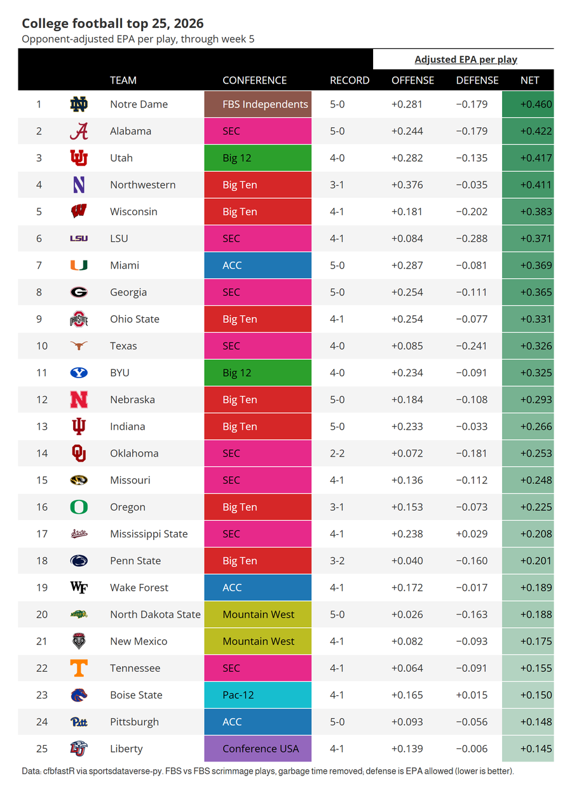
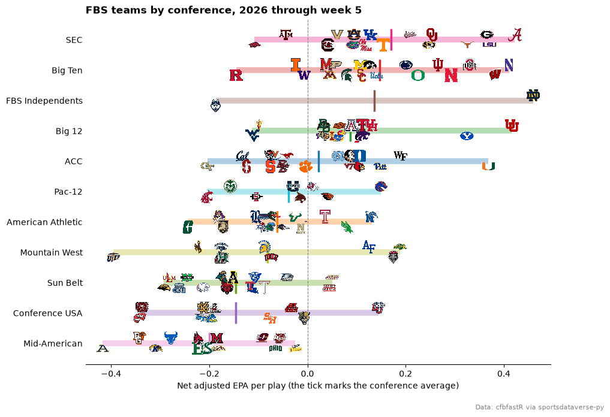
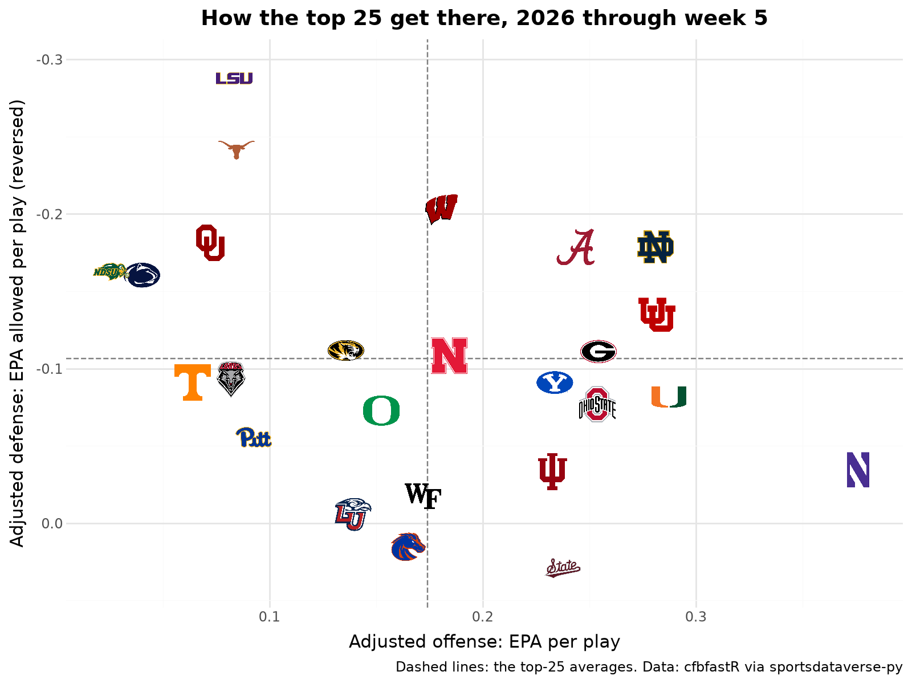

# College football weekly

This page is regenerated every week by sdvplot's docs workflow. It rates every FBS team by opponent-adjusted EPA per play, a simple cousin of SP+ built from the
play-by-play, for the latest season with data: the season to date during the fall, the final season in the offseason.
Data: cfbfastR play-by-play and schedules, read through [sportsdataverse-py](https://py.sportsdataverse.org/).

Week 0 is in late August, so before then the calendar points at last season. For a season that is not published yet
`load_cfb_pbp` warns and returns an empty frame rather than raising, so the helper below turns that into a
`NoDataError` and the page steps back one season.

```python
import datetime as dt
import warnings

import matplotlib.pyplot as plt
import polars as pl
import sportsdataverse.cfb as cfb
from IPython.display import Markdown, display
from sportsdataverse.errors import NoDataError

import sdvplot

today = dt.date.today()
current = today.year if today.month >= 8 else today.year - 1
COLUMNS = [
    "game_id",
    "week",
    "period",
    "pos_team_id",
    "def_pos_team_id",
    "pos_score_diff_start",
    "scrimmage_play",
    "EPA",
]


def play_by_play(season):
    with warnings.catch_warnings():
        warnings.simplefilter("ignore")  # "no data for season(s)": handled just below
        pbp = cfb.load_cfb_pbp([season])
    if pbp.is_empty():
        raise NoDataError(f"no {season} play-by-play yet")
    return pbp.select(COLUMNS)


try:
    season, pbp = current, play_by_play(current)
except NoDataError as err:
    print(f"{err}; showing {current - 1} instead")
    season, pbp = current - 1, play_by_play(current - 1)
```

The schedule gives each team's division, conference and record, and the status line says what the ratings cover.

```python
schedule = cfb.load_cfb_schedule([season])
played = schedule.filter(pl.col("completed"))
regular = played.filter(pl.col("season_type") == "regular")
week = regular["week"].max()
left = schedule.filter(~pl.col("completed"))
if left.filter(pl.col("season_type") == "regular").height:
    status = f"**Updated {today}:** the {season} season through week {week}."
    through = f"through week {week}"
elif left.height:
    status = f"**Updated {today}:** the {season} regular season is final; bowls and the playoff are under way."
    through = "regular season and finished bowls"
else:
    status = f"**Offseason:** the final {season} season, bowls and playoff included."
    through = "final"
display(Markdown(status))

sides = pl.concat(
    [
        played.select(
            team_id="home_id",
            school="home_team",
            conference="home_conference",
            division="home_division",
            win="home_winner",
        ),
        played.select(
            team_id="away_id",
            school="away_team",
            conference="away_conference",
            division="away_division",
            win="away_winner",
        ),
    ]
)
fbs = (
    sides.filter(pl.col("division") == "fbs")
    .group_by("team_id")
    .agg(pl.col("school", "conference").last(), w=pl.col("win").sum(), l=(~pl.col("win")).sum())
    .with_columns(record=pl.format("{}-{}", "w", "l"))
)
fbs.sort("school").head()
```

<div class="sdv-output">

**Updated 2026-10-05:** the 2026 season through week 5.

| team_id | school    | conference    | w | l | record |
|---------|-----------|---------------|---|---|--------|
| 2005    | Air Force | Mountain West | 3 | 1 | 3-1    |
| 2006    | Akron     | Mid-American  | 1 | 4 | 1-4    |
| 333     | Alabama   | SEC           | 5 | 0 | 5-0    |
| 2026    | App State | Sun Belt      | 3 | 1 | 3-1    |
| 12      | Arizona   | Big 12        | 4 | 1 | 4-1    |

</div>

## 1. Top 25 by adjusted EPA per play

The ratings use FBS-against-FBS scrimmage plays, minus garbage time (a lead of more than 43 points in the first
quarter, 37 in the second, 27 in the third or 21 in the fourth). One pass of opponent adjustment credits each offensive
play for the defense it faced (that defense's EPA allowed per play against the FBS average), and each defensive play
for the offense it faced. Net is adjusted offense minus adjusted defense.

```python
margin = pl.col("period").replace_strict({1: 43, 2: 37, 3: 27, 4: 21}, default=None)  # overtime is never garbage time
garbage = pl.col("pos_score_diff_start").abs() > margin
ids = fbs["team_id"].implode()
plays = pbp.filter(
    pl.col("scrimmage_play")
    & pl.col("EPA").is_not_null()
    & ~garbage.fill_null(False)
    & pl.col("pos_team_id").is_in(ids)
    & pl.col("def_pos_team_id").is_in(ids)
)
assert plays.schema["pos_team_id"] == fbs.schema["team_id"]

avg = plays["EPA"].mean()
offense = plays.group_by("pos_team_id").agg(faced_off=pl.col("EPA").mean())  # what each defense faced
defense = plays.group_by("def_pos_team_id").agg(faced_def=pl.col("EPA").mean())  # what each offense faced
adjusted = (  # keep the play order, so the means below sum in the same order every week
    plays.join(defense, on="def_pos_team_id", maintain_order="left").join(
        offense, on="pos_team_id", maintain_order="left"
    )
).with_columns(
    adj_off=pl.col("EPA") - (pl.col("faced_def") - avg),
    adj_def=pl.col("EPA") - (pl.col("faced_off") - avg),
)
ratings = (
    adjusted.group_by(team_id="pos_team_id")
    .agg(off=pl.col("adj_off").mean())
    .join(adjusted.group_by(team_id="def_pos_team_id").agg(dfn=pl.col("adj_def").mean()), on="team_id")
    .with_columns(net=pl.col("off") - pl.col("dfn"))
    .join(fbs, on="team_id")
    .sort(["net", "team_id"], descending=[True, False])  # a tiebreaker keeps the weekly re-render stable
    .with_row_index("rank", offset=1)
    .with_columns(pl.col("team_id").cast(pl.String))  # sdvplot ids are strings; cast the integer, never a float
)
top25 = ratings.head(25).select("rank", "team_id", "school", "conference", "record", "off", "dfn", "net")
top25.head()
```

<div class="sdv-output">

| rank | team_id | school       | conference       | record | off      | dfn       | net      |
|------|---------|--------------|------------------|--------|----------|-----------|----------|
| 1    | 87      | Notre Dame   | FBS Independents | 5-0    | 0.281153 | -0.178627 | 0.45978  |
| 2    | 333     | Alabama      | SEC              | 5-0    | 0.243624 | -0.178609 | 0.422233 |
| 3    | 254     | Utah         | Big 12           | 4-0    | 0.281749 | -0.134768 | 0.416518 |
| 4    | 77      | Northwestern | Big Ten          | 3-1    | 0.376074 | -0.034502 | 0.410575 |
| 5    | 275     | Wisconsin    | Big Ten          | 4-1    | 0.180678 | -0.201931 | 0.382609 |

</div>

Conferences get one color each from a qualitative palette, used in the table and the chart below. `gt_sdv_logos`
reads the ESPN team ids straight from the data.

```python
from great_tables import GT
from matplotlib.colors import to_hex

from sdvplot.great_tables import gt_save_crop, gt_sdv_logos, gt_theme_ncaa

conferences = sorted(fbs["conference"].unique().drop_nulls())
qualitative = [c for i, c in enumerate(plt.get_cmap("tab10").colors) if i != 7] + list(plt.get_cmap("Dark2").colors[3:])
CONF_COLORS = {conf: to_hex(color) for conf, color in zip(conferences, qualitative, strict=False)}  # tab10 minus grey

gt = (
    GT(top25, id="cfb-top25")  # a fixed id: great_tables otherwise draws a random one each run
    .tab_header(f"College football top 25, {season}", f"Opponent-adjusted EPA per play, {through}")
    .fmt_number(["off", "dfn", "net"], decimals=3, force_sign=True)
    .data_color("conference", palette=[CONF_COLORS[c] for c in conferences], domain=conferences)
    .data_color("net", palette=["#f7f7f7", "#2e8b57"], domain=[0, top25["net"].max()])
    .tab_spanner("Adjusted EPA per play", ["off", "dfn", "net"])
    .cols_label(
        rank="",
        team_id="",
        school="Team",
        conference="Conference",
        record="Record",
        off="Offense",
        dfn="Defense",
        net="Net",
    )
    .tab_source_note(
        "Data: cfbfastR via sportsdataverse-py. FBS vs FBS scrimmage plays, garbage time removed; "
        "defense is EPA allowed (lower is better)."
    )
)
gt = gt_theme_ncaa(gt_sdv_logos(gt, "team_id", league="cfb", height=26))
gt
```

<div class="sdv-output">

<iframe class="sdv-frame" src="/outputs/leaderboards/cfb-weekly/8_0.html" title="HTML output" height="480" loading="lazy"></iframe>

</div>

`gt_save_crop` renders the same table to a trimmed PNG, ready to post.

```python
gt_save_crop(gt, width=900)
```

<div class="sdv-output">



</div>

## 2. Every FBS team, by conference

One row per conference, ordered by the conference's average rating, each team's logo at its net rating (alternately
nudged up and down so neighbors overlap less). The line in the conference color spans the conference from its lowest
to its highest team.

```python
by_conf = ratings.filter(pl.col("conference").is_not_null())
order = by_conf.group_by("conference").agg(pl.col("net").mean()).sort("net", "conference")["conference"].to_list()

fig, ax = plt.subplots(figsize=(10, 7.5))
for row, conf in enumerate(order):
    teams = by_conf.filter(pl.col("conference") == conf).sort("net", "team_id")
    ax.hlines(row, teams["net"].min(), teams["net"].max(), color=CONF_COLORS[conf], lw=7, alpha=0.35, zorder=1)
    ax.plot(teams["net"].mean(), row, marker="|", markersize=26, mew=2.5, color=CONF_COLORS[conf], zorder=2)
    rows = [row + (0.17 if i % 2 else -0.17) for i in range(teams.height)]  # alternate up and down: less overlap
    sdvplot.add_logos(ax, teams["net"], rows, teams["team_id"], league="cfb", season=season, height=0.042)
ax.set_yticks(range(len(order)), order)
ax.set_ylim(-0.7, len(order) - 0.3)
ax.margins(x=0.04)
ax.axvline(0, color="grey", lw=0.8, ls="--")
ax.spines[["top", "right", "left"]].set_visible(False)
ax.tick_params(axis="y", length=0)
ax.set_xlabel("Net adjusted EPA per play (the tick marks the conference average)")
ax.set_title(f"FBS teams by conference, {season} {through}", loc="left", fontweight="bold")
fig.text(0.99, 0.01, "Data: cfbfastR via sportsdataverse-py", ha="right", fontsize=8, color="grey")
plt.show()
```

<div class="sdv-output">



</div>

## 3. Offense and defense of the top 25

The two halves of the rating for the top 25, drawn with plotnine. `geom_sdv_logos` takes the ESPN ids through the
`team` aesthetic; the defense axis is reversed so the better defenses sit higher.

```python
from plotnine import aes, element_text, ggplot, labs, scale_x_continuous, scale_y_reverse, theme, theme_minimal

from sdvplot.plotnine import geom_mean_lines, geom_sdv_logos

(
    ggplot(top25.to_pandas(), aes("off", "dfn", x0="off", y0="dfn", team="team_id"))
    + geom_mean_lines(color="grey")
    + geom_sdv_logos(league="cfb", season=season, height=0.07)
    + scale_x_continuous(expand=(0.06, 0))  # logos do not widen the limits: leave room for the outermost ones
    + scale_y_reverse(expand=(0.08, 0))
    + labs(
        x="Adjusted offense: EPA per play",
        y="Adjusted defense: EPA allowed per play (reversed)",
        title=f"How the top 25 get there, {season} {through}",
        caption="Dashed lines: the top-25 averages. Data: cfbfastR via sportsdataverse-py",
    )
    + theme_minimal()
    + theme(figure_size=(8, 6), plot_title=element_text(weight="bold"))
)
```

<div class="sdv-output">



</div>

## Run it yourself

<a href="pathname:///notebooks/leaderboards/cfb-weekly.ipynb" download>Download the notebook</a> (outputs cleared) or [open it on GitHub](https://github.com/sportsdataverse/sdvplot/blob/main/examples/notebooks/leaderboards/cfb-weekly.ipynb).
