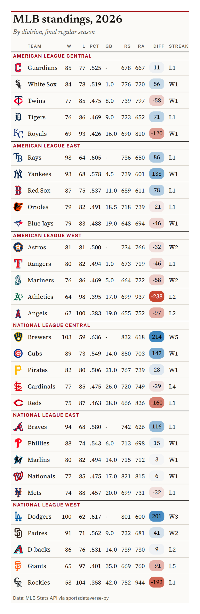
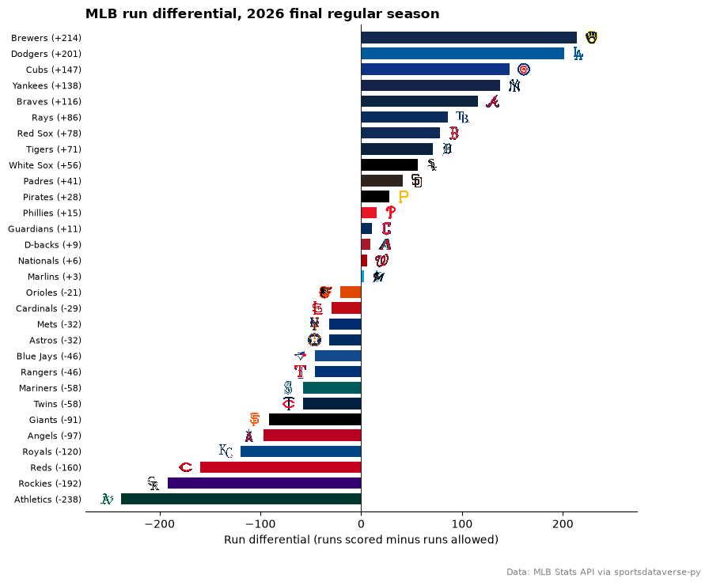
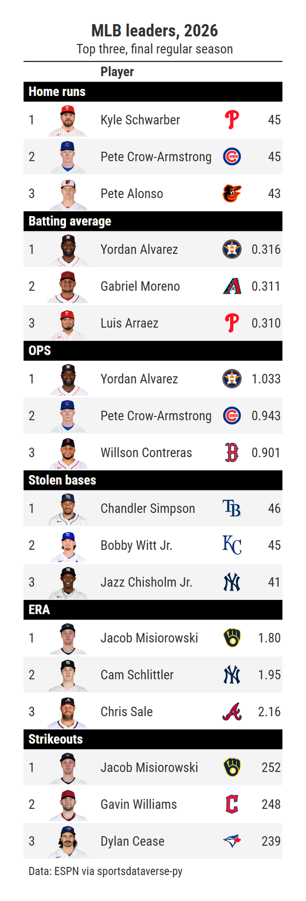

# MLB

This page is regenerated every week by sdvplot's docs workflow. It builds the division standings, charts run differential with logos and lists the league leaders with
their headshots, for the latest MLB season with games: the season to date from opening day to the end of September,
the final regular season after that. Data: the MLB Stats API and ESPN, read through
[sportsdataverse-py](https://py.sportsdataverse.org/); no key needed.

The season runs inside one calendar year, but before opening day the Stats API standings for the new season come back
empty or with no games played. The helper turns that into a `NoDataError` and the page steps back one season.

```python
import datetime as dt

import matplotlib.pyplot as plt
import polars as pl
import sportsdataverse.mlb as mlb
from IPython.display import Markdown, display
from sportsdataverse.errors import NoDataError

import sdvplot

today = dt.date.today()
current = today.year
STATS_API = "Data: MLB Stats API via sportsdataverse-py"


def standings_for(season):
    table = mlb.parse_mlb_api_standings(mlb.mlb_standings(season=season, hydrate="division"))
    if table.is_empty() or table["games_played"].max() == 0:
        raise NoDataError(f"no {season} regular-season games yet")
    return table


try:
    season, standings = current, standings_for(current)
except NoDataError as err:
    print(f"{err}; showing {current - 1} instead")
    season, standings = current - 1, standings_for(current - 1)
```

The Stats API's season calendar (`mlb_season`) says whether the regular season is still being played, so the status
line can say what the numbers cover.

```python
calendar = mlb.mlb_season(season_id=season).row(0, named=True)
regular_end = dt.date.fromisoformat(calendar["regular_season_end_date"])
post_end = dt.date.fromisoformat(calendar["post_season_end_date"])
if season < current:
    status = f"**Offseason:** the final {season} regular season; the {current} season has no games yet."
    through = "final regular season"
elif today <= regular_end:
    games = int(standings["games_played"].median())
    status = f"**Updated {today}:** the {season} season to date, about {games} games per team."
    through = f"through {games} games"
elif today <= post_end:
    status = f"**Updated {today}:** the final {season} regular season; the postseason is under way."
    through = "final regular season"
else:
    status = f"**Offseason:** the final {season} regular season."
    through = "final regular season"
display(Markdown(status))

clubs = mlb.parse_mlb_api_teams(mlb.mlb_teams(season=season)).select(pl.col("id").alias("team_id"), "abbreviation")
assert standings.schema["team_id"] == clubs.schema["team_id"]
standings = standings.join(clubs, on="team_id").select(
    "abbreviation",
    "team_name",
    division="standings_division_name",
    rank=pl.col("division_rank").cast(pl.Int64),
    w="wins",
    l="losses",
    pct="winning_percentage",
    gb="games_back",
    rs="runs_scored",
    ra="runs_allowed",
    diff="run_differential",
    strk="streak_streak_code",
)
standings.sort("division", "rank").head()
```

<div class="sdv-output">

**Updated 2026-10-05:** the final 2026 regular season; the postseason is under way.

| abbreviation | team_name | division                | rank | w  | l  | pct  | gb   | rs  | ra  | diff | strk |
|--------------|-----------|-------------------------|------|----|----|------|------|-----|-----|------|------|
| CLE          | Guardians | American League Central | 1    | 85 | 77 | .525 | -    | 678 | 667 | 11   | L1   |
| CWS          | White Sox | American League Central | 2    | 84 | 78 | .519 | 1.0  | 776 | 720 | 56   | W1   |
| MIN          | Twins     | American League Central | 3    | 77 | 85 | .475 | 8.0  | 739 | 797 | -58  | W1   |
| DET          | Tigers    | American League Central | 4    | 76 | 86 | .469 | 9.0  | 723 | 652 | 71   | L1   |
| KC           | Royals    | American League Central | 5    | 69 | 93 | .426 | 16.0 | 690 | 810 | -120 | W1   |

</div>

## 1. Division standings

Six tables in one, grouped by division. `gt_sdv_logos` turns the Stats API abbreviations into logos and
`gt_color_pills` draws the run differential on a scale centred at zero.

```python
from great_tables import GT

from sdvplot.great_tables import gt_color_pills, gt_save_crop, gt_sdv_logos, gt_theme_broadsheet

table = standings.sort("division", "rank").select(
    "division", "abbreviation", "team_name", "w", "l", "pct", "gb", "rs", "ra", "diff", "strk"
)
reach = max(abs(table["diff"].min()), table["diff"].max())
gt = (
    GT(table, groupname_col="division", id="mlb-standings")  # fixed id: no random one each run
    .tab_header(f"MLB standings, {season}", f"By division, {through}")
    .cols_label(
        abbreviation="",
        team_name="Team",
        w="W",
        l="L",
        pct="Pct",
        gb="GB",
        rs="RS",
        ra="RA",
        diff="Diff",
        strk="Streak",
    )
    .tab_source_note(STATS_API)
)
gt = gt_color_pills(gt, "diff", palette=["#c84630", "#f7f7f7", "#2a7ab9"], domain=[-reach, reach], digits=0)
gt = gt_theme_broadsheet(gt_sdv_logos(gt, "abbreviation", league="mlb", height=24))
gt
```

<div class="sdv-output">

<iframe class="sdv-frame" src="/outputs/leaderboards/mlb/6_0.html" title="HTML output" height="480" loading="lazy"></iframe>

</div>

`gt_save_crop` renders the same table to a trimmed PNG, ready to post.

```python
gt_save_crop(gt, width=900)
```

<div class="sdv-output">



</div>

## 2. Run differential

Every club's run differential as a bar in its colors, best at the top, the logo at the end of each bar.

```python
rd = standings.sort("diff", "abbreviation")  # ties broken by name, so each re-render matches
fig, ax = plt.subplots(figsize=(9, 8))
y = list(range(rd.height))
ax.barh(y, rd["diff"], color=sdvplot.team_colors(rd["abbreviation"].to_list(), "mlb"), height=0.72)
ax.axvline(0, color="#222222", lw=0.8)
reach = max(abs(rd["diff"].min()), rd["diff"].max())
ends = [d + (0.06 if d >= 0 else -0.06) * reach for d in rd["diff"]]
ax.set_xlim(-1.15 * reach, 1.15 * reach)
ax.set_ylim(-0.8, rd.height - 0.2)
ax.set_yticks(y, [f"{name} ({d:+d})" for name, d in zip(rd["team_name"], rd["diff"], strict=True)], fontsize=8)
ax.spines[["top", "right", "left"]].set_visible(False)
ax.tick_params(axis="y", length=0)
ax.set_xlabel("Run differential (runs scored minus runs allowed)")
ax.set_title(f"MLB run differential, {season} {through}", loc="left", fontweight="bold")
fig.text(0.99, 0.01, STATS_API, ha="right", fontsize=8, color="grey")
sdvplot.add_logos(ax, ends, y, rd["abbreviation"], league="mlb", season=season, height=0.03)
plt.show()
```

<div class="sdv-output">



</div>

## 3. League leaders with headshots

ESPN's leaders endpoint sorted by one statistic at a time (`season_type=2` is the regular season; the rate stats list
qualified players). Its athlete ids feed `gt_sdv_headshots` and its team abbreviations feed `gt_sdv_logos`.

```python
from sdvplot.great_tables import gt_sdv_headshots, gt_theme_savant

CATEGORIES = [  # (label, ESPN group, statistic, sort order, format)
    ("Home runs", "batting", "homeRuns", "desc", "{:.0f}"),
    ("Batting average", "batting", "avg", "desc", "{:.3f}"),
    ("OPS", "batting", "OPS", "desc", "{:.3f}"),
    ("Stolen bases", "batting", "stolenBases", "desc", "{:.0f}"),
    ("ERA", "pitching", "ERA", "asc", "{:.2f}"),
    ("Strikeouts", "pitching", "strikeouts", "desc", "{:.0f}"),
]
rows = []
for name, group, stat, order, fmt in CATEGORIES:
    raw = mlb.espn_mlb_leaders(
        season=season, season_type=2, sort=f"{group}.{stat}:{order}", limit=3, return_parsed=False
    )
    labels = next(c["names"] for c in raw["categories"] if c["name"] == group)
    for rank, a in enumerate(raw["athletes"], start=1):
        values = dict(zip(labels, next(c["values"] for c in a["categories"] if c["name"] == group), strict=True))
        rows.append(
            {
                "category": name,
                "rank": rank,
                "espn_id": a["athlete"]["id"],
                "player": a["athlete"]["displayName"],
                "team": a["athlete"]["teamShortName"],
                "value": fmt.format(values[stat]),
            }
        )
leaders = pl.DataFrame(rows)

leaders_gt = (
    GT(leaders, groupname_col="category", id="mlb-leaders")
    .tab_header(f"MLB leaders, {season}", f"Top three, {through}")
    .cols_label(rank="", espn_id="", player="Player", team="", value="")
    .cols_align("right", "value")
    .tab_source_note("Data: ESPN via sportsdataverse-py")
)
leaders_gt = gt_sdv_headshots(leaders_gt, "espn_id", league="mlb", height=36)
leaders_gt = gt_theme_savant(gt_sdv_logos(leaders_gt, "team", league="mlb", height=22))
leaders_gt
```

<div class="sdv-output">

<iframe class="sdv-frame" src="/outputs/leaderboards/mlb/12_0.html" title="HTML output" height="480" loading="lazy"></iframe>

</div>

```python
gt_save_crop(leaders_gt, width=700)
```

<div class="sdv-output">



</div>

## Run it yourself

<a href="pathname:///notebooks/leaderboards/mlb.ipynb" download>Download the notebook</a> (outputs cleared) or [open it on GitHub](https://github.com/sportsdataverse/sdvplot/blob/main/examples/notebooks/leaderboards/mlb.ipynb).
