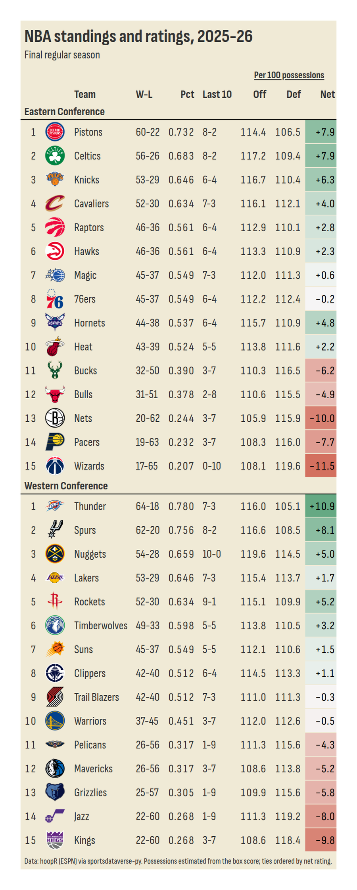
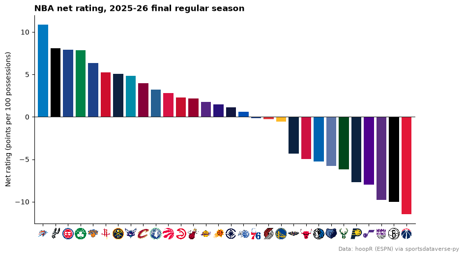
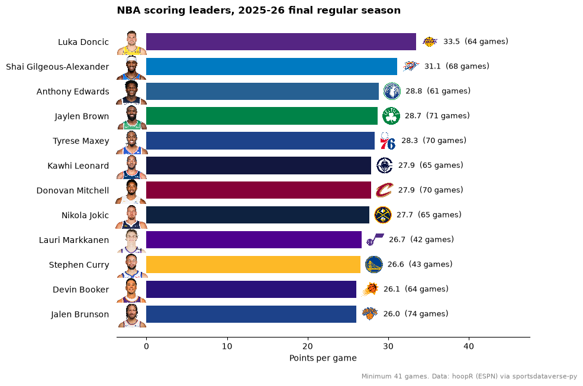

# NBA

This page is regenerated every week by sdvplot's docs workflow. It builds the standings with offensive, defensive and net ratings, charts net rating with logos and ranks
the scoring leaders with their headshots, for the latest NBA season with games: the season to date from October to
April, the final regular season once it is over. Data: hoopR's ESPN box scores, read from release files through
[sportsdataverse-py](https://py.sportsdataverse.org/) (no stats.nba.com calls).

NBA seasons are named by the year they end (2025-26 is `2026`) and tip off in October, so until then the calendar points at the season that ended in June. For a season that is not published yet `load_nba_team_boxscore` warns and returns an empty frame rather
than raising, so the helper below turns "no regular-season games" into a `NoDataError` and the page steps back one
season.

```python
import datetime as dt
import warnings

import matplotlib.pyplot as plt
import polars as pl
import sportsdataverse.nba as nba
from IPython.display import Markdown, display
from sportsdataverse.errors import NoDataError

import sdvplot

today = dt.date.today()
current = today.year + 1 if today.month >= 10 else today.year
SOURCE = "Data: hoopR (ESPN) via sportsdataverse-py"


def label(season):
    return f"{season - 1}-{season % 100:02d}"


def team_games(season):
    with warnings.catch_warnings():
        warnings.simplefilter("ignore")  # "no data for season(s)": handled just below
        box = nba.load_nba_team_boxscore(seasons=[season])
    if box.is_empty() or box.filter(pl.col("season_type") == 2).is_empty():
        raise NoDataError(f"no {label(season)} regular-season games yet")
    return box


try:
    season, box = current, team_games(current)
except NoDataError as err:
    print(f"{err}; showing {label(current - 1)} instead")
    season, box = current - 1, team_games(current - 1)
```

<div class="sdv-output">

```text
no 2026-27 regular-season games yet; showing 2025-26 instead
```

</div>

The status line is written when the page runs: the season to date, a finished regular season with the playoffs under
way, or the offseason.

```python
last_game = box["game_date"].max()
if season < current:
    status = f"**Offseason:** the final {label(season)} regular season; the {label(current)} season has no games yet."
    through = "final regular season"
elif box.filter(pl.col("season_type") == 3).is_empty():
    status = f"**Season to date:** the {label(season)} season through {last_game:%B} {last_game.day}."
    through = f"through {last_game:%b} {last_game.day}"
elif (today - last_game).days <= 10:
    status = f"**Playoffs:** the final {label(season)} regular season; the playoffs are under way."
    through = "final regular season"
else:
    status = f"**Offseason:** the final {label(season)} regular season."
    through = "final regular season"
subtitle = through[:1].upper() + through[1:]
display(Markdown(status))
```

<div class="sdv-output">

**Offseason:** the final 2025-26 regular season; the 2026-27 season has no games yet.

</div>

ESPN files the All-Star Game and the in-season cup final as regular-season games, though neither counts in the
standings. The schedule marks them in `type_abbreviation` (`ALLSTAR`, `CC`), so keep the standard games (`STD`) only.
`resolve` then maps the ESPN team ids to sdvplot's, for the team table's names and conferences.

```python
standard = nba.load_nba_schedule(seasons=[season]).filter(
    (pl.col("season_type") == 2) & (pl.col("type_abbreviation") == "STD")
)
assert box.schema["game_id"] == standard.schema["game_id"]
regular = box.filter(pl.col("season_type") == 2).join(standard.select("game_id"), on="game_id", how="semi")
regular = regular.with_columns(
    team=pl.Series(sdvplot.resolve(regular["team_id"].cast(pl.String).to_list(), "nba"), dtype=pl.String)
)
possessions = (  # the box-score estimate, averaged with the opponent's
    pl.col("field_goals_attempted")
    - pl.col("offensive_rebounds")
    + pl.col("total_turnovers")
    + 0.44 * pl.col("free_throws_attempted")
)
games = regular.with_columns(poss=possessions).with_columns(poss=pl.col("poss").mean().over("game_id"))
teams = sdvplot.teams("nba").select(team="team_id", abbr="abbr", name="short_name", conference="conference")
ratings = (
    games.sort("game_date")
    .group_by("team", maintain_order=True)
    .agg(
        w=pl.col("team_winner").sum(),
        l=(~pl.col("team_winner")).sum(),
        l10=pl.col("team_winner").tail(10).sum(),
        ortg=100 * pl.col("team_score").sum() / pl.col("poss").sum(),
        drtg=100 * pl.col("opponent_team_score").sum() / pl.col("poss").sum(),
    )
    .with_columns(pct=pl.col("w") / (pl.col("w") + pl.col("l")), net=pl.col("ortg") - pl.col("drtg"))
    .join(teams, on="team")
    .sort(["pct", "net", "team"], descending=[True, True, False])  # a tiebreaker keeps re-renders stable
)
ratings.head()
```

<div class="sdv-output">

| team | w  | l  | l10 | ortg       | drtg       | pct      | net       | abbr | name    | conference         |
|------|----|----|-----|------------|------------|----------|-----------|------|---------|--------------------|
| 25   | 64 | 18 | 7   | 115.988049 | 105.126054 | 0.780488 | 10.861996 | OKC  | Thunder | Western Conference |
| 24   | 62 | 20 | 8   | 116.606658 | 108.525126 | 0.756098 | 8.081532  | SA   | Spurs   | Western Conference |
| 8    | 60 | 22 | 8   | 114.414822 | 106.488601 | 0.731707 | 7.926221  | DET  | Pistons | Eastern Conference |
| 2    | 56 | 26 | 8   | 117.222701 | 109.368854 | 0.682927 | 7.853846  | BOS  | Celtics | Eastern Conference |
| 7    | 54 | 28 | 10  | 119.578358 | 114.537192 | 0.658537 | 5.041166  | DEN  | Nuggets | Western Conference |

</div>

## 1. Standings with net rating

Each conference ordered by winning percentage, with every team's points scored and allowed per 100 possessions.
`gt_sdv_logos` draws the logos from the abbreviations in sdvplot's team table.

```python
from great_tables import GT

from sdvplot.great_tables import gt_save_crop, gt_sdv_logos, gt_theme_sofa

table = ratings.with_columns(
    record=pl.format("{}-{}", "w", "l"),
    last10=pl.format("{}-{}", "l10", pl.min_horizontal(10, pl.col("w") + pl.col("l")) - pl.col("l10")),
    seed=pl.col("pct").rank("ordinal", descending=True).over("conference"),
).sort("conference", "seed")
table = table.select("conference", "seed", "abbr", "name", "record", "pct", "last10", "ortg", "drtg", "net")
gt = (
    GT(table, groupname_col="conference", id="nba-standings")  # fixed id: no random one each run
    .tab_header(f"NBA standings and ratings, {label(season)}", subtitle)
    .fmt_number("pct", decimals=3)
    .cols_align("left", "name")
    .fmt_number(["ortg", "drtg"], decimals=1)
    .fmt_number("net", decimals=1, force_sign=True)
    .data_color("net", palette=["#c84630", "#f7f7f7", "#2e8b57"], domain=[-15, 15])
    .tab_spanner("Per 100 possessions", ["ortg", "drtg", "net"])
    .cols_label(
        seed="", abbr="", name="Team", record="W-L", pct="Pct", last10="Last 10", ortg="Off", drtg="Def", net="Net"
    )
    .tab_source_note(SOURCE + ". Possessions estimated from the box score; ties ordered by net rating.")
)
gt = gt_theme_sofa(gt_sdv_logos(gt, "abbr", league="nba", height=26))
gt
```

<div class="sdv-output">

<iframe class="sdv-frame" src="/outputs/leaderboards/nba/8_0.html" title="HTML output" height="480" loading="lazy"></iframe>

</div>

`gt_save_crop` renders the same table to a trimmed PNG, ready to post.

```python
gt_save_crop(gt, width=900)
```

<div class="sdv-output">



</div>

## 2. Net rating, best to worst

The same net ratings as bars in team colors; `axis_logos` swaps the abbreviations on the x axis for logos.

```python
by_net = ratings.sort(["net", "team"], descending=[True, False])
fig, ax = plt.subplots(figsize=(10, 5.5))
ax.bar(by_net["abbr"], by_net["net"], color=sdvplot.team_colors("nba", by_net["team"].to_list()))
ax.axhline(0, color="#222222", lw=0.8)
ax.margins(x=0.01)
ax.set_ylabel("Net rating (points per 100 possessions)")
ax.spines[["top", "right"]].set_visible(False)
ax.set_title(f"NBA net rating, {label(season)} {through}", loc="left", fontweight="bold")
fig.text(0.99, 0.01, SOURCE, ha="right", fontsize=8, color="grey")
sdvplot.axis_logos(ax, "x", league="nba", season=season, height=0.06)
plt.show()
```

<div class="sdv-output">



</div>

## 3. Scoring leaders with headshots

Points per game from the player box scores (standard games only, as above), for players who appeared in at least half of the most games any team has
played. ESPN athlete ids feed `add_headshots`.

```python
players = (
    nba.load_nba_player_boxscore(seasons=[season])
    .filter((pl.col("season_type") == 2) & ~pl.col("did_not_play") & pl.col("minutes").is_not_null())
    .join(standard.select("game_id"), on="game_id", how="semi")
)  # no All-Star or cup final
games_played = players.group_by("team_id", maintain_order=True).agg(pl.col("game_id").n_unique())["game_id"].max()
leaders = (
    players.sort("game_date")
    .group_by("athlete_id", maintain_order=True)
    .agg(
        name=pl.col("athlete_display_name").last(),
        team=pl.col("team_abbreviation").last(),
        gp=pl.len(),
        ppg=pl.col("points").mean(),
    )
    .filter(pl.col("gp") >= games_played / 2)
    .sort(["ppg", "athlete_id"], descending=[True, False])
    .head(12)
    .reverse()
)

fig, ax = plt.subplots(figsize=(9, 7))
y = list(range(leaders.height))
ax.barh(y, leaders["ppg"], color=sdvplot.team_colors("nba", leaders["team"].to_list()), height=0.7)
ax.set_yticks(y, [f"{name}  " for name in leaders["name"]])
top = leaders["ppg"].max()
for i, (ppg, gp) in enumerate(zip(leaders["ppg"], leaders["gp"], strict=True)):
    ax.text(ppg + 0.1 * top, i, f"{ppg:.1f}  ({gp} games)", va="center", fontsize=9)
ax.set_xlim(-0.11 * top, 1.42 * top)
sdvplot.add_headshots(ax, [-0.055 * top] * leaders.height, y, leaders["athlete_id"], league="nba", height=0.085)
sdvplot.add_logos(
    ax, (leaders["ppg"] + 0.05 * top).to_list(), y, leaders["team"], league="nba", season=season, height=0.06
)
ax.spines[["top", "right", "left"]].set_visible(False)
ax.tick_params(axis="y", length=0)
ax.set_xlabel("Points per game")
ax.set_title(f"NBA scoring leaders, {label(season)} {through}", loc="left", fontweight="bold")
fig.text(0.99, 0.01, f"Minimum {games_played / 2:.0f} games. {SOURCE}", ha="right", fontsize=8, color="grey")
plt.show()
```

<div class="sdv-output">



</div>

## Run it yourself

<a href="pathname:///notebooks/leaderboards/nba.ipynb" download>Download the notebook</a> (outputs cleared) or [open it on GitHub](https://github.com/sportsdataverse/sdvplot/blob/main/examples/notebooks/leaderboards/nba.ipynb).
