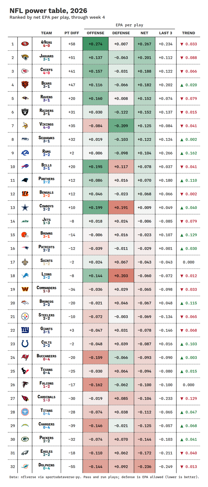
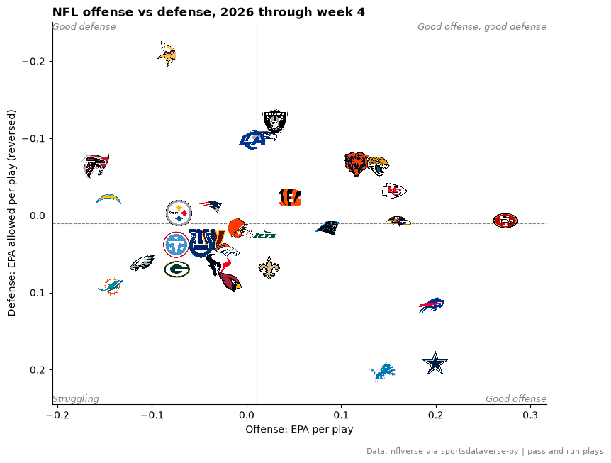
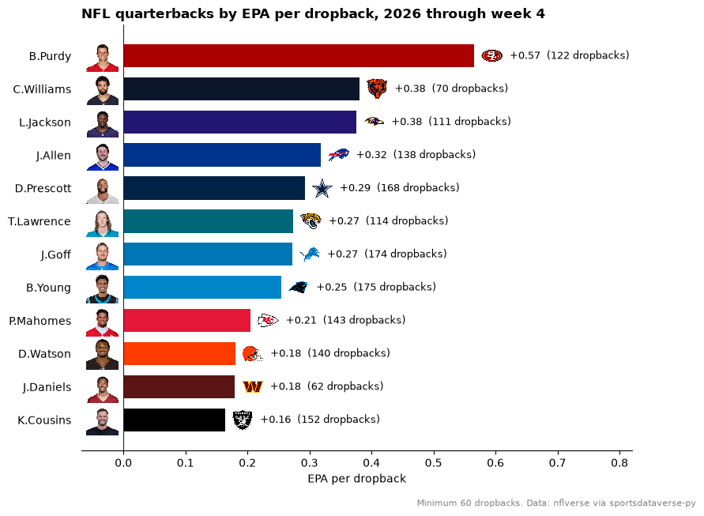

# NFL weekly

This page is regenerated every week by sdvplot's docs workflow. It finds the latest NFL season with play-by-play, ranks every team by EPA per play, plots offense against
defense and lists the most efficient quarterbacks: the season to date while games are being played, the last full
regular season in the offseason. Data: nflverse play-by-play and schedules, read through
[sportsdataverse-py](https://py.sportsdataverse.org/).

The season starts in September, so before then the calendar points at last season. nflverse publishes a season's
play-by-play file with its first games; until then `load_nfl_pbp` raises `NoDataError`, and the page steps back one
season instead of failing.

```python
import datetime as dt

import matplotlib.pyplot as plt
import polars as pl
import sportsdataverse.nfl as nfl
from IPython.display import Markdown, display
from sportsdataverse.errors import NoDataError

import sdvplot

today = dt.date.today()
current = today.year if today.month >= 9 else today.year - 1


def regular_season(season):
    pbp = nfl.load_nfl_pbp([season])  # NoDataError until nflverse publishes the season
    pbp = pbp.filter(pl.col("season_type") == "REG")
    if pbp.is_empty():
        raise NoDataError(f"no {season} regular-season plays yet")
    return pbp


try:
    season, pbp = current, regular_season(current)
except NoDataError as err:
    print(f"{err}; showing {current - 1} instead")
    season, pbp = current - 1, regular_season(current - 1)
```

The status line below is written when the page runs. It says whether the table is the season to date or a finished
regular season, so a stale table is never presented as current.

```python
schedule = nfl.load_nfl_schedule([season])
week, n_games = pbp["week"].max(), pbp["game_id"].n_unique()
unplayed = schedule.filter((pl.col("game_type") == "REG") & pl.col("result").is_null()).height
super_bowl = schedule.filter((pl.col("game_type") == "SB") & pl.col("result").is_not_null()).height
if unplayed:
    status = f"**Season to date:** the {season} season through week {week} ({n_games} games)."
    through = f"through week {week}"
elif not super_bowl:
    status = f"**Playoffs:** the final {season} regular season; the playoffs are under way."
    through = "final regular season"
else:
    status = f"**Offseason:** the final {season} regular season. The {season + 1} season starts in September."
    through = "final regular season"
display(Markdown(status))
```

<div class="sdv-output">

**Season to date:** the 2026 season through week 4 (63 games).

</div>

## 1. Power table

Every team's record and point differential from the schedule, and its EPA (expected points added) per pass or run play
on offense and allowed on defense, from the play-by-play. Net EPA per play is offense minus defense; the last column
compares each team's last three games with its season. `gt_merge_stack_team_color` stacks the record under the
nickname in team colors and `gt_sdv_logos` turns the nflverse abbreviations into logos.

```python
plays = pbp.filter(((pl.col("pass") == 1) | (pl.col("rush") == 1)) & pl.col("epa").is_not_null())
per_game = (
    plays.group_by("game_id", "week", team="posteam", maintain_order=True)
    .agg(off=pl.col("epa").sum(), off_n=pl.len())
    .join(
        plays.group_by("game_id", team="defteam", maintain_order=True).agg(dfn=pl.col("epa").sum(), dfn_n=pl.len()),
        on=["game_id", "team"],
    )
    .sort("team", "week")  # a fixed row order makes every sum below come out bit-for-bit the same each week
)


def per_play(games):
    return (
        games.group_by("team", maintain_order=True)
        .agg(
            off_epa=pl.col("off").sum() / pl.col("off_n").sum(),
            def_epa=pl.col("dfn").sum() / pl.col("dfn_n").sum(),
        )
        .with_columns(net=pl.col("off_epa") - pl.col("def_epa"))
    )


last3 = per_play(per_game.group_by("team", maintain_order=True).tail(3)).select("team", last3="net")

games = schedule.filter(pl.col("game_type") == "REG").join(pbp.select("game_id").unique(), on="game_id", how="semi")
sides = pl.concat(
    [
        games.select(team="home_team", pf="home_score", pa="away_score"),
        games.select(team="away_team", pf="away_score", pa="home_score"),
    ]
)
record = sides.group_by("team", maintain_order=True).agg(
    w=(pl.col("pf") > pl.col("pa")).sum(),
    l=(pl.col("pf") < pl.col("pa")).sum(),
    t=(pl.col("pf") == pl.col("pa")).sum(),
    diff=(pl.col("pf") - pl.col("pa")).sum(),
)
record = record.with_columns(
    record=pl.when(pl.col("t") > 0).then(pl.format("{}-{}-{}", "w", "l", "t")).otherwise(pl.format("{}-{}", "w", "l"))
)

nicknames = nfl.load_nfl_teams().select(team="team_abbr", name="team_nick")
power = (
    per_play(per_game)
    .join(last3, on="team")
    .join(record, on="team")
    .join(nicknames, on="team")
    .sort(["net", "team"], descending=[True, False])  # a tiebreaker keeps the weekly re-render stable
    .with_row_index("rank", offset=1)
    .select("rank", "team", "name", "record", "diff", "off_epa", "def_epa", "net", "last3")
)
power.head()
```

<div class="sdv-output">

| rank | team | name    | record | diff | off_epa  | def_epa   | net      | last3    |
|------|------|---------|--------|------|----------|-----------|----------|----------|
| 1    | SF   | 49ers   | 4-0    | 58   | 0.273627 | 0.006825  | 0.266802 | 0.23372  |
| 2    | JAX  | Jaguars | 3-1    | 51   | 0.137129 | -0.063447 | 0.200577 | 0.11214  |
| 3    | KC   | Chiefs  | 4-0    | 41   | 0.156582 | -0.031381 | 0.187963 | 0.122073 |
| 4    | CHI  | Bears   | 3-1    | 47   | 0.116045 | -0.065657 | 0.181702 | 0.202105 |
| 5    | BAL  | Ravens  | 3-1    | 20   | 0.160467 | 0.008274  | 0.152193 | 0.073678 |

</div>

```python
from great_tables import GT

from sdvplot.great_tables import gt_delta, gt_merge_stack_team_color, gt_save_crop, gt_sdv_logos, gt_theme_athletic

GOOD_BAD = ["#c84630", "#f7f7f7", "#2e8b57"]
epa = ["off_epa", "def_epa", "net", "last3"]
gt = (
    GT(power, id="nfl-power")  # a fixed id: great_tables otherwise draws a random one each run
    .tab_header(f"NFL power table, {season}", f"Ranked by net EPA per play, {through}")
    .fmt_number(epa, decimals=3, force_sign=True)
    .fmt_number("diff", decimals=0, force_sign=True)
    .data_color("off_epa", palette=GOOD_BAD, domain=[-0.3, 0.3])
    .data_color("def_epa", palette=GOOD_BAD[::-1], domain=[-0.3, 0.3])
    .data_color("net", palette=GOOD_BAD, domain=[-0.5, 0.5])
    .tab_spanner("EPA per play", epa)
    .cols_label(
        rank="", team="", name="Team", diff="Pt diff", off_epa="Offense", def_epa="Defense", net="Net", last3="Last 3"
    )
    .tab_source_note(
        "Data: nflverse via sportsdataverse-py. Pass and run plays; defense is EPA allowed (lower is better)."
    )
)
gt = gt_merge_stack_team_color(gt, "name", "record", "team", league="nfl")
gt = gt_delta(gt, "net", "last3", column_label="Trend", decimals=3, arrows=True)
gt = gt_theme_athletic(gt_sdv_logos(gt, "team", league="nfl", height=26))
gt
```

<div class="sdv-output">

<iframe class="sdv-frame" src="/outputs/leaderboards/nfl-weekly/7_0.html" title="HTML output" height="480" loading="lazy"></iframe>

</div>

`gt_save_crop` renders the same table to a trimmed PNG, ready to post.

```python
gt_save_crop(gt, width=900)
```

<div class="sdv-output">



</div>

## 2. Offense against defense

The same EPA per play as a scatter, one logo per team. The y axis is reversed so the better defenses sit higher: the
top-right corner is where good teams live.

```python
fig, ax = plt.subplots(figsize=(9, 7))
ax.scatter(power["off_epa"], power["def_epa"], alpha=0)  # sets the limits; the logos are the points
ax.axvline(power["off_epa"].mean(), color="grey", lw=0.8, ls="--")
ax.axhline(power["def_epa"].mean(), color="grey", lw=0.8, ls="--")
ax.invert_yaxis()
ax.margins(0.1)
x0, x1 = ax.get_xlim()
y0, y1 = ax.get_ylim()
for x, y, text, ha in [
    (x1, y1, "Good offense, good defense", "right"),
    (x0, y1, "Good defense", "left"),
    (x1, y0, "Good offense", "right"),
    (x0, y0, "Struggling", "left"),
]:
    ax.text(x, y, text, ha=ha, va="top" if y == y1 else "bottom", color="grey", fontsize=9, fontstyle="italic")
sdvplot.add_logos(ax, power["off_epa"], power["def_epa"], power["team"], league="nfl", season=season, height=0.075)
ax.set(xlabel="Offense: EPA per play", ylabel="Defense: EPA allowed per play (reversed)")
ax.spines[["top", "right"]].set_visible(False)
ax.set_title(f"NFL offense vs defense, {season} {through}", loc="left", fontweight="bold")
fig.text(0.99, 0.01, "Data: nflverse via sportsdataverse-py | pass and run plays", ha="right", fontsize=8, color="grey")
plt.show()
```

<div class="sdv-output">



</div>

## 3. Quarterback leaderboard

EPA per dropback for every quarterback with at least 15 dropbacks per week of the season so far. nflverse's
play-by-play carries gsis player ids, so `add_headshots(..., id_system="gsis")` finds each headshot through the nflverse
player table.

```python
dropbacks = pbp.filter((pl.col("qb_dropback") == 1) & pl.col("qb_epa").is_not_null() & pl.col("id").is_not_null())
qbs = (
    dropbacks.group_by("id", maintain_order=True)
    .agg(name=pl.col("name").first(), team=pl.col("posteam").last(), n=pl.len(), epa=pl.col("qb_epa").mean())
    .filter(pl.col("n") >= 15 * week)
    .sort(["epa", "id"], descending=[True, False])
    .head(12)
    .reverse()
)

fig, ax = plt.subplots(figsize=(9, 7))
y = list(range(qbs.height))
ax.barh(y, qbs["epa"], color=sdvplot.team_colors("nfl", qbs["team"].to_list()), height=0.7)
ax.set_yticks(y, [f"{name}  " for name in qbs["name"]])
low = min(qbs["epa"].min(), 0)
span = qbs["epa"].max() - low
ends = qbs["epa"].clip(lower_bound=0)  # where each bar ends on the right
for i, (end, value, n) in enumerate(zip(ends, qbs["epa"], qbs["n"], strict=True)):
    ax.text(end + 0.1 * span, i, f"{value:+.2f}  ({n} dropbacks)", va="center", fontsize=9)
ax.set_xlim(low - 0.12 * span, qbs["epa"].max() + 0.45 * span)
ax.axvline(0, color="#222222", lw=0.8)
sdvplot.add_headshots(ax, [low - 0.06 * span] * qbs.height, y, qbs["id"], league="nfl", id_system="gsis", height=0.075)
sdvplot.add_logos(ax, (ends + 0.05 * span).to_list(), y, qbs["team"], league="nfl", season=season, height=0.055)
ax.spines[["top", "right", "left"]].set_visible(False)
ax.tick_params(axis="y", length=0)
ax.set_xlabel("EPA per dropback")
ax.set_title(f"NFL quarterbacks by EPA per dropback, {season} {through}", loc="left", fontweight="bold")
fig.text(
    0.99,
    0.01,
    f"Minimum {15 * week} dropbacks. Data: nflverse via sportsdataverse-py",
    ha="right",
    fontsize=8,
    color="grey",
)
plt.show()
```

<div class="sdv-output">



</div>

## Run it yourself

<a href="pathname:///notebooks/leaderboards/nfl-weekly.ipynb" download>Download the notebook</a> (outputs cleared) or [open it on GitHub](https://github.com/sportsdataverse/sdvplot/blob/main/examples/notebooks/leaderboards/nfl-weekly.ipynb).
