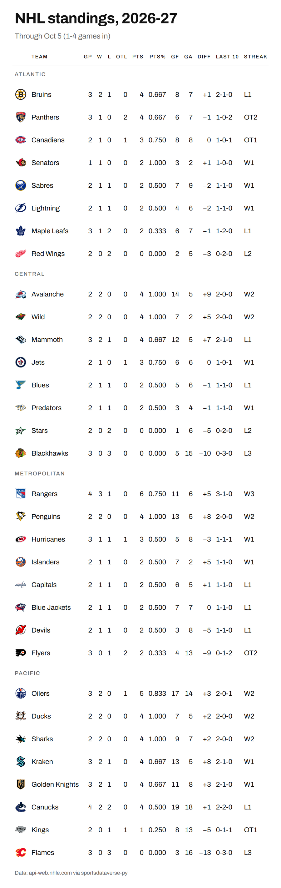
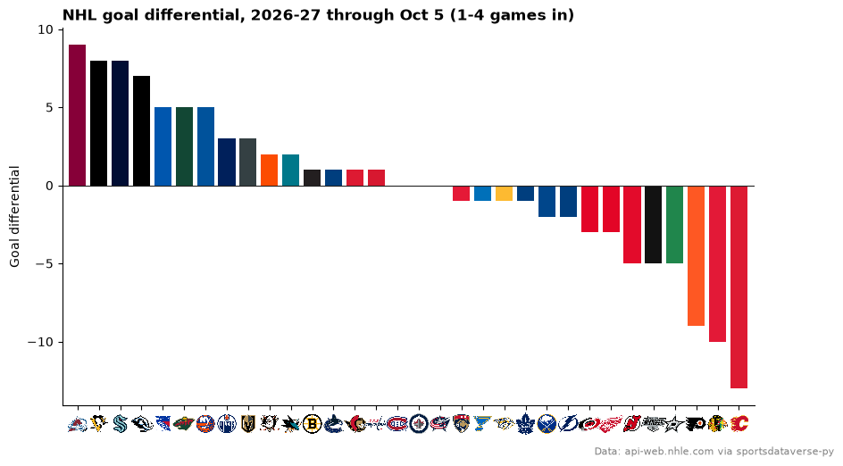
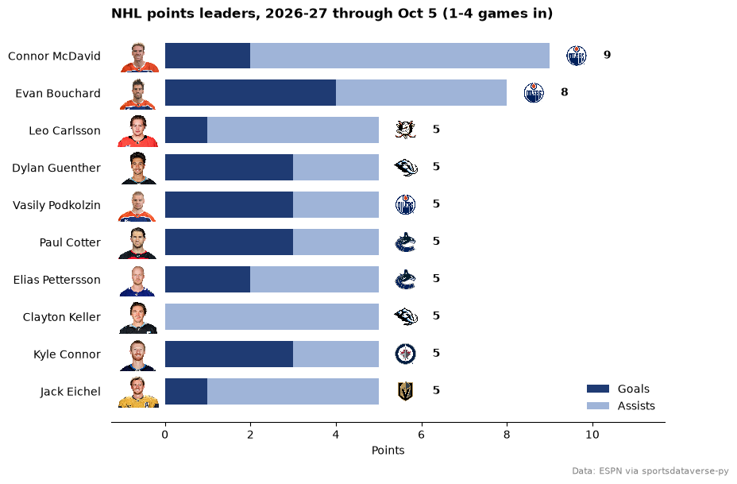

# NHL

This page is regenerated every week by sdvplot's docs workflow. It builds the standings, charts goal differential with logos and ranks the scoring leaders with their
headshots, for the latest NHL season with games: the season to date from October to April, the final regular season
once it is over. Data: the fastRhockey box-score release, the NHL's api-web.nhle.com standings and ESPN's leaders,
read through [sportsdataverse-py](https://py.sportsdataverse.org/).

NHL seasons are named by the year they end (2025-26 is `2026`) and start in the fall, so until September the calendar
points at the season that ended in June. For a season that is not published yet `load_nhl_team_box` warns and
returns an empty frame rather than raising, so the helper below turns "no regular-season games" into a `NoDataError`
and the page steps back one season. A game id's fifth and sixth digits are its type: 02 regular season, 03 playoffs.

```python
import datetime as dt
import warnings

import matplotlib.pyplot as plt
import polars as pl
import sportsdataverse.nhl as nhl
from IPython.display import Markdown, display
from sportsdataverse.errors import NoDataError

import sdvplot

today = dt.date.today()
current = today.year + 1 if today.month >= 9 else today.year


def label(season):
    return f"{season - 1}-{season % 100:02d}"


def team_games(season):
    with warnings.catch_warnings():
        warnings.simplefilter("ignore")  # "no data for season(s)": handled just below
        box = nhl.load_nhl_team_box(seasons=[season])
    if box.is_empty():
        raise NoDataError(f"no {label(season)} games yet")
    box = box.with_columns(game_type=pl.col("game_id") // 10_000 % 100, game_date=pl.col("game_date").str.to_date())
    if box.filter(pl.col("game_type") == 2).is_empty():
        raise NoDataError(f"no {label(season)} regular-season games yet")
    return box


try:
    season, box = current, team_games(current)
except NoDataError as err:
    print(f"{err}; showing {label(current - 1)} instead")
    season, box = current - 1, team_games(current - 1)
```

During the season the standings come from api-web.nhle.com as of today; once the regular season is over, as of its
last day. The status line says which.

```python
last_regular = box.filter(pl.col("game_type") == 2)["game_date"].max()
playoffs = box.filter(pl.col("game_type") == 3)
in_season = season == current and playoffs.is_empty()
standings = nhl.nhl_standings("now" if in_season else str(last_regular))
games = standings["games_played"].sum() // 2
lo, hi = standings["games_played"].min(), standings["games_played"].max()
games_in = f"{lo}-{hi}" if lo != hi else f"{hi}"  # games per team: early in the season they differ
if in_season:
    status = (
        f"**Updated {today}:** the {label(season)} season, {games_in} games in per team ({games} games played). "
        "Early-season tables move a lot from week to week."
    )
    through = f"through {today:%b} {today.day} ({games_in} games in)"
elif season < current:
    status = f"**Offseason:** the final {label(season)} regular season; the {label(current)} season has no games yet."
    through = "final regular season"
elif (today - playoffs["game_date"].max()).days <= 10:
    status = f"**Updated {today}:** the final {label(season)} regular season; the playoffs are under way."
    through = "final regular season"
else:
    status = f"**Offseason:** the final {label(season)} regular season."
    through = "final regular season"
display(Markdown(status))
```

<div class="sdv-output">

**Updated 2026-10-05:** the 2026-27 season, 1-4 games in per team (39 games played). Early-season tables move a lot from week to week.

</div>

## 1. Standings

Grouped by division in the NHL's own order. `gt_sdv_logos` turns the NHL's team codes into logos; the codes resolve
through the index, so nothing is mapped by hand.

```python
from great_tables import GT

from sdvplot.great_tables import gt_save_crop, gt_sdv_logos, gt_theme_swiss

table = standings.sort("division_name", "division_sequence").select(
    division="division_name",
    logo="team_abbrev_default",
    team="team_common_name_default",
    gp="games_played",
    w="wins",
    l="losses",
    otl="ot_losses",
    pts="points",
    pts_pct="point_pctg",
    gf="goal_for",
    ga="goal_against",
    diff="goal_differential",
    l10=pl.format("{}-{}-{}", "l10_wins", "l10_losses", "l10_ot_losses"),
    strk=pl.format("{}{}", "streak_code", "streak_count"),
)
gt = (
    GT(table, groupname_col="division")
    .tab_header(f"NHL standings, {label(season)}", through[:1].upper() + through[1:])
    .fmt_number("pts_pct", decimals=3)
    .fmt_number("diff", decimals=0, force_sign=True)
    .cols_align("left", "team")
    .cols_label(
        logo="",
        team="Team",
        gp="GP",
        w="W",
        l="L",
        otl="OTL",
        pts="PTS",
        pts_pct="PTS%",
        gf="GF",
        ga="GA",
        diff="DIFF",
        l10="Last 10",
        strk="Streak",
    )
    .tab_source_note("Data: api-web.nhle.com via sportsdataverse-py")
)
gt = gt_theme_swiss(gt_sdv_logos(gt, "logo", league="nhl", height=24))
gt
```

<div class="sdv-output">

<iframe class="sdv-frame" src="/outputs/leaderboards/nhl/6_0.html" title="HTML output" height="480" loading="lazy"></iframe>

</div>

`gt_save_crop` renders the same table to a trimmed PNG, ready to post.

```python
gt_save_crop(gt, width=900)
```

<div class="sdv-output">



</div>

## 2. Goal differential

Goals for minus goals against, all 32 teams, in team colors; `axis_logos` swaps the team codes on the x axis for
logos.

```python
gd = standings.sort("goal_differential", descending=True)
fig, ax = plt.subplots(figsize=(10, 5.5))
ax.bar(
    gd["team_abbrev_default"],
    gd["goal_differential"],
    color=sdvplot.team_colors(gd["team_abbrev_default"].to_list(), "nhl", season=season),
)
ax.axhline(0, color="#222222", lw=0.8)
ax.margins(x=0.01)
ax.set_ylabel("Goal differential")
ax.spines[["top", "right"]].set_visible(False)
ax.set_title(f"NHL goal differential, {label(season)} {through}", loc="left", fontweight="bold")
fig.text(0.99, 0.01, "Data: api-web.nhle.com via sportsdataverse-py", ha="right", fontsize=8, color="grey")
sdvplot.axis_logos(ax, "x", league="nhl", season=season, height=0.06)
plt.show()
```

<div class="sdv-output">



</div>

## 3. Scoring leaders with headshots

ESPN's leaders feed (`season_type=2`, the regular season) carries ESPN athlete ids, which is what `add_headshots`
needs. Goals and assists stack into points; the team logo sits at the end of each bar. The feed falls back to its
current season when asked for one it does not have, so check `requestedSeason` before using it.

```python
raw = nhl.espn_nhl_leaders(season=season, season_type=2, limit=12, return_parsed=False)
assert raw["requestedSeason"]["year"] == season, raw["requestedSeason"]
names = next(c["names"] for c in raw["categories"] if c["name"] == "offensive")
rows = []
for a in raw["athletes"]:
    stats = dict(zip(names, next(c["values"] for c in a["categories"] if c["name"] == "offensive"), strict=True))
    rows.append(
        {
            "player_id": a["athlete"]["id"],
            "player": a["athlete"]["displayName"],
            "team": a["athlete"]["teamShortName"],
            "goals": stats["goals"],
            "assists": stats["assists"],
            "points": stats["points"],
        }
    )
leaders = pl.DataFrame(rows).sort("points").tail(10)

top = leaders["points"].max()
fig, ax = plt.subplots(figsize=(9, 6.5))
y = list(range(leaders.height))
ax.barh(y, leaders["goals"], color="#1f3b73", height=0.7, label="Goals")
ax.barh(y, leaders["assists"], left=leaders["goals"], color="#9fb4d8", height=0.7, label="Assists")
ax.set_yticks(y, [f"{p}  " for p in leaders["player"]])
ax.set_xlim(-0.14 * top, 1.3 * top)
sdvplot.add_headshots(ax, [-0.07 * top] * leaders.height, y, leaders["player_id"], league="nhl", height=0.085)
sdvplot.add_logos(
    ax, (leaders["points"] + 0.07 * top).to_list(), y, leaders["team"], league="nhl", season=season, height=0.06
)
for i, p in enumerate(leaders["points"]):
    ax.text(p + 0.14 * top, i, f"{p:.0f}", va="center", fontsize=10, fontweight="bold")
ax.spines[["top", "right", "left"]].set_visible(False)
ax.tick_params(axis="y", length=0)
ax.set_xlabel("Points")
ax.legend(loc="lower right", frameon=False)
ax.set_title(f"NHL points leaders, {label(season)} {through}", loc="left", fontweight="bold")
fig.text(0.99, 0.01, "Data: ESPN via sportsdataverse-py", ha="right", fontsize=8, color="grey")
plt.show()
```

<div class="sdv-output">



</div>

## Run it yourself

<a href="pathname:///notebooks/leaderboards/nhl.ipynb" download>Download the notebook</a> (outputs cleared) or [open it on GitHub](https://github.com/sportsdataverse/sdvplot/blob/main/examples/notebooks/leaderboards/nhl.ipynb).
