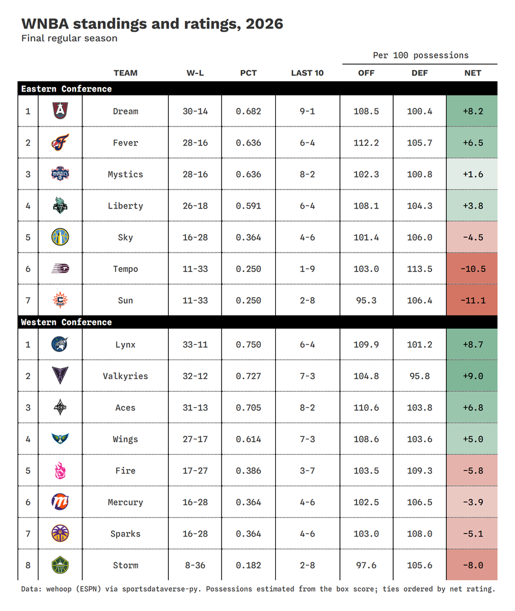
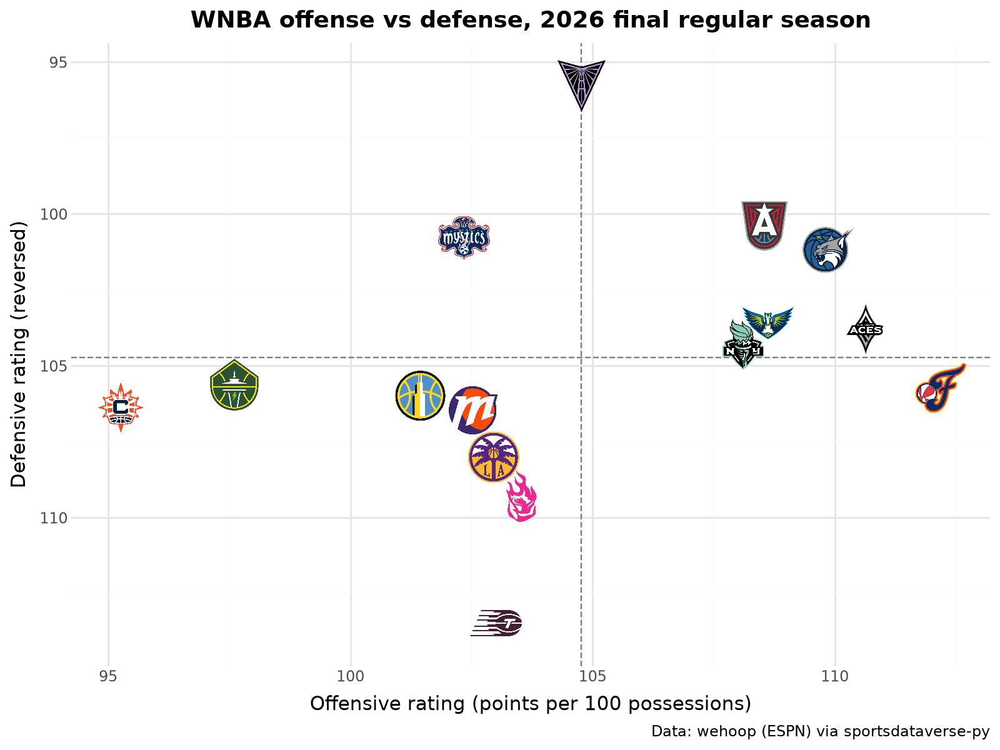
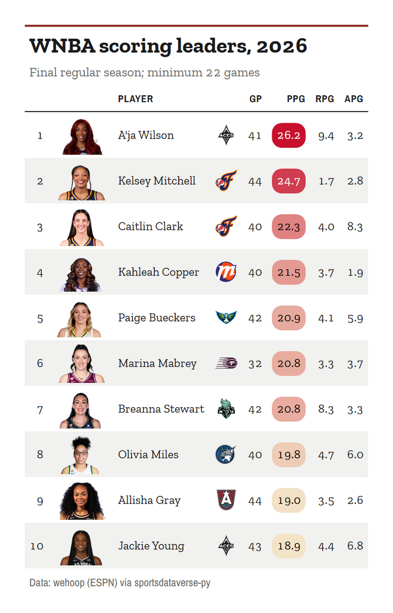

# WNBA

This page is regenerated every week by sdvplot's docs workflow. It builds the standings with offensive, defensive and net ratings, plots offense against defense and lists
the scoring leaders with their headshots, for the latest WNBA season with games: the season to date from May to
September, the final regular season once it is over. Data: wehoop's ESPN box scores, read from release files through
[sportsdataverse-py](https://py.sportsdataverse.org/) (no stats.wnba.com calls).

The WNBA season tips off in May, so until then the calendar points at last season. For a season that is not published yet `load_wnba_team_boxscore` warns and returns an empty frame rather
than raising, so the helper below turns "no regular-season games" into a `NoDataError` and the page steps back one
season.

```python
import datetime as dt
import warnings

import polars as pl
import sportsdataverse.wnba as wnba
from IPython.display import Markdown, display
from sportsdataverse.errors import NoDataError

import sdvplot

today = dt.date.today()
current = today.year if today.month >= 5 else today.year - 1
SOURCE = "Data: wehoop (ESPN) via sportsdataverse-py"


def label(season):
    return str(season)


def team_games(season):
    with warnings.catch_warnings():
        warnings.simplefilter("ignore")  # "no data for season(s)": handled just below
        box = wnba.load_wnba_team_boxscore(seasons=[season])
    if box.is_empty() or box.filter(pl.col("season_type") == 2).is_empty():
        raise NoDataError(f"no {label(season)} regular-season games yet")
    return box


try:
    season, box = current, team_games(current)
except NoDataError as err:
    print(f"{err}; showing {label(current - 1)} instead")
    season, box = current - 1, team_games(current - 1)
```

The status line is written when the page runs: the season to date, a finished regular season with the playoffs under
way, or the offseason.

```python
last_game = box["game_date"].max()
if season < current:
    status = f"**Offseason:** the final {label(season)} regular season; the {label(current)} season has no games yet."
    through = "final regular season"
elif box.filter(pl.col("season_type") == 3).is_empty():
    status = f"**Updated {today}:** the {label(season)} season through {last_game:%B} {last_game.day}."
    through = f"through {last_game:%b} {last_game.day}"
elif (today - last_game).days <= 10:
    status = f"**Updated {today}:** the final {label(season)} regular season; the playoffs are under way."
    through = "final regular season"
else:
    status = f"**Offseason:** the final {label(season)} regular season."
    through = "final regular season"
subtitle = through[:1].upper() + through[1:]
display(Markdown(status))
```

<div class="sdv-output">

**Updated 2026-10-05:** the final 2026 regular season; the playoffs are under way.

</div>

ESPN files the All-Star Game and the in-season cup final as regular-season games, though neither counts in the
standings. The schedule marks them in `type_abbreviation` (`ALLSTAR`, `CC`), so keep the standard games (`STD`) only.
`resolve` then maps the ESPN team ids to sdvplot's, for the team table's names and conferences.

```python
standard = wnba.load_wnba_schedule(seasons=[season]).filter(
    (pl.col("season_type") == 2) & (pl.col("type_abbreviation") == "STD")
)
assert box.schema["game_id"] == standard.schema["game_id"]
regular = box.filter(pl.col("season_type") == 2).join(standard.select("game_id"), on="game_id", how="semi")
regular = regular.with_columns(
    team=pl.Series(sdvplot.resolve(regular["team_id"].cast(pl.String).to_list(), "wnba"), dtype=pl.String)
)
possessions = (  # the box-score estimate, averaged with the opponent's
    pl.col("field_goals_attempted")
    - pl.col("offensive_rebounds")
    + pl.col("total_turnovers")
    + 0.44 * pl.col("free_throws_attempted")
)
games = regular.with_columns(poss=possessions).with_columns(poss=pl.col("poss").mean().over("game_id"))
teams = sdvplot.teams("wnba").select(team="team_id", abbr="abbr", name="short_name", conference="conference")
ratings = (
    games.sort("game_date")
    .group_by("team")
    .agg(
        w=pl.col("team_winner").sum(),
        l=(~pl.col("team_winner")).sum(),
        l10=pl.col("team_winner").tail(10).sum(),
        ortg=100 * pl.col("team_score").sum() / pl.col("poss").sum(),
        drtg=100 * pl.col("opponent_team_score").sum() / pl.col("poss").sum(),
    )
    .with_columns(pct=pl.col("w") / (pl.col("w") + pl.col("l")), net=pl.col("ortg") - pl.col("drtg"))
    .join(teams, on="team")
    .sort(["pct", "net", "team"], descending=[True, True, False])  # a tiebreaker keeps re-renders stable
)
ratings.head()
```

<div class="sdv-output">

| team   | w  | l  | l10 | ortg       | drtg       | pct      | net      | abbr | name      | conference         |
|--------|----|----|-----|------------|------------|----------|----------|------|-----------|--------------------|
| 8      | 33 | 11 | 6   | 109.869267 | 101.183081 | 0.75     | 8.686187 | MIN  | Lynx      | Western Conference |
| 129689 | 32 | 12 | 7   | 104.772891 | 95.788217  | 0.727273 | 8.984674 | GS   | Valkyries | Western Conference |
| 17     | 31 | 13 | 8   | 110.63893  | 103.794434 | 0.704545 | 6.844495 | LV   | Aces      | Western Conference |
| 20     | 30 | 14 | 9   | 108.548278 | 100.391627 | 0.681818 | 8.156651 | ATL  | Dream     | Eastern Conference |
| 5      | 28 | 16 | 6   | 112.18877  | 105.731672 | 0.636364 | 6.457099 | IND  | Fever     | Eastern Conference |

</div>

## 1. Standings with net rating

Each conference ordered by winning percentage, with every team's points scored and allowed per 100 possessions.

```python
from great_tables import GT

from sdvplot.great_tables import gt_save_crop, gt_sdv_logos, gt_theme_athletic

table = ratings.with_columns(
    record=pl.format("{}-{}", "w", "l"),
    last10=pl.format("{}-{}", "l10", pl.min_horizontal(10, pl.col("w") + pl.col("l")) - pl.col("l10")),
    seed=pl.col("pct").rank("ordinal", descending=True).over("conference"),
).sort("conference", "seed")
table = table.select("conference", "seed", "abbr", "name", "record", "pct", "last10", "ortg", "drtg", "net")
gt = (
    GT(table, groupname_col="conference", id="wnba-standings")  # fixed id: no random one each run
    .tab_header(f"WNBA standings and ratings, {label(season)}", subtitle)
    .fmt_number("pct", decimals=3)
    .cols_align("left", "name")
    .fmt_number(["ortg", "drtg"], decimals=1)
    .fmt_number("net", decimals=1, force_sign=True)
    .data_color("net", palette=["#c84630", "#f7f7f7", "#2e8b57"], domain=[-15, 15])
    .tab_spanner("Per 100 possessions", ["ortg", "drtg", "net"])
    .cols_label(
        seed="", abbr="", name="Team", record="W-L", pct="Pct", last10="Last 10", ortg="Off", drtg="Def", net="Net"
    )
    .tab_source_note(SOURCE + ". Possessions estimated from the box score; ties ordered by net rating.")
)
gt = gt_theme_athletic(gt_sdv_logos(gt, "abbr", league="wnba", height=28))
gt
```

<div class="sdv-output">

<iframe class="sdv-frame" src="/outputs/leaderboards/wnba/8_0.html" title="HTML output" height="480" loading="lazy"></iframe>

</div>

`gt_save_crop` renders the same table to a trimmed PNG, ready to post.

```python
gt_save_crop(gt, width=900)
```

<div class="sdv-output">



</div>

## 2. Offense against defense

plotnine with `geom_sdv_logos`: offensive rating against defensive rating, the defense axis reversed so the better
defenses sit higher, and `geom_mean_lines` at the league averages.

```python
from plotnine import aes, element_text, ggplot, labs, scale_x_continuous, scale_y_reverse, theme, theme_minimal

from sdvplot.plotnine import geom_mean_lines, geom_sdv_logos

(
    ggplot(ratings.to_pandas(), aes("ortg", "drtg", x0="ortg", y0="drtg", team="team"))
    + geom_mean_lines(color="grey")
    + geom_sdv_logos(league="wnba", season=season, height=0.09)
    + scale_x_continuous(expand=(0.06, 0))  # logos do not widen the limits: leave room for the outermost ones
    + scale_y_reverse(expand=(0.08, 0))
    + labs(
        x="Offensive rating (points per 100 possessions)",
        y="Defensive rating (reversed)",
        title=f"WNBA offense vs defense, {label(season)} {through}",
        caption=SOURCE,
    )
    + theme_minimal()
    + theme(figure_size=(8, 6), plot_title=element_text(weight="bold"))
)
```

<div class="sdv-output">



</div>

## 3. Scoring leaders with headshots

Points, rebounds and assists per game from the player box scores (standard games only), for players who appeared in at least half of the
most games any team has played. `gt_sdv_headshots` turns the ESPN athlete ids into headshots and `gt_color_pills`
draws the scoring column.

```python
from sdvplot.great_tables import gt_color_pills, gt_sdv_headshots, gt_theme_almanac

players = (
    wnba.load_wnba_player_boxscore(seasons=[season])
    .filter((pl.col("season_type") == 2) & ~pl.col("did_not_play") & pl.col("minutes").is_not_null())
    .join(standard.select("game_id"), on="game_id", how="semi")
)  # no All-Star or cup final
games_played = players.group_by("team_id").agg(pl.col("game_id").n_unique())["game_id"].max()
leaders = (
    players.sort("game_date")
    .group_by("athlete_id")
    .agg(
        name=pl.col("athlete_display_name").last(),
        team=pl.col("team_abbreviation").last(),
        gp=pl.len(),
        ppg=pl.col("points").mean(),
        rpg=pl.col("rebounds").mean(),
        apg=pl.col("assists").mean(),
    )
    .filter(pl.col("gp") >= games_played / 2)
    .sort(["ppg", "athlete_id"], descending=[True, False])
    .head(10)
    .with_row_index("rank", offset=1)
    .select("rank", "athlete_id", "name", "team", "gp", "ppg", "rpg", "apg")
)
leaders_gt = (
    GT(leaders, id="wnba-leaders")
    .tab_header(f"WNBA scoring leaders, {label(season)}", f"{subtitle}; minimum {games_played / 2:.0f} games")
    .fmt_number(["rpg", "apg"], decimals=1)
    .cols_label(rank="", athlete_id="", name="Player", team="", gp="GP", ppg="PPG", rpg="RPG", apg="APG")
    .tab_source_note(SOURCE)
)
leaders_gt = gt_color_pills(
    leaders_gt, "ppg", palette=["#f3e4c8", "#c8102e"], digits=1, domain=[leaders["ppg"].min(), leaders["ppg"].max()]
)
leaders_gt = gt_sdv_logos(
    gt_sdv_headshots(leaders_gt, "athlete_id", league="wnba", height=40), "team", league="wnba", height=24
)
leaders_gt = gt_theme_almanac(leaders_gt)
leaders_gt
```

<div class="sdv-output">

<iframe class="sdv-frame" src="/outputs/leaderboards/wnba/14_0.html" title="HTML output" height="480" loading="lazy"></iframe>

</div>

```python
gt_save_crop(leaders_gt, width=800)
```

<div class="sdv-output">



</div>

## Run it yourself

<a href="pathname:///notebooks/leaderboards/wnba.ipynb" download>Download the notebook</a> (outputs cleared) or [open it on GitHub](https://github.com/sportsdataverse/sdvplot/blob/main/examples/notebooks/leaderboards/wnba.ipynb).
