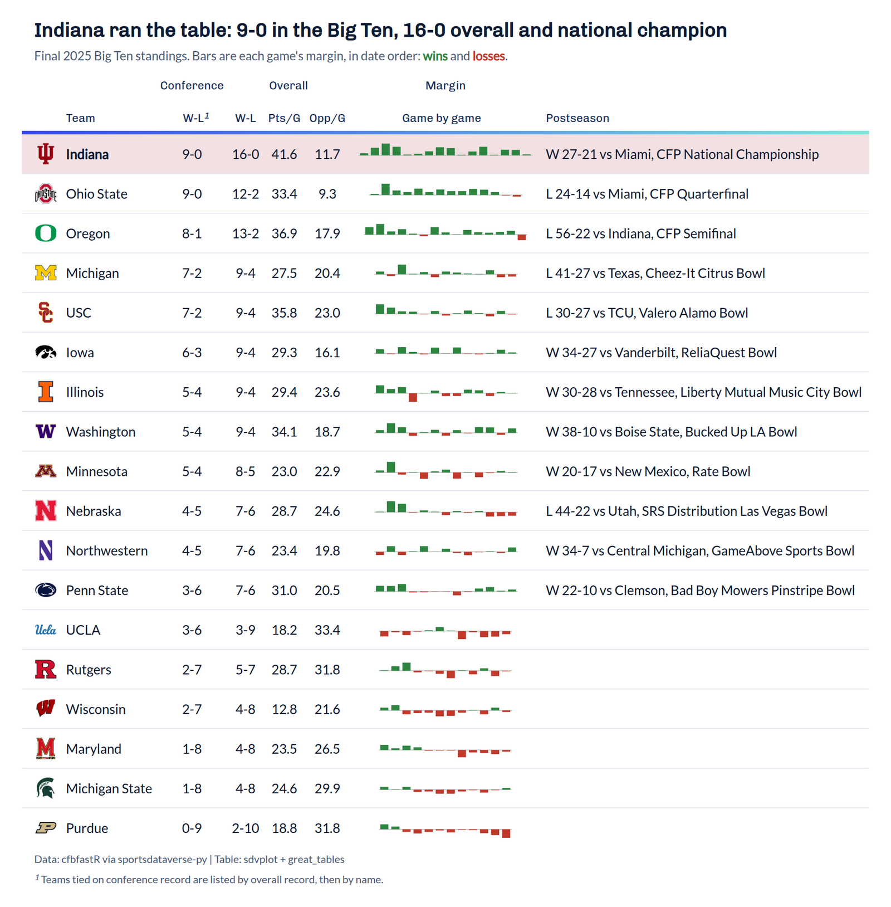
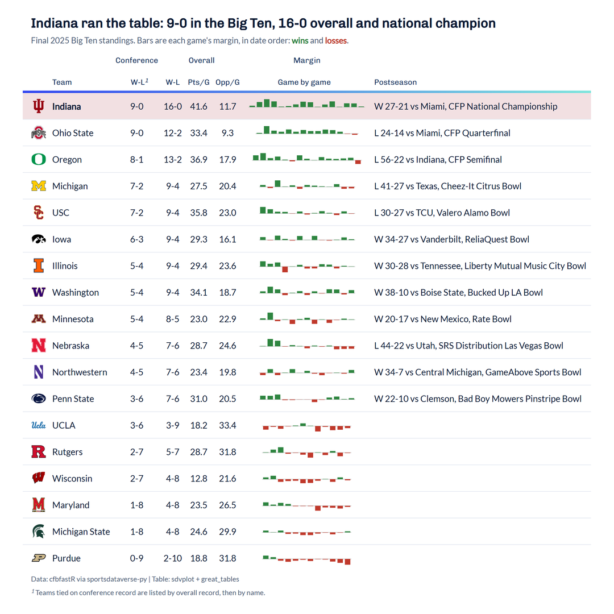

# CFB conference table

**The brief:** the season-review newsletter needs the final Big Ten standings as an image: 1600 px wide for the email,
plus a square cut for social. Indiana went 16-0 and won the national title, so the table should make that obvious.
The records are built from the cfbfastR schedule through `sportsdataverse.cfb`, and the table is great_tables with
sdvplot's logo, theme and export helpers.

```python
import tempfile
from pathlib import Path

import polars as pl
import sportsdataverse.cfb as cfb
from great_tables import GT, html, loc, nanoplot_options, style
from IPython.display import Image
from PIL import Image as PILImage

import sdvplot
from sdvplot.great_tables import gt_save_crop, gt_sdv_logos, gt_social_crop, gt_theme_sdv

SEASON = 2025
CONFERENCE = "Big Ten"
OUT = Path(tempfile.mkdtemp(prefix="sdvplot-recipe-"))  # where the exports go; use your own folder
```

## 1. Get the data

The schedule has one row per game. Stacking the home and away sides gives one row per team per game, which makes
every record a `group_by`. The ESPN team ids arrive as integers; they become strings once, at the boundary, because
sdvplot's `team_id` is always a string. The margins are kept in date order as a list, one value per game, for a
small chart later.

```python
schedule = cfb.load_cfb_schedule([SEASON]).filter(pl.col("completed"))


def side(me, opp):
    return schedule.select(
        "start_date",
        "season_type",
        "conference_game",
        "notes",
        team_id=pl.col(f"{me}_id").cast(pl.Utf8),
        team=f"{me}_team",
        conference=f"{me}_conference",
        opponent=f"{opp}_team",
        pf=f"{me}_points",
        pa=f"{opp}_points",
    )


games = (
    pl.concat([side("home", "away"), side("away", "home")])
    .filter(pl.col("conference") == CONFERENCE)
    .sort("start_date")
    .with_columns(won=pl.col("pf") > pl.col("pa"))
)
in_conf = pl.col("conference_game")
standings = (
    games.group_by("team_id", "team", maintain_order=True)
    .agg(
        conf_w=(pl.col("won") & in_conf).sum(),
        conf_l=(~pl.col("won") & in_conf).sum(),
        w=pl.col("won").sum(),
        l=(~pl.col("won")).sum(),
        pf=pl.col("pf").mean(),
        pa=pl.col("pa").mean(),
        margins=pl.col("pf") - pl.col("pa"),
        # the last game: where a bowl or the playoff shows up
        last_type=pl.col("season_type").last(),
        last_won=pl.col("won").last(),
        last_score=pl.format("{}-{}", pl.max_horizontal("pf", "pa"), pl.min_horizontal("pf", "pa")).last(),
        last_opponent=pl.col("opponent").last(),
        last_event=pl.col("notes").last(),
    )
    .sort(["conf_w", "w", "team"], descending=[True, True, False])
)
standings.head()
```

<div class="sdv-output">

| team_id | team       | conf_w | conf_l | w  | l | pf        | pa        | margins          | last_type  | last_won | last_score | last_opponent | last_event                                                                |
|---------|------------|--------|--------|----|---|-----------|-----------|------------------|------------|----------|------------|---------------|---------------------------------------------------------------------------|
| 84      | Indiana    | 9      | 0      | 16 | 0 | 41.625    | 11.6875   | [13, 47, … 6]    | postseason | true     | 27-21      | Miami         | College Football Playoff National Championship Presented by AT&T          |
| 194     | Ohio State | 9      | 0      | 12 | 2 | 33.428571 | 9.285714  | [7, 70, … -10]   | postseason | false    | 24-14      | Miami         | College Football Playoff Quarterfinal at the Goodyear Cotton Bowl Classic |
| 2483    | Oregon     | 8      | 1      | 13 | 2 | 36.933333 | 17.866667 | [46, 66, … -34]  | postseason | false    | 56-22      | Indiana       | College Football Playoff Semifinal at the Chick-fil-A Peach Bowl          |
| 130     | Michigan   | 7      | 2      | 9  | 4 | 27.538462 | 20.384615 | [17, -11, … -14] | postseason | false    | 41-27      | Texas         | Cheez-It Citrus Bowl                                                      |
| 30      | USC        | 7      | 2      | 9  | 4 | 35.769231 | 23.0      | [60, 39, … -3]   | postseason | false    | 30-27      | TCU           | Valero Alamo Bowl                                                         |

</div>

## 2. The first draft

Hand the frame to great_tables as it is.

```python
GT(standings)
```

<div class="sdv-output">

<iframe class="sdv-frame" src="/outputs/recipes/cfb-conference-table/5_0.html" title="HTML output" height="480" loading="lazy"></iframe>

</div>

Every number is there, and none of it is readable: ids, a list printed as text, a dozen decimals and
column names only the analyst knows.

## 3. Shape it for a reader

Records read as "9-0", not two columns. Each team's last game becomes one short line ("W 27-21 vs Miami, CFP
National Championship"), which is where the national title shows up. Columns get real labels, conference and overall records sit under spanners, and the averages get
one decimal.

```python
event = (
    pl.col("last_event")
    .str.replace(" Presented by.*", "")
    .str.replace(" at the .*", "")
    .str.replace("College Football Playoff", "CFP")
)
postseason = (
    pl.when(pl.col("last_type") == "postseason")
    .then(
        pl.format(
            "{} {} vs {}, {}",
            pl.when("last_won").then(pl.lit("W")).otherwise(pl.lit("L")),
            "last_score",
            "last_opponent",
            event,
        )
    )
    .otherwise(pl.lit(""))
)

table = standings.with_columns(
    conf=pl.format("{}-{}", "conf_w", "conf_l"),
    overall=pl.format("{}-{}", "w", "l"),
    postseason=postseason,
).select("team_id", "team", "conf", "overall", "pf", "pa", "margins", "postseason")

draft = (
    GT(table)
    .cols_hide(["team_id", "margins"])
    .cols_label(team="Team", conf="W-L", overall="W-L", pf="Pts/G", pa="Opp/G", postseason="Postseason")
    .tab_spanner("Conference", ["conf"])
    .tab_spanner("Overall", ["overall", "pf", "pa"])
    .fmt_number(["pf", "pa"], decimals=1)
    .cols_align("center", ["conf", "overall", "pf", "pa"])
    .cols_align("left", ["team", "postseason"])
)
draft
```

<div class="sdv-output">

<iframe class="sdv-frame" src="/outputs/recipes/cfb-conference-table/7_0.html" title="HTML output" height="480" loading="lazy"></iframe>

</div>

## 4. Logos and the season at a glance

`gt_sdv_logos` turns the `team_id` column into logos; the ESPN ids resolve as they are. The margins list becomes a
nanoplot, great_tables' in-cell bar chart: one bar per game, green for a win and red for a loss, so a perfect season
is a solid green row.

```python
margin_bars = nanoplot_options(
    data_bar_fill_color="#2e8540",
    data_bar_negative_fill_color="#c0392b",
    data_bar_stroke_color="transparent",
    data_bar_negative_stroke_color="transparent",
    show_data_points=False,
    show_reference_line=False,
    show_vertical_guides=False,
    show_y_axis_guide=False,
    interactive_data_values=True,  # values on hover only, so the saved image stays clean
)
with_marks = (
    draft.cols_unhide(["team_id", "margins"])
    .pipe(gt_sdv_logos, "team_id", league="cfb", season=SEASON, height=26)
    .fmt_nanoplot("margins", plot_type="bar", autoscale=True, options=margin_bars)
    .cols_label(team_id="", margins="Game by game")
    .tab_spanner("Margin", ["margins"])
)
with_marks
```

<div class="sdv-output">

<iframe class="sdv-frame" src="/outputs/recipes/cfb-conference-table/9_0.html" title="HTML output" height="480" loading="lazy"></iframe>

</div>

## 5. Theme it and say what it means

A theme does the typography and rules in one call (`gt_theme_sdv`, the SportsDataverse house style, here). The title says the news, the subtitle
how to read the table, and the source note credits the data. Indiana's row gets a soft fill in its own red, and a
footnote owns up to the ordering: teams tied on conference record are listed by overall record, which is not the
conference's tiebreaker.

```python
indiana = standings.filter(pl.col("team") == "Indiana")
fill = sdvplot.team_colors(indiana["team_id"][0], "cfb") + "1f"  # the primary color at 12% opacity

final = (
    with_marks.tab_header(
        title=f"Indiana ran the table: 9-0 in the {CONFERENCE}, 16-0 overall and national champion",
        subtitle=html(
            f"Final {SEASON} {CONFERENCE} standings. Bars are each game's margin, in date order: "
            "<span style='color:#2e8540'><b>wins</b></span> and "
            "<span style='color:#c0392b'><b>losses</b></span>."
        ),
    )
    .tab_source_note("Data: cfbfastR via sportsdataverse-py  |  Table: sdvplot + great_tables")
    .tab_footnote(
        "Teams tied on conference record are listed by overall record, then by name.",
        locations=loc.column_labels(columns="conf"),
    )
    .tab_style(style.fill(fill), loc.body(rows=pl.col("team") == "Indiana"))
    .tab_style(style.text(weight="bold"), loc.body(columns="team", rows=pl.col("team") == "Indiana"))
    .pipe(gt_theme_sdv)
)
final
```

<div class="sdv-output">

<iframe class="sdv-frame" src="/outputs/recipes/cfb-conference-table/11_0.html" title="HTML output" height="480" loading="lazy"></iframe>

</div>

## 6. Export for the newsletter and for social

`gt_save_crop` renders the table in headless Chrome, trims it with an even border and, with `width=`, scales it to
the email's 1600 px. `gt_social_crop` centers the same table on a square canvas for Instagram, never cropping it:
a tall table just gets side padding.

```python
newsletter = gt_save_crop(final, OUT / "big_ten_1600.png", width=1600)
square = gt_social_crop(final, OUT / "big_ten_1080x1080.png", aspect_ratio="1:1", width=1080)
for f in (newsletter, square):
    print(Path(f).name, PILImage.open(f).size)
Image(newsletter, width=800)
```

<div class="sdv-output">

```text
big_ten_1600.png (1600, 1628)
big_ten_1080x1080.png (1080, 1080)
```



</div>

The square cut keeps the whole table and pads the sides:

```python
Image(square, width=540)
```

<div class="sdv-output">



</div>

## Run it yourself

<a href="pathname:///notebooks/recipes/cfb-conference-table.ipynb" download>Download the notebook</a> (outputs cleared) or [open it on GitHub](https://github.com/sportsdataverse/sdvplot/blob/main/examples/notebooks/recipes/cfb-conference-table.ipynb).
