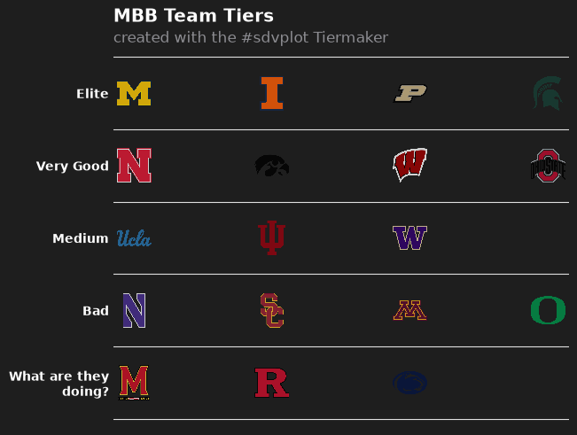
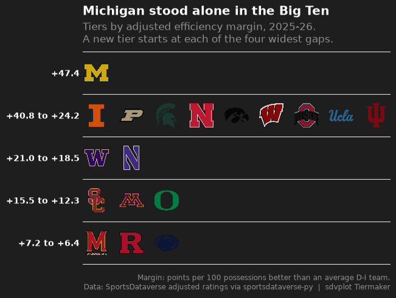
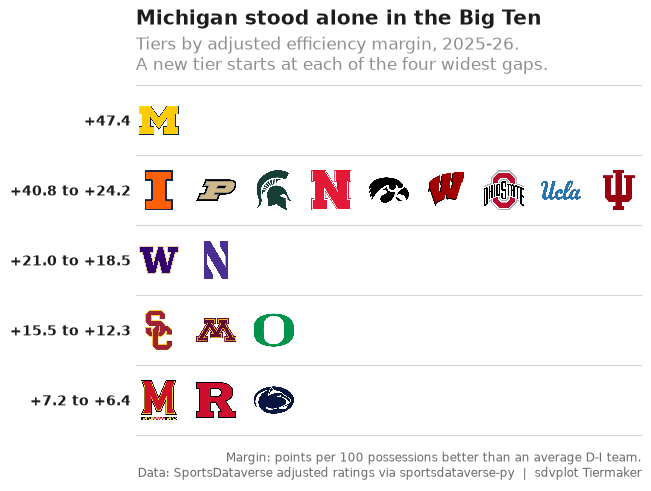
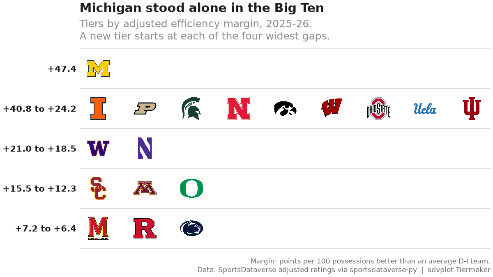
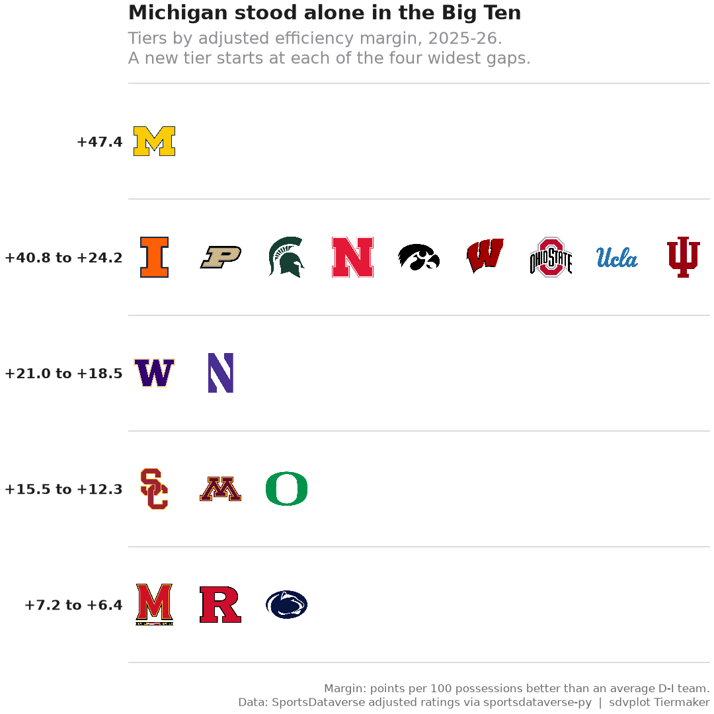

# College hoops tiers

**The brief:** a college basketball account wants an end-of-season Big Ten tier list, the kind fans argue about,
but backed by a power rating instead of vibes, as a 1080 x 1080 post plus a 1200 x 675 cut. The rating is
SportsDataverse's adjusted efficiency margin for men's college basketball through `sportsdataverse.mbb`, and
`team_tiers` (sdvplot's port of sdvplotR's Tiermaker) draws the list.

```python
import tempfile
from pathlib import Path

import matplotlib.pyplot as plt
import polars as pl
import sportsdataverse.mbb as mbb
from IPython.display import Image
from PIL import Image as PILImage

import sdvplot
from sdvplot.matplotlib import team_tiers

SEASON = 2026  # the 2025-26 season, named by the year it ends
CONFERENCE = "Big Ten Conference"
OUT = Path(tempfile.mkdtemp(prefix="sdvplot-recipe-"))  # where the exports go; use your own folder
```

## 1. Get the data

One row per team: adjusted offense, defense and their margin (points per 100 possessions better than an average
Division I team, adjusted for opponents). The ratings carry ESPN team ids; sdvplot's team table supplies each
team's conference and abbreviation for the same ids.

```python
ratings = mbb.load_mbb_ratings(SEASON)
teams = sdvplot.teams("mbb").select("team_id", "abbr", "short_name", "conference")
assert ratings.schema["team_id"] == teams.schema["team_id"]  # ESPN ids as strings on both sides
league = (
    ratings.join(teams, on="team_id")
    .filter(pl.col("conference") == CONFERENCE)
    .sort("adj_em", descending=True)
    .select("team_id", "abbr", "short_name", "rank", "adj_em")
)
league
```

<div class="sdv-output">

| team_id | abbr | short_name  | rank | adj_em    |
|---------|------|-------------|------|-----------|
| 130     | MICH | Michigan    | 1    | 47.352765 |
| 356     | ILL  | Illinois    | 4    | 40.779914 |
| 2509    | PUR  | Purdue      | 8    | 37.843323 |
| 127     | MSU  | Michigan St | 11   | 35.216251 |
| 158     | NEB  | Nebraska    | 17   | 32.265985 |
| …       | …    | …           | …    | …         |
| 135     | MINN | Minnesota   | 78   | 15.001971 |
| 2483    | ORE  | Oregon      | 92   | 12.254012 |
| 120     | MD   | Maryland    | 121  | 7.168668  |
| 164     | RUTG | Rutgers     | 124  | 6.900419  |
| 213     | PSU  | Penn State  | 130  | 6.3738    |

</div>

## 2. The first draft

Five tiers of equal size, straight into `team_tiers`.

```python
equal = pl.int_range(pl.len()) * 5 // pl.len() + 1  # five tiers of (nearly) equal size
draft = league.select(team="team_id", tier_no=equal)
fig = team_tiers(draft, "mbb")
plt.show()
```

<div class="sdv-output">



</div>

It looks like a tier list, but the tiers are wrong. Equal-sized groups put Michigan, the best team in the country,
in the same tier as teams more than ten points worse per 100 possessions, and split neighbors who are barely a
point apart. The default labels ("Elite" ... "What are they doing?") are jokes, not information.

## 3. Let the ratings draw the lines

Tiers should break where the ratings do. Sorting by rating and measuring the gap to the team above makes the
widest gaps easy to find; cutting at the four widest gives five tiers whose members are close to each other.

```python
league = league.with_columns(gap=pl.col("adj_em").shift(1) - pl.col("adj_em"))
cut = league["gap"].drop_nulls().sort(descending=True)[3]  # the fourth-widest gap
league = league.with_columns(tier_no=(pl.col("gap").fill_null(0) >= cut).cum_sum() + 1)
league.filter(pl.col("gap") >= cut).select("short_name", "adj_em", "gap", "tier_no")
```

<div class="sdv-output">

| short_name | adj_em    | gap      | tier_no |
|------------|-----------|----------|---------|
| Illinois   | 40.779914 | 6.572851 | 2       |
| Washington | 20.961117 | 3.22975  | 3       |
| USC        | 15.505063 | 3.014913 | 4       |
| Maryland   | 7.168668  | 5.085345 | 5       |

</div>

Each row above starts a new tier: Michigan stands alone, and the gaps at the top (6.6 points) and near the bottom
(5.1) are the conference's real dividing lines.

## 4. Labels that say something

Each tier's label becomes the rating range of its members, so the list carries its own evidence, and the title states
the finding. `tier_rank` keeps teams in rating order inside a tier. The subtitle explains the rating and the rule for
the cuts; the caption names the data.

```python
tiers = league.group_by("tier_no").agg(lo=pl.col("adj_em").min(), hi=pl.col("adj_em").max()).sort("tier_no")
tier_desc = {
    row["tier_no"]: f"{row['hi']:+.1f}" if row["lo"] == row["hi"] else f"{row['hi']:+.1f} to {row['lo']:+.1f}"
    for row in tiers.iter_rows(named=True)
}
best = league.row(0, named=True)
data = league.select(team="team_id", tier_no="tier_no", tier_rank=pl.int_range(1, pl.len() + 1).over("tier_no"))


def tier_list(height=0.12, alpha=0.8):
    return team_tiers(
        data,
        "mbb",
        title=f"{best['short_name']} stood alone in the Big Ten",
        subtitle=f"Tiers by adjusted efficiency margin, {SEASON - 1}-{SEASON % 100:02d}.\n"
        "A new tier starts at each of the four widest gaps.",
        caption="Margin: points per 100 possessions better than an average D-I team.\n"
        "Data: SportsDataverse adjusted ratings via sportsdataverse-py  |  sdvplot Tiermaker",
        tier_desc=tier_desc,
        height=height,
        alpha=alpha,
    )


fig = tier_list()
plt.show()
```

<div class="sdv-output">



</div>

## 5. Fix the contrast

On the dark Tiermaker background, three logos almost vanish: Iowa's black hawk, Penn State's navy lion and Michigan
State's dark green Spartan. Most college logos are drawn for a white page, so the fix is a light background.
`team_tiers` returns an ordinary matplotlib figure, so restyling it is a few lines: the background, the tier lines,
and the white text turned dark. The logos go to full opacity too (`alpha=1`); the theme's default 0.8 softens them
against the dark background but washes them out on white.

```python
INK, MUTED = "#1d1d1d", "#6b6b6b"


def light(fig):
    """Recolor a team_tiers figure for a white background."""
    ax = fig.axes[0]
    fig.set_facecolor("white")
    ax.set_facecolor("white")
    for line in ax.lines:  # the tier separators
        line.set_color("#d4d4d4")
    for label in ax.get_yticklabels():  # the tier labels
        label.set_color(INK)
    for text in [ax.title, *ax.texts]:  # subtitle, title and caption
        text.set_color(INK if text.get_color() == "white" else MUTED)
    return fig


fig = light(tier_list(alpha=1))
plt.show()
```

<div class="sdv-output">



</div>

## 6. Export at social sizes

`team_tiers` returns an ordinary matplotlib figure with constrained layout, so `set_size_inches` re-lays it at each
export size. The logos are a fraction of the panel's height, and the square's panel is taller but narrower than the
wide cut's, so nine logos in one tier would collide there: the square gets a smaller `height`. Nine teams in a row
is also why the wide 1200 x 675 cut is the better post here.

```python
exports = {"big_ten_tiers_1200x675.png": ((8, 4.5), 0.12), "big_ten_tiers_1080x1080.png": ((7.2, 7.2), 0.075)}
for name, (size, height) in exports.items():
    fig = light(tier_list(height, alpha=1))
    fig.set_size_inches(*size)
    fig.savefig(OUT / name, dpi=150)
    plt.close(fig)
    print(name, PILImage.open(OUT / name).size)
Image(OUT / "big_ten_tiers_1200x675.png", width=700)
```

<div class="sdv-output">

```text
big_ten_tiers_1200x675.png (1200, 675)
```

```text
big_ten_tiers_1080x1080.png (1080, 1080)
```



</div>

The 1080 x 1080 cut:

```python
Image(OUT / "big_ten_tiers_1080x1080.png", width=540)
```

<div class="sdv-output">



</div>

## Run it yourself

<a href="pathname:///notebooks/recipes/college-hoops-tiers.ipynb" download>Download the notebook</a> (outputs cleared) or [open it on GitHub](https://github.com/sportsdataverse/sdvplot/blob/main/examples/notebooks/recipes/college-hoops-tiers.ipynb).
