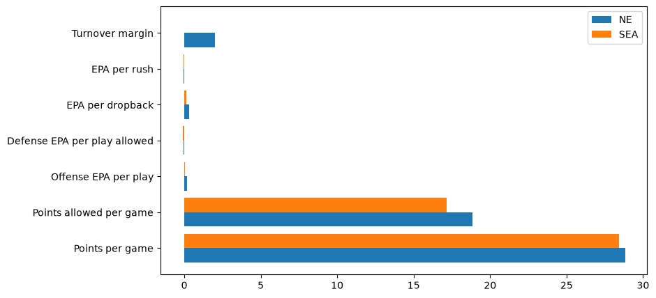
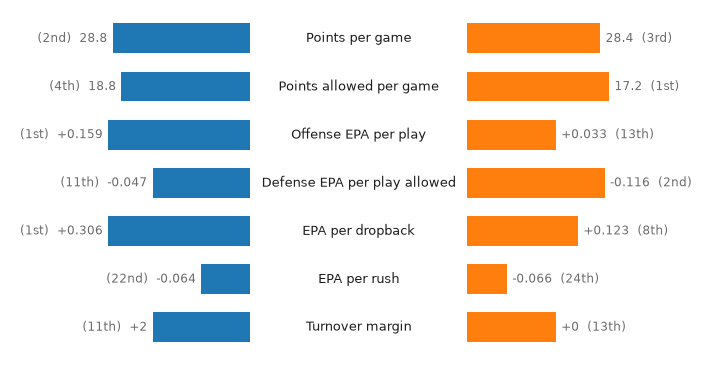
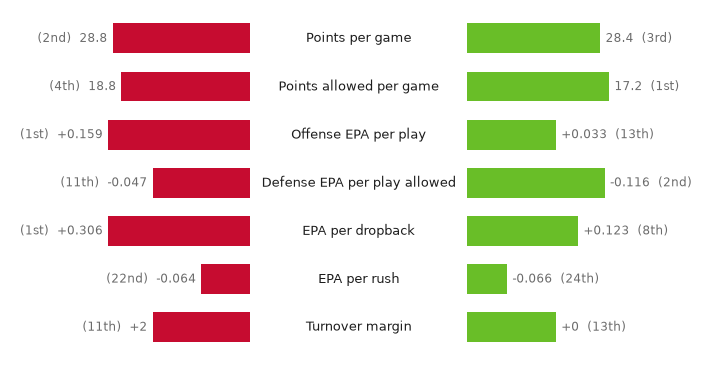
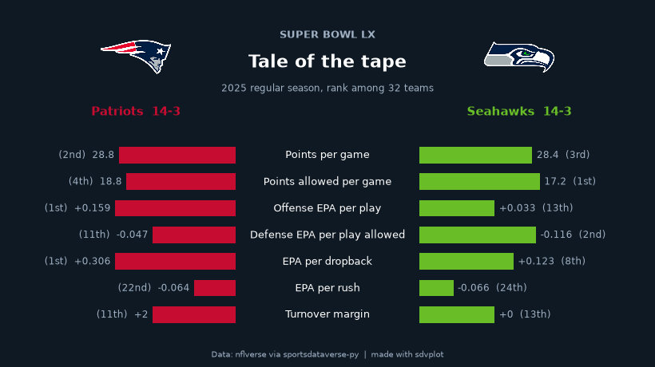
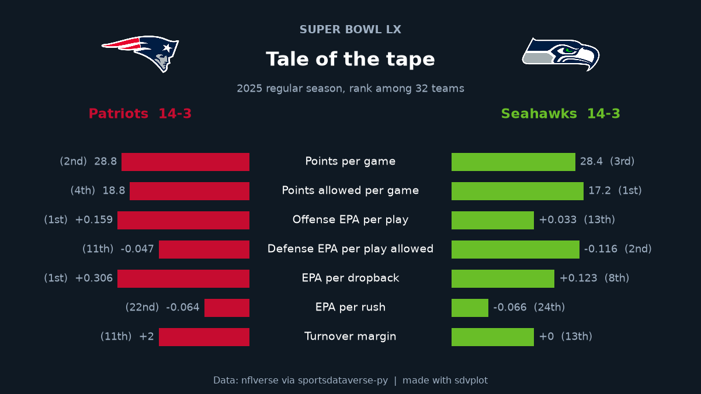
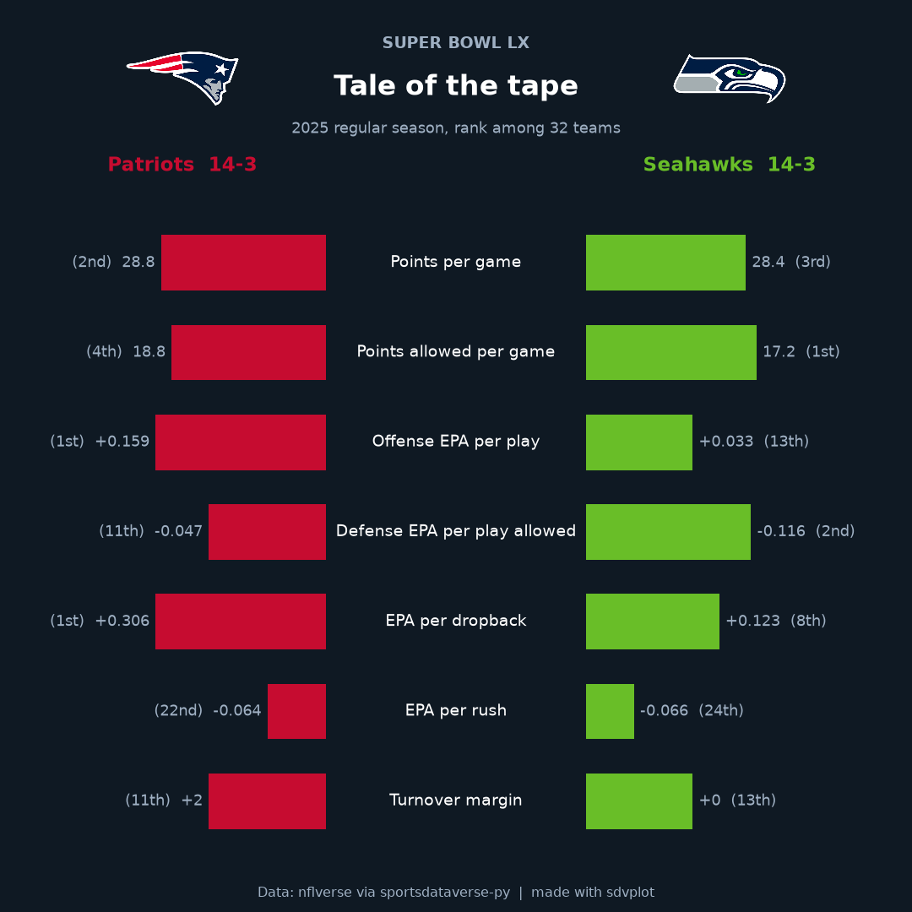

# Head-to-head card

**The brief:** Super Bowl week. The social team wants a "tale of the tape" card for the two teams: their regular
seasons side by side, in each team's colors, with logos, at 1200 x 675 for X and 1080 x 1080 for Instagram. The
numbers come from nflverse play-by-play and schedules through `sportsdataverse.nfl`.

```python
import tempfile
from pathlib import Path

import matplotlib.pyplot as plt
import polars as pl
import sportsdataverse.nfl as nfl
from IPython.display import Image
from PIL import Image as PILImage

import sdvplot

SEASON = 2025
OUT = Path(tempfile.mkdtemp(prefix="sdvplot-recipe-"))  # where the exports go; use your own folder
```

## 1. Get the data

Every stat is computed for all 32 teams, not just the two finalists, because a comparison needs context: each one
also gets a league rank (1 is best, whichever direction "best" is for that stat). Points come from the schedule,
efficiency and turnovers from the play-by-play.

```python
schedule = nfl.load_nfl_schedule([SEASON])
sb = schedule.filter(pl.col("game_type") == "SB").row(0, named=True)
regular = schedule.filter(pl.col("game_type") == "REG")
sides = pl.concat(
    [
        regular.select(team="home_team", pf="home_score", pa="away_score"),
        regular.select(team="away_team", pf="away_score", pa="home_score"),
    ]
)
scoring = sides.group_by("team").agg(
    w=(pl.col("pf") > pl.col("pa")).sum(),
    l=(pl.col("pf") < pl.col("pa")).sum(),
    ppg=pl.col("pf").mean(),
    papg=pl.col("pa").mean(),
)

pbp = nfl.load_nfl_pbp([SEASON]).filter(pl.col("season_type") == "REG", pl.col("epa").is_not_null())
plays = pbp.filter(pl.col("play_type").is_in(["pass", "run"]))
offense = plays.group_by("posteam").agg(
    off_epa=pl.col("epa").mean(),
    pass_epa=pl.col("epa").filter(pl.col("pass") == 1).mean(),
    rush_epa=pl.col("epa").filter(pl.col("rush") == 1).mean(),
    giveaways=(pl.col("interception") + pl.col("fumble_lost")).sum(),
)
defense = plays.group_by("defteam").agg(
    def_epa=pl.col("epa").mean(), takeaways=(pl.col("interception") + pl.col("fumble_lost")).sum()
)
teams = (
    scoring.join(offense, left_on="team", right_on="posteam")
    .join(defense, left_on="team", right_on="defteam")
    .with_columns(to_margin=(pl.col("takeaways") - pl.col("giveaways")).cast(pl.Int64))
)

# (column, label, number format, True when bigger is better)
STATS = [
    ("ppg", "Points per game", "{:.1f}", True),
    ("papg", "Points allowed per game", "{:.1f}", False),
    ("off_epa", "Offense EPA per play", "{:+.3f}", True),
    ("def_epa", "Defense EPA per play allowed", "{:+.3f}", False),
    ("pass_epa", "EPA per dropback", "{:+.3f}", True),
    ("rush_epa", "EPA per rush", "{:+.3f}", True),
    ("to_margin", "Turnover margin", "{:+d}", True),
]
teams = teams.with_columns(
    pl.col(col).rank("min", descending=better).cast(pl.Int64).alias(f"{col}_rank") for col, _, _, better in STATS
)
pair = [sb["home_team"], sb["away_team"]]
teams.filter(pl.col("team").is_in(pair)).sort("team").select("team", "w", "l", *[c for c, *_ in STATS])
```

<div class="sdv-output">

| team | w  | l | ppg       | papg      | off_epa  | def_epa   | pass_epa | rush_epa  | to_margin |
|------|----|---|-----------|-----------|----------|-----------|----------|-----------|-----------|
| NE   | 14 | 3 | 28.823529 | 18.823529 | 0.159207 | -0.047123 | 0.305703 | -0.063989 | 2         |
| SEA  | 14 | 3 | 28.411765 | 17.176471 | 0.032795 | -0.115932 | 0.122813 | -0.065733 | 0         |

</div>

## 2. The first draft

Both teams' numbers as grouped bars.

```python
two = teams.filter(pl.col("team").is_in(pair)).sort("team")
labels = [label for _, label, _, _ in STATS]
fig, ax = plt.subplots(figsize=(9, 5))
for i, row in enumerate(two.iter_rows(named=True)):
    ax.barh([y + 0.4 * i for y in range(len(STATS))], [row[c] for c, *_ in STATS], height=0.4, label=row["team"])
ax.set_yticks([y + 0.2 for y in range(len(STATS))], labels)
ax.legend()
plt.show()
```

<div class="sdv-output">



</div>

Useless: points per game (about 25) dwarf EPA per play (about 0.1), "more" is good for some rows and bad for others,
and the default blue and orange belong to neither team.

## 3. One scale: league rank

Ranks put every stat on the same 1-32 scale with the same direction, so a longer bar is always better. Mirroring the
two teams around a center column of labels (a "butterfly") makes each row a direct comparison; the actual value and
the rank sit at the end of each bar.

```python
def ordinal(n):
    return f"{n}{'th' if 10 <= n % 100 <= 20 else {1: 'st', 2: 'nd', 3: 'rd'}.get(n % 10, 'th')}"


def butterfly(ax, colors, ink="#1d1d1d", muted="#6b6b6b"):
    """Mirrored rank bars: the first team grows left from the center labels, the second right."""
    rows = {row["team"]: row for row in teams.filter(pl.col("team").is_in(pair)).iter_rows(named=True)}
    gap = 0.42  # half the width of the label column, in axes units
    for y, (col, label, fmt, _) in enumerate(STATS):
        ax.text(0, y, label, ha="center", va="center", fontsize=9, color=ink)
        for side, team in zip((-1, 1), pair, strict=True):
            rank = rows[team][f"{col}_rank"]
            length = (33 - rank) / 32 * 0.55  # rank 1 is the longest bar
            start = side * gap
            ax.barh(y, side * length, left=start, height=0.62, color=colors[team])
            ax.text(
                start + side * (length + 0.02),
                y,
                f"{fmt.format(rows[team][col])}  ({ordinal(rank)})"
                if side > 0
                else f"({ordinal(rank)})  {fmt.format(rows[team][col])}",
                ha="left" if side > 0 else "right",
                va="center",
                fontsize=8.5,
                color=muted,
            )
    ax.set_xlim(-1.35, 1.35)
    ax.set_ylim(len(STATS) - 0.4, -0.6)
    ax.axis("off")


fig, ax = plt.subplots(figsize=(9, 4.5))
butterfly(ax, {pair[0]: "#1f77b4", pair[1]: "#ff7f0e"})
plt.show()
```

<div class="sdv-output">



</div>

## 4. The teams' own colors

Swapping matplotlib's defaults for team colors runs into a real-world snag: both teams' primary color is the same
navy (`#002244`), so the card would be one color on both sides. Each team's secondary color, Seattle's action green
and New England's red, tells them apart.

```python
primary = dict(zip(pair, sdvplot.team_colors(pair, "nfl"), strict=True))
secondary = dict(zip(pair, sdvplot.team_colors(pair, "nfl", which="secondary"), strict=True))
print("primary:", primary, " secondary:", secondary)
colors = secondary if len(set(primary.values())) == 1 else primary

fig, ax = plt.subplots(figsize=(9, 4.5))
butterfly(ax, colors)
plt.show()
```

<div class="sdv-output">

```text
primary: {'NE': '#002244', 'SEA': '#002244'}  secondary: {'NE': '#c60c30', 'SEA': '#69be28'}
```



</div>

## 5. Make it a card

The card is dark, which most game-week graphics are, so the logos use the `"dark"` variant (the mark drawn for a
dark background, which keeps navy outlines from disappearing). Each team gets its logo and record above its side,
the kicker names the game, and the footer the source. Positions are in inches from the edges, so one function draws
both export sizes.

```python
BG, INK, MUTED = "#0f1923", "#ffffff", "#9fb0c3"
rows = {row["team"]: row for row in teams.filter(pl.col("team").is_in(pair)).iter_rows(named=True)}
names = dict(sdvplot.teams("nfl").select("abbr", "short_name").iter_rows())


def card(figsize, dpi=100):
    w, h = figsize
    fig = plt.figure(figsize=figsize, dpi=dpi, facecolor=BG)
    header = 1.55  # inches for kicker, logos and records
    ax = fig.add_axes((0.3 / w, 0.45 / h, 1 - 0.6 / w, 1 - (header + 0.55) / h), facecolor=BG)
    butterfly(ax, colors, ink=INK, muted=MUTED)

    top = fig.add_axes((0, 1 - header / h, 1, header / h), facecolor=BG)
    top.set(xlim=(0, w), ylim=(0, header))
    top.axis("off")
    for x, team in zip((w * 0.2, w * 0.8), pair, strict=True):
        sdvplot.add_logos(top, [x], [header - 0.62], [team], league="nfl", season=SEASON, variant="dark", height=0.62)
        top.text(
            x,
            0.2,
            f"{names[team]}  {rows[team]['w']}-{rows[team]['l']}",
            ha="center",
            fontsize=11,
            fontweight="bold",
            color=colors[team],
        )
    top.text(w / 2, header - 0.38, "SUPER BOWL LX", ha="center", fontsize=9, fontweight="bold", color=MUTED)
    top.text(w / 2, header - 0.75, "Tale of the tape", ha="center", fontsize=16, fontweight="bold", color=INK)
    top.text(
        w / 2, header - 1.05, f"{SEASON} regular season, rank among 32 teams", ha="center", fontsize=8.5, color=MUTED
    )
    fig.text(
        0.5,
        0.12 / h,
        "Data: nflverse via sportsdataverse-py  |  made with sdvplot",
        ha="center",
        fontsize=7.5,
        color=MUTED,
    )
    return fig


fig = card((8, 4.5))
plt.show()
```

<div class="sdv-output">



</div>

## 6. Export for X and Instagram

The same function draws both posts: 8 x 4.5 in and 7.2 x 7.2 in at 150 dpi are exactly 1200 x 675 and 1080 x 1080.
`savefig` needs the card's background passed again, or the margins come out white.

```python
for name, size in {
    "sb_tale_of_the_tape_1200x675.png": (8, 4.5),
    "sb_tale_of_the_tape_1080x1080.png": (7.2, 7.2),
}.items():
    fig = card(size, dpi=150)
    fig.savefig(OUT / name, dpi=150, facecolor=BG)
    plt.close(fig)
    print(name, PILImage.open(OUT / name).size)
Image(OUT / "sb_tale_of_the_tape_1200x675.png")
```

<div class="sdv-output">

```text
sb_tale_of_the_tape_1200x675.png (1200, 675)
```

```text
sb_tale_of_the_tape_1080x1080.png (1080, 1080)
```



</div>

The square cut:

```python
Image(OUT / "sb_tale_of_the_tape_1080x1080.png", width=540)
```

<div class="sdv-output">



</div>

## Run it yourself

<a href="pathname:///notebooks/recipes/head-to-head-card.ipynb" download>Download the notebook</a> (outputs cleared) or [open it on GitHub](https://github.com/sportsdataverse/sdvplot/blob/main/examples/notebooks/recipes/head-to-head-card.ipynb).
