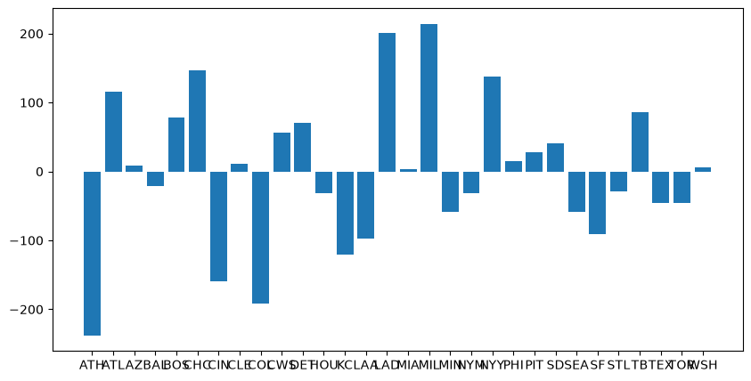
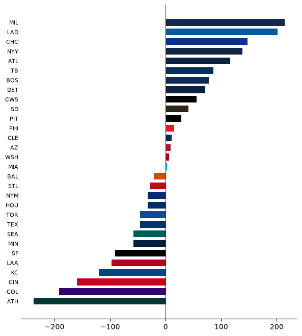
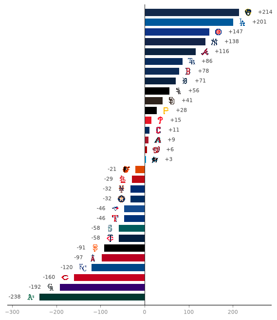
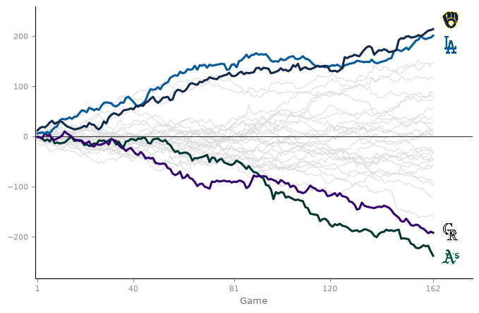
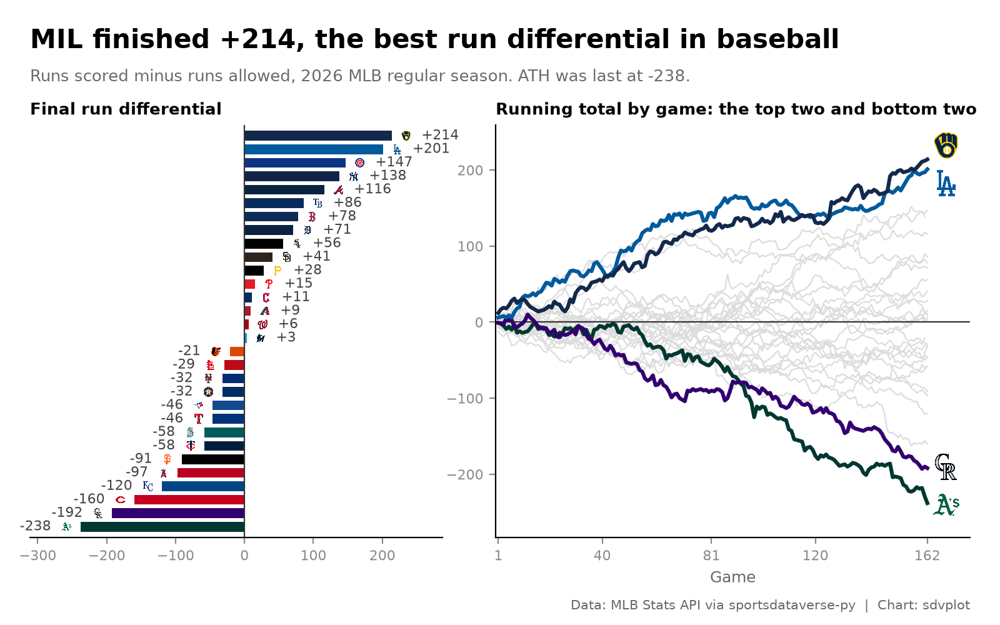

# MLB run differential

**The brief:** an end-of-season blog post on run differential needs one graphic, 1600 px wide: every team's final
run differential, ranked, plus how the best and worst teams got there over 162 games. The game results come from
the MLB Stats API schedule through `sportsdataverse.mlb`; sdvplot supplies the colors and logos.

```python
import tempfile
from pathlib import Path

import matplotlib.pyplot as plt
import polars as pl
import sportsdataverse.mlb as mlb
from IPython.display import Image
from PIL import Image as PILImage

import sdvplot

SEASON = 2026
OUT = Path(tempfile.mkdtemp(prefix="sdvplot-recipe-"))  # where the exports go; use your own folder
```

## 1. Get the data

The schedule has one row per game, so stacking the home and away sides gives one row per team per game; a running
sum of the margin is the season line. Two checks before trusting it: a suspended game is listed twice (on the day it
started and the day it finished), so games are de-duplicated on `game_pk`; and the totals must match the official
standings.

```python
schedule = mlb.parse_mlb_api_schedule(mlb.mlb_schedule(season=SEASON, sport_id=1, game_type="R"))
finals = (
    schedule.filter(pl.col("status_coded_game_state") == "F")  # final, including games completed early
    .sort("schedule_date")
    .unique("game_pk", keep="last")
)
games = (
    pl.concat(
        [
            finals.select(
                "official_date",
                "game_pk",
                team_id="teams_home_team_id",
                margin=pl.col("teams_home_score") - pl.col("teams_away_score"),
            ),
            finals.select(
                "official_date",
                "game_pk",
                team_id="teams_away_team_id",
                margin=pl.col("teams_away_score") - pl.col("teams_home_score"),
            ),
        ]
    )
    .sort("official_date", "game_pk")
    .with_columns(
        game=pl.int_range(1, pl.len() + 1).over("team_id"),
        run_diff=pl.col("margin").cum_sum().over("team_id"),
    )
)
clubs = mlb.parse_mlb_api_teams(mlb.mlb_teams(season=SEASON)).select(team_id="id", team="abbreviation")
totals = (
    games.group_by("team_id", maintain_order=True)
    .agg(diff=pl.col("margin").sum().cast(pl.Int64), games=pl.len())
    .join(clubs, on="team_id")
    .sort("diff", "team")  # ties (two teams at -58) need a second key to keep one order every run
)

official = mlb.parse_mlb_api_standings(mlb.mlb_standings(season=SEASON)).select("team_id", "run_differential")
assert totals.schema["team_id"] == official.schema["team_id"]
check = totals.join(official, on="team_id")
assert (check["diff"] == check["run_differential"]).all(), "totals differ from the official standings"
totals.tail(5)
```

<div class="sdv-output">

| team_id | diff | games | team |
|---------|------|-------|------|
| 144     | 116  | 162   | ATL  |
| 147     | 138  | 161   | NYY  |
| 112     | 147  | 162   | CHC  |
| 119     | 201  | 162   | LAD  |
| 158     | 214  | 162   | MIL  |

</div>

## 2. The first draft

Thirty bars in alphabetical order, the way a pivot table would hand them over.

```python
draft = totals.sort("team")
fig, ax = plt.subplots(figsize=(10, 5))
ax.bar(draft["team"], draft["diff"])
plt.show()
```

<div class="sdv-output">



</div>

Alphabetical order hides the ranking, thirty rotated-looking abbreviations crowd the axis, and one color says
nothing about who is who.

## 3. Rank it, turn it sideways, color it by team

Horizontal bars give every team a readable row, sorting turns the chart into a ranking, and team colors (from
`team_colors`, which reads the MLB Stats API abbreviations as they are) tie each bar to a club. A zero line anchors
the diverging bars.

```python
colors = sdvplot.team_colors(totals["team"], "mlb")

fig, ax = plt.subplots(figsize=(7, 8))
ax.barh(totals["team"], totals["diff"], color=colors, height=0.7)
ax.axvline(0, color="#333333", lw=0.8)
ax.spines[["top", "right", "left"]].set_visible(False)
ax.tick_params(axis="y", length=0, labelsize=8)
plt.show()
```

<div class="sdv-output">



</div>

## 4. Logos at the bar ends

The abbreviations go; each logo sits just past the end of its bar (right of a positive bar, left of a negative one)
with the value beside it. `add_logos` sizes the logos as a fraction of the axes height, so 0.026 is a little under
one row of thirty.

```python
def bars(ax, logo_height=0.026):
    """Ranked run-differential bars with logos and values at the bar ends."""
    span = totals["diff"].max() - totals["diff"].min()
    pad = 0.045 * span  # the gap between a bar's end and its logo, in runs
    y = list(range(totals.height))
    side = totals["diff"].sign().replace(0, 1)
    ax.barh(y, totals["diff"], color=sdvplot.team_colors(totals["team"], "mlb"), height=0.72)
    ax.axvline(0, color="#333333", lw=0.8)
    sdvplot.add_logos(
        ax, totals["diff"] + side * pad, y, totals["team"], league="mlb", season=SEASON, height=logo_height
    )
    for yi, v, s in zip(y, totals["diff"], side, strict=True):
        ax.text(
            v + s * 2.1 * pad, yi, f"{v:+d}", va="center", ha="left" if s > 0 else "right", fontsize=8, color="#444444"
        )
    ax.set_xlim(totals["diff"].min() - 3.6 * pad, totals["diff"].max() + 3.6 * pad)
    ax.set_ylim(-0.8, totals.height - 0.2)
    ax.set_yticks([])
    ax.spines[["top", "right", "left"]].set_visible(False)
    ax.tick_params(axis="x", colors="#8a8a8a", labelsize=8)


fig, ax = plt.subplots(figsize=(7, 8))
bars(ax)
plt.show()
```

<div class="sdv-output">



</div>

## 5. The season line

A total hides the path. The running run differential by game number shows when the best and worst teams pulled
away: every club in light grey for context, the top two and bottom two in their colors, with a logo at the end of
each highlighted line. The top two finished within a few runs of each other, so their logos are nudged apart.

```python
best_worst = totals.head(2)["team_id"].to_list() + totals.tail(2)["team_id"].to_list()


def arc(ax, logo_height=0.07):
    """Running run differential by game: everyone in grey, the top two and bottom two in team colors."""
    for _, g in games.group_by("team_id", maintain_order=True):
        ax.plot(g["game"], g["run_diff"], color="#dcdcdc", lw=0.8, zorder=1)
    ends = []
    abbreviation = dict(clubs.iter_rows())
    for team_id in best_worst:
        g = games.filter(pl.col("team_id") == team_id)  # a filter keeps the game order
        team = abbreviation[team_id]
        ax.plot(g["game"], g["run_diff"], color=sdvplot.team_colors(team, "mlb"), lw=2.2, zorder=3)
        ends.append((g["game"][-1] + 7, g["run_diff"][-1], team))
    ax.axhline(0, color="#333333", lw=0.8, zorder=2)
    # the top two finish close together: nudge their logos apart so they do not overlap
    gap = 0.11 * (games["run_diff"].max() - games["run_diff"].min())
    ends.sort(key=lambda e: e[1])
    for i in range(1, len(ends)):
        short = gap - (ends[i][1] - ends[i - 1][1])
        if short > 0:
            ends[i - 1] = (ends[i - 1][0], ends[i - 1][1] - short / 2, ends[i - 1][2])
            ends[i] = (ends[i][0], ends[i][1] + short / 2, ends[i][2])
    x, y, t = zip(*ends, strict=True)
    sdvplot.add_logos(ax, x, y, t, league="mlb", season=SEASON, height=logo_height)
    ax.set_xlim(0, 178)
    ax.margins(y=0.1)
    ax.set_xticks([1, 40, 81, 120, 162])
    ax.set_xlabel("Game", color="#6b6b6b", fontsize=9)
    ax.spines[["top", "right"]].set_visible(False)
    ax.tick_params(colors="#8a8a8a", labelsize=8)


fig, ax = plt.subplots(figsize=(8, 5))
arc(ax)
plt.show()
```

<div class="sdv-output">



</div>

## 6. One graphic for the blog

The two charts go side by side under one headline. The title states the finding, the subtitle says how to read
each panel, and the caption carries the source. At 8 x 5 in and 200 dpi the file is exactly 1600 x 1000 px.

```python
best = totals.row(-1, named=True)
worst = totals.row(0, named=True)


def graphic(figsize=(8, 5), dpi=100):
    fig = plt.figure(figsize=figsize, dpi=dpi, facecolor="white")
    grid = fig.add_gridspec(1, 2, width_ratios=(1, 1.15), left=0.03, right=0.97, top=0.8, bottom=0.14, wspace=0.12)
    left, right = fig.add_subplot(grid[0]), fig.add_subplot(grid[1])
    bars(left)
    arc(right)
    left.set_title("Final run differential", loc="left", fontsize=9.5, fontweight="bold")
    right.set_title("Running total by game: the top two and bottom two", loc="left", fontsize=9.5, fontweight="bold")
    fig.text(
        0.03,
        0.955,
        f"{best['team']} finished {best['diff']:+d}, the best run differential in baseball",
        fontsize=15,
        fontweight="bold",
        va="top",
    )
    fig.text(
        0.03,
        0.89,
        f"Runs scored minus runs allowed, {SEASON} MLB regular season. {worst['team']} was last at {worst['diff']:+d}.",
        fontsize=9.5,
        color="#6b6b6b",
        va="top",
    )
    fig.text(
        0.97,
        0.025,
        "Data: MLB Stats API via sportsdataverse-py  |  Chart: sdvplot",
        fontsize=7.5,
        color="#6b6b6b",
        ha="right",
    )
    return fig


blog = OUT / "mlb_run_differential_1600x1000.png"
fig = graphic(dpi=200)
fig.savefig(blog, dpi=200)
plt.close(fig)
print(blog.name, PILImage.open(blog).size)
Image(blog, width=800)
```

<div class="sdv-output">

```text
mlb_run_differential_1600x1000.png (1600, 1000)
```



</div>

## Run it yourself

<a href="pathname:///notebooks/recipes/mlb-run-differential.ipynb" download>Download the notebook</a> (outputs cleared) or [open it on GitHub](https://github.com/sportsdataverse/sdvplot/blob/main/examples/notebooks/recipes/mlb-run-differential.ipynb).
