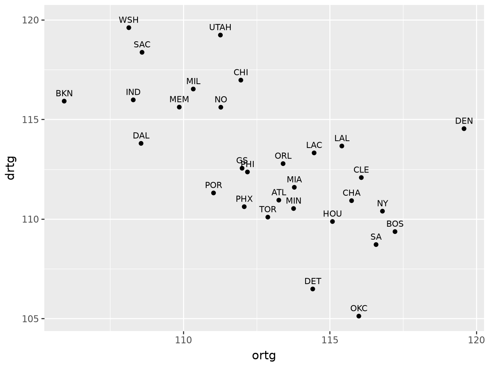
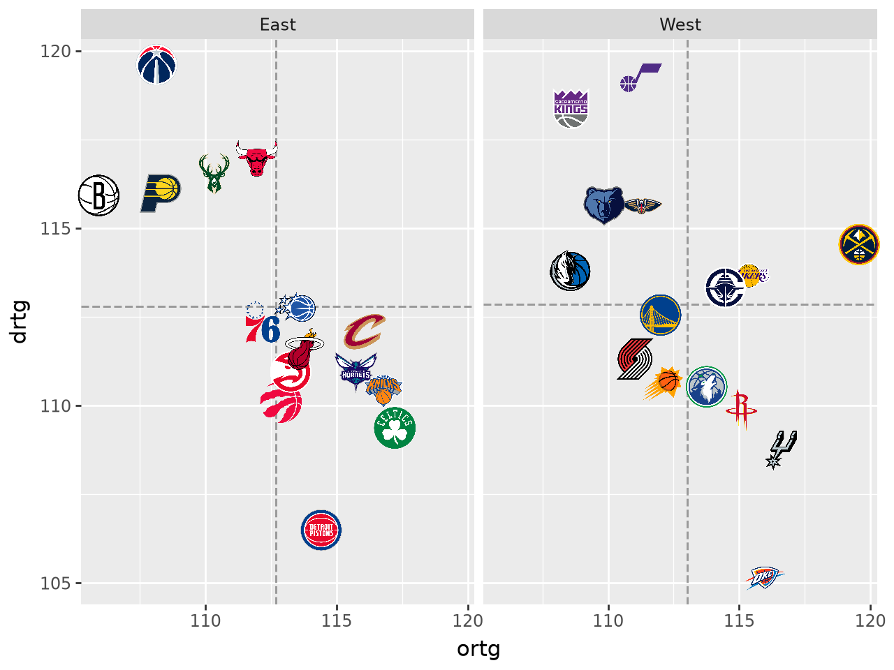
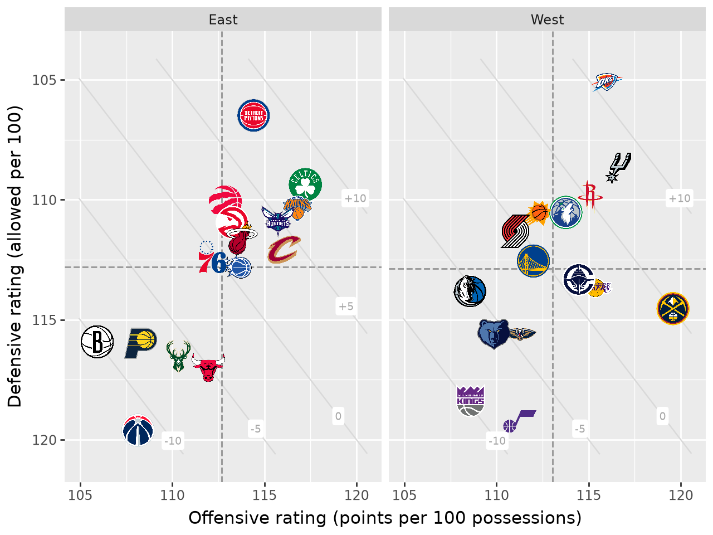
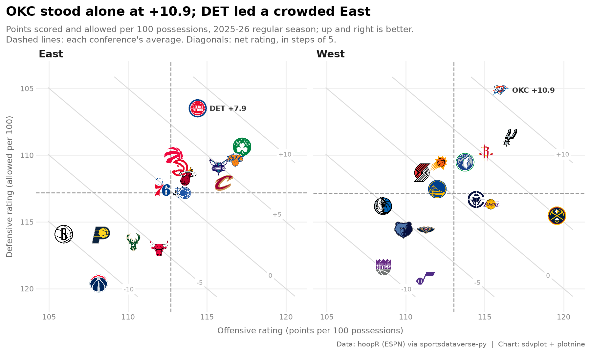
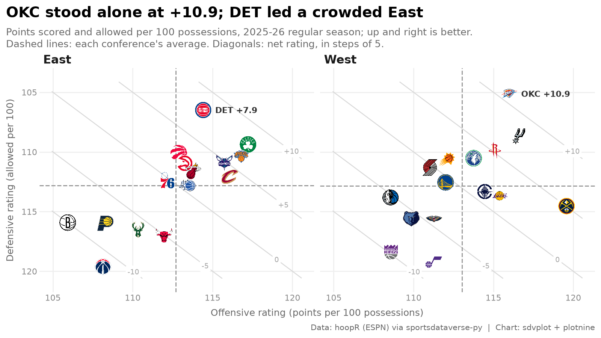
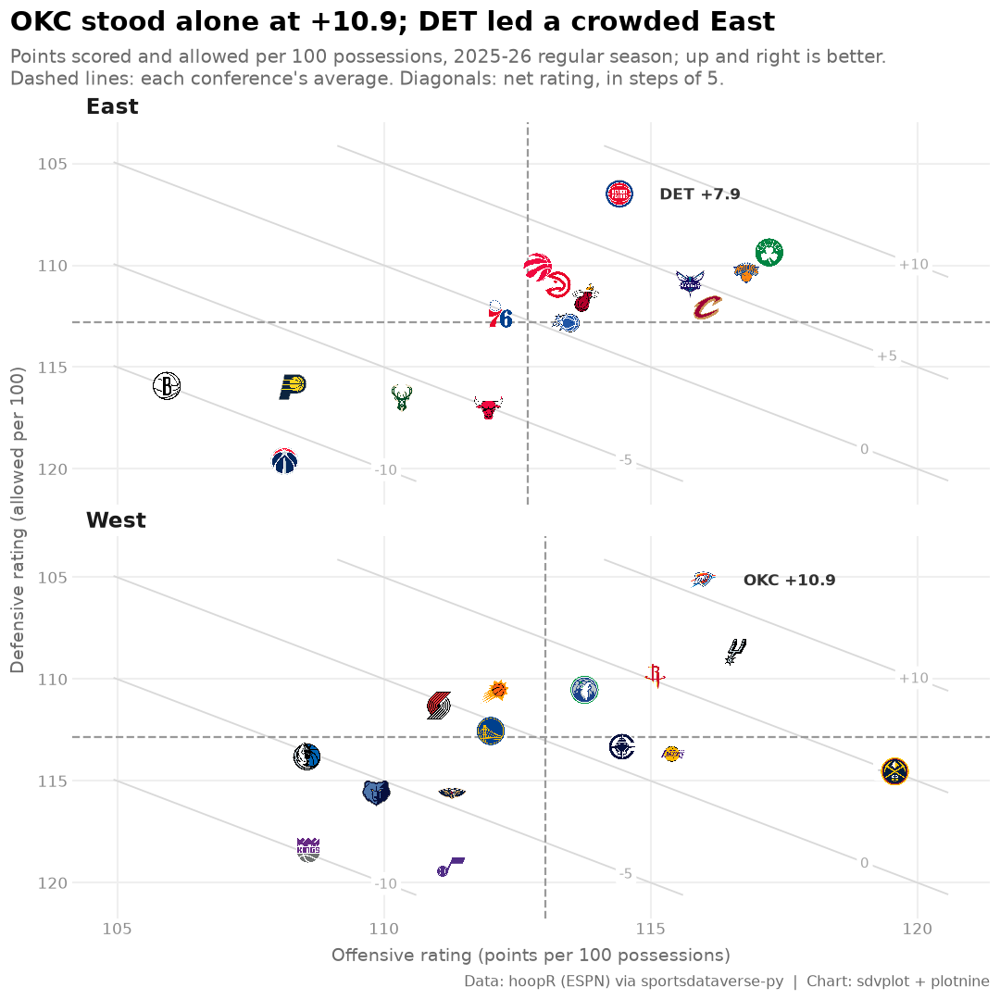

# NBA net rating quadrant

**The brief:** a season-review blog post needs one chart of where all 30 teams finished on offense and defense,
split by conference, at 1600 px wide, plus a square version for Instagram. This recipe builds it in plotnine, where
each fix is one more layer: logos with `geom_sdv_logos`, per-conference averages with `geom_mean_lines`, and facets
for the conferences. The ratings come from hoopR's ESPN team box scores through `sportsdataverse.nba`.

```python
import tempfile
import warnings
from pathlib import Path

import polars as pl
import sportsdataverse.nba as nba
from IPython.display import Image
from PIL import Image as PILImage
from plotnine import (
    aes,
    element_blank,
    element_line,
    element_text,
    facet_wrap,
    geom_label,
    geom_line,
    geom_point,
    geom_text,
    ggplot,
    labs,
    scale_x_continuous,
    scale_y_reverse,
    theme,
    theme_minimal,
)

import sdvplot
from sdvplot.plotnine import geom_mean_lines, geom_sdv_logos

SEASON = 2026  # the 2025-26 season: NBA seasons are named by the year they end
LABEL = f"{SEASON - 1}-{SEASON % 100:02d}"
OUT = Path(tempfile.mkdtemp(prefix="sdvplot-recipe-"))  # where the exports go; use your own folder
```

## 1. Get the data

Offensive and defensive rating are points scored and allowed per 100 possessions. Possessions are estimated from the
box score (FGA - OREB + TOV + 0.44 FTA) and averaged with the opponent's, so both teams in a game share one count.

```python
box = nba.load_nba_team_boxscore(seasons=[SEASON]).filter(pl.col("season_type") == 2)  # regular season
possessions = (
    pl.col("field_goals_attempted")
    - pl.col("offensive_rebounds")
    + pl.col("total_turnovers")
    + 0.44 * pl.col("free_throws_attempted")
)
games = box.with_columns(poss=possessions)
opponents = games.select("game_id", opponent_team_id="team_id", opp_poss="poss")
assert games.schema["opponent_team_id"] == opponents.schema["opponent_team_id"]  # same dtype on both sides
games = games.join(opponents, on=["game_id", "opponent_team_id"]).with_columns(
    game_poss=(pl.col("poss") + pl.col("opp_poss")) / 2
)
ratings = (
    games.group_by("team_abbreviation")
    .agg(
        ortg=100 * pl.col("team_score").sum() / pl.col("game_poss").sum(),
        drtg=100 * pl.col("opponent_team_score").sum() / pl.col("game_poss").sum(),
    )
    .with_columns(net=pl.col("ortg") - pl.col("drtg"))
    .sort("team_abbreviation")  # group_by returns groups in any order; sort for a stable result
)
ratings.height
```

<div class="sdv-output">

```text
33
```

</div>

33 teams in a 30-team league. The extra three are the All-Star Game's teams, which ESPN files as regular-season
games. `resolve` is the quickest way to find them: anything that is not an NBA team comes back `None`, with one
warning that names it. The conference comes from the same resolved ids.

```python
with warnings.catch_warnings(record=True) as caught:
    warnings.simplefilter("always")
    team_ids = sdvplot.resolve(ratings["team_abbreviation"].to_list(), "nba")
print(caught[0].message)

conferences = sdvplot.teams("nba").select("team_id", conference=pl.col("conference").str.replace("ern Conference", ""))
ratings = (
    ratings.with_columns(team_id=pl.Series(team_ids, dtype=pl.Utf8))
    .filter(pl.col("team_id").is_not_null())
    .join(conferences, on="team_id")
    .sort("net", descending=True)
)
ratings.head()
```

<div class="sdv-output">

```text
3 value(s) did not resolve to a nba team: 'STARS' (unknown), 'STRIPES' (unknown), 'WORLD' (unknown). Use sdvplot.suggest() for candidates, or strict=True to raise.
```

| team_abbreviation | ortg       | drtg       | net       | team_id | conference |
|-------------------|------------|------------|-----------|---------|------------|
| OKC               | 115.988049 | 105.126054 | 10.861996 | 25      | West       |
| DET               | 114.414822 | 106.488601 | 7.926221  | 8       | East       |
| SA                | 116.576118 | 108.717581 | 7.858537  | 24      | West       |
| BOS               | 117.222701 | 109.368854 | 7.853846  | 2       | East       |
| NY                | 116.794332 | 110.394973 | 6.399359  | 18      | East       |

</div>

## 2. The first draft

Points and abbreviations, plotnine's defaults.

```python
(ggplot(ratings, aes("ortg", "drtg", label="team_abbreviation")) + geom_point() + geom_text(nudge_y=0.4, size=8))
```

<div class="sdv-output">



</div>

Three problems: the labels overlap, a low defensive rating is good but sits at the bottom, and the two conferences
(which only meet a third of the time) are mixed together.

## 3. Logos, one panel per conference, and average lines

`geom_sdv_logos` replaces the points (the `team` aesthetic takes the abbreviations as they are), `facet_wrap` splits
the conferences, and `geom_mean_lines` draws each panel's own average offense and defense, so every team is read
against its conference.

```python
p = (
    ggplot(ratings, aes("ortg", "drtg"))
    + geom_mean_lines(aes(x0="ortg", y0="drtg"), color="#9a9a9a", size=0.6)
    + geom_sdv_logos(aes(team="team_abbreviation"), league="nba", season=SEASON, height=0.08)
    + facet_wrap("conference")
)
p
```

<div class="sdv-output">



</div>

Better, but the best defenses are at the bottom, logos at the edges are clipped (Denver, Brooklyn, Washington), and
the axis titles are column names.

## 4. Point the axes the right way and add net-rating guides

`scale_y_reverse` puts the best defenses on top, so up and to the right is good on both axes, and `expand` on both
scales leaves room for the edge logos. Net rating is the gap between the two numbers, so teams with the same net
rating sit on a diagonal: faint lines at -10, -5, 0, +5 and +10 show it without a third axis. Each line is clipped
to the data's range and drawn as data (`geom_line`), so the reversed scale moves it with the logos.

```python
x_lo, x_hi = ratings["ortg"].min() - 1, ratings["ortg"].max() + 1
y_lo, y_hi = ratings["drtg"].min() - 1, ratings["drtg"].max() + 1
# the line drtg = ortg - net, cut to the box [x_lo, x_hi] x [y_lo, y_hi]
ends = (
    pl.DataFrame({"net": [-10, -5, 0, 5, 10]})
    .with_columns(
        x0=pl.max_horizontal(pl.lit(x_lo), pl.lit(y_lo) + pl.col("net")),
        x1=pl.min_horizontal(pl.lit(x_hi), pl.lit(y_hi) + pl.col("net")),
    )
    .filter(pl.col("x0") < pl.col("x1"))
)
guides = (
    ends.unpivot(["x0", "x1"], index="net", value_name="ortg")
    .with_columns(drtg=pl.col("ortg") - pl.col("net"))
    .join(pl.DataFrame({"conference": ["East", "West"]}), how="cross")  # the same guides in both panels
)
guide_labels = (
    ends.with_columns(ortg=pl.col("x0") + 0.9 * (pl.col("x1") - pl.col("x0")))  # near the lower-right end
    .with_columns(
        drtg=pl.col("ortg") - pl.col("net"),
        label=pl.when(pl.col("net") > 0).then(pl.format("+{}", "net")).otherwise(pl.col("net").cast(pl.Utf8)),
    )
    .join(pl.DataFrame({"conference": ["East", "West"]}), how="cross")
)

p = (
    ggplot(ratings, aes("ortg", "drtg"))
    + geom_line(aes(group="net"), data=guides, color="#d9d9d9", size=0.5)
    + geom_label(aes(label="label"), data=guide_labels, color="#a6a6a6", size=7, fill="white", label_size=0)
    + geom_mean_lines(aes(x0="ortg", y0="drtg"), color="#9a9a9a", size=0.6)
    + geom_sdv_logos(aes(team="team_abbreviation"), league="nba", season=SEASON, height=0.08)
    + facet_wrap("conference")
    + scale_x_continuous(expand=(0.05, 0))
    + scale_y_reverse(expand=(0.07, 0))
    + labs(x="Offensive rating (points per 100 possessions)", y="Defensive rating (allowed per 100)")
)
p
```

<div class="sdv-output">



</div>

## 5. Polish and tell the story

A theme strips the chart junk (minor grid, panel background) and sets the type; the strip titles become plain
bold labels. The title states the finding, the subtitle explains the reading, and the caption carries the source.
The two conference leaders get their net rating printed under the logo.

```python
leaders = (
    ratings.group_by("conference")
    .agg(pl.all().sort_by("net").last())
    .sort("conference")
    .with_columns(
        note=pl.format("{} +{}", "team_abbreviation", pl.col("net").round(1))  # both leaders are above zero
    )
)
top = leaders.sort("net", descending=True).row(0, named=True)
east = leaders.filter(pl.col("conference") == "East").row(0, named=True)
title = f"{top['team_abbreviation']} stood alone at +{top['net']:.1f}; {east['team_abbreviation']} led a crowded East"

blog_theme = theme_minimal(base_size=10) + theme(
    figure_size=(9, 5.4),
    plot_title=element_text(weight="bold", size=14),
    plot_subtitle=element_text(color="#6b6b6b", size=9.5),
    plot_caption=element_text(color="#6b6b6b", size=7.5),
    strip_text=element_text(weight="bold", size=11, ha="left"),
    axis_title=element_text(color="#6b6b6b", size=9),
    axis_text=element_text(color="#8a8a8a"),
    panel_grid_minor=element_blank(),
    panel_grid_major=element_line(color="#efefef"),
    plot_title_position="plot",
)
chart = (
    p
    + geom_text(aes(label="note"), data=leaders, size=8, fontweight="bold", ha="left", nudge_x=0.75, color="#333333")
    + labs(
        title=title,
        subtitle=f"Points scored and allowed per 100 possessions, {LABEL} regular season; up and right is better.\n"
        "Dashed lines: each conference's average. Diagonals: net rating, in steps of 5.",
        caption="Data: hoopR (ESPN) via sportsdataverse-py  |  Chart: sdvplot + plotnine",
    )
    + blog_theme
)
chart
```

<div class="sdv-output">



</div>

## 6. Export for the blog and for Instagram

`ggplot.save` takes the size in inches and a dpi: 8 x 4.5 in at 200 dpi is the blog's 1600 x 900. The square post
re-lays the same plot with one more layer: `facet_wrap(..., ncol=1)` stacks the conferences, and a theme tweak
sets the square figure size.

```python
blog = OUT / "nba_net_rating_1600x900.png"
chart.save(blog, width=8, height=4.5, dpi=200, verbose=False)

square = OUT / "nba_net_rating_1080x1080.png"
(chart + facet_wrap("conference", ncol=1) + theme(figure_size=(7.2, 7.2))).save(
    square, width=7.2, height=7.2, dpi=150, verbose=False
)
for f in (blog, square):
    print(f.name, PILImage.open(f).size)
Image(blog, width=800)
```

<div class="sdv-output">

```text
nba_net_rating_1600x900.png (1600, 900)
nba_net_rating_1080x1080.png (1080, 1080)
```



</div>

The square cut, stacked:

```python
Image(square, width=540)
```

<div class="sdv-output">



</div>

## Run it yourself

<a href="pathname:///notebooks/recipes/nba-net-rating-quadrant.ipynb" download>Download the notebook</a> (outputs cleared) or [open it on GitHub](https://github.com/sportsdataverse/sdvplot/blob/main/examples/notebooks/recipes/nba-net-rating-quadrant.ipynb).
