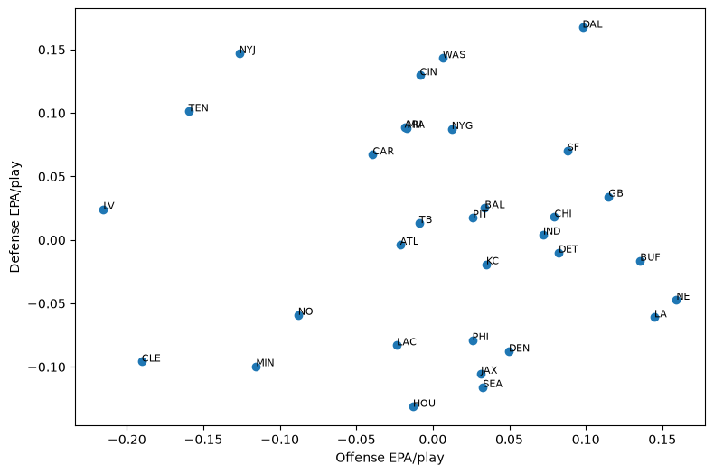
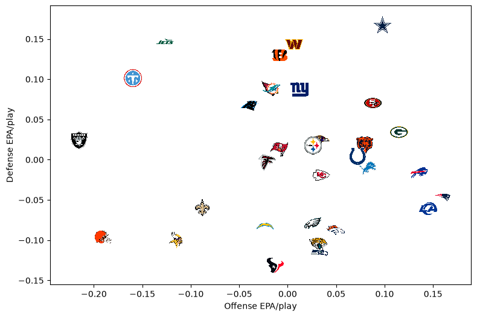
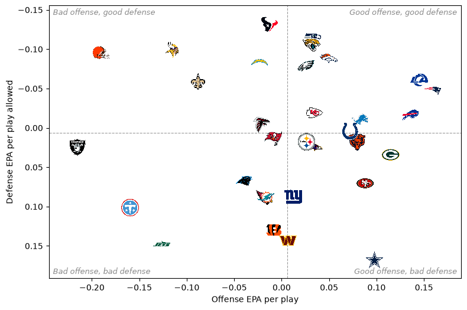
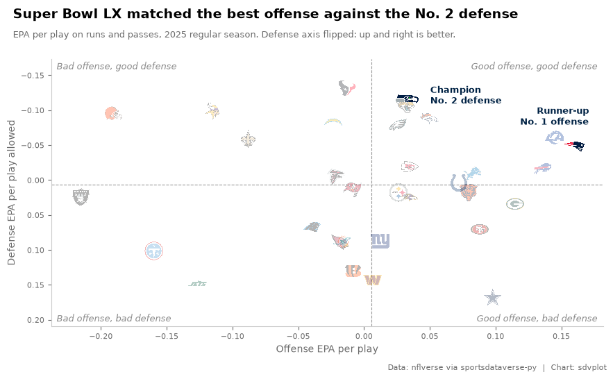
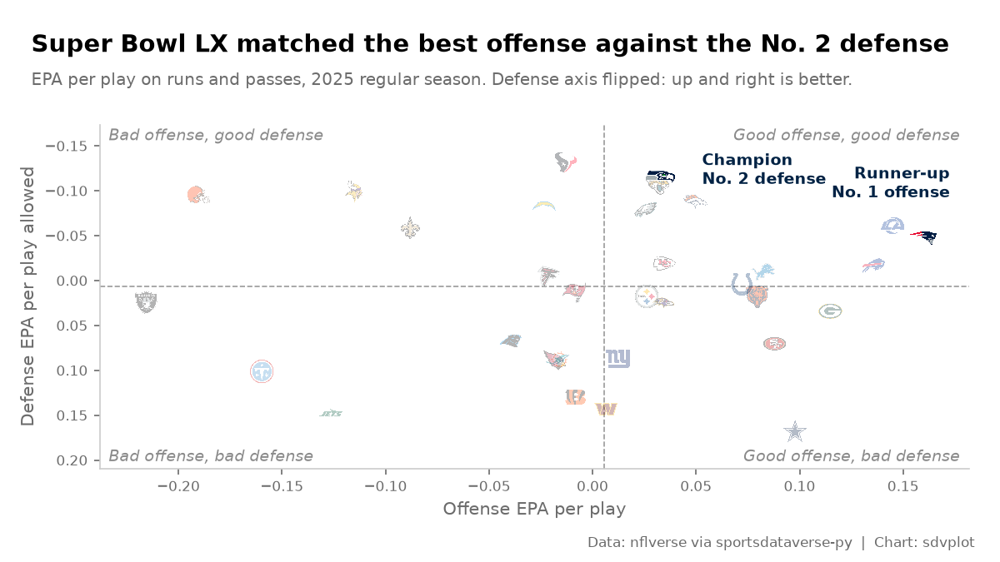
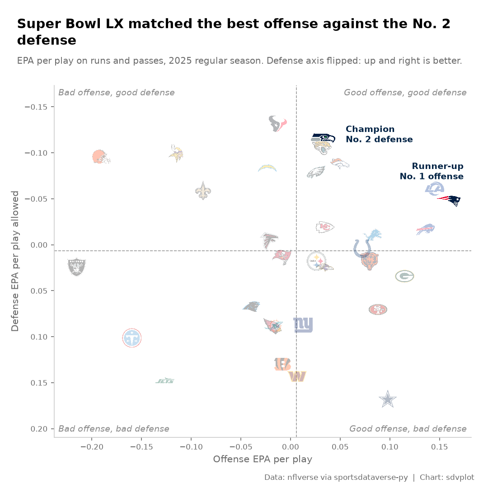

# NFL EPA scatter

**The brief:** the week after the Super Bowl, the social team wants the season's offense-vs-defense chart for X and
Bluesky (1200 x 675) and Instagram (1080 x 1080), and it should say something about the two teams that just played.
This is the chart every NFL analyst makes: each team's offensive EPA per play against the EPA per play its defense
allowed, with logos for points. The data is nflverse play-by-play through `sportsdataverse.nfl`.

```python
import tempfile
from pathlib import Path

import matplotlib.pyplot as plt
import polars as pl
import sportsdataverse.nfl as nfl
from IPython.display import Image

import sdvplot

SEASON = 2025
OUT = Path(tempfile.mkdtemp(prefix="sdvplot-recipe-"))  # where the exports go; use your own folder
```

## 1. Get the data

One season of play-by-play, cut to regular-season runs and passes with an EPA value, then averaged twice: by the team
with the ball and by the team on defense. The Super Bowl comes from the schedule, so the chart can point at it.

```python
pbp = nfl.load_nfl_pbp([SEASON])
plays = pbp.filter(
    pl.col("season_type") == "REG",
    pl.col("play_type").is_in(["pass", "run"]),
    pl.col("epa").is_not_null(),
)
offense = plays.group_by("posteam").agg(off_epa=pl.col("epa").mean(), plays=pl.len())
defense = plays.group_by("defteam").agg(def_epa=pl.col("epa").mean())
assert offense.schema["posteam"] == defense.schema["defteam"]  # one dtype on both sides of the join key
teams = (
    offense.join(defense, left_on="posteam", right_on="defteam")
    .rename({"posteam": "team"})
    .with_columns(
        off_rank=pl.col("off_epa").rank(descending=True).cast(pl.Int64),
        def_rank=pl.col("def_epa").rank().cast(pl.Int64),  # less EPA allowed is better
    )
    .sort("team")  # group_by returns groups in any order; sort so the logos draw in the same order every run
)

sb = nfl.load_nfl_schedule([SEASON]).filter(pl.col("game_type") == "SB").row(0, named=True)
winner, loser = (
    (sb["home_team"], sb["away_team"]) if sb["home_score"] > sb["away_score"] else (sb["away_team"], sb["home_team"])
)
print(f"Super Bowl: {sb['away_team']} {sb['away_score']}, {sb['home_team']} {sb['home_score']}")
teams.filter(pl.col("team").is_in([winner, loser]))
```

<div class="sdv-output">

```text
Super Bowl: SEA 29, NE 13
```

| team | off_epa  | plays | def_epa   | off_rank | def_rank |
|------|----------|-------|-----------|----------|----------|
| NE   | 0.159207 | 1017  | -0.047123 | 1        | 11       |
| SEA  | 0.032795 | 997   | -0.115932 | 13       | 2        |

</div>

The champion had the No. 2 defense and the runner-up the No. 1 offense: that is the story the chart should tell.

## 2. The first draft

Thirty-two dots and their abbreviations, the five-minute version.

```python
fig, ax = plt.subplots(figsize=(9, 6))
ax.scatter(teams["off_epa"], teams["def_epa"])
for row in teams.iter_rows(named=True):
    ax.annotate(row["team"], (row["off_epa"], row["def_epa"]), fontsize=8)
ax.set(xlabel="Offense EPA/play", ylabel="Defense EPA/play")
plt.show()
```

<div class="sdv-output">



</div>

It is all there, but it does not read: labels collide in the middle of the pack, a reader has to work out that low
is good on the y axis, and nothing says what the chart is about.

## 3. Logos for points

`add_logos` puts each team's logo on its point; the abbreviations from nflverse resolve as they are. An invisible
scatter (`s=0`) still sets the axis limits, and `margins` leaves room so no logo at the edge is clipped. `height` is a
fraction of the axes height, so the logos keep their size when the figure is resized or saved at another dpi.

```python
fig, ax = plt.subplots(figsize=(9, 6))
ax.scatter(teams["off_epa"], teams["def_epa"], s=0)
ax.margins(0.08)
sdvplot.add_logos(ax, teams["off_epa"], teams["def_epa"], teams["team"], league="nfl", season=SEASON, height=0.07)
ax.set(xlabel="Offense EPA/play", ylabel="Defense EPA/play")
plt.show()
```

<div class="sdv-output">



</div>

## 4. Point the axes the same way

Readers expect "up and to the right" to be good. Flipping the y axis puts the best defenses on top; dashed
league-average lines and a label in each corner turn the scatter into four quadrants anyone can read.

```python
def quadrants(ax):
    """League-average lines and a label in each corner of a flipped-defense EPA chart."""
    ax.axvline(teams["off_epa"].mean(), color="#9a9a9a", lw=0.8, ls="--", zorder=1)
    ax.axhline(teams["def_epa"].mean(), color="#9a9a9a", lw=0.8, ls="--", zorder=1)
    corners = {
        (0.99, 0.99): "Good offense, good defense",
        (0.01, 0.99): "Bad offense, good defense",
        (0.99, 0.01): "Good offense, bad defense",
        (0.01, 0.01): "Bad offense, bad defense",
    }
    for (x, y), label in corners.items():
        ax.text(
            x,
            y,
            label,
            transform=ax.transAxes,
            fontsize=9,
            color="#8a8a8a",
            style="italic",
            ha="right" if x > 0.5 else "left",
            va="top" if y > 0.5 else "bottom",
        )


fig, ax = plt.subplots(figsize=(9, 6))
ax.scatter(teams["off_epa"], teams["def_epa"], s=0)
ax.margins(0.08)
ax.invert_yaxis()
quadrants(ax)
sdvplot.add_logos(ax, teams["off_epa"], teams["def_epa"], teams["team"], league="nfl", season=SEASON, height=0.07)
ax.set(xlabel="Offense EPA per play", ylabel="Defense EPA per play allowed")
plt.show()
```

<div class="sdv-output">



</div>

Seattle is half buried: its numbers are almost the same as Jacksonville's, and the Jaguars logo covers it. That is
the team the chart is about, so the next step has to fix it.

## 5. Tell the story

Now make it about the Super Bowl. The other 30 logos fade (`alpha`), the two finalists are drawn last, a little
larger, with a callout each, which also lifts Seattle out from under Jacksonville. The title states the finding
instead of describing the axes, the subtitle carries the definitions and the caption the source.

Everything goes in one function of the figure size, ready for the exports. Font sizes are in points, so a smaller
canvas fits fewer characters per line: the title and subtitle wrap to the width, and the margins are set in inches
so the tick labels never collide with the edge.

```python
import textwrap

GREY = "#6b6b6b"
TITLE = "Super Bowl LX matched the best offense against the No. 2 defense"
SUBTITLE = f"EPA per play on runs and passes, {SEASON} regular season. Defense axis flipped: up and right is better."
CALLOUTS = {  # where each finalist's label sits, in points from its logo
    winner: dict(xytext=(24, 4), ha="left", va="center"),
    loser: dict(xytext=(16, 22), ha="right", va="bottom"),
}


def epa_chart(figsize, dpi=100, logo_height=0.075):
    w, h = figsize
    title = textwrap.fill(TITLE, int(w * 8.2))  # about 8 characters per inch at 14 pt bold
    subtitle = textwrap.fill(SUBTITLE, int(w * 14))
    top = 0.25 + 0.26 * title.count("\n") + 0.22 + 0.18 * (subtitle.count("\n") + 1) + 0.35  # inches

    fig = plt.figure(figsize=figsize, dpi=dpi)
    ax = fig.add_axes((0.8 / w, 0.75 / h, 1 - 1.05 / w, 1 - (0.75 + top) / h))
    ax.scatter(teams["off_epa"], teams["def_epa"], s=0)
    ax.margins(x=0.06, y=0.14)  # headroom for the corner labels and the callouts
    ax.invert_yaxis()
    quadrants(ax)

    finalists = teams.filter(pl.col("team").is_in([winner, loser]))
    others = teams.filter(~pl.col("team").is_in([winner, loser]))
    sdvplot.add_logos(
        ax,
        others["off_epa"],
        others["def_epa"],
        others["team"],
        league="nfl",
        season=SEASON,
        height=logo_height,
        alpha=0.3,
    )
    sdvplot.add_logos(
        ax,
        finalists["off_epa"],
        finalists["def_epa"],
        finalists["team"],
        league="nfl",
        season=SEASON,
        height=logo_height * 1.3,
        zorder=5,
    )
    for row in finalists.iter_rows(named=True):
        note = (
            f"Champion\nNo. {row['def_rank']} defense"
            if row["team"] == winner
            else f"Runner-up\nNo. {row['off_rank']} offense"
        )
        ax.annotate(
            note,
            (row["off_epa"], row["def_epa"]),
            textcoords="offset points",
            fontsize=9,
            fontweight="bold",
            color=sdvplot.team_colors(row["team"], "nfl"),
            linespacing=1.1,
            **CALLOUTS[row["team"]],
        )

    ax.set_xlabel("Offense EPA per play", color=GREY)
    ax.set_ylabel("Defense EPA per play allowed", color=GREY)
    ax.tick_params(colors=GREY, labelsize=8)
    ax.spines[["top", "right"]].set_visible(False)
    ax.spines[["left", "bottom"]].set_color("#cccccc")

    fig.text(0.25 / w, 1 - 0.25 / h, title, fontsize=14, fontweight="bold", va="top", linespacing=1.15)
    fig.text(0.25 / w, 1 - (0.25 + 0.26 * title.count("\n") + 0.33) / h, subtitle, fontsize=9.5, color=GREY, va="top")
    fig.text(
        1 - 0.2 / w,
        0.12 / h,
        "Data: nflverse via sportsdataverse-py  |  Chart: sdvplot",
        fontsize=8,
        color=GREY,
        ha="right",
    )
    return fig


fig = epa_chart((9, 5.6))
plt.show()
```

<div class="sdv-output">



</div>

## 6. Export at social sizes

Social sites resize whatever they get, so export at the size they show: 1200 x 675 for X and Bluesky, 1080 x 1080
for Instagram. Inches times dpi gives the pixels; skip `bbox_inches="tight"`, which trims the canvas and breaks the
exact size. The square's axes are taller, so the same `height` fraction would make bigger logos; it gets a smaller
one.

```python
from PIL import Image as PILImage

files = {
    "nfl_epa_1200x675.png": epa_chart((8, 4.5), dpi=150),
    "nfl_epa_1080x1080.png": epa_chart((7.2, 7.2), dpi=150, logo_height=0.06),
}
for name, fig in files.items():
    fig.savefig(OUT / name, dpi=150, facecolor="white")
    plt.close(fig)
    print(name, PILImage.open(OUT / name).size)
Image(OUT / "nfl_epa_1200x675.png")
```

<div class="sdv-output">

```text
nfl_epa_1200x675.png (1200, 675)
```

```text
nfl_epa_1080x1080.png (1080, 1080)
```



</div>

The square cut, from the same function:

```python
Image(OUT / "nfl_epa_1080x1080.png", width=540)
```

<div class="sdv-output">



</div>

## Run it yourself

<a href="pathname:///notebooks/recipes/nfl-epa-scatter.ipynb" download>Download the notebook</a> (outputs cleared) or [open it on GitHub](https://github.com/sportsdataverse/sdvplot/blob/main/examples/notebooks/recipes/nfl-epa-scatter.ipynb).
