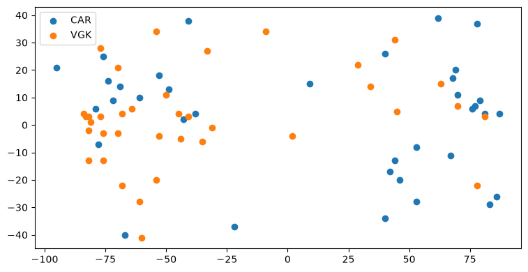
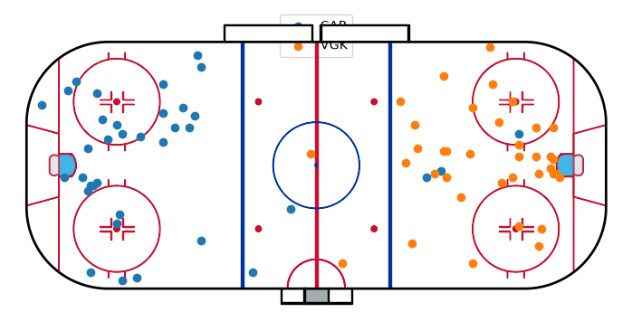
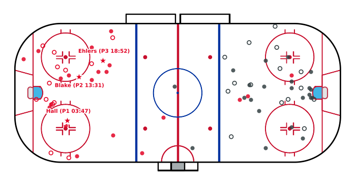
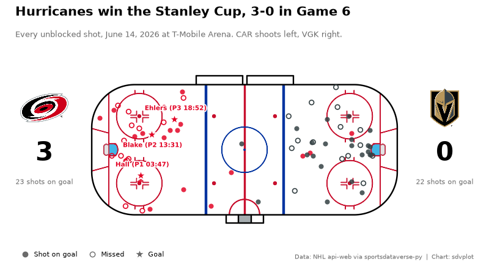
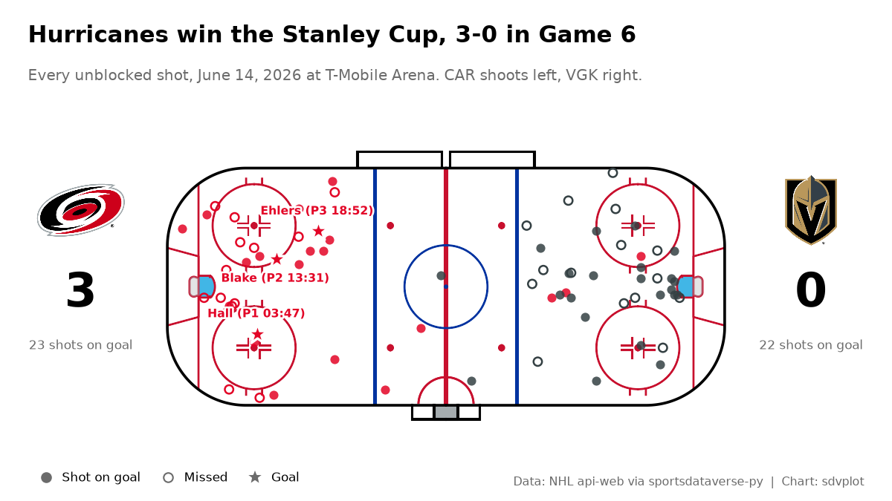

# NHL shot map

**The brief:** the morning after the Stanley Cup clincher, post one image of the game: every unblocked shot on a
rink, each team in its colors, the goals called out, and the score. It goes out at 1200 x 675 for X and Bluesky and
1600 x 900 for the blog recap. The play-by-play is the NHL's own game feed (api-web.nhle.com) through
`sportsdataverse.nhl`, and `sdvplot.surface` draws the rink.

```python
import datetime as dt
import tempfile
from pathlib import Path

import matplotlib.patheffects as pe
import matplotlib.pyplot as plt
import polars as pl
import sportsdataverse.nhl as nhl
from IPython.display import Image
from matplotlib.lines import Line2D
from PIL import Image as PILImage

import sdvplot

GAME_ID = 2025030416  # 2025-26 Stanley Cup Final, Game 6
OUT = Path(tempfile.mkdtemp(prefix="sdvplot-recipe-"))  # where the exports go; use your own folder
```

## 1. Get the data

One request returns the whole game feed. `parse_nhl_web_pbp` turns its plays into a frame, and the raw payload
still has the teams, the final score and the rosters (for the scorers' names). The feed identifies teams by NHL
stats ids, which arrive as floats; they become integers once, at the boundary, and `resolve` maps them with
`id_system="nhl_id"`. That id system is never tried automatically, because NHL ids 1-28 collide with other teams'
ESPN ids, so it has to be named.

```python
raw = nhl.nhl_web_pbp(GAME_ID, return_parsed=False)
plays = nhl.parse_nhl_web_pbp(raw)
home, away = raw["homeTeam"], raw["awayTeam"]
names = {p["playerId"]: p["lastName"]["default"] for p in raw["rosterSpots"]}

shots = plays.filter(pl.col("type_desc_key").is_in(["shot-on-goal", "missed-shot", "goal"])).select(
    "time_in_period",
    "home_team_defending_side",
    kind="type_desc_key",
    period="period_descriptor_number",
    nhl_id=pl.col("details_event_owner_team_id").cast(pl.Int64),
    x="details_x_coord",
    y="details_y_coord",
    scorer=pl.col("details_scoring_player_id").cast(pl.Int64),
)
team_ids = sdvplot.resolve(shots["nhl_id"].to_list(), "nhl", id_system="nhl_id")
abbr = dict(sdvplot.teams("nhl").select("team_id", "abbr").iter_rows())
shots = shots.with_columns(team=pl.Series([abbr[t] for t in team_ids]))
print(f"{away['abbrev']} {away['score']} at {home['abbrev']} {home['score']}")
shots.group_by("team", "kind").len().sort("team", "kind")
```

<div class="sdv-output">

```text
CAR 3 at VGK 0
```

| team | kind         | len |
|------|--------------|-----|
| CAR  | goal         | 3   |
| CAR  | missed-shot  | 13  |
| CAR  | shot-on-goal | 20  |
| VGK  | missed-shot  | 15  |
| VGK  | shot-on-goal | 22  |

</div>

## 2. The first draft

Scatter the coordinates as they come, one color per team.

```python
fig, ax = plt.subplots(figsize=(9, 4.5))
for team, g in shots.group_by("team", maintain_order=True):
    ax.scatter(g["x"], g["y"], label=team[0])
ax.legend()
plt.show()
```

<div class="sdv-output">



</div>

Both teams have shots at both ends: teams switch ends every period, and the feed records where on the ice each shot
happened. With no rink, the dots float in space, and the goals look like every other shot.

## 3. One end per team, on a rink

Rotating every play by 180 degrees in the periods when the home team defends the right-hand net puts each team's
shots at one end for the whole game: the home team shoots right, the visitors left. `sdvplot.surface("nhl")` draws a
regulation rink in the feed's coordinates (feet, center ice at 0, 0), so the points land in place.

```python
flip = pl.when(pl.col("home_team_defending_side") == "right").then(-1).otherwise(1)
shots = shots.with_columns(x=pl.col("x") * flip, y=pl.col("y") * flip)

fig, ax = plt.subplots(figsize=(9, 4.5))
sdvplot.surface("nhl", ax=ax)
for team, g in shots.group_by("team", maintain_order=True):
    ax.scatter(g["x"], g["y"], label=team[0], zorder=20)
ax.legend()
plt.show()
```

<div class="sdv-output">



</div>

## 4. Team colors, shot types and the goals

Each team's shots take its primary color from `team_colors`; a shot on goal is filled, a miss is an open ring, and a
goal is a large star with the scorer's name, in a white halo so it reads over the shots and the rink lines. The
same drawing goes in a function so the final layout can reuse it.

```python
def draw_shots(ax):
    sdvplot.surface("nhl", ax=ax)
    for (team,), g in shots.group_by("team", maintain_order=True):
        color = sdvplot.team_colors(team, "nhl")
        on_goal, missed, goals = (g.filter(pl.col("kind") == k) for k in ("shot-on-goal", "missed-shot", "goal"))
        ax.scatter(on_goal["x"], on_goal["y"], s=34, color=color, alpha=0.85, lw=0, zorder=20)
        ax.scatter(missed["x"], missed["y"], s=30, facecolor="none", edgecolor=color, lw=1.2, zorder=20)
        ax.scatter(goals["x"], goals["y"], s=190, color=color, edgecolor="white", lw=1.6, marker="*", zorder=22)
        for i, row in enumerate(goals.iter_rows(named=True)):
            above = i % 2 == 0  # alternate above and below, so goals close together keep their labels apart
            ax.annotate(
                f"{names[row['scorer']]} (P{row['period']} {row['time_in_period']})",
                (row["x"], row["y"]),
                xytext=(0, 9 if above else -9),
                textcoords="offset points",
                ha="center",
                va="bottom" if above else "top",
                fontsize=7.5,
                fontweight="bold",
                color=color,
                zorder=23,
                path_effects=[pe.withStroke(linewidth=2.5, foreground="white")],
            )


fig, ax = plt.subplots(figsize=(9, 4.5))
draw_shots(ax)
plt.show()
```

<div class="sdv-output">



</div>

## 5. The frame: score, teams and story

A shot map needs a scoreboard. Each team gets a block on the side of the rink it attacks: its logo (`add_logos` on a
small axes), its score and its official shots on goal from the feed. The title says what happened, the subtitle how to read the rink, and a
legend row explains the three marks. The layout is set in inches, so the same function serves both export sizes.

```python
GREY = "#6b6b6b"
winner, loser = (away, home) if away["score"] > home["score"] else (home, away)
day = dt.date.fromisoformat(raw["gameDate"])
played = f"{day:%B} {day.day}, {day.year}"


def team_block(fig, rect, team):
    ax = fig.add_axes(rect)
    ax.set(xlim=(0, 1), ylim=(0, 1))
    ax.axis("off")
    sdvplot.add_logos(ax, [0.5], [0.72], [team["abbrev"]], league="nhl", season=2026, height=0.36)
    ax.text(0.5, 0.36, str(team["score"]), ha="center", va="center", fontsize=30, fontweight="bold")
    ax.text(0.5, 0.14, f"{team['sog']} shots on goal", ha="center", va="center", fontsize=8, color=GREY)


def shot_map(figsize, dpi=100):
    w, h = figsize
    fig = plt.figure(figsize=figsize, dpi=dpi, facecolor="white")
    side = 1.25  # inches for each team block
    rink_h = h - 1.75
    rink_w = min(w - 2 * side - 0.2, rink_h * 212.5 / 108.5)
    left = (w - rink_w) / 2
    ax = fig.add_axes((left / w, 0.55 / h, rink_w / w, rink_h / h))
    draw_shots(ax)
    block_h = 2.1 / h
    team_block(fig, ((left - side) / w, 0.5 - block_h / 2 - 0.1 / h, side / w, block_h), away)  # shoots left
    team_block(fig, ((left + rink_w) / w, 0.5 - block_h / 2 - 0.1 / h, side / w, block_h), home)  # shoots right

    fig.text(
        0.25 / w,
        1 - 0.22 / h,
        f"{winner['commonName']['default']} win the Stanley Cup, {winner['score']}-{loser['score']} in Game 6",
        fontsize=15,
        fontweight="bold",
        va="top",
    )
    fig.text(
        0.25 / w,
        1 - 0.62 / h,
        f"Every unblocked shot, {played} at {raw['venue']['default']}. "
        f"{away['abbrev']} shoots left, {home['abbrev']} right.",
        fontsize=9.5,
        color=GREY,
        va="top",
    )
    marks = [
        Line2D([], [], ls="", marker="o", color=GREY, ms=6, label="Shot on goal"),
        Line2D([], [], ls="", marker="o", mfc="none", mec=GREY, ms=6, label="Missed"),
        Line2D([], [], ls="", marker="*", color=GREY, mec="white", ms=12, label="Goal"),
    ]
    fig.legend(
        handles=marks,
        loc="lower left",
        bbox_to_anchor=(0.2 / w, 0.05 / h),
        ncol=3,
        frameon=False,
        fontsize=8,
        handletextpad=0.3,
        columnspacing=1.2,
    )
    fig.text(
        1 - 0.25 / w,
        0.14 / h,
        "Data: NHL api-web via sportsdataverse-py  |  Chart: sdvplot",
        fontsize=7.5,
        color=GREY,
        ha="right",
    )
    return fig


fig = shot_map((8, 4.5))
plt.show()
```

<div class="sdv-output">



</div>

## 6. Export for X and the blog

1200 x 675 for X and Bluesky and 1600 x 900 for the blog are the same 16:9 shape, so the 8 x 4.5 in figure from the
last step serves both; only the dpi changes (150 and 200). Inches times dpi gives the exact pixels, and the logos,
sized as a fraction of their axes, scale with everything else. (Saving the figure already drawn also skips
redrawing the rink, the slowest part of this notebook.)

```python
files = {"nhl_shot_map_1200x675.png": 150, "nhl_shot_map_1600x900.png": 200}
for name, dpi in files.items():
    fig.savefig(OUT / name, dpi=dpi)
    print(name, PILImage.open(OUT / name).size)
Image(OUT / "nhl_shot_map_1200x675.png")
```

<div class="sdv-output">

```text
nhl_shot_map_1200x675.png (1200, 675)
```

```text
nhl_shot_map_1600x900.png (1600, 900)
```



</div>

## Run it yourself

<a href="pathname:///notebooks/recipes/nhl-shot-map.ipynb" download>Download the notebook</a> (outputs cleared) or [open it on GitHub](https://github.com/sportsdataverse/sdvplot/blob/main/examples/notebooks/recipes/nhl-shot-map.ipynb).
