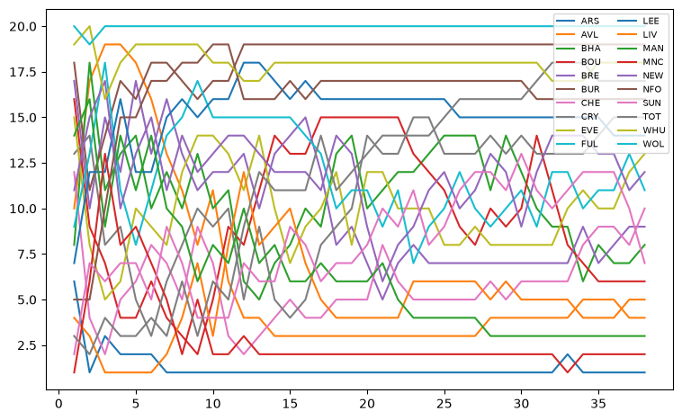
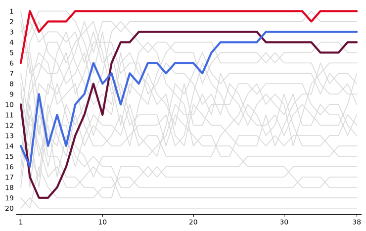
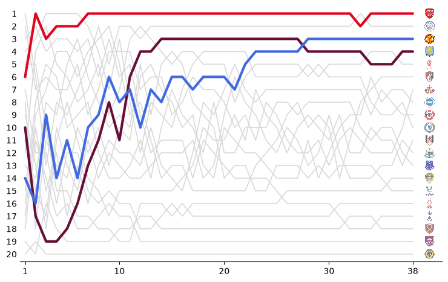
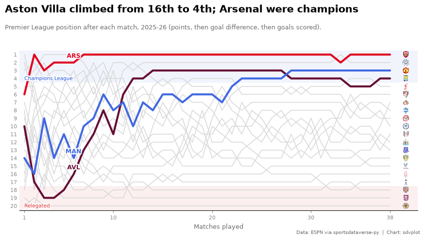
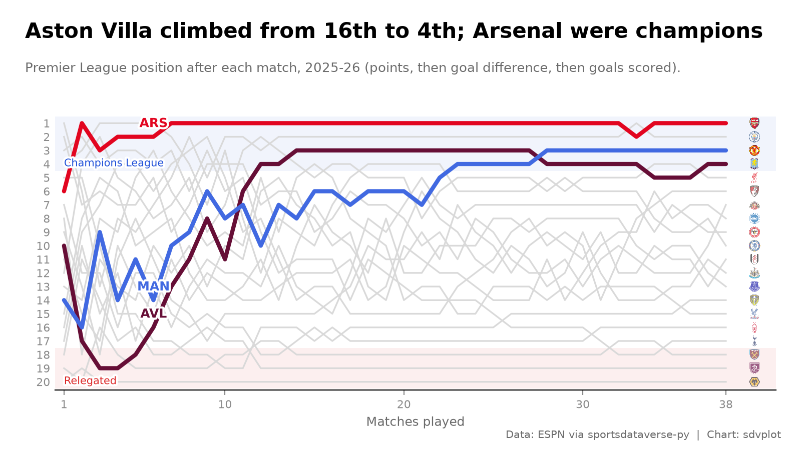

# Rank bump chart

**The brief:** a season-review piece wants the whole Premier League season in one picture: every club's league
position, match by match, with the clubs that moved most called out and crests at the end of each line. It runs
1600 x 900 on the blog and 1200 x 675 on X. The results are ESPN's through `sportsdataverse.soccer`; matplotlib
draws the "bump chart" and sdvplot the crests and colors.

```python
import tempfile
from pathlib import Path

import matplotlib.patheffects as pe
import matplotlib.pyplot as plt
import polars as pl
import sportsdataverse.soccer as soccer
from IPython.display import Image
from matplotlib.colors import to_rgb
from PIL import Image as PILImage

import sdvplot

LEAGUE, SEASON = "eng.1", 2025  # ESPN names a European season by the year it starts: 2025 is 2025-26
OUT = Path(tempfile.mkdtemp(prefix="sdvplot-recipe-"))  # where the exports go; use your own folder
```

## 1. Get the data

ESPN's scoreboard takes a calendar year, so two calls cover the season, filtered to its slug. Stacking each match's
two sides gives one row per club per match; running totals of points, goal difference and goals give each club's
record after every game. Ranking the clubs after the same number of games, by the league's order (points, then goal
difference, then goals scored), gives the position. Using games played rather than calendar weeks keeps a postponed
match from scrambling the order.

```python
events = []
for year in (SEASON, SEASON + 1):
    events += soccer.espn_soccer_scoreboard(LEAGUE, dates=year, limit=500, return_parsed=False)["events"]
events = [e for e in events if e["season"]["slug"].startswith(f"{SEASON}-{(SEASON + 1) % 100:02d}")]

rows = []
for e in events:
    first, second = e["competitions"][0]["competitors"]
    for me, opp in ((first, second), (second, first)):
        team = me["team"]
        rows.append(
            {
                "date": e["date"],
                "team_id": me["id"],
                "team": team["abbreviation"],
                "name": team["displayName"],
                "color": f"#{team['color']}",
                "alt": f"#{team['alternateColor']}",
                "gf": int(me["score"]),
                "ga": int(opp["score"]),
            }
        )
games = (
    pl.DataFrame(rows)
    .sort("date", "team")  # clubs kick off at the same time; the second key keeps one order every run
    .with_columns(
        game=pl.int_range(1, pl.len() + 1).over("team_id"),
        pts=pl.when(pl.col("gf") > pl.col("ga")).then(3).when(pl.col("gf") == pl.col("ga")).then(1).otherwise(0),
    )
    .with_columns(
        points=pl.col("pts").cum_sum().over("team_id"),
        gd=(pl.col("gf") - pl.col("ga")).cum_sum().over("team_id"),
        goals=pl.col("gf").cum_sum().over("team_id"),
    )
    .with_columns(
        # rank() returns unsigned integers; make them signed now, or "start - finish" wraps around below zero
        position=pl.struct("points", "gd", "goals").rank("ordinal", descending=True).over("game").cast(pl.Int64)
    )
)
final = games.filter(pl.col("game") == pl.col("game").max()).sort("position")
final.select("position", "team", "points", "gd").head(5)
```

<div class="sdv-output">

| position | team | points | gd |
|----------|------|--------|----|
| 1        | ARS  | 85     | 44 |
| 2        | MNC  | 78     | 42 |
| 3        | MAN  | 71     | 19 |
| 4        | AVL  | 65     | 7  |
| 5        | LIV  | 60     | 10 |

</div>

## 2. The first draft

One line per club, matplotlib's defaults.

```python
fig, ax = plt.subplots(figsize=(9, 5.5))
for (team,), g in games.sort("team").group_by("team", maintain_order=True):
    ax.plot(g["game"], g["position"], label=team)
ax.legend(ncol=2, fontsize=7)
plt.show()
```

<div class="sdv-output">



</div>

Spaghetti: twenty lines in ten recycled colors, a legend nobody can match to them, and first place at the bottom.

## 3. Flip it and pick the story

League tables read top down, so the y axis is inverted with a tick for every position. All twenty clubs stay in
light grey for context, and three are drawn in their colors: the champion and the two biggest climbers, measured
from where they stood after six games to where they finished.

The colors come from the data, not sdvplot: the soccer index has no club colors yet (its `color_source` column says
`fallback`, a stand-in palette), while ESPN's scoreboard carries each club's own colors. Two red clubs would read as
one, so a club whose color is too close to one already used switches to its alternate color.

```python
start = games.filter(pl.col("game") == 6).select("team", start="position")
climbers = (
    final.join(start, on="team")
    .with_columns(climb=pl.col("start") - pl.col("position"))
    .sort(["climb", "position"], descending=[True, False])
    .head(2)
)
focus = [final["team"][0], *climbers["team"]]
print(
    sdvplot.teams("soccer")
    .filter(pl.col("team_id").is_in(final["team_id"].to_list()))["color_source"]
    .unique(maintain_order=True)
    .to_list()
)
colors = {}
for team, color, alt in final.filter(pl.col("team").is_in(focus)).select("team", "color", "alt").iter_rows():
    close = any(sum(abs(a - b) for a, b in zip(to_rgb(color), to_rgb(c), strict=True)) < 0.6 for c in colors.values())
    colors[team] = alt if close else color


def lines(ax):
    for (team,), g in games.group_by("team", maintain_order=True):
        if team in focus:
            ax.plot(g["game"], g["position"], color=colors[team], lw=3, zorder=3, solid_capstyle="round")
        else:
            ax.plot(g["game"], g["position"], color="#d9d9d9", lw=1.2, zorder=2)
    ax.set_ylim(20.6, 0.4)
    ax.set_yticks(range(1, 21))
    ax.set_xlim(0.5, 38.5)
    ax.set_xticks([1, 10, 20, 30, 38])
    ax.spines[["top", "right", "left"]].set_visible(False)
    ax.tick_params(axis="y", length=0)


fig, ax = plt.subplots(figsize=(9, 5.5))
lines(ax)
plt.show()
climbers.select("team", "start", "position", "climb")
```

<div class="sdv-output">

```text
['fallback']
```



| team | start | position | climb |
|------|-------|----------|-------|
| AVL  | 16    | 4        | 12    |
| MAN  | 14    | 3        | 11    |

</div>

## 4. Crests at the line ends

Every line ends with its club's crest, in final-table order, so the right edge reads as the final table. `add_logos`
sizes the crests as a fraction of the axes height: twenty positions in an axes 21 units tall leave a little under
0.05 per crest. The ESPN team ids resolve against sdvplot's soccer index. The three focus clubs keep full-strength
crests; the rest are faded so the eye goes to the story.

```python
def crests(ax, x=39.6):
    in_focus = final["team"].is_in(focus)
    for mask, alpha in ((~in_focus, 0.6), (in_focus, 1.0)):
        sub = final.filter(mask)
        sdvplot.add_logos(
            ax, [x] * sub.height, sub["position"], sub["team_id"], league="soccer", height=0.044, alpha=alpha
        )
    ax.set_xlim(0.5, x + 1.2)


fig, ax = plt.subplots(figsize=(9, 5.5))
lines(ax)
crests(ax)
plt.show()
```

<div class="sdv-output">



</div>

## 5. Tell the story

Shaded bands mark what the positions mean (the top four went to the Champions League, the bottom three down), each
focus club gets a label where its climb began, and the title states the finding. Labels get a white halo so they
stay readable over the grey lines.

```python
GREY = "#6b6b6b"
champion = final.row(0, named=True)
big = climbers.row(0, named=True)


def ordinal(n):
    return f"{n}{'th' if 10 <= n % 100 <= 20 else {1: 'st', 2: 'nd', 3: 'rd'}.get(n % 10, 'th')}"


def bump(figsize=(9, 5.06), dpi=100):
    w, h = figsize
    fig = plt.figure(figsize=figsize, dpi=dpi, facecolor="white")
    ax = fig.add_axes((0.55 / w, 0.6 / h, 1 - 0.8 / w, 1 - 1.75 / h))
    ax.axhspan(0.5, 4.5, color="#1d4ed8", alpha=0.06, lw=0)
    ax.axhspan(17.5, 20.5, color="#dc2626", alpha=0.07, lw=0)
    halo = [pe.withStroke(linewidth=3, foreground="white")]
    ax.text(1, 4.35, "Champions League", fontsize=7.5, color="#1d4ed8", va="bottom", path_effects=halo, zorder=4)
    ax.text(1, 20.35, "Relegated", fontsize=7.5, color="#dc2626", va="bottom", path_effects=halo, zorder=4)
    lines(ax)
    crests(ax)
    for team in focus:
        g = games.filter((pl.col("team") == team) & (pl.col("game") == 6)).row(0, named=True)
        ax.annotate(
            team,
            (6, g["position"]),
            xytext=(0, 7),
            textcoords="offset points",
            ha="center",
            fontsize=9,
            fontweight="bold",
            color=colors[team],
            path_effects=halo,
            zorder=5,
        )
    ax.tick_params(colors="#8a8a8a", labelsize=8)
    ax.set_xlabel("Matches played", color=GREY, fontsize=9)
    fig.text(
        0.25 / w,
        1 - 0.22 / h,
        f"{big['name']} climbed from {ordinal(big['start'])} to "
        f"{ordinal(big['position'])}; {champion['name']} were champions",
        fontsize=15,
        fontweight="bold",
        va="top",
    )
    fig.text(
        0.25 / w,
        1 - 0.62 / h,
        f"Premier League position after each match, {SEASON}-{(SEASON + 1) % 100:02d} "
        "(points, then goal difference, then goals scored).",
        fontsize=9.5,
        color=GREY,
        va="top",
    )
    fig.text(
        1 - 0.2 / w,
        0.12 / h,
        "Data: ESPN via sportsdataverse-py  |  Chart: sdvplot",
        fontsize=7.5,
        color=GREY,
        ha="right",
    )
    return fig


fig = bump()
plt.show()
```

<div class="sdv-output">



</div>

## 6. Export for the blog and X

The blog's 1600 x 900 and X's 1200 x 675 are both 16:9, so one 8 x 4.5 in figure serves both, saved at 200 and 150
dpi. Inches times dpi gives the exact pixels; the crests scale with their axes.

```python
fig = bump((8, 4.5))
for name, dpi in {"premier_league_bump_1600x900.png": 200, "premier_league_bump_1200x675.png": 150}.items():
    fig.savefig(OUT / name, dpi=dpi)
    print(name, PILImage.open(OUT / name).size)
plt.close(fig)
Image(OUT / "premier_league_bump_1600x900.png", width=800)
```

<div class="sdv-output">

```text
premier_league_bump_1600x900.png (1600, 900)
premier_league_bump_1200x675.png (1200, 675)
```



</div>

## Run it yourself

<a href="pathname:///notebooks/recipes/rank-bump-chart.ipynb" download>Download the notebook</a> (outputs cleared) or [open it on GitHub](https://github.com/sportsdataverse/sdvplot/blob/main/examples/notebooks/recipes/rank-bump-chart.ipynb).
