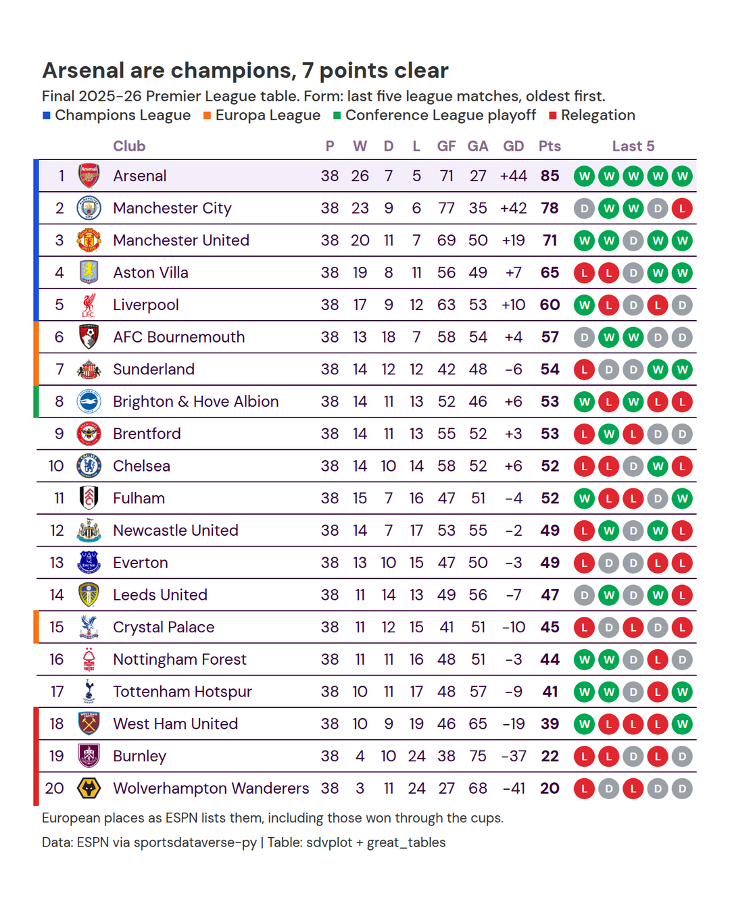

# Soccer league table

**The brief:** the season is over, and the club-football newsletter wants the final Premier League table: crests,
the usual columns, each club's last five results as form pills, and the European and relegation places marked. It
goes out 1600 px wide in the email and as a 1080 x 1350 portrait post for Instagram. The table and results are
ESPN's, through `sportsdataverse.soccer`; great_tables draws it with sdvplot's crests and Premier League theme.

```python
import tempfile
from pathlib import Path

import polars as pl
import sportsdataverse.soccer as soccer
from great_tables import GT, html, loc, style
from IPython.display import Image
from PIL import Image as PILImage

from sdvplot.great_tables import gt_row_accent, gt_save_crop, gt_sdv_logos, gt_social_crop, gt_theme_pl

LEAGUE, SEASON = "eng.1", 2025  # ESPN names a European season by the year it starts: 2025 is 2025-26
OUT = Path(tempfile.mkdtemp(prefix="sdvplot-recipe-"))  # where the exports go; use your own folder
```

## 1. Get the data

The standings call returns the final table. Form needs the results: ESPN's scoreboard takes a calendar year, so two
calls (2025 and 2026) cover the season, filtered to its slug. One row per club per match gives each club's last five
results, and the points they add up to are checked against the table.

```python
table = soccer.espn_soccer_standings(LEAGUE, season=SEASON).sort("rank")

events = []
for year in (SEASON, SEASON + 1):
    events += soccer.espn_soccer_scoreboard(LEAGUE, dates=year, limit=500, return_parsed=False)["events"]
events = [e for e in events if e["season"]["slug"].startswith(f"{SEASON}-{(SEASON + 1) % 100:02d}")]

rows = []
for e in events:
    first, second = e["competitions"][0]["competitors"]
    for me, opp in ((first, second), (second, first)):
        rows.append({"date": e["date"], "team_id": me["id"], "gf": int(me["score"]), "ga": int(opp["score"])})
results = pl.DataFrame(rows).with_columns(
    result=pl.when(pl.col("gf") > pl.col("ga"))
    .then(pl.lit("W"))
    .when(pl.col("gf") < pl.col("ga"))
    .then(pl.lit("L"))
    .otherwise(pl.lit("D"))
)
form = (
    results.sort("date")
    .group_by("team_id", maintain_order=True)
    .agg(
        form=pl.col("result").tail(5).str.join(""),
        points=pl.col("result").replace_strict({"W": 3, "D": 1, "L": 0}, return_dtype=pl.Int64).sum(),
    )
)
assert table.schema["team_id"] == form.schema["team_id"]  # ESPN ids as strings on both sides
table = table.join(form, on="team_id").sort("rank")  # a join does not promise to keep row order
assert (table["points"] == table["points_right"]).all(), "results do not add up to the table"
print(f"{len(events)} matches")
table.select("rank", "team", "points", "form", "note").head()
```

<div class="sdv-output">

```text
380 matches
```

| rank | team              | points | form  | note             |
|------|-------------------|--------|-------|------------------|
| 1.0  | Arsenal           | 85.0   | WWWWW | Champions League |
| 2.0  | Manchester City   | 78.0   | DWWDL | Champions League |
| 3.0  | Manchester United | 71.0   | WWDWW | Champions League |
| 4.0  | Aston Villa       | 65.0   | LLDWW | Champions League |
| 5.0  | Liverpool         | 60.0   | WLDLD | Champions League |

</div>

## 2. The first draft

The standings frame, straight into great_tables.

```python
GT(table)
```

<div class="sdv-output">

<iframe class="sdv-frame" src="/outputs/recipes/soccer-league-table/5_0.html" title="HTML output" height="480" loading="lazy"></iframe>

</div>

Every column ESPN sends, floats where there should be integers, and nothing a fan would recognize as a league table.

## 3. A league table's columns, with crests

Keep the columns a table reader expects (position, club, played, won, drawn, lost, goals for and against, goal
difference, points) as integers, and turn the ESPN team id into the club crest with `gt_sdv_logos`
(`league="soccer"` covers every club in ESPN's soccer index). Goal difference gets an explicit sign.

```python
counts = ["rank", "games_played", "wins", "ties", "losses", "points_for", "points_against", "points"]
league_table = table.select(
    *[pl.col(c).cast(pl.Int64) for c in counts[:1]],
    "team_id",
    "team",
    *[pl.col(c).cast(pl.Int64) for c in counts[1:]],
    gd=pl.col("point_differential").cast(pl.Int64),
    form="form",
    note=pl.col("note").fill_null(""),
)
base = (
    GT(league_table)
    .cols_hide(["form", "note"])
    .cols_move(["gd"], after="points_against")
    .pipe(gt_sdv_logos, "team_id", league="soccer", height=24)
    .cols_label(
        rank="",
        team_id="",
        team="Club",
        games_played="P",
        wins="W",
        ties="D",
        losses="L",
        points_for="GF",
        points_against="GA",
        gd="GD",
        points="Pts",
    )
    .fmt_integer("gd", force_sign=True)
    .cols_align("center", ["games_played", "wins", "ties", "losses", "points_for", "points_against", "gd", "points"])
)
base
```

<div class="sdv-output">

<iframe class="sdv-frame" src="/outputs/recipes/soccer-league-table/7_0.html" title="HTML output" height="480" loading="lazy"></iframe>

</div>

## 4. Form pills

The last five results are a string like "WWDLW". A custom `fmt` function turns each letter into a small colored
circle (green win, grey draw, red loss): great_tables inserts what a formatter returns as HTML, so a few lines of
inline CSS is all a pill needs.

```python
PILL = {"W": "#00a651", "D": "#9aa0a6", "L": "#e0262f"}


def pills(form):
    return "".join(
        f'<span style="display:inline-block;width:19px;height:19px;line-height:19px;margin:0 1.5px;'
        f"border-radius:50%;background:{PILL[r]};color:white;font-size:10px;font-weight:700;"
        f'text-align:center">{r}</span>'
        for r in form
    )


with_form = base.cols_unhide("form").fmt(pills, columns="form").cols_label(form="Last 5").cols_align("center", "form")
with_form
```

<div class="sdv-output">

<iframe class="sdv-frame" src="/outputs/recipes/soccer-league-table/9_0.html" title="HTML output" height="480" loading="lazy"></iframe>

</div>

## 5. Places, theme and headline

`gt_row_accent` draws a colored bar on the edge of each row, keyed to ESPN's `note`: Champions League, Europa
League, Conference League and relegation, the way broadcasters mark them. The bars need a key, so the subtitle
spells the colors out. `gt_theme_pl` gives the table the Premier League's typography and purple; the points column
is bold and the champion's row gets a light fill.

```python
PLACES = {
    "Champions League": "#1d4ed8",
    "Europa League": "#f97316",
    "Conference League Playoff Round": "#16a34a",
    "Relegation": "#dc2626",
}
champion, runner_up = league_table.row(0, named=True), league_table.row(1, named=True)
key = " &nbsp; ".join(
    f"<span style='color:{c}'>&#9632;</span> {name.replace(' Playoff Round', ' playoff')}" for name, c in PLACES.items()
)

final = (
    with_form.pipe(gt_row_accent, "note", palette=PLACES, width=5)
    .tab_header(
        title=f"{champion['team']} are champions, {champion['points'] - runner_up['points']} points clear",
        subtitle=html(
            f"Final {SEASON}-{(SEASON + 1) % 100:02d} Premier League table. Form: last five league "
            f"matches, oldest first.<br>{key}"
        ),
    )
    .tab_source_note("European places as ESPN lists them, including those won through the cups.")
    .tab_source_note("Data: ESPN via sportsdataverse-py  |  Table: sdvplot + great_tables")
    .tab_style(style.text(weight="bold"), loc.body(columns="points"))
    .tab_style(style.fill("#f3eefa"), loc.body(rows=[0]))
    .pipe(gt_theme_pl)
)
final
```

<div class="sdv-output">

<iframe class="sdv-frame" src="/outputs/recipes/soccer-league-table/11_0.html" title="HTML output" height="480" loading="lazy"></iframe>

</div>

## 6. Export for the newsletter and Instagram

`gt_save_crop` renders the table in headless Chrome, trims it with an even border and scales it to the email's 1600
px. Twenty rows make a tall table, so the social cut is Instagram's 4:5 portrait (1080 x 1350) from
`gt_social_crop`, which pads the canvas to the ratio instead of cropping.

```python
newsletter = gt_save_crop(final, OUT / "premier_league_1600.png", width=1600)
portrait = gt_social_crop(final, OUT / "premier_league_1080x1350.png", aspect_ratio="4:5", width=1080)
for f in (newsletter, portrait):
    print(Path(f).name, PILImage.open(f).size)
Image(portrait, width=540)
```

<div class="sdv-output">

```text
premier_league_1600.png (1600, 1880)
premier_league_1080x1350.png (1080, 1350)
```



</div>

## Run it yourself

<a href="pathname:///notebooks/recipes/soccer-league-table.ipynb" download>Download the notebook</a> (outputs cleared) or [open it on GitHub](https://github.com/sportsdataverse/sdvplot/blob/main/examples/notebooks/recipes/soccer-league-table.ipynb).
