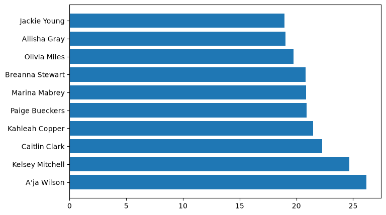
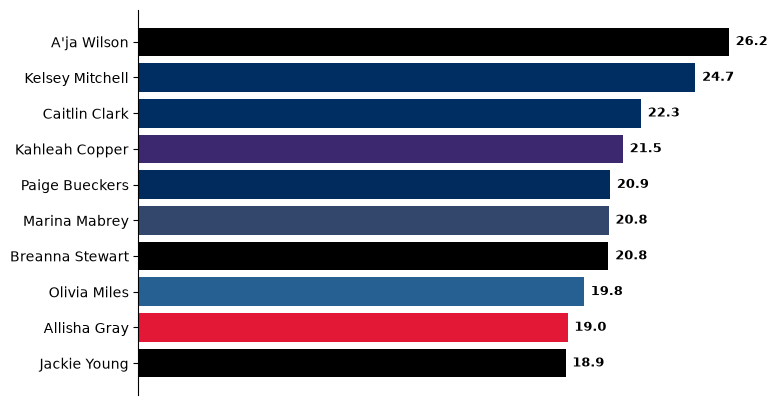
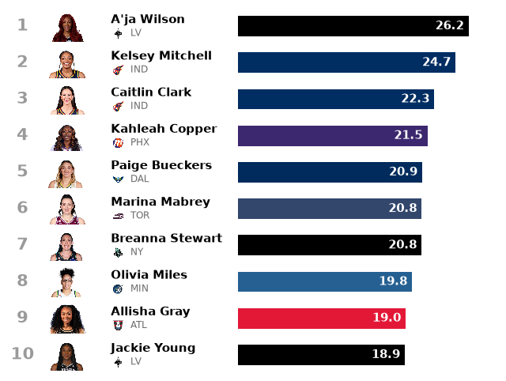
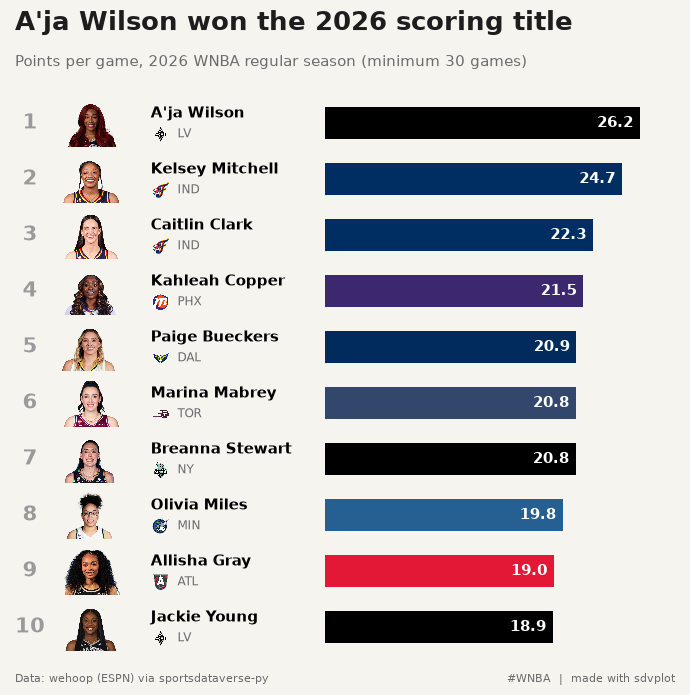
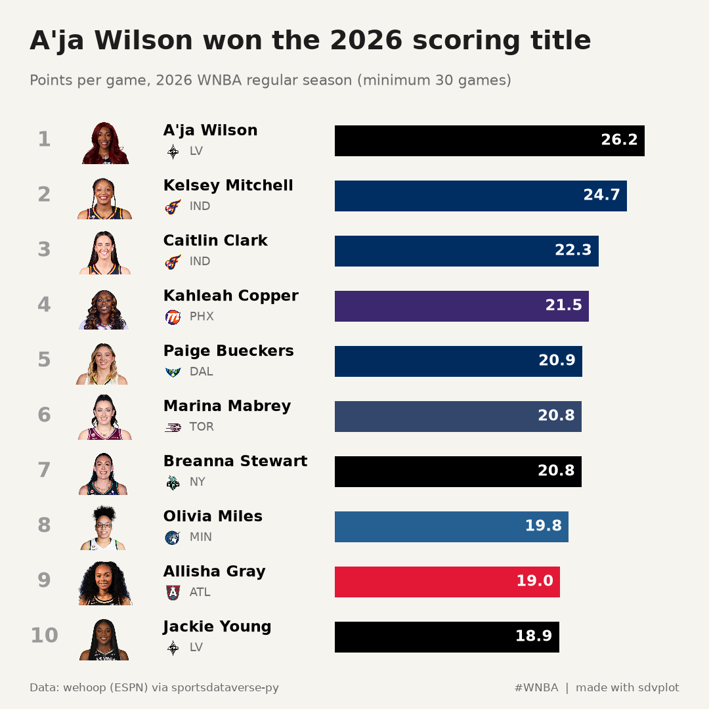
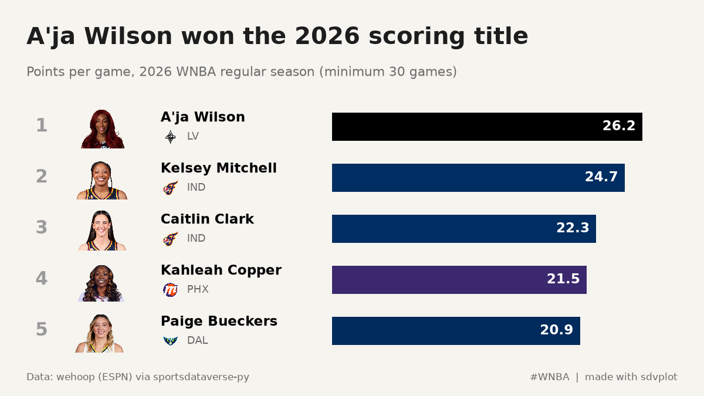

# WNBA scoring leaders card

**The brief:** the regular season just ended, and the social team wants a scoring-leaders card: the top ten in
points per game with each player's face and team, as a 1080 x 1080 image for Instagram, plus a top-five cut at
1200 x 675 for X and Bluesky. The box scores are hoopR/wehoop's ESPN data through `sportsdataverse.wnba`; the
headshots come from ESPN's CDN through `sdvplot.add_headshots`.

```python
import tempfile
from pathlib import Path

import matplotlib.pyplot as plt
import polars as pl
import sportsdataverse.wnba as wnba
from IPython.display import Image
from matplotlib.colors import to_rgb
from PIL import Image as PILImage

import sdvplot

SEASON = 2026
OUT = Path(tempfile.mkdtemp(prefix="sdvplot-recipe-"))  # where the exports go; use your own folder
```

## 1. Get the data

One row per player per game. ESPN files the All-Star Game and the Commissioner's Cup final as regular-season
games, but neither counts in the official stats; the schedule marks the standard games with `type_abbreviation`
"STD", so a semi join keeps only those. Players who did not play are dropped, the qualifier is 30 games (about 70%
of the 44-game schedule), and a player traded mid-season is listed with her last team.

```python
regular = wnba.load_wnba_schedule(seasons=[SEASON]).filter(pl.col("season_type") == 2)
print(
    regular.group_by("type_abbreviation", maintain_order=True).len().sort("type_abbreviation")
)  # STD, plus one ALLSTAR and one CC (the Cup final)
standard = regular.filter(pl.col("type_abbreviation") == "STD").select("game_id")

box = wnba.load_wnba_player_boxscore(seasons=[SEASON])
assert box.schema["game_id"] == standard.schema["game_id"]  # one dtype on both sides of the join key
box = box.join(standard, on="game_id", how="semi").filter(~pl.col("did_not_play"))
leaders = (
    box.group_by("athlete_id", "athlete_display_name", maintain_order=True)
    .agg(
        games=pl.len(),
        ppg=pl.col("points").mean(),
        team=pl.col("team_abbreviation").sort_by("game_date").last(),
    )
    .filter(pl.col("games") >= 30)
    .sort(["ppg", "athlete_display_name"], descending=[True, False])
    .head(10)
    .with_columns(rank=pl.int_range(1, pl.len() + 1))
)
leaders
```

<div class="sdv-output">

```text
| type_abbreviation | len |
|-------------------|-----|
| ALLSTAR           | 1   |
| CC                | 1   |
| STD               | 331 |
```

| athlete_id | athlete_display_name | games | ppg       | team | rank |
|------------|----------------------|-------|-----------|------|------|
| 3149391    | A'ja Wilson          | 41    | 26.170732 | LV   | 1    |
| 3142191    | Kelsey Mitchell      | 44    | 24.681818 | IND  | 2    |
| 4433403    | Caitlin Clark        | 40    | 22.275    | IND  | 3    |
| 2998938    | Kahleah Copper       | 40    | 21.475    | PHX  | 4    |
| 4433730    | Paige Bueckers       | 42    | 20.904762 | DAL  | 5    |
| 3904576    | Marina Mabrey        | 32    | 20.84375  | TOR  | 6    |
| 2998928    | Breanna Stewart      | 42    | 20.833333 | NY   | 7    |
| 4433791    | Olivia Miles         | 40    | 19.75     | MIN  | 8    |
| 3058901    | Allisha Gray         | 44    | 19.022727 | ATL  | 9    |
| 4065870    | Jackie Young         | 43    | 18.930233 | LV   | 10   |

</div>

## 2. The first draft

A horizontal bar chart is the right shape for a ranked list of names.

```python
fig, ax = plt.subplots(figsize=(8, 5))
ax.barh(leaders["athlete_display_name"], leaders["ppg"])
plt.show()
```

<div class="sdv-output">



</div>

The leader is at the bottom (`barh` draws the first row lowest), every bar is the same blue, the exact values are
missing, and nothing says what or when.

## 3. Order, team colors and values

Inverting the y axis puts No. 1 on top. Each bar takes its team's color, with one catch: a few primaries (the Aces'
silver, the Liberty's seafoam) are too light to read on a light card, so a small WCAG luminance check swaps those to
the team's secondary color. The values go at the end of each bar, which makes the x axis unnecessary.

```python
def luminance(color):
    """WCAG relative luminance, 0 (black) to 1 (white)."""
    r, g, b = (c / 12.92 if c <= 0.03928 else ((c + 0.055) / 1.055) ** 2.4 for c in to_rgb(color))
    return 0.2126 * r + 0.7152 * g + 0.0722 * b


primary = sdvplot.team_colors("wnba", leaders["team"])
secondary = sdvplot.team_colors("wnba", leaders["team"], which="secondary")
leaders = leaders.with_columns(
    color=pl.Series([p if luminance(p) < 0.3 else s for p, s in zip(primary, secondary, strict=True)])
)

fig, ax = plt.subplots(figsize=(8, 5))
ax.barh(leaders["athlete_display_name"], leaders["ppg"], color=leaders["color"])
ax.invert_yaxis()
for y, v in enumerate(leaders["ppg"]):
    ax.text(v + 0.3, y, f"{v:.1f}", va="center", fontsize=9, fontweight="bold")
ax.xaxis.set_visible(False)
ax.spines[["top", "right", "bottom"]].set_visible(False)
plt.show()
```

<div class="sdv-output">



</div>

## 4. Faces and logos

A card like this sells on faces. Moving to a blank canvas (an axes with fixed 0-100 x coordinates and one unit per
row) makes room for a column of headshots and a small team logo under each name. `add_headshots` and `add_logos`
size their images as a fraction of the axes height, so with ten rows a headshot of 0.085 fills most of a row.

```python
def rows(ax, data, bar_from=47, bar_to=94):
    """Ranked rows on a 0-100 canvas: rank, headshot, name, team logo and a bar with its value."""
    n = data.height
    ax.set(xlim=(0, 100), ylim=(n + 0.5, 0.5))
    ax.axis("off")
    face, logo = 0.85 / n, 0.32 / n  # image heights as a fraction of the axes: most of a row, a third of one
    sdvplot.add_headshots(ax, [12] * n, data["rank"], data["athlete_id"], league="wnba", height=face)
    sdvplot.add_logos(ax, [22.5] * n, data["rank"] + 0.2, data["team"], league="wnba", season=SEASON, height=logo)
    scale = (bar_to - bar_from) / data["ppg"].max()
    for row in data.iter_rows(named=True):
        y = row["rank"]
        ax.text(3, y, str(row["rank"]), ha="center", va="center", fontsize=15, fontweight="bold", color="#9a9a9a")
        ax.text(21, y - 0.17, row["athlete_display_name"], va="center", fontsize=11, fontweight="bold")
        ax.text(25, y + 0.2, row["team"], va="center", fontsize=8.5, color="#6b6b6b")
        ax.barh(y, row["ppg"] * scale, left=bar_from, height=0.56, color=row["color"])
        ax.text(
            bar_from + row["ppg"] * scale - 1,
            y,
            f"{row['ppg']:.1f}",
            ha="right",
            va="center",
            fontsize=11,
            fontweight="bold",
            color="white",
        )


fig, ax = plt.subplots(figsize=(8, 6))
rows(ax, leaders)
plt.show()
```

<div class="sdv-output">



</div>

## 5. Make it a card

The finishing pass is the frame: a warm off-white background, the headline as the title (the stat goes in the
subtitle), the qualifier stated, and a footer with the source. Everything is placed in inches from the edges, so the
same function draws the square post and a wider one.

```python
BG, INK, GREY = "#f6f4ef", "#1d1d1d", "#6b6b6b"


def card(data, figsize, dpi=100):
    w, h = figsize
    fig = plt.figure(figsize=figsize, dpi=dpi, facecolor=BG)
    top, bottom = 1.15, 0.45  # inches for the header and the footer
    ax = fig.add_axes((0.25 / w, bottom / h, 1 - 0.5 / w, 1 - (top + bottom) / h), facecolor=BG)
    rows(ax, data)
    leader = data.row(0, named=True)
    fig.text(
        0.3 / w,
        1 - 0.3 / h,
        f"{leader['athlete_display_name']} won the {SEASON} scoring title",
        fontsize=19,
        fontweight="bold",
        color=INK,
        va="top",
    )
    fig.text(
        0.3 / w,
        1 - 0.75 / h,
        f"Points per game, {SEASON} WNBA regular season (minimum 30 games)",
        fontsize=10.5,
        color=GREY,
        va="top",
    )
    fig.text(0.3 / w, 0.18 / h, "Data: wehoop (ESPN) via sportsdataverse-py", fontsize=8, color=GREY)
    fig.text(1 - 0.3 / w, 0.18 / h, "#WNBA  |  made with sdvplot", fontsize=8, color=GREY, ha="right")
    return fig


fig = card(leaders, (7.2, 7.2))
plt.show()
```

<div class="sdv-output">



</div>

## 6. Export for Instagram and X

The square holds all ten. The 16:9 post for X and Bluesky is too short for ten readable rows, so it gets the top
five from the same function: changing the content to fit the format beats shrinking the type. Inches times dpi
gives the exact pixels.

```python
exports = {
    "wnba_scoring_1080x1080.png": card(leaders, (7.2, 7.2), dpi=150),
    "wnba_scoring_top5_1200x675.png": card(leaders.head(5), (8, 4.5), dpi=150),
}
for name, fig in exports.items():
    fig.savefig(OUT / name, dpi=150, facecolor=BG)
    plt.close(fig)
    print(name, PILImage.open(OUT / name).size)
Image(OUT / "wnba_scoring_1080x1080.png", width=600)
```

<div class="sdv-output">

```text
wnba_scoring_1080x1080.png (1080, 1080)
wnba_scoring_top5_1200x675.png (1200, 675)
```



</div>

The top-five cut for X and Bluesky:

```python
Image(OUT / "wnba_scoring_top5_1200x675.png", width=700)
```

<div class="sdv-output">



</div>

## Run it yourself

<a href="pathname:///notebooks/recipes/wnba-scoring-leaders-card.ipynb" download>Download the notebook</a> (outputs cleared) or [open it on GitHub](https://github.com/sportsdataverse/sdvplot/blob/main/examples/notebooks/recipes/wnba-scoring-leaders-card.ipynb).
