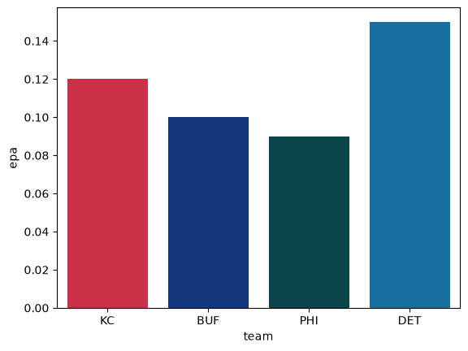

# Team colors

`palette` and `team_colors` give you colors keyed by team, so a chart can be colored without hand-picking hex codes.

```python
import sdvplot
```

```python
import polars as pl

df = pl.DataFrame({"team": ["KC", "BUF", "PHI", "DET"], "epa": [0.12, 0.10, 0.09, 0.15]})
df
```

<div class="sdv-output">

| team | epa  |
|------|------|
| KC   | 0.12 |
| BUF  | 0.1  |
| PHI  | 0.09 |
| DET  | 0.15 |

</div>

## A palette for seaborn

`palette` accepts a polars Series of abbreviations, so it can be passed straight to seaborn.

```python
import matplotlib.pyplot as plt
import seaborn as sns

sns.barplot(
    df.to_pandas(),
    x="team",
    y="epa",
    hue="team",
    palette=sdvplot.palette("nfl", teams=df["team"]),
    legend=False,
)
plt.show()
```

<div class="sdv-output">



</div>

## One color per team

`team_colors` returns one color per team, in the order given. `which="secondary"` picks the secondary color.

```python
sdvplot.team_colors("nfl", df["team"], which="secondary")
```

<div class="sdv-output">

```text
shape: (4,)
Series: 'team' [str]
[
	"#ffb612"
	"#c60c30"
	"#a5acaf"
	"#b0b7bc"
]
```

</div>

## Other libraries

The palette is a plain dict of `team -> hex`, so other libraries take it directly (not executed here).

Plotly:

```python
import plotly.express as px

px.bar(df.to_pandas(), x="team", y="epa", color="team",
       color_discrete_map=sdvplot.palette("nfl", teams=df["team"]))
```

Altair:

```python
import altair as alt

p = sdvplot.palette("nfl", teams=df["team"])
alt.Chart(df.to_pandas()).mark_bar().encode(
    x="team", y="epa", color=alt.Color("team", scale=alt.Scale(domain=list(p), range=list(p.values()))),
)
```

## Fallback colors

Not every league has official colors. Where none exist, `color_source` is `"fallback"` and the color is one from a
colorblind-safe categorical palette that only keeps teams distinguishable. Check `color_source` before treating a color as a team's own.
Every OHL team below is a fallback; every NFL team has colors from nflverse.

```python
sdvplot.teams("ohl").select("team_id", "name", "color_primary", "color_source").head()
```

<div class="sdv-output">

| team_id | name               | color_primary | color_source |
|---------|--------------------|---------------|--------------|
| 1       | Brantford Bulldogs | #76b7b2       | fallback     |
| 10      | Kitchener Rangers  | #b07aa1       | fallback     |
| 11      | Owen Sound Attack  | #bab0ac       | fallback     |
| 12      | Sudbury Wolves     | #76b7b2       | fallback     |
| 13      | Flint Firebirds    | #f28e2b       | fallback     |

</div>

## Run it yourself

<a href="pathname:///notebooks/02_colors.ipynb" download>Download the notebook</a> (outputs cleared) or [open it on GitHub](https://github.com/sportsdataverse/sdvplot/blob/main/examples/notebooks/02_colors.ipynb).
