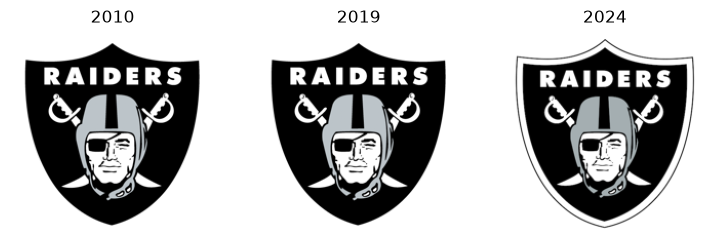
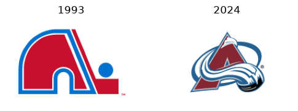

# Logos and eras

A franchise changes marks over time. `logo_url` and `logo_image` take a `season` and return the mark in use that
year.

```python
import sdvplot
```

```python
sdvplot.logo_url("LV", "nfl"), sdvplot.logo_url("OAK", "nfl", season=2010)
```

<div class="sdv-output">

```text
('https://sdv.nyc3.cdn.digitaloceanspaces.com/assets/public/sha256/25/25fbb03e972ae872fa024026b73c7b63ef9f23c2f2c51f87d1614d800dcee6e7.png',
 'https://sdv.nyc3.cdn.digitaloceanspaces.com/assets/public/sha256/94/94de716ea6d3859effbfbc0966c8327eefc0a004e0d2f16c77ca80b58fd95eaa.png')
```

</div>

## The marks table

The marks table lists every mark with the seasons it is valid for. Sorted by `valid_from`, the dated Oakland-era marks
(1960-2019) come first; marks with no dates are the current ones.

```python
(
    sdvplot.marks("LV", "nfl")
    .sort("valid_from", nulls_last=True)
    .select("entity_name", "variant", "mark_type", "valid_from", "valid_to", "source")
    .head(8)
)
```

<div class="sdv-output">

| entity_name       | variant                       | mark_type | valid_from | valid_to | source   |
|-------------------|-------------------------------|-----------|------------|----------|----------|
| OAK               | dark                          | logo      | 1960       | 2019     | espn     |
| OAK               | default                       | logo      | 1960       | 2019     | espn     |
| Oakland Raiders   | squared                       | logo      | 1960       | 2019     | nflverse |
| Oakland Raiders   | default                       | wordmark  | 1960       | 2019     | nflverse |
| Las Vegas Raiders | primary_logo_on_white_color   | logo      | null       | null     | espn     |
| Las Vegas Raiders | secondary_logo_on_white_color | logo      | null       | null     | espn     |
| Las Vegas Raiders | primary_logo_white            | logo      | null       | null     | espn     |
| Las Vegas Raiders | secondary_logo_white          | logo      | null       | null     | espn     |

</div>

## Logos by season

`logo_image` returns a PIL image (or `None` when no mark exists), so it drops straight into `imshow`. Here are the Raiders in 2010, 2019 and 2024.

```python
import matplotlib.pyplot as plt

fig, axes = plt.subplots(1, 3, figsize=(9, 3))
for ax, s in zip(axes, (2010, 2019, 2024), strict=True):
    ax.imshow(sdvplot.logo_image("LV", "nfl", season=s, size=200))
    ax.set_title(str(s))
    ax.axis("off")
plt.show()
```

<div class="sdv-output">



</div>

2010 and 2019 are the same Oakland mark (valid 1960-2019); the Las Vegas mark starts after that.

## SVG marks

NHL marks are SVGs, rasterized by the `svg` extra. The Avalanche moved from Quebec in 1995, so 1993 is the Nordiques mark.

```python
fig, axes = plt.subplots(1, 2, figsize=(6, 3))
for ax, s in zip(axes, (1993, 2024), strict=True):
    ax.imshow(sdvplot.logo_image("COL", "nhl", season=s, size=200))
    ax.set_title(str(s))
    ax.axis("off")
plt.show()
```

<div class="sdv-output">



</div>

## How era selection works

Each mark carries `valid_from` / `valid_to` seasons (inclusive), or none. With a `season`, sdvplot picks, within the
requested variant, a mark with explicit dates that cover the season first, then an undated mark, and only then any
other row. Without a `season` you get the current (undated) mark. See [Seasons and eras](../concepts/seasons-and-eras.md) for the full rules.

## Run it yourself

<a href="pathname:///notebooks/03_logos_and_seasons.ipynb" download>Download the notebook</a> (outputs cleared) or [open it on GitHub](https://github.com/sportsdataverse/sdvplot/blob/main/examples/notebooks/03_logos_and_seasons.ipynb).
