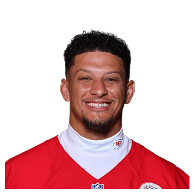

# Headshots

`headshot_url` builds a player headshot url from an id. ESPN athlete ids work directly; other id systems are
translated through a table (for NFL, nflverse's gsis ids).

```python
import sdvplot
```

## Headshot urls

An ESPN athlete id works as is; an NFL gsis id goes through the nflverse player table.

```python
sdvplot.headshot_url(3139477, "nfl")
```

<div class="sdv-output">

```text
'https://a.espncdn.com/combiner/i?img=/i/headshots/nfl/players/full/3139477.png'
```

</div>

```python
sdvplot.headshot_url("00-0033873", "nfl", id_system="gsis")
```

<div class="sdv-output">

```text
'https://static.www.nfl.com/image/upload/t_headshot_desktop/f_auto/league/wdckwtob1lybvkmxnf7p.png'
```

</div>

## Show a headshot

The url is an ordinary image link. Here the gsis one is downloaded and shown.

```python
import io

import matplotlib.pyplot as plt
import requests
from PIL import Image

url = sdvplot.headshot_url("00-0033873", "nfl", id_system="gsis")
img = Image.open(io.BytesIO(requests.get(url, timeout=30).content))
plt.imshow(img)
plt.axis("off")
plt.show()
```

<div class="sdv-output">



</div>

## Other leagues

Other leagues use their ESPN athlete id the same way, for example a men's college basketball player:

```python
sdvplot.headshot_url(4433134, "mbb")
```

## Run it yourself

<a href="pathname:///notebooks/04_headshots.ipynb" download>Download the notebook</a> (outputs cleared) or [open it on GitHub](https://github.com/sportsdataverse/sdvplot/blob/main/examples/notebooks/04_headshots.ipynb).
