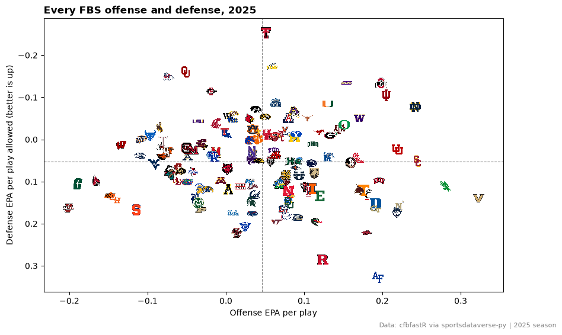
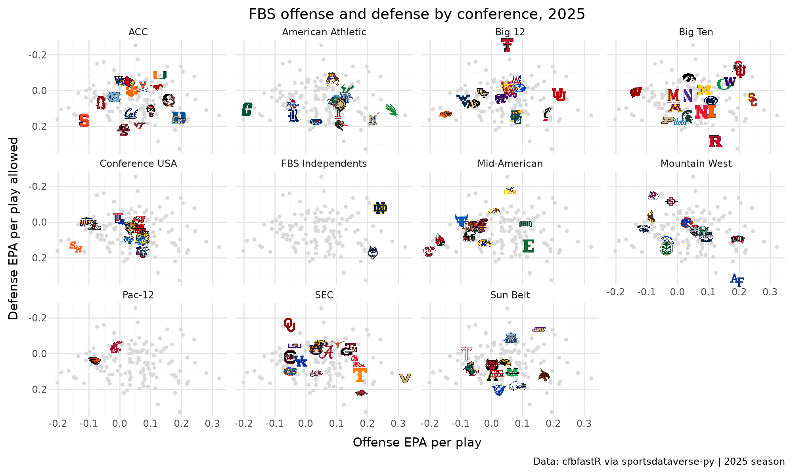
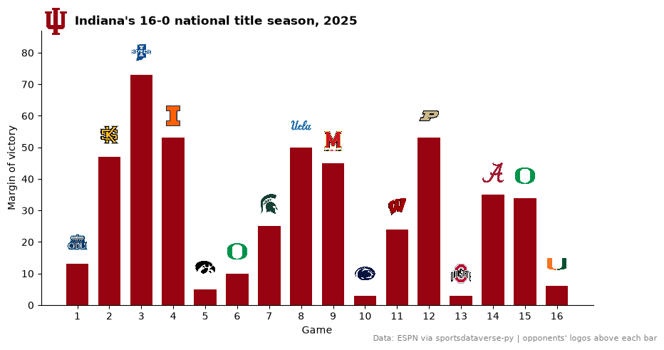
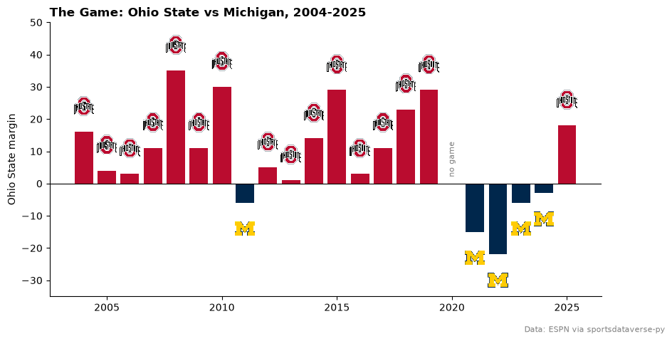
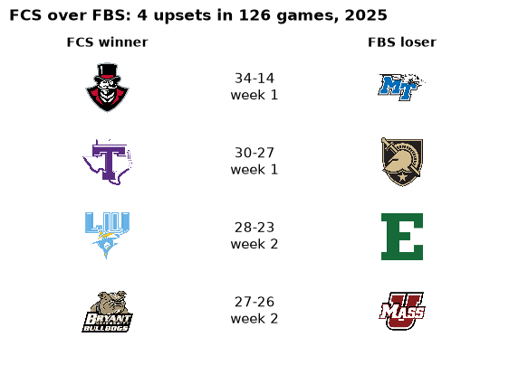
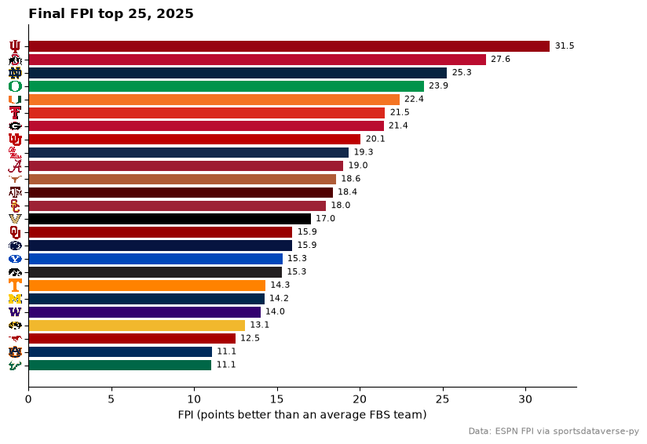
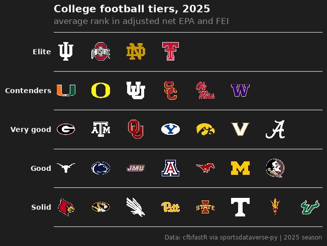

# College football

Nine charts and tables from the 2025 college football season: all 136 FBS teams on one scatter, conference small
multiples, a conference standings table, the national champion's season, a rivalry, FCS upsets, an interactive
Altair chart, a ranked bar chart and a tier list. The data comes from the cfbfastR releases and ESPN through
`sportsdataverse.cfb`.

```python
import matplotlib.pyplot as plt
import polars as pl
import sportsdataverse.cfb as cfb

import sdvplot

SEASON = 2025
CAPTION = f"Data: cfbfastR via sportsdataverse-py | {SEASON} season"

# sdvplot team ids are strings: cast the loaders' integer ESPN ids once, here
summaries = cfb.load_cfb_team_summaries([SEASON]).select(
    pl.col("team_id").cast(pl.Utf8), "pos_team", "conference", "EPAplay_off", "EPAplay_def"
)
schedule = cfb.load_cfb_schedule([SEASON]).with_columns(pl.col("home_id", "away_id").cast(pl.Utf8))
names = sdvplot.teams("cfb").select("team_id", school="short_name")
summaries.height, schedule.height
```

<div class="sdv-output">

```text
(136, 3831)
```

</div>

## 1. All 136 FBS teams on one chart

Offensive EPA per play against defensive EPA per play allowed, from the cfbfastR team summaries. With this many
teams the logos have to be small: `height=0.045` makes each one 4.5% of the plot's height.

```python
fig, ax = plt.subplots(figsize=(10, 6))
ax.axvline(summaries["EPAplay_off"].mean(), color="grey", lw=0.8, ls="--")
ax.axhline(summaries["EPAplay_def"].mean(), color="grey", lw=0.8, ls="--")
ax.scatter(summaries["EPAplay_off"], summaries["EPAplay_def"], s=0)
ax.margins(0.06)
sdvplot.add_logos(
    ax,
    summaries["EPAplay_off"],
    summaries["EPAplay_def"],
    summaries["team_id"],
    league="cfb",
    season=SEASON,
    height=0.045,
)
ax.invert_yaxis()
ax.set(xlabel="Offense EPA per play", ylabel="Defense EPA per play allowed (better is up)")
ax.set_title(f"Every FBS offense and defense, {SEASON}", loc="left", fontweight="bold")
fig.text(0.99, 0.01, CAPTION, ha="right", fontsize=8, color="grey")
plt.show()
```

<div class="sdv-output">



</div>

## 2. Conference small multiples with plotnine

The same data, one panel per conference: every FBS team as a grey dot behind, the conference's own teams as logos.
The grey layer gets a copy of the data without the `conference` column, so plotnine repeats it in every panel.

```python
from plotnine import aes, facet_wrap, geom_point, ggplot, labs, scale_y_reverse, theme, theme_minimal

from sdvplot.plotnine import geom_sdv_logos

(
    ggplot(summaries.to_pandas(), aes("EPAplay_off", "EPAplay_def"))
    + geom_point(data=summaries.drop("conference").to_pandas(), color="#d9d9d9", size=1)
    + geom_sdv_logos(aes(team="team_id"), league="cfb", season=SEASON, height=0.13)
    + facet_wrap("conference", ncol=4)
    + scale_y_reverse()
    + labs(
        x="Offense EPA per play",
        y="Defense EPA per play allowed",
        title=f"FBS offense and defense by conference, {SEASON}",
        caption=CAPTION,
    )
    + theme_minimal()
    + theme(figure_size=(10, 6))
)
```

<div class="sdv-output">



</div>

## 3. A conference standings table

Big Ten records built from the schedule: conference games and all games through the regular season (the title game
and bowls left out). `gt_sdv_logos` turns the id column into logos and `gt_fmt_tally` writes each pair of win and
loss columns as one record.

```python
from great_tables import GT

from sdvplot.great_tables import gt_fmt_tally, gt_sdv_logos, gt_theme_athletic

regular = schedule.filter(pl.col("completed"), pl.col("season_type") == "regular", pl.col("week") <= 14)
sides = pl.concat(
    [
        regular.select(
            "conference_game", team_id="home_id", conf="home_conference", pf="home_points", pa="away_points"
        ),
        regular.select(
            "conference_game", team_id="away_id", conf="away_conference", pf="away_points", pa="home_points"
        ),
    ]
).with_columns(win=pl.col("pf") > pl.col("pa"))

big_ten = (
    sides.filter(pl.col("conf") == "Big Ten")
    .group_by("team_id", maintain_order=True)
    .agg(
        conf_w=(pl.col("win") & pl.col("conference_game")).sum(),
        conf_l=(~pl.col("win") & pl.col("conference_game")).sum(),
        w=pl.col("win").sum(),
        l=(~pl.col("win")).sum(),
        pf=pl.col("pf").sum(),
        pa=pl.col("pa").sum(),
    )
    .join(names, on="team_id")
    .sort(["conf_w", "w", "pf"], descending=True)
    .select("team_id", "school", "conf_w", "conf_l", "w", "l", "pf", "pa")
)

(
    GT(big_ten)
    .pipe(gt_sdv_logos, "team_id", league="cfb", season=SEASON, height=24)
    .pipe(gt_fmt_tally, ["conf_w", "conf_l"], label="Conf")
    .pipe(gt_fmt_tally, ["w", "l"], label="Overall")
    .cols_label(team_id="", school="", pf="PF", pa="PA")
    .tab_header(title=f"Big Ten standings, {SEASON}", subtitle="Regular season, before the title game")
    .tab_source_note(CAPTION)
    .pipe(gt_theme_athletic, density="compact")
)
```

<div class="sdv-output">

<iframe class="sdv-frame" src="/outputs/tutorials/leagues/cfb/7_0.html" title="HTML output" height="480" loading="lazy"></iframe>

</div>

## 4. The national champion's season, with a logo in the title

Indiana went 16-0. Each bar is one game's margin in Indiana's primary color, the opponent's logo above it, and
`title_image` puts the Indiana logo beside the title. `resolve` turns the school name into its id.

```python
from sdvplot.matplotlib import title_image

team = sdvplot.resolve("Indiana", "cfb")
games = (
    schedule.filter(pl.col("completed"), (pl.col("home_id") == team) | (pl.col("away_id") == team))
    .sort("start_date")
    .with_columns(
        home=pl.col("home_id") == team,
        opponent=pl.when(pl.col("home_id") == team).then("away_id").otherwise("home_id"),
    )
    .with_columns(
        margin=pl.when(pl.col("home"))
        .then(pl.col("home_points") - pl.col("away_points"))
        .otherwise(pl.col("away_points") - pl.col("home_points"))
    )
)
game_no = list(range(1, games.height + 1))

fig, ax = plt.subplots(figsize=(10, 5))
ax.bar(game_no, games["margin"], color=sdvplot.team_colors("cfb", team), width=0.7)
sdvplot.add_logos(ax, game_no, games["margin"] + 7, games["opponent"], league="cfb", season=SEASON, height=0.08)
ax.set_ylim(0, games["margin"].max() + 14)
ax.set_xticks(game_no)
ax.set(xlabel="Game", ylabel="Margin of victory")
ax.spines[["top", "right"]].set_visible(False)
record = f"{(games['margin'] > 0).sum()}-{(games['margin'] < 0).sum()}"
title_image(
    ax,
    team,
    f"Indiana's {record} national title season, {SEASON}",
    league="cfb",
    season=SEASON,
    height=30,
    loc="left",
    fontweight="bold",
)
fig.text(
    0.99,
    0.01,
    "Data: ESPN via sportsdataverse-py | opponents' logos above each bar",
    ha="right",
    fontsize=8,
    color="grey",
)
plt.show()
```

<div class="sdv-output">



</div>

## 5. A rivalry, season by season

Ohio State against Michigan since 2004 (`load_cfb_schedule` for 22 seasons). Each bar is the margin from Ohio
State's side, colored for the winner, with the winner's logo at the end of the bar.

```python
osu, mich = sdvplot.resolve(["Ohio State", "Michigan"], "cfb")
history = cfb.load_cfb_schedule(list(range(2004, SEASON + 1))).with_columns(pl.col("home_id", "away_id").cast(pl.Utf8))
rivalry = (
    history.filter(pl.col("home_id").is_in([osu, mich]), pl.col("away_id").is_in([osu, mich]), pl.col("completed"))
    .with_columns(
        osu_margin=pl.when(pl.col("home_id") == osu)
        .then(pl.col("home_points") - pl.col("away_points"))
        .otherwise(pl.col("away_points") - pl.col("home_points"))
    )
    .with_columns(winner=pl.when(pl.col("osu_margin") > 0).then(pl.lit(osu)).otherwise(pl.lit(mich)))
    .sort("season")
)

fig, ax = plt.subplots(figsize=(10, 5))
ax.bar(rivalry["season"], rivalry["osu_margin"], color=sdvplot.team_colors("cfb", rivalry["winner"]).to_list())
tip = rivalry["osu_margin"] + pl.Series([8 if m > 0 else -8 for m in rivalry["osu_margin"]])
sdvplot.add_logos(ax, rivalry["season"], tip, rivalry["winner"], league="cfb", season=SEASON, height=0.08)
ax.axhline(0, color="black", lw=0.8)
ax.text(2020, 2, "no game", ha="center", fontsize=8, color="grey", rotation=90, va="bottom")
ax.set_ylim(-35, 50)
ax.set(ylabel="Ohio State margin")
ax.spines[["top", "right"]].set_visible(False)
ax.set_title("The Game: Ohio State vs Michigan, 2004-2025", loc="left", fontweight="bold")
fig.text(0.99, 0.01, "Data: ESPN via sportsdataverse-py", ha="right", fontsize=8, color="grey")
plt.show()
```

<div class="sdv-output">



</div>

## 6. FBS, FCS and the schools sdvplot does not know

The index has every FBS and FCS program and most of Division II and III. The 2025 schedule also lists opponents
outside the NCAA divisions (NAIA schools, mostly); most of those do not resolve, and sdvplot says so in one warning
instead of guessing.

```python
import warnings

opponents = pl.concat(
    [
        schedule.select(team_id="home_id", division="home_division"),
        schedule.select(team_id="away_id", division="away_division"),
    ]
).unique("team_id", maintain_order=True)

with warnings.catch_warnings(record=True) as caught:
    warnings.simplefilter("always")
    resolved = sdvplot.resolve(opponents["team_id"], "cfb")
print(str(caught[0].message)[:160], "...")

(
    opponents.with_columns(found=resolved.is_not_null())
    .group_by("division", maintain_order=True)
    .agg(teams=pl.len(), in_sdvplot=pl.col("found").sum())
    .sort("teams", descending=True)
)
```

<div class="sdv-output">

```text
33 value(s) did not resolve to a cfb team: '15' (unknown), '2366' (unknown), '127991' (unknown), '110254' (unknown), '2395' (unknown), '2939' (unknown), '108358 ...
```

| division | teams | in_sdvplot |
|----------|-------|------------|
| iii      | 240   | 237        |
| ii       | 162   | 158        |
| fbs      | 136   | 136        |
| fcs      | 129   | 129        |
| null     | 32    | 6          |

</div>

FCS teams have their own logos and colors, so an FCS-over-FBS upset draws like any other game. In 2025 the FCS won
four of its games against FBS teams:

```python
cross = schedule.filter(
    pl.col("completed"),
    pl.concat_list("home_division", "away_division").list.sort() == ["fbs", "fcs"],
)
fcs_home = pl.col("home_division") == "fcs"
upsets = cross.filter(pl.when(fcs_home).then("home_winner").otherwise("away_winner")).select(
    winner=pl.when(fcs_home).then("home_id").otherwise("away_id"),
    loser=pl.when(fcs_home).then("away_id").otherwise("home_id"),
    score=pl.format(
        "{}-{}", pl.max_horizontal("home_points", "away_points"), pl.min_horizontal("home_points", "away_points")
    ),
    week="week",
)

rows = list(range(upsets.height, 0, -1))
fig, ax = plt.subplots(figsize=(7, 4.5))
ax.set(xlim=(0, 1), ylim=(0.4, upsets.height + 0.6))
ax.axis("off")
sdvplot.add_logos(ax, [0.2] * upsets.height, rows, upsets["winner"], league="cfb", season=SEASON, height=0.17)
sdvplot.add_logos(ax, [0.8] * upsets.height, rows, upsets["loser"], league="cfb", season=SEASON, height=0.17)
for y, row in zip(rows, upsets.iter_rows(named=True), strict=True):
    ax.text(0.5, y, f"{row['score']}\nweek {row['week']}", ha="center", va="center", fontsize=11)
ax.text(0.2, upsets.height + 0.55, "FCS winner", ha="center", fontweight="bold")
ax.text(0.8, upsets.height + 0.55, "FBS loser", ha="center", fontweight="bold")
ax.set_title(
    f"FCS over FBS: {upsets.height} upsets in {cross.height} games, {SEASON}", loc="left", fontweight="bold", pad=18
)
plt.show()
```

<div class="sdv-output">



</div>

## 7. An interactive Altair chart

The cfbfastR opponent-adjusted ratings (`load_cfb_ratings`) as an Altair chart with tooltips. `add_logos` layers the
logos onto the chart; the transparent points underneath carry the tooltips.

```python
import altair as alt

ratings = (
    cfb.load_cfb_ratings([SEASON])
    .with_columns(pl.col("team_id").cast(pl.Utf8))
    .join(names, on="team_id")
    .select("team_id", "school", "adj_off_epa", "adj_def_epa", "adj_net", "net_rank")
)

points = (
    alt.Chart(ratings.to_pandas())
    .mark_circle(size=250, opacity=0)
    .encode(
        x=alt.X("adj_off_epa", title="Adjusted offense EPA per play"),
        y=alt.Y("adj_def_epa", title="Adjusted defense EPA per play (better is up)", scale=alt.Scale(reverse=True)),
        tooltip=["school", "net_rank", alt.Tooltip("adj_net", format=".3f")],
    )
    .properties(width=640, height=440, title=f"Opponent-adjusted FBS ratings, {SEASON}")
)
sdvplot.add_logos(
    points, ratings["adj_off_epa"], ratings["adj_def_epa"], ratings["team_id"], league="cfb", season=SEASON, height=0.05
)
```

<div class="sdv-output">

<iframe class="sdv-frame" src="/outputs/tutorials/leagues/cfb/17_0.html" title="HTML output" height="480" loading="lazy"></iframe>

</div>

## 8. A ranked bar chart with logos on the y axis

ESPN's final 2025 FPI (`load_cfb_fpi_weekly`, the snapshot after the title game), top 25. The bars use the teams'
ESPN colors and `axis_logos(ax, "y")` replaces the team ids on the axis.

```python
fpi = cfb.load_cfb_fpi_weekly([SEASON]).filter(pl.col("season_type") == 3)
top = (
    fpi.select(pl.col("team_id").cast(pl.Utf8), "fpi")
    .sort("fpi", descending=True)
    .head(25)
    .reverse()  # barh draws from the bottom up, so number one ends on top
)

fig, ax = plt.subplots(figsize=(9, 6))
ax.barh(top["team_id"], top["fpi"], color=sdvplot.team_colors("cfb", top["team_id"]).to_list())
for y, value in enumerate(top["fpi"]):
    ax.text(value + 0.3, y, f"{value:.1f}", va="center", fontsize=8)
sdvplot.axis_logos(ax, "y", league="cfb", season=SEASON, height=0.04)
ax.spines[["top", "right"]].set_visible(False)
ax.set_xlabel("FPI (points better than an average FBS team)")
ax.set_title(f"Final FPI top 25, {SEASON}", loc="left", fontweight="bold")
fig.text(0.99, 0.01, "Data: ESPN FPI via sportsdataverse-py", ha="right", fontsize=8, color="grey")
plt.show()
```

<div class="sdv-output">



</div>

## 9. Tiers of a ranking you compute

A composite ranking: the average of each team's rank in two systems, cfbfastR's adjusted net EPA and FEI. The top
32 go into five tiers with `team_tiers`, on its default dark theme: it draws each school's dark-background logo, so
Ohio State, Texas A&M and Penn State stay visible.

```python
from sdvplot.matplotlib import team_tiers

composite = (
    cfb.load_cfb_ratings([SEASON])
    .with_columns(pl.col("team_id").cast(pl.Utf8), score=(pl.col("net_rank") + pl.col("fei_net_rank")) / 2)
    .sort("score", "net_rank", "team_id")
    .head(32)
)
sizes = [4, 6, 7, 7, 8]  # teams per tier, top to bottom
composite = composite.with_columns(tier_no=pl.Series([tier for tier, n in enumerate(sizes, start=1) for _ in range(n)]))

fig = team_tiers(
    composite.select("tier_no", team="team_id"),
    "cfb",
    title=f"College football tiers, {SEASON}",
    subtitle="average rank in adjusted net EPA and FEI",
    caption=CAPTION,
    alpha=1,
    tier_desc={1: "Elite", 2: "Contenders", 3: "Very good", 4: "Good", 5: "Solid"},
)
plt.show()
```

<div class="sdv-output">



</div>

## Run it yourself

<a href="pathname:///notebooks/leagues/cfb.ipynb" download>Download the notebook</a> (outputs cleared) or [open it on GitHub](https://github.com/sportsdataverse/sdvplot/blob/main/examples/notebooks/leagues/cfb.ipynb).
