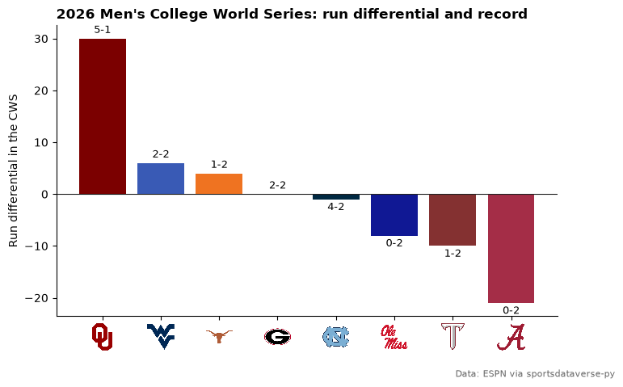
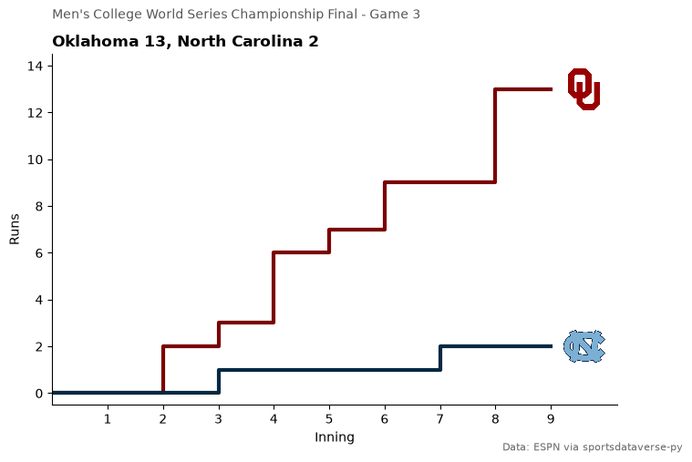
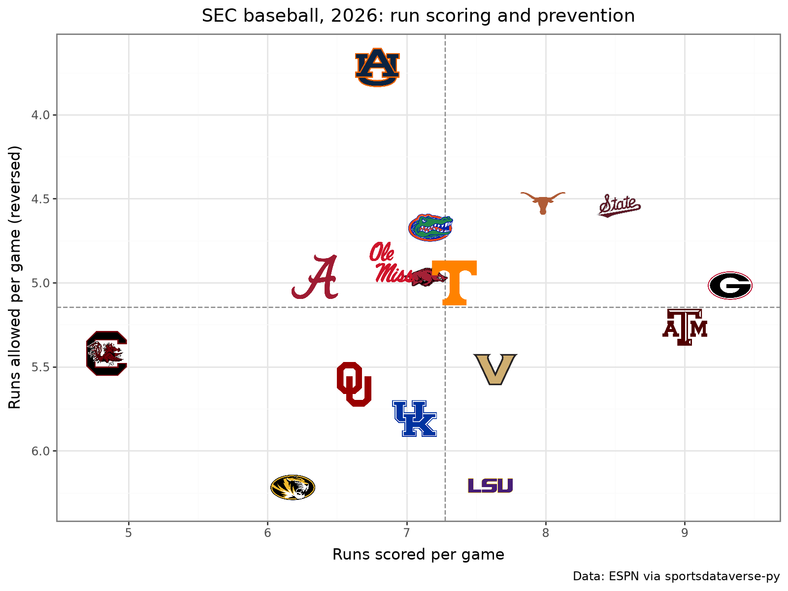
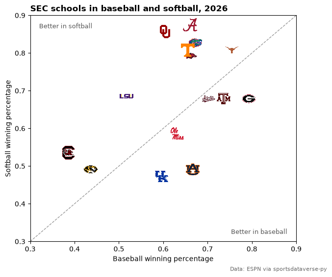
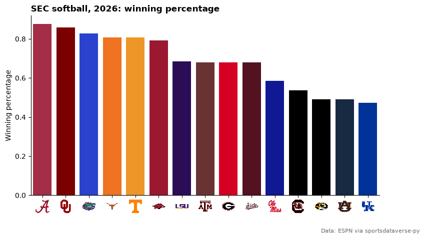

# College baseball and softball

Nine worked examples on the 2026 college season: the Men's College World Series in Omaha, the Women's College World
Series champion's run, the SEC in both sports, and every team in ESPN's Division I softball standings. All data comes
from ESPN's college-baseball and college-softball endpoints through
[sportsdataverse-py](https://py.sportsdataverse.org/); sdvplot's `ncaa_baseball` and `ncaa_softball` leagues key on
ESPN's team ids, so the data's ids go straight in.

```python
import datetime as dt

import matplotlib.pyplot as plt
import polars as pl
import sportsdataverse as sdv

import sdvplot

SEASON = 2026  # the 2026 season ended with the World Series in June
ESPN = "Data: ESPN via sportsdataverse-py"


def scoreboard(sport: str, start: dt.date, days: int) -> pl.DataFrame:
    """Every game on ESPN's college scoreboard for `days` dates from `start` (the endpoint takes one date per call)."""
    fetch = getattr(sdv, f"espn_college_{sport}_scoreboard")
    frames = [fetch(dates=(start + dt.timedelta(days=d)).strftime("%Y%m%d")) for d in range(days)]
    return pl.concat([f for f in frames if f.height], how="diagonal_relaxed")
```

The 2026 Men's College World Series ran from June 12 to June 22. Each scoreboard row is one game, with both teams'
ESPN ids, abbreviations and scores, and ESPN's note naming the round.

```python
cws = (
    scoreboard("baseball", dt.date(SEASON, 6, 12), 11)
    .filter(pl.col("note").str.contains("College World Series"))
    .with_columns(
        pl.col("home_score").cast(pl.Int64),
        pl.col("away_score").cast(pl.Int64),
        local=pl.col("date")
        .str.strptime(pl.Datetime, "%Y-%m-%dT%H:%MZ")
        .dt.replace_time_zone("UTC")
        .dt.convert_time_zone("America/Chicago"),
    )
    .sort("local")
)
cws.select("local", "note", "away_abbreviation", "away_score", "home_abbreviation", "home_score").tail(3)
```

<div class="sdv-output">

| local                   | note                                                   | away_abbreviation | away_score | home_abbreviation | home_score |
|-------------------------|--------------------------------------------------------|-------------------|------------|-------------------|------------|
| 2026-06-20 14:00:00 CDT | Men's College World Series Championship Final - Game 1 | OU                | 9          | UNC               | 3          |
| 2026-06-21 13:30:00 CDT | Men's College World Series Championship Final - Game 2 | UNC               | 6          | OU                | 2          |
| 2026-06-22 18:00:00 CDT | Men's College World Series Championship Final - Game 3 | OU                | 13         | UNC               | 2          |

</div>

## 1. The College World Series, game by game

A great_tables results table: `gt_sdv_logos` turns the winner and loser id columns into logos, and `gt_theme_ncaa`
gives it the NCAA stats-site look.

```python
from great_tables import GT

from sdvplot.great_tables import gt_sdv_logos, gt_theme_ncaa

home_won = pl.col("home_score") > pl.col("away_score")
results = cws.select(
    date=pl.col("local").dt.strftime("%b %d"),
    round=pl.col("note").str.replace(r"^Men's College World Series( - )?", ""),
    winner_logo=pl.when(home_won).then("home_id").otherwise("away_id"),
    winner=pl.when(home_won).then("home_display_name").otherwise("away_display_name"),
    score=pl.format(
        "{}-{}", pl.max_horizontal("home_score", "away_score"), pl.min_horizontal("home_score", "away_score")
    ),
    loser_logo=pl.when(home_won).then("away_id").otherwise("home_id"),
    loser=pl.when(home_won).then("away_display_name").otherwise("home_display_name"),
)
gt = gt_theme_ncaa(
    GT(results)
    .cols_label(
        date="Date", round="Round", winner_logo="", winner="Winner", score="Score", loser_logo="", loser="Loser"
    )
    .cols_align("center", columns="score")
    .tab_header(title=f"{SEASON} Men's College World Series", subtitle="Charles Schwab Field, Omaha")
    .tab_source_note(ESPN)
)
gt_sdv_logos(gt, ["winner_logo", "loser_logo"], league="ncaa_baseball", height=26)
```

<div class="sdv-output">

<iframe class="sdv-frame" src="/outputs/tutorials/leagues/college-baseball-softball/5_0.html" title="HTML output" height="480" loading="lazy"></iframe>

</div>

## 2. Run differential in Omaha

Stack the home and away sides into one row per team per game, then total each team's runs for and against. The bar
colors come from `team_colors` with ESPN ids, and `axis_logos` replaces the id tick labels with logos.

```python
sides = pl.concat(
    [
        cws.select(team="home_id", rf="home_score", ra="away_score"),
        cws.select(team="away_id", rf="away_score", ra="home_score"),
    ]
)
omaha = (
    sides.group_by("team", maintain_order=True)
    .agg(games=pl.len(), wins=(pl.col("rf") > pl.col("ra")).sum(), diff=(pl.col("rf") - pl.col("ra")).sum())
    .sort(["diff", "wins", "team"], descending=[True, True, False])
)

fig, ax = plt.subplots(figsize=(8, 5))
ax.bar(omaha["team"], omaha["diff"], color=sdvplot.team_colors(omaha["team"].to_list(), "ncaa_baseball"))
for i, (diff, wins, games) in enumerate(omaha.select("diff", "wins", "games").iter_rows()):
    ax.text(
        i,
        diff + (0.6 if diff >= 0 else -0.6),
        f"{wins}-{games - wins}",
        ha="center",
        va="bottom" if diff >= 0 else "top",
        fontsize=9,
    )
ax.axhline(0, color="#222222", linewidth=0.8)
ax.set_ylabel("Run differential in the CWS")
ax.spines[["top", "right"]].set_visible(False)
ax.set_title(f"{SEASON} Men's College World Series: run differential and record", loc="left", fontweight="bold")
fig.subplots_adjust(bottom=0.16)
fig.text(0.99, 0.01, ESPN, ha="right", fontsize=8, color="#666666")
sdvplot.axis_logos(ax, "x", league="ncaa_baseball", height=0.1)
plt.show()
```

<div class="sdv-output">



</div>

## 3. The clincher, inning by inning

ESPN's game summary carries each team's line score. Cumulative runs by inning, in team colors, with each team's logo at
the end of its line.

```python
final = cws.row(-1, named=True)
summary = sdv.espn_college_baseball_summary(event_id=final["game_id"], return_parsed=False)
line = pl.DataFrame(
    [
        {"team": c["team"]["id"], "inning": i + 1, "runs": int(s["displayValue"]) if s["displayValue"].isdigit() else 0}
        for c in summary["header"]["competitions"][0]["competitors"]
        for i, s in enumerate(c["linescores"])
    ]
)
line = pl.concat([line.select("team").unique().with_columns(inning=0, runs=0), line], how="vertical_relaxed")
line = line.sort("team", "inning").with_columns(total=pl.col("runs").cum_sum().over("team"))

fig, ax = plt.subplots(figsize=(8, 5))
ends = line.group_by("team", maintain_order=True).agg(pl.col("inning").max(), pl.col("total").last())
for team in ends["team"]:
    t = line.filter(pl.col("team") == team)
    ax.step(t["inning"], t["total"], where="post", linewidth=3, color=sdvplot.team_colors(team, "ncaa_baseball"))
ax.set_xticks(range(1, line["inning"].max() + 1))
ax.set_xlim(0, line["inning"].max() + 1.2)
ax.set_ylim(-0.5, line["total"].max() + 1.5)
ax.set_xlabel("Inning")
ax.set_ylabel("Runs")
ax.spines[["top", "right"]].set_visible(False)
fig.suptitle(final["note"], x=0.125, ha="left", fontsize=10, color="#555555")
ax.set_title(
    f"{final['away_location']} {final['away_score']}, {final['home_location']} {final['home_score']}",
    loc="left",
    fontweight="bold",
)
fig.text(0.99, 0.01, ESPN, ha="right", fontsize=8, color="#666666")
sdvplot.add_logos(
    ax, (ends["inning"] + 0.6).to_list(), ends["total"].to_list(), ends["team"], league="ncaa_baseball", height=0.13
)
plt.show()
```

<div class="sdv-output">



</div>

## 4. The Women's College World Series champion's run

The WCWS in Oklahoma City ran from May 28 to June 4. The champion is the winner of the series' last game; its games go into a
table where `gt_color_results` fills each row by the result. As with any fill, the theme goes on first and the
result colors after it. `logo_url` puts the champion's logo in the title.

```python
from great_tables import html

from sdvplot.great_tables import gt_color_results

wcws = (
    scoreboard("softball", dt.date(SEASON, 5, 28), 8)
    .filter(pl.col("note").str.contains("College World Series"))
    .with_columns(pl.col("home_score").cast(pl.Int64), pl.col("away_score").cast(pl.Int64))
    .sort("date", maintain_order=True)
)
last = wcws.row(-1, named=True)
won_home = last["home_score"] > last["away_score"]
champ, champ_name = (
    (last["home_id"], last["home_display_name"]) if won_home else (last["away_id"], last["away_display_name"])
)

at_home = pl.col("home_id") == champ
run = (
    wcws.filter(at_home | (pl.col("away_id") == champ))
    .select(
        round=pl.col("note").str.replace(r"^Women's College World Series( - )?", ""),
        opponent_logo=pl.when(at_home).then("away_id").otherwise("home_id"),
        opponent=pl.when(at_home).then("away_display_name").otherwise("home_display_name"),
        rf=pl.when(at_home).then("home_score").otherwise("away_score"),
        ra=pl.when(at_home).then("away_score").otherwise("home_score"),
    )
    .with_columns(result=pl.when(pl.col("rf") > pl.col("ra")).then(pl.lit("W")).otherwise(pl.lit("L")))
)

logo = sdvplot.logo_url(champ, "ncaa_softball")
gt = gt_theme_ncaa(
    GT(run.select("round", "opponent_logo", "opponent", "rf", "ra", "result"))
    .cols_label(round="Round", opponent_logo="", opponent="Opponent", rf="Runs", ra="Allowed", result="")
    .tab_header(
        title=html(f' {champ_name}'),
        subtitle=f"{SEASON} Women's College World Series",
    )
    .tab_source_note(ESPN)
)
gt = gt_sdv_logos(gt, "opponent_logo", league="ncaa_softball", height=26)
gt_color_results(gt, "result")
```

<div class="sdv-output">

<iframe class="sdv-frame" src="/outputs/tutorials/leagues/college-baseball-softball/11_0.html" title="HTML output" height="480" loading="lazy"></iframe>

</div>

## 5. One conference: the SEC in college baseball

ESPN's standings take a `group` for one conference (27 is the SEC in college baseball). plotnine's `geom_sdv_logos`
plots runs scored against runs allowed per game, and `geom_mean_lines` adds the conference averages. The y axis is
reversed, so the best run prevention sits on top.

```python
from plotnine import aes, ggplot, labs, scale_x_continuous, scale_y_reverse, theme, theme_bw

from sdvplot.plotnine import geom_mean_lines, geom_sdv_logos

sec = sdv.espn_college_baseball_standings(season=SEASON, group=27).with_columns(
    rs_g=pl.col("points_for") / pl.col("games_played"), ra_g=pl.col("points_against") / pl.col("games_played")
)
(
    ggplot(sec.to_pandas(), aes("rs_g", "ra_g", team="team_id", x0="rs_g", y0="ra_g"))
    + geom_mean_lines(color="#888888")
    + geom_sdv_logos(league="ncaa_baseball", height=0.1)
    + scale_x_continuous(expand=(0.08, 0))
    + scale_y_reverse(expand=(0.08, 0))
    + labs(
        x="Runs scored per game",
        y="Runs allowed per game (reversed)",
        title=f"SEC baseball, {SEASON}: run scoring and prevention",
        caption=ESPN,
    )
    + theme_bw()
    + theme(figure_size=(8, 6))
)
```

<div class="sdv-output">



</div>

## 6. The best records in Division I (interactive)

The full Division I standings, top 15 by winning percentage, as an Altair bar chart. `palette` colors the bars by team,
`axis_logos` replaces the team axis with logos, and the tooltip names the team.

```python
import altair as alt

top = (
    sdv.espn_college_baseball_standings(season=SEASON)
    .filter(pl.col("games_played") >= 40)
    .sort("win_percent", descending=True, maintain_order=True)
    .head(15)
    .with_columns(record=pl.format("{}-{}", pl.col("wins").cast(pl.Int64), pl.col("losses").cast(pl.Int64)))
)
colors = sdvplot.palette("ncaa_baseball", teams=top["team_id"])
bars = (
    alt.Chart(top.select("team_id", "team_display_name", "record", "win_percent").to_pandas())
    .mark_bar()
    .encode(
        x=alt.X("win_percent:Q", title="Winning percentage", axis=alt.Axis(format=".0%")),
        y=alt.Y("team_id:N", sort=top["team_id"].to_list(), title=None),  # an explicit order survives the logo layer
        color=alt.Color("team_id:N", scale=alt.Scale(domain=list(colors), range=list(colors.values())), legend=None),
        tooltip=[alt.Tooltip("team_display_name", title="Team"), alt.Tooltip("record", title="Record")],
    )
    .properties(width=480, height=420, title=f"Best records in Division I baseball, {SEASON} (40+ games)")
)
sdvplot.axis_logos(bars, "y", league="ncaa_baseball", height=0.055)
```

<div class="sdv-output">

<iframe class="sdv-frame" src="/outputs/tutorials/leagues/college-baseball-softball/15_0.html" title="HTML output" height="480" loading="lazy"></iframe>

</div>

## 7. One school, two sports

The same school has a different ESPN id in each sport (Texas is 126 in college baseball and 538 in softball), so
`ncaa_baseball` and `ncaa_softball` are separate leagues in sdvplot. To compare a school across sports, join the two
standings on ESPN's abbreviation, which both sports share; 32 is the SEC's group in college softball. Vanderbilt has no
softball team, so 15 schools match. The abbreviation also resolves in each sdvplot league, to that sport's id: ESPN's
baseball teams list calls Missouri `MIZZ` while its standings and scoreboards say `MIZ`, and the index carries both.

```python
sec_sb = sdv.espn_college_softball_standings(season=SEASON, group=32)
assert sec.schema["team_abbreviation"] == sec_sb.schema["team_abbreviation"]
both = sec.select("team_abbreviation", "team_id", baseball="win_percent").join(
    sec_sb.select("team_abbreviation", softball_id="team_id", softball="win_percent"),
    on="team_abbreviation",
    maintain_order="left",
)
both = both.with_columns(
    baseball_key=sdvplot.resolve(both["team_abbreviation"], "ncaa_baseball", season=SEASON),
    softball_key=sdvplot.resolve(both["team_abbreviation"], "ncaa_softball", season=SEASON),
)
assert (both["baseball_key"] == both["team_id"]).all() and (both["softball_key"] == both["softball_id"]).all()
both.filter(pl.col("team_abbreviation").is_in(["TEX", "OU", "MIZ"])).select(
    "team_abbreviation", "team_id", "baseball_key", "softball_id", "softball_key"
)
```

<div class="sdv-output">

| team_abbreviation | team_id | baseball_key | softball_id | softball_key |
|-------------------|---------|--------------|-------------|--------------|
| TEX               | 126     | 126          | 538         | 538          |
| OU                | 112     | 112          | 524         | 524          |
| MIZ               | 91      | 91           | 503         | 503          |

</div>

```python
fig, ax = plt.subplots(figsize=(7, 6))
ax.plot([0.3, 0.9], [0.3, 0.9], color="#999999", linestyle="--", linewidth=1)
ax.set_xlim(0.3, 0.9)
ax.set_ylim(0.3, 0.9)
ax.set_xlabel("Baseball winning percentage")
ax.set_ylabel("Softball winning percentage")
ax.text(0.32, 0.88, "Better in softball", fontsize=9, color="#555555", va="top")
ax.text(0.88, 0.32, "Better in baseball", fontsize=9, color="#555555", ha="right")
ax.set_title(f"SEC schools in baseball and softball, {SEASON}", loc="left", fontweight="bold")
fig.text(0.99, 0.01, ESPN, ha="right", fontsize=8, color="#666666")
sdvplot.add_logos(ax, both["baseball"], both["softball"], both["team_id"], league="ncaa_baseball", height=0.065)
plt.show()
```

<div class="sdv-output">



</div>

## 8. Team colors with seaborn

`palette` returns a plain `{team: color}` dict, which seaborn takes as is. College teams carry one ESPN color: the
secondary is `None`, so a second color has to come from elsewhere.

```python
import seaborn as sns

sb = sec_sb.sort("win_percent", descending=True, maintain_order=True)
fig, ax = plt.subplots(figsize=(9, 5))
sns.barplot(
    sb.to_pandas(),
    x="team_id",
    y="win_percent",
    hue="team_id",
    order=sb["team_id"].to_list(),
    palette=sdvplot.palette("ncaa_softball", teams=sb["team_id"]),
    saturation=1,  # seaborn mutes bar colors by default; keep the teams' own
    legend=False,
    ax=ax,
)
ax.set_xlabel("")
ax.set_ylabel("Winning percentage")
ax.spines[["top", "right"]].set_visible(False)
ax.set_title(f"SEC softball, {SEASON}: winning percentage", loc="left", fontweight="bold")
fig.subplots_adjust(bottom=0.16)
fig.text(0.99, 0.01, ESPN, ha="right", fontsize=8, color="#666666")
sdvplot.axis_logos(ax, "x", league="ncaa_softball", height=0.08)
plt.show()
```

<div class="sdv-output">



</div>

```python
sdvplot.team_colors(sb["team_id"].head(3).to_list(), "ncaa_softball", which="secondary")
```

<div class="sdv-output">

```text
[None, None, None]
```

</div>

## 9. Every Division I softball team (interactive)

All teams in ESPN's Division I softball standings: runs scored against runs allowed per game, one logo each through
the Plotly adapter. Hover a logo for the team and its record; the y axis runs high to low, so the best teams sit top
right.

```python
import plotly.graph_objects as go

d1 = (
    sdv.espn_college_softball_standings(season=SEASON)
    .filter(pl.col("games_played") > 0, pl.col("points_for") > 0)  # a few rows carry no run totals
    .with_columns(
        rs_g=pl.col("points_for") / pl.col("games_played"),
        ra_g=pl.col("points_against") / pl.col("games_played"),
        label=pl.format(
            "{} ({}-{})", "team_display_name", pl.col("wins").cast(pl.Int64), pl.col("losses").cast(pl.Int64)
        ),
    )
)
fig = go.Figure(
    go.Scatter(
        x=d1["rs_g"],
        y=d1["ra_g"],
        mode="markers",
        marker={"opacity": 0},
        text=d1["label"],
        hovertemplate="%{text}<br>%{x:.2f} scored, %{y:.2f} allowed per game<extra></extra>",
    )
)
fig = sdvplot.add_logos(fig, d1["rs_g"], d1["ra_g"], d1["team_id"], league="ncaa_softball", height=0.05)
fig.update_layout(
    title=f"Division I softball, {SEASON}: runs per game<br><sup>{ESPN}</sup>",
    xaxis={"title": "Runs scored per game", "range": [d1["rs_g"].min() - 0.5, d1["rs_g"].max() + 0.5]},
    yaxis={"title": "Runs allowed per game", "range": [d1["ra_g"].max() + 0.5, d1["ra_g"].min() - 0.5]},
    width=800,
    height=650,
    template="plotly_white",
)
fig
```

<div class="sdv-output">

<iframe class="sdv-frame" src="/outputs/tutorials/leagues/college-baseball-softball/23_0.html" title="Interactive Plotly figure" height="480" loading="lazy"></iframe>

</div>

## Run it yourself

<a href="pathname:///notebooks/leagues/college-baseball-softball.ipynb" download>Download the notebook</a> (outputs cleared) or [open it on GitHub](https://github.com/sportsdataverse/sdvplot/blob/main/examples/notebooks/leagues/college-baseball-softball.ipynb).
