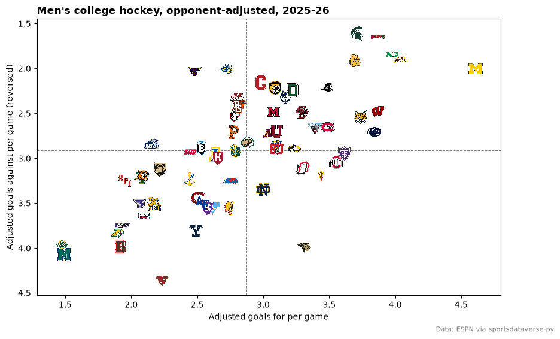
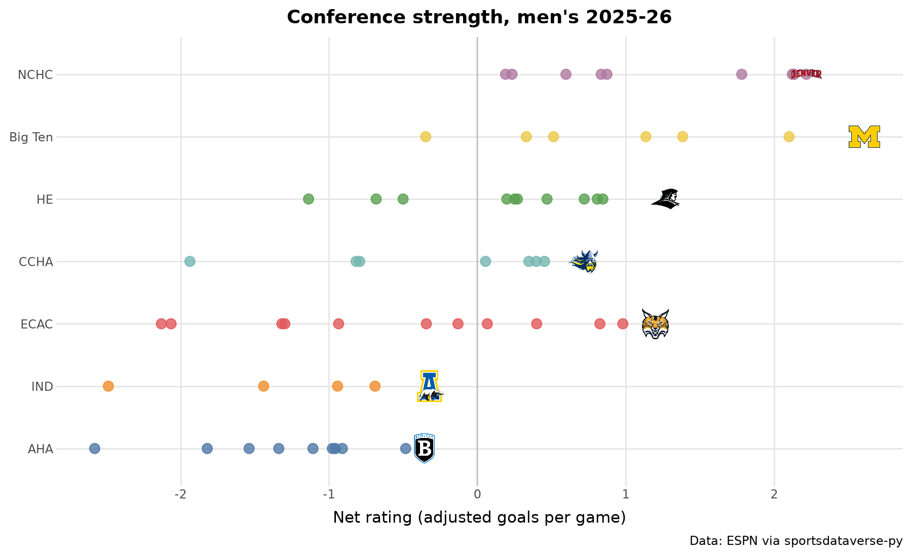
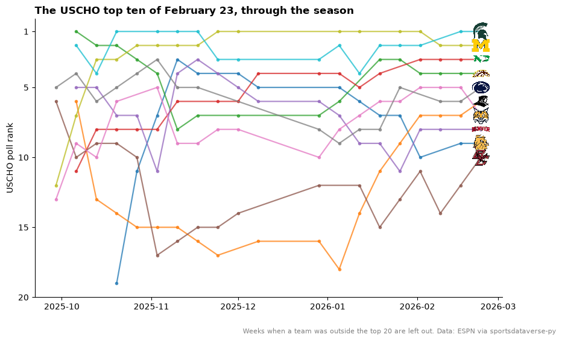
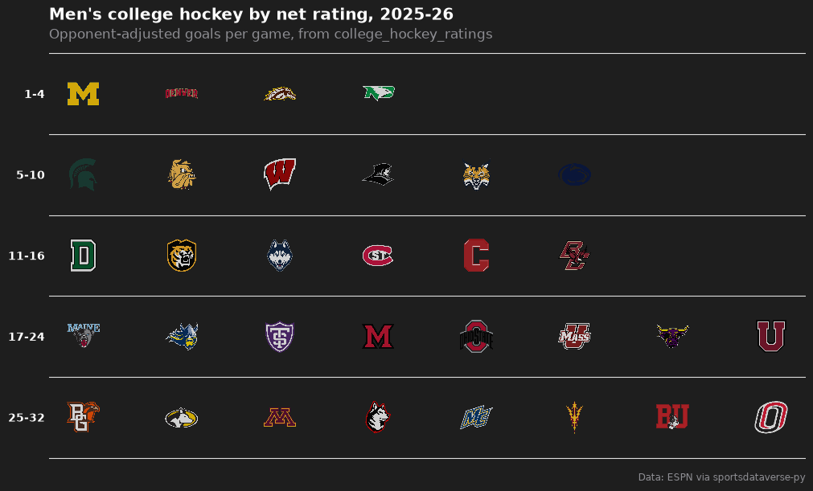
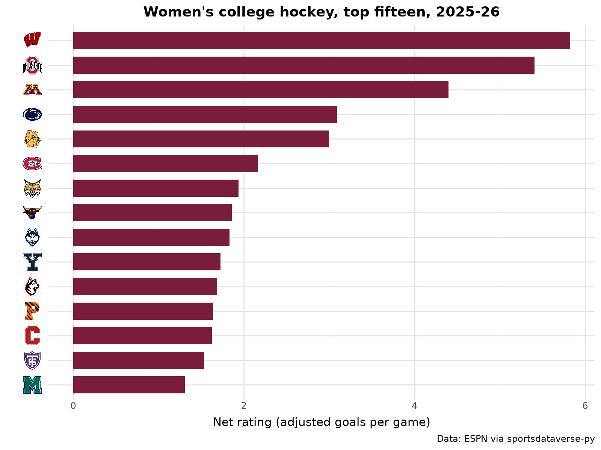

# College hockey

Nine charts and tables from the 2025-26 NCAA Division I men's and women's hockey seasons: records and
opponent-adjusted ratings built from ESPN's scoreboard, conference strength, the USCHO poll week by week, the men's
NCAA tournament and a women's ratings chart. ESPN publishes no college hockey standings, so everything starts from
the game results that [sportsdataverse-py](https://py.sportsdataverse.org/)'s `espn_mch_*` (men) and `espn_wch_*`
(women) wrappers return.

```python
import warnings

import matplotlib.pyplot as plt
import polars as pl
import sportsdataverse as sdv
from sportsdataverse.hockey.college_hockey_ratings import college_hockey_game_results, college_hockey_ratings

import sdvplot

SEASON = 2026  # the 2025-26 season, named by the year it ends
MONTHS = ["202509", "202510", "202511", "202512", "202601", "202602", "202603", "202604"]


def season_events(league):
    """Every scoreboard event of the season: ESPN's college scoreboard takes a whole month (YYYYMM) as its date."""
    scoreboard = getattr(sdv, f"espn_{league}_scoreboard")
    return [e for m in MONTHS for e in scoreboard(dates=m, return_parsed=False).get("events", [])]


men, women = season_events("mch"), season_events("wch")
len(men), len(women)
```

<div class="sdv-output">

```text
(1149, 817)
```

</div>

## 1. Records from the scoreboard

`college_hockey_game_results` turns the events into one row per team and completed game; a record is a `group_by`
away. College hockey keeps ties (a game still level after overtime), so the winning percentage counts a tie as half a
win.

```python
def records(events, league):
    games = college_hockey_game_results(events, league=league)
    names = {c["team"]["id"]: c["team"]["displayName"] for e in events for c in e["competitions"][0]["competitors"]}
    return (
        games.group_by("team_id")
        .agg(
            pl.len().alias("gp"),
            (pl.col("goals_for") > pl.col("goals_against")).sum().alias("w"),
            (pl.col("goals_for") < pl.col("goals_against")).sum().alias("l"),
            (pl.col("goals_for") == pl.col("goals_against")).sum().alias("t"),
            pl.col("goals_for").sum().alias("gf"),
            pl.col("goals_against").sum().alias("ga"),
        )
        .with_columns(
            team=pl.col("team_id").replace_strict(names),
            pct=(pl.col("w") + pl.col("t") / 2) / pl.col("gp"),
            record=pl.format("{}-{}-{}", "w", "l", "t"),
        )
        .sort("pct", descending=True)
    )


men_records = records(men, "mch")
men_records.head(5)
```

<div class="sdv-output">

| team_id | gp | w  | l  | t | gf  | ga | team                        | pct      | record  |
|---------|----|----|----|---|-----|----|-----------------------------|----------|---------|
| 130     | 40 | 30 | 8  | 2 | 178 | 96 | Michigan Wolverines         | 0.775    | 30-8-2  |
| 127     | 37 | 26 | 8  | 3 | 136 | 76 | Michigan State Spartans     | 0.743243 | 26-8-3  |
| 155     | 40 | 29 | 10 | 1 | 151 | 90 | North Dakota Fighting Hawks | 0.7375   | 29-10-1 |
| 159     | 35 | 23 | 7  | 5 | 123 | 70 | Dartmouth Big Green         | 0.728571 | 23-7-5  |
| 2172    | 43 | 29 | 11 | 3 | 154 | 90 | Denver Pioneers             | 0.709302 | 29-11-3 |

</div>

## 2. The top sixteen, with conferences

ESPN's group endpoints list each conference's teams, which gives every team its conference. A great_tables table of
the sixteen best records with `gt_sdv_logos` on ESPN's team ids and the NCAA-style `gt_theme_ncaa`.

```python
from great_tables import GT

from sdvplot.great_tables import gt_sdv_logos, gt_theme_ncaa

rows = []
for item in sdv.espn_mch_season_groups(season=SEASON, season_type=2, return_parsed=False)["items"]:
    group_id = item["$ref"].split("/groups/")[1].split("?")[0]
    group = sdv.espn_mch_season_group(season=SEASON, season_type=2, group_id=group_id, return_parsed=False)
    members = sdv.espn_mch_season_group_teams(SEASON, 2, group_id, return_parsed=False)["items"]
    rows += [
        {"team_id": m["$ref"].split("/teams/")[1].split("?")[0], "conference": group["abbreviation"]} for m in members
    ]
conferences = pl.DataFrame(rows)
assert conferences.schema["team_id"] == men_records.schema["team_id"] == pl.String
men_records = men_records.join(conferences, on="team_id", how="left")

top = men_records.head(16).with_row_index("rank", offset=1)
gt = (
    GT(top.select("rank", pl.col("team_id").alias("logo"), "team", "conference", "record", "pct", "gf", "ga"))
    .tab_header("Men's college hockey, 2025-26", "The sixteen best records, NCAA tournament included")
    .fmt_number("pct", decimals=3)
    .cols_label(rank="", logo="", team="Team", conference="Conf.", record="W-L-T", pct="Pct.", gf="GF", ga="GA")
    .tab_source_note("Data: ESPN via sportsdataverse-py")
)
gt_theme_ncaa(gt_sdv_logos(gt, "logo", league="ncaa_mhockey", height=24))
```

<div class="sdv-output">

<iframe class="sdv-frame" src="/outputs/tutorials/leagues/college-hockey/5_0.html" title="HTML output" height="480" loading="lazy"></iframe>

</div>

## 3. Opponent-adjusted ratings

Raw goals flatter teams with easy schedules. `college_hockey_ratings` adjusts each team's goals for and against for
its opponents (an iterative, KenPom-style fit), in goals per game against an average team. The scoreboard also holds
a few exhibitions against teams outside Division I; keep teams with at least ten games.

```python
men_ratings = college_hockey_ratings(men, league="mch").filter(pl.col("games") >= 10)  # drops one-off exhibition foes
fig, ax = plt.subplots(figsize=(10, 6))
ax.scatter(men_ratings["adj_off"], men_ratings["adj_def"], alpha=0)
ax.axvline(men_ratings["adj_off"].mean(), color="grey", lw=0.8, ls="--")
ax.axhline(men_ratings["adj_def"].mean(), color="grey", lw=0.8, ls="--")
ax.invert_yaxis()
ax.margins(0.06)
sdvplot.add_logos(
    ax,
    men_ratings["adj_off"],
    men_ratings["adj_def"],
    men_ratings["team_id"],
    league="ncaa_mhockey",
    season=SEASON,
    height=0.055,
)
ax.set(xlabel="Adjusted goals for per game", ylabel="Adjusted goals against per game (reversed)")
ax.set_title("Men's college hockey, opponent-adjusted, 2025-26", loc="left", fontweight="bold")
fig.text(0.99, 0.01, "Data: ESPN via sportsdataverse-py", ha="right", fontsize=8, color="grey")
plt.show()
```

<div class="sdv-output">



</div>

Michigan's attack, 4.6 adjusted goals a game, was the best in the country by more than half a goal; Michigan State
allowed the fewest.

## 4. Conference strength, in conference colors

Each team's net rating (adjusted goals for minus against) as a dot colored by its conference, one row per conference
ordered by its average; the best team in each conference carries its logo. (HE is Hockey East, AHA Atlantic Hockey
America and IND the independents.) The index has no school colors for college hockey yet (`color_source` is
`"fallback"`), and conference colors read better here anyway.

```python
from plotnine import (
    aes,
    element_blank,
    element_text,
    geom_point,
    geom_vline,
    ggplot,
    labs,
    scale_color_manual,
    theme,
    theme_minimal,
)

from sdvplot.plotnine import geom_sdv_logos

net = men_ratings.join(conferences, on="team_id")
order = net.group_by("conference").agg(pl.col("adj_net").mean()).sort("adj_net")["conference"].to_list()
best = net.sort("adj_net", descending=True).group_by("conference", maintain_order=True).first()
frame, best_frame = net.to_pandas(), best.to_pandas()
for f in (frame, best_frame):
    f["conference"] = f["conference"].astype("category").cat.set_categories(order)
palette = dict(
    zip(
        order,
        [
            "#4e79a7",
            "#f28e2b",
            "#e15759",
            "#76b7b2",
            "#59a14f",
            "#edc948",
            "#b07aa1",
            "#ff9da7",
            "#9c755f",
            "#bab0ac",
            "#86bcb6",
            "#d37295",
        ],
        strict=False,
    )
)
(
    ggplot(frame, aes("adj_net", "conference"))
    + geom_vline(xintercept=0, color="#bbbbbb")
    + geom_point(aes(color="conference"), size=3.5, alpha=0.8, show_legend=False)
    + geom_sdv_logos(aes(team="team_id"), data=best_frame, league="ncaa_mhockey", season=SEASON, height=0.075)
    + scale_color_manual(values=palette)
    + labs(
        x="Net rating (adjusted goals per game)",
        y="",
        title="Conference strength, men's 2025-26",
        caption="Data: ESPN via sportsdataverse-py",
    )
    + theme_minimal()
    + theme(figure_size=(9, 5.5), panel_grid_minor=element_blank(), plot_title=element_text(weight="bold"))
)
```

<div class="sdv-output">



</div>

The NCHC was the strongest conference on average; the Big Ten had the best team, Michigan.

## 5. The USCHO poll, week by week

Every competitor on ESPN's scoreboard carries its poll rank at game time (`curatedRank`, 99 when unranked), so the
weekly USCHO poll falls out of the same events. Conference tournaments give byes in March, so take the top ten from
the last week in which all ten ranked teams played, and follow them back through the season as a bump chart.

```python
weekly = (
    pl.DataFrame(
        [
            {"date": e["date"][:10], "team_id": c["team"]["id"], "rank": c.get("curatedRank", {}).get("current", 99)}
            for e in men
            if e["season"]["type"] == 2
            for c in e["competitions"][0]["competitors"]
        ]
    )
    .with_columns(week=pl.col("date").str.to_date().dt.truncate("1w"))
    .group_by("team_id", "week")
    .agg(pl.col("rank").min())
)
full = weekly.filter(pl.col("rank") <= 10).group_by("week").len().filter(pl.col("len") == 10)
last_week = full["week"].max()  # the last week in which all ten ranked teams played
polls = weekly.filter((pl.col("rank") <= 20) & (pl.col("week") <= last_week))
final10 = polls.filter((pl.col("week") == last_week) & (pl.col("rank") <= 10))["team_id"].to_list()
fig, ax = plt.subplots(figsize=(10, 6))
for team_id in final10:
    t = polls.filter(pl.col("team_id") == team_id).sort("week")
    ax.plot(t["week"], t["rank"], marker="o", ms=3, lw=1.6, alpha=0.75)
ends = polls.filter((pl.col("week") == last_week) & pl.col("team_id").is_in(final10))
sdvplot.add_logos(ax, ends["week"], ends["rank"], ends["team_id"], league="ncaa_mhockey", season=SEASON, height=0.07)
ax.invert_yaxis()
ax.set_yticks([1, 5, 10, 15, 20])
ax.set_ylabel("USCHO poll rank")
ax.spines[["top", "right"]].set_visible(False)
ax.set_title(f"The USCHO top ten of {last_week:%B} {last_week.day}, through the season", loc="left", fontweight="bold")
fig.text(
    0.99,
    0.01,
    "Weeks when a team was outside the top 20 are left out. Data: ESPN via sportsdataverse-py",
    ha="right",
    fontsize=8,
    color="grey",
)
plt.show()
```

<div class="sdv-output">



</div>

## 6. The men's NCAA tournament

The sixteen-team tournament is in the same events (season type 3), with the round in each game's notes. A results
table with two logo columns, one for the winner and one for the loser.

```python
from sdvplot.great_tables import gt_theme_scoreboard

games = []
for e in men:
    if e["season"]["type"] != 3:
        continue
    comp = e["competitions"][0]
    win, lose = sorted(comp["competitors"], key=lambda c: not c["winner"])
    games.append(
        {
            "date": e["date"][:10],
            "round": comp["notes"][0]["headline"].replace("NCAA Men's Hockey ", "").replace("Championship - ", ""),
            "winner": win["team"]["id"],
            "winner_name": win["team"]["shortDisplayName"],
            "score": f"{win['score']}-{lose['score']}"
            + (" (OT)" if "OT" in e["status"]["type"]["shortDetail"] else ""),
            "loser": lose["team"]["id"],
            "loser_name": lose["team"]["shortDisplayName"],
        }
    )
bracket = pl.DataFrame(games).sort("date")
gt = (
    GT(bracket)
    .tab_header("2026 NCAA men's hockey tournament", "Every game, regionals to the national championship")
    .cols_label(
        date="Date", round="Round", winner="", winner_name="Winner", score="Score", loser="", loser_name="Loser"
    )
    .tab_source_note("Data: ESPN via sportsdataverse-py")
)
gt_theme_scoreboard(gt_sdv_logos(gt, ["winner", "loser"], league="ncaa_mhockey", height=22))
```

<div class="sdv-output">

<iframe class="sdv-frame" src="/outputs/tutorials/leagues/college-hockey/15_0.html" title="HTML output" height="480" loading="lazy"></iframe>

</div>

Denver won the title, beating Wisconsin 2-1 in the final after a double-overtime semifinal against Michigan.

## 7. Tiers of the top thirty-two

The thirty-two best net ratings as a tier list, with matplotlib's `team_tiers`. Tiers are rating ranks, so the
labels say which.

```python
from sdvplot.matplotlib import team_tiers

ranked = men_ratings.sort("adj_net", descending=True).head(32).with_row_index("rank", offset=1)
ranked = ranked.with_columns(
    tier_no=pl.when(pl.col("rank") <= 4)
    .then(1)
    .when(pl.col("rank") <= 10)
    .then(2)
    .when(pl.col("rank") <= 16)
    .then(3)
    .when(pl.col("rank") <= 24)
    .then(4)
    .otherwise(5)
)
fig = team_tiers(
    ranked.select(pl.col("team_id").alias("team"), "tier_no"),
    "ncaa_mhockey",
    title="Men's college hockey by net rating, 2025-26",
    subtitle="Opponent-adjusted goals per game, from college_hockey_ratings",
    caption="Data: ESPN via sportsdataverse-py",
    tier_desc={1: "1-4", 2: "5-10", 3: "11-16", 4: "17-24", 5: "25-32"},
    height=0.085,
)
fig.set_size_inches(10, 6)
plt.show()
```

<div class="sdv-output">



</div>

## 8. Women's ratings: when an id does not resolve, try the name

The same pipeline for the women. Two of ESPN's women's team ids are not in the index, and `resolve` warns rather than
guessing. Minnesota State's women's team has its own ESPN id; its name resolves to the school. Delaware has no entry
yet, so it drops out of the logo charts with one warning.

```python
names = {c["team"]["id"]: c["team"]["displayName"] for e in women for c in e["competitions"][0]["competitors"]}
ids = list(names)
with warnings.catch_warnings(record=True) as caught:
    warnings.simplefilter("always")
    by_id = sdvplot.resolve(ids, "ncaa_whockey")
    missing = [i for i, key in zip(ids, by_id, strict=True) if key is None]
    by_name = dict(zip(missing, sdvplot.resolve([names[i] for i in missing], "ncaa_whockey"), strict=True))
for w in caught:
    print(w.message)
keys = pl.DataFrame({"team_id": ids, "key": [key or by_name[i] for i, key in zip(ids, by_id, strict=True)]})
women_ratings = college_hockey_ratings(women, league="wch").filter(pl.col("games") >= 10).join(keys, on="team_id")
women_ratings.filter(pl.col("team_id").is_in(missing)).select("team_id", "key", "adj_net", "games")
```

<div class="sdv-output">

```text
2 value(s) did not resolve to a ncaa_whockey team: '24059' (unknown), '48' (unknown). Use sdvplot.suggest() for candidates, or strict=True to raise.
1 value(s) did not resolve to a ncaa_whockey team: 'Delaware Blue Hens' (unknown). Use sdvplot.suggest() for candidates, or strict=True to raise.
```

| team_id | key  | adj_net  | games |
|---------|------|----------|-------|
| 24059   | 2364 | 1.859313 | 38    |
| 48      | null | -3.04131 | 33    |

</div>

```python
from plotnine import coord_flip, geom_col

top15 = women_ratings.filter(pl.col("key").is_not_null()).sort("adj_net", descending=True).head(15)
frame = top15.to_pandas()
frame["key"] = frame["key"].astype("category").cat.set_categories(top15["key"].reverse().to_list())
p = (
    ggplot(frame, aes("key", "adj_net"))
    + geom_col(fill="#7a1c3c", width=0.7)
    + coord_flip()
    + labs(
        x="",
        y="Net rating (adjusted goals per game)",
        title="Women's college hockey, top fifteen, 2025-26",
        caption="Data: ESPN via sportsdataverse-py",
    )
    + theme_minimal()
    + theme(figure_size=(8, 6), plot_title=element_text(weight="bold"))
)
sdvplot.axis_logos(p, "y", league="ncaa_whockey", season=SEASON, height=0.055)  # "y": the axis as drawn, after the flip
```

<div class="sdv-output">



</div>

## 9. Women's scoring, interactive

Goals for and against per game for every women's team in Plotly, logos as the points; hover for the record.

```python
import plotly.graph_objects as go

w = records(women, "wch").join(keys.rename({"key": "logo"}), on="team_id").filter(pl.col("logo").is_not_null())
w = w.with_columns(gf_pg=pl.col("gf") / pl.col("gp"), ga_pg=pl.col("ga") / pl.col("gp"))
fig = go.Figure(
    go.Scatter(
        x=w["gf_pg"],
        y=w["ga_pg"],
        mode="markers",
        marker={"opacity": 0},
        text=w["team"],
        customdata=w["record"],
        hovertemplate="%{text}<br>%{customdata}<br>%{x:.2f} for, %{y:.2f} against<extra></extra>",
    )
)
fig = sdvplot.add_logos(fig, w["gf_pg"], w["ga_pg"], w["logo"], league="ncaa_whockey", season=SEASON, height=0.07)
fig.update_layout(
    title="Women's college hockey: goals for and against per game, 2025-26",
    template="plotly_white",
    xaxis_title="Goals for per game",
    yaxis={"title": "Goals against per game (reversed)", "autorange": "reversed"},
    width=800,
    height=560,
)
fig
```

<div class="sdv-output">

<iframe class="sdv-frame" src="/outputs/tutorials/leagues/college-hockey/23_0.html" title="Interactive Plotly figure" height="480" loading="lazy"></iframe>

</div>

Wisconsin, the women's national champion, beat Ohio State 3-2 in the final.

## Run it yourself

<a href="pathname:///notebooks/leagues/college-hockey.ipynb" download>Download the notebook</a> (outputs cleared) or [open it on GitHub](https://github.com/sportsdataverse/sdvplot/blob/main/examples/notebooks/leagues/college-hockey.ipynb).
