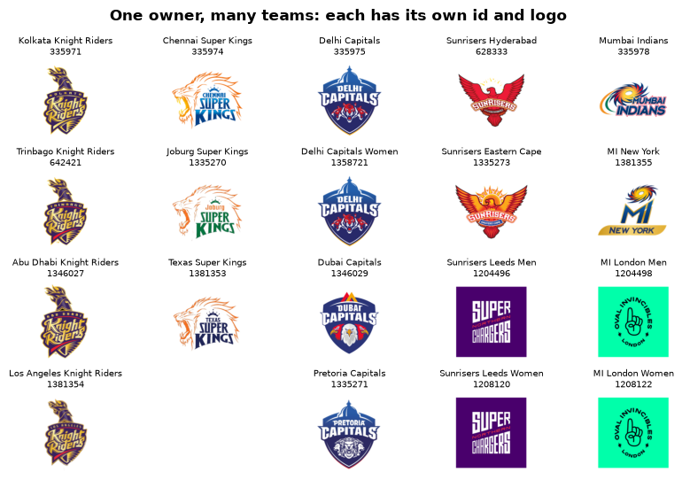
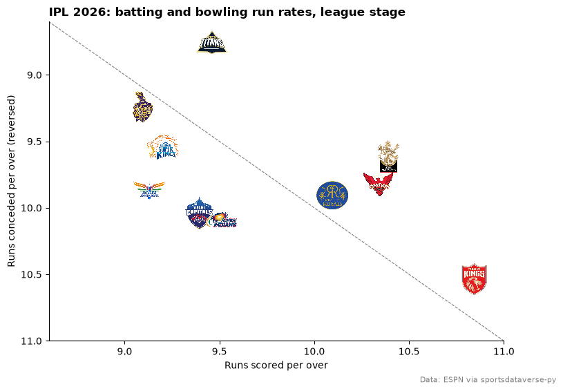
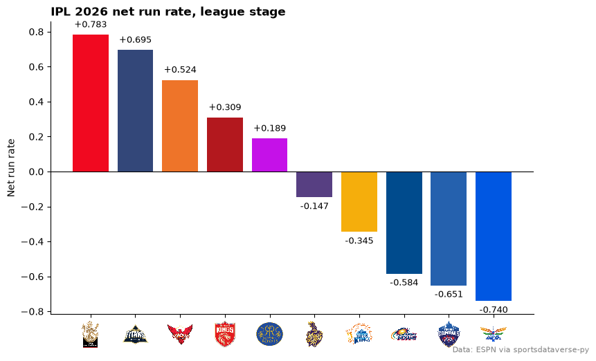
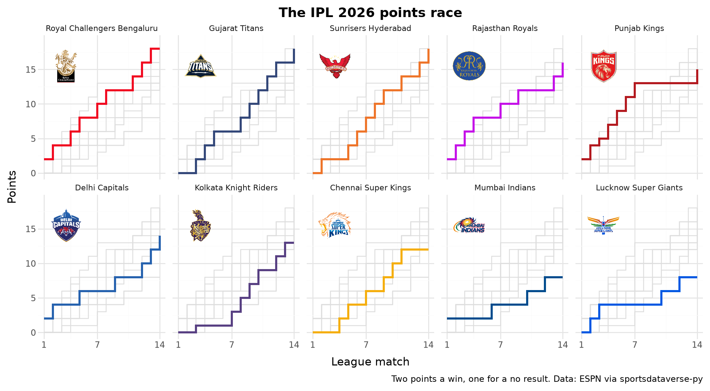
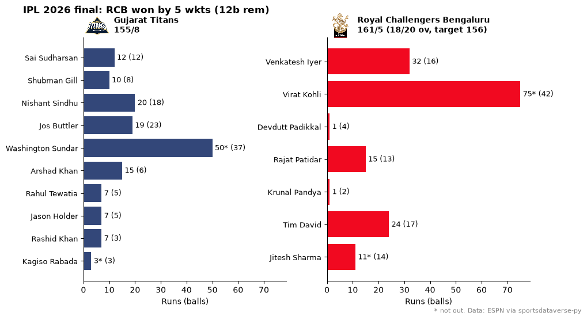
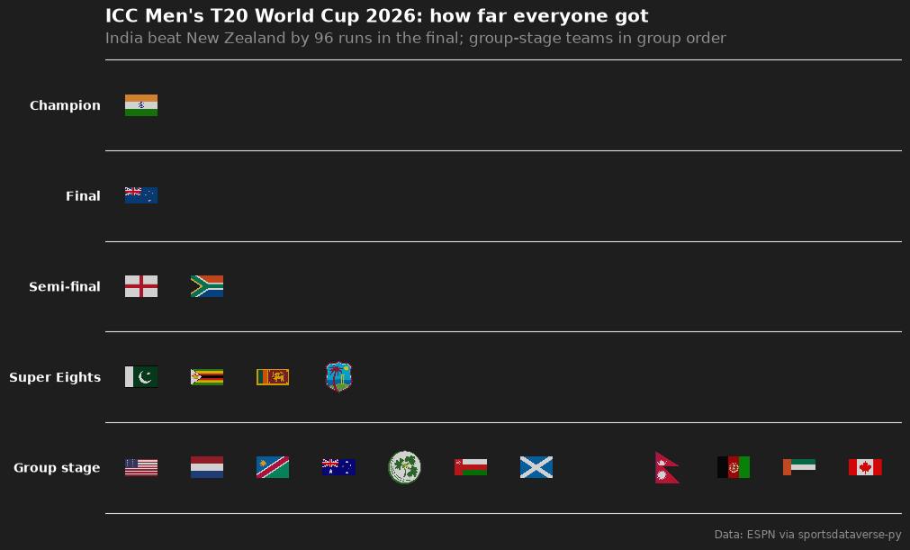

# Cricket

Nine charts and tables from the 2026 Indian Premier League and the 2026 ICC Men's T20 World Cup: a points table with
logos, run rates and net run rate in team colors, the points race, a scorecard card for the IPL final, a World Cup
tier list and an interactive run-rate chart. The data is ESPN's cricket feed (ESPNcricinfo), read through
[sportsdataverse-py](https://py.sportsdataverse.org/) (`sportsdataverse.cricket`), whose wrappers take ESPN's league
id: `8048` is the IPL and `8604` the men's T20 World Cup.

```python
import datetime as dt
import re
import warnings

import matplotlib.pyplot as plt
import polars as pl
import sportsdataverse.cricket as cricket

import sdvplot

IPL, SEASON = "8048", 2026  # the 2026 IPL ran from 28 March to the final on 31 May
```

Load the IPL season: the final league table, and every match from ESPN's scoreboard, one day at a time. Each match
gives both teams' ids, scores and the colors ESPN uses for them, and a result line ("RCB won by 6 wkts (26b rem)").
The winner comes from that line, because a tie settled by a Super Over marks neither side as the winner; a washout
reads "No result" and is worth a point each. The points rebuilt that way match the official table.

```python
table = cricket.espn_cricket_standings(IPL, season=SEASON).sort("rank")
rows = []
for day in pl.date_range(dt.date(2026, 3, 28), dt.date(2026, 5, 31), eager=True):
    raw = cricket.espn_cricket_scoreboard(IPL, dates=day.strftime("%Y%m%d"), return_parsed=False)
    for event in raw.get("events", []):
        comp = event["competitions"][0]
        result = comp["status"]["summary"]
        won = re.search(r"(\w+) won", result)  # "RCB won by 5 wkts", "Match tied (KKR won the Super Over)"
        for side in comp["competitors"]:
            rows.append(
                {
                    "event_id": event["id"],
                    "date": day,
                    "stage": comp["description"],
                    "result": result,
                    "team_id": side["id"],
                    "team": side["team"]["abbreviation"],
                    "color": side["team"]["color"],
                    "score": side["score"],
                    "winner": won.group(1) if won else None,
                }
            )
matches = pl.DataFrame(rows).with_columns(
    pts=pl.when(pl.col("winner").is_null()).then(1).when(pl.col("winner") == pl.col("team")).then(2).otherwise(0)
)
team_colors = dict(zip(matches["team_id"], matches["color"], strict=True))  # ESPN's colors, keyed by team id
league = matches.filter(pl.col("stage").str.ends_with("Match"))  # "1st Match" ... "70th Match"; then the playoffs
check = league.group_by("team_id").agg(pl.col("pts").sum()).join(table.select("team_id", "match_points"), on="team_id")
assert (check["pts"] == check["match_points"]).all()
table.height, matches["event_id"].n_unique()
```

<div class="sdv-output">

```text
(10, 74)
```

</div>

## 1. One key for nations, franchises and women's sides

sdvplot's `cricket` key holds national sides and franchises together. Its `team_id` is the ESPNcricinfo id, which is
also ESPN's team id, so the ids in this data resolve directly. A nation is one team in every format: India is `6` in
a Test, an ODI or the T20 World Cup below. The index has no abbreviations for cricket, so ESPN's `RCB` does not
resolve; a full name does.

```python
print(sdvplot.resolve(table["team_id"], "cricket").to_list())
with warnings.catch_warnings(record=True) as caught:
    warnings.simplefilter("always")
    print(sdvplot.resolve(["RCB", "Royal Challengers Bengaluru", "Royal Challengers Bengaluru Women"], "cricket"))
print(caught[0].message)
```

<div class="sdv-output">

```text
['335970', '1298769', '628333', '335977', '335973', '335975', '335971', '335974', '335978', '1298768']
[None, '335970', '1358723']
1 value(s) did not resolve to a cricket team: 'RCB' (unknown). Use sdvplot.suggest() for candidates, or strict=True to raise.
```

</div>

## 2. Franchise families across leagues

IPL owners now run teams in leagues around the world, and the women's sides are teams of their own. Each is a
separate team with its own id and logo; the names resolve because each is unique in the index. Names change while
ids stay: two Hundred sides were renamed for 2026 (Northern Superchargers became Sunrisers Leeds, Oval Invincibles
became MI London), and ESPN still serves their old marks.

```python
families = {
    "Knight Riders": [
        "Kolkata Knight Riders",
        "Trinbago Knight Riders",
        "Abu Dhabi Knight Riders",
        "Los Angeles Knight Riders",
    ],
    "Super Kings": ["Chennai Super Kings", "Joburg Super Kings", "Texas Super Kings"],
    "Capitals": ["Delhi Capitals", "Delhi Capitals Women", "Dubai Capitals", "Pretoria Capitals"],
    "Sunrisers": ["Sunrisers Hyderabad", "Sunrisers Eastern Cape", "Sunrisers Leeds Men", "Sunrisers Leeds Women"],
    "Mumbai Indians": ["Mumbai Indians", "MI New York", "MI London Men", "MI London Women"],
}
fig, axes = plt.subplots(4, len(families), figsize=(10, 6))
for column, names in zip(axes.T, families.values(), strict=True):
    for ax in column:
        ax.axis("off")
    for ax, name, team_id in zip(column, names, sdvplot.resolve(names, "cricket"), strict=False):
        ax.imshow(sdvplot.logo_image(team_id, "cricket", size=160))
        ax.set_title(f"{name}\n{team_id}", fontsize=7.5)
fig.suptitle("One owner, many teams: each has its own id and logo", fontweight="bold")
fig.subplots_adjust(hspace=0.45)
plt.show()
```

<div class="sdv-output">



</div>

## 3. The IPL 2026 points table

`gt_sdv_logos` turns the team ids into logos and `gt_cutline` marks the four playoff places. Net run rate (NRR)
breaks ties on points: it is the runs a team scored per over minus the runs it conceded per over, the two columns
beside it. Three teams finished on 18 points.

```python
from great_tables import GT

from sdvplot.great_tables import gt_cutline, gt_sdv_logos, gt_theme_athletic

points = table.select(
    "rank",
    pl.col("team_id").alias("logo"),
    "team",
    pl.col("matches_played").alias("p"),
    pl.col("matches_won").alias("w"),
    pl.col("matches_lost").alias("l"),
    pl.col("noresult").alias("nr"),
    pl.col("match_points").alias("pts"),
    "netrr",
    pl.col("for").alias("rr_for"),
    pl.col("against").alias("rr_against"),
)
gt = (
    GT(points)
    .tab_header("Indian Premier League 2026", "League stage; the top four reached the playoffs")
    .cols_label(
        rank="",
        logo="",
        team="Team",
        p="P",
        w="W",
        l="L",
        nr="NR",
        pts="Pts",
        netrr="NRR",
        rr_for="Scored",
        rr_against="Conceded",
    )
    .tab_spanner("Runs per over", ["rr_for", "rr_against"])
    .fmt_number("netrr", decimals=3, force_sign=True)
    .fmt_number(["rr_for", "rr_against"], decimals=2)
    .cols_align("left", "team")
    .tab_source_note("Royal Challengers Bengaluru won the final. Data: ESPN via sportsdataverse-py")
)
gt = gt_theme_athletic(gt_sdv_logos(gt, "logo", league="cricket", height=26)).cols_align("left", "team")
gt_cutline(gt, after=4, label="Playoffs", label_position="above")
```

<div class="sdv-output">

<iframe class="sdv-frame" src="/outputs/tutorials/leagues/cricket/9_0.html" title="HTML output" height="480" loading="lazy"></iframe>

</div>

## 4. Run rates: batting against bowling

Runs scored per over against runs conceded per over, one logo per team. The y axis is reversed so the stingy bowling
sides sit at the top; teams above the diagonal scored faster than they conceded (a positive NRR).

```python
fig, ax = plt.subplots(figsize=(8.5, 6))
ax.scatter(table["for"], table["against"], alpha=0)  # sets the limits; the logos are the points
lo, hi = 8.6, 11.0
ax.plot([lo, hi], [lo, hi], color="grey", lw=0.8, ls="--")  # scored = conceded: NRR 0
ax.set(xlim=(lo, hi), ylim=(hi, lo), xlabel="Runs scored per over", ylabel="Runs conceded per over (reversed)")
sdvplot.add_logos(ax, table["for"], table["against"], table["team_id"], league="cricket", height=0.11)
ax.spines[["top", "right"]].set_visible(False)
ax.set_title("IPL 2026: batting and bowling run rates, league stage", loc="left", fontweight="bold")
fig.text(0.99, 0.01, "Data: ESPN via sportsdataverse-py", ha="right", fontsize=8, color="grey")
plt.show()
```

<div class="sdv-output">



</div>

Gujarat Titans conceded 8.76 runs an over, almost half a run better than any other side; Punjab Kings scored fastest
(10.84) and conceded fastest (10.54).

## 5. Net run rate in team colors

The index's cricket colors are fallback colors (`color_source == "fallback"`), so the bars use the colors ESPN's
scoreboard carried for each team. `axis_logos` swaps the x-axis team ids for logos.

```python
nrr = table.sort("netrr", descending=True)
fig, ax = plt.subplots(figsize=(9, 5.5))
ax.bar(nrr["team_id"], nrr["netrr"], color=[team_colors[t] for t in nrr["team_id"]])
ax.axhline(0, color="black", lw=0.8)
for x, value in enumerate(nrr["netrr"]):
    ax.text(
        x,
        value + (0.03 if value > 0 else -0.03),
        f"{value:+.3f}",
        ha="center",
        va="bottom" if value > 0 else "top",
        fontsize=9,
    )
sdvplot.axis_logos(ax, "x", league="cricket", height=0.1)
ax.set_ylabel("Net run rate")
ax.spines[["top", "right"]].set_visible(False)
ax.set_title("IPL 2026 net run rate, league stage", loc="left", fontweight="bold")
fig.text(0.99, 0.01, "Data: ESPN via sportsdataverse-py", ha="right", fontsize=8, color="grey")
plt.show()
```

<div class="sdv-output">



</div>

## 6. The points race

Points after each of the fourteen league matches, one panel per team in table order: the team's line in its color,
every other team in grey behind it. A layer without the facet column repeats in every panel, which is all the grey
background needs. `geom_sdv_logos` puts the logo in each panel.

```python
from plotnine import (
    aes,
    element_text,
    facet_wrap,
    geom_step,
    ggplot,
    labs,
    scale_color_manual,
    scale_x_continuous,
    scale_y_continuous,
    theme,
    theme_minimal,
)

from sdvplot.plotnine import geom_sdv_logos

order = table["team"].to_list()
race = (
    league.sort("date", "event_id")
    .with_columns(game=pl.int_range(1, pl.len() + 1).over("team_id"), total=pl.col("pts").cum_sum().over("team_id"))
    .drop("team")
    .join(table.select("team_id", "team"), on="team_id")
    .to_pandas()
)
race["team"] = race["team"].astype("category").cat.set_categories(order)
logos = table.select("team_id", "team").with_columns(game=pl.lit(3.5), total=pl.lit(15.5)).to_pandas()
logos["team"] = logos["team"].astype("category").cat.set_categories(order)
(
    ggplot(race, aes("game", "total"))
    + geom_step(aes(group="team_id"), data=race.drop(columns="team"), color="#dddddd", size=0.5)
    + geom_step(aes(color="team_id"), size=1.2, show_legend=False)
    + geom_sdv_logos(aes(team="team_id"), data=logos, league="cricket", height=0.25)
    + scale_color_manual(values=team_colors)
    + scale_x_continuous(breaks=[1, 7, 14])
    + scale_y_continuous(limits=(0, 19))
    + facet_wrap("team", ncol=5)
    + labs(
        x="League match",
        y="Points",
        title="The IPL 2026 points race",
        caption="Two points a win, one for a no result. Data: ESPN via sportsdataverse-py",
    )
    + theme_minimal()
    + theme(figure_size=(10, 5.5), plot_title=element_text(weight="bold"), strip_text=element_text(size=8))
)
```

<div class="sdv-output">



</div>

Punjab Kings had 13 points after seven matches, took two from their last seven and missed the playoffs by a point.

## 7. A scorecard card for the final

ESPN's match summary carries every player's innings: runs, balls, boundaries and whether he was out, inside each
roster entry. One panel per innings, the batters in batting order, bars in the batting side's color and the team's
logo by each panel title.

```python
from sdvplot.matplotlib import title_image

final_id = matches.filter(pl.col("stage") == "Final")["event_id"][0]
summary = cricket.espn_cricket_summary(IPL, event_id=final_id, return_parsed=False)
batting = []
for side in summary["rosters"]:
    for player in side["roster"]:
        for innings in player["linescores"]:
            for line in innings["linescores"]:
                stats = {s["name"]: s["displayValue"] for s in line["statistics"]["categories"][0]["stats"]}
                if stats.get("batted") == "1":
                    batting.append(
                        {
                            "team_id": side["team"]["id"],
                            "innings": innings["period"],
                            "batter": player["athlete"]["displayName"],
                            "order": int(stats["battingPosition"]),
                            "runs": int(stats["runs"]),
                            "balls": int(stats["ballsFaced"]),
                            "out": stats["outs"] == "1",
                        }
                    )
batting = pl.DataFrame(batting).sort("innings", "order")
header = summary["header"]["competitions"][0]
names = {c["id"]: c["team"]["displayName"] for c in header["competitors"]}
scores = {c["id"]: c["score"] for c in header["competitors"]}

fig, axes = plt.subplots(1, 2, figsize=(10, 5.5), sharex=True)
for ax, (_, card) in zip(axes, batting.group_by("innings", maintain_order=True), strict=True):
    team_id = card["team_id"][0]
    y = list(range(card.height))[::-1]
    ax.barh(y, card["runs"], color=team_colors[team_id])
    ax.set_yticks(y, card["batter"], fontsize=9)
    for yy, runs, balls, out in zip(y, card["runs"], card["balls"], card["out"], strict=True):
        ax.text(runs + 1, yy, f"{runs}{'' if out else '*'} ({balls})", va="center", fontsize=9)
    ax.spines[["top", "right"]].set_visible(False)
    ax.set_xlabel("Runs (balls)")
    title_image(
        ax,
        team_id,
        f"{names[team_id]}\n{scores[team_id]}",
        league="cricket",
        height=34,
        loc="left",
        fontsize=10,
        fontweight="bold",
    )
fig.suptitle(f"IPL 2026 final: {header['status']['summary']}", fontweight="bold", x=0.02, ha="left")
fig.text(0.99, 0.01, "* not out. Data: ESPN via sportsdataverse-py", ha="right", fontsize=8, color="grey")
plt.show()
```

<div class="sdv-output">



</div>

Virat Kohli's 75 not out from 42 balls chased down 156 with two overs to spare; Washington Sundar's 50 not out was
the top score for Gujarat.

## 8. The T20 World Cup as a tier list

The 2026 men's T20 World Cup (ESPN league `8604`): twenty teams, four groups, two Super Eights groups, then semi-finals
and a final. The standings give the groups; the knockout results come from three days of scoreboards. `team_tiers`
puts each team in the row for how far it went. Italy, at its first World Cup, has no entry in the index yet: it
warns once (caught and printed here) and its slot stays empty, rather than taking a guessed logo.

```python
from sdvplot.matplotlib import team_tiers

T20WC = "8604"
wc = cricket.espn_cricket_standings(T20WC)
won, lost = {}, {}
for day in ("20260304", "20260305", "20260308"):  # the semi-finals and the final
    for event in cricket.espn_cricket_scoreboard(T20WC, dates=day, return_parsed=False)["events"]:
        comp = event["competitions"][0]
        for side in comp["competitors"]:
            (won if side["winner"] == "true" else lost)[side["id"]] = comp["description"]
super8 = set(wc.filter(pl.col("group").str.starts_with("Super"))["team_id"])
tiers = (
    wc.filter(pl.col("group").str.starts_with("Group"))
    .sort("group", "rank")
    .select(
        pl.col("team_id").alias("team"),
        tier_no=pl.col("team_id").map_elements(
            lambda t: (
                1
                if won.get(t) == "Final"
                else 2
                if lost.get(t) == "Final"
                else 3
                if t in lost
                else 4
                if t in super8
                else 5
            ),
            return_dtype=pl.Int64,
        ),
    )
    .sort("tier_no", maintain_order=True)
)
with warnings.catch_warnings(record=True) as caught:
    warnings.simplefilter("always")
    fig = team_tiers(
        tiers,
        "cricket",
        title="ICC Men's T20 World Cup 2026: how far everyone got",
        subtitle="India beat New Zealand by 96 runs in the final; group-stage teams in group order",
        caption="Data: ESPN via sportsdataverse-py",
        tier_desc={1: "Champion", 2: "Final", 3: "Semi-final", 4: "Super Eights", 5: "Group stage"},
        height=0.075,
    )
print(*(str(w.message) for w in caught), sep="\n")
fig.set_size_inches(10, 6)
plt.show()
```

<div class="sdv-output">

```text
1 value(s) did not resolve to a cricket team: '31' (unknown). Use sdvplot.suggest() for candidates, or strict=True to raise.
```



</div>

## 9. Interactive: World Cup group-stage run rates

The group stage in Altair: runs scored against runs conceded per over, with flags as the points and the details on
hover. Italy is left out because it has no mark in the index yet (example 8).

```python
import altair as alt

groups = wc.filter(pl.col("group").str.starts_with("Group") & (pl.col("team_id") != "31"))
chart = (
    alt.Chart(groups.to_pandas())
    .mark_circle(size=300, opacity=0)
    .encode(
        x=alt.X("for:Q", title="Runs scored per over", scale=alt.Scale(zero=False)),
        y=alt.Y("against:Q", title="Runs conceded per over (reversed)", scale=alt.Scale(zero=False, reverse=True)),
        tooltip=["team", "group", "match_points", alt.Tooltip("netrr:Q", format="+.3f", title="NRR")],
    )
    .properties(width=620, height=440, title="ICC Men's T20 World Cup 2026, group stage: run rates")
)
sdvplot.add_logos(chart, groups["for"], groups["against"], groups["team_id"], league="cricket", height=0.06)
```

<div class="sdv-output">

<iframe class="sdv-frame" src="/outputs/tutorials/leagues/cricket/24_0.html" title="HTML output" height="480" loading="lazy"></iframe>

</div>

## Run it yourself

<a href="pathname:///notebooks/leagues/cricket.ipynb" download>Download the notebook</a> (outputs cleared) or [open it on GitHub](https://github.com/sportsdataverse/sdvplot/blob/main/examples/notebooks/leagues/cricket.ipynb).
