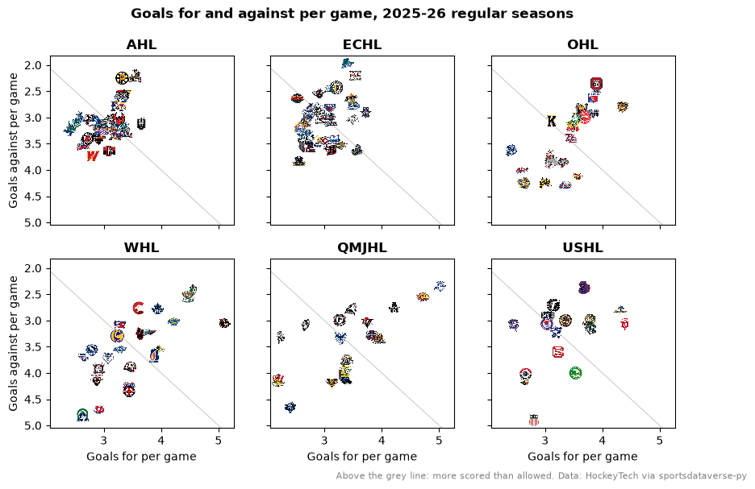
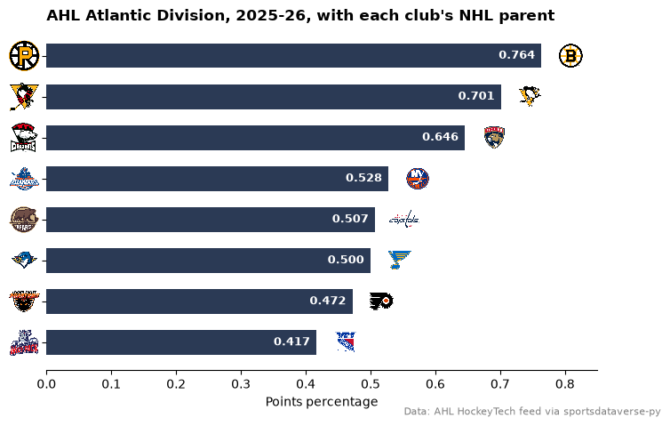
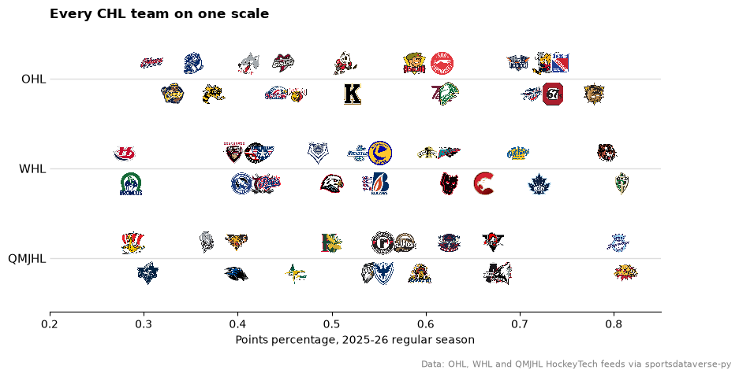
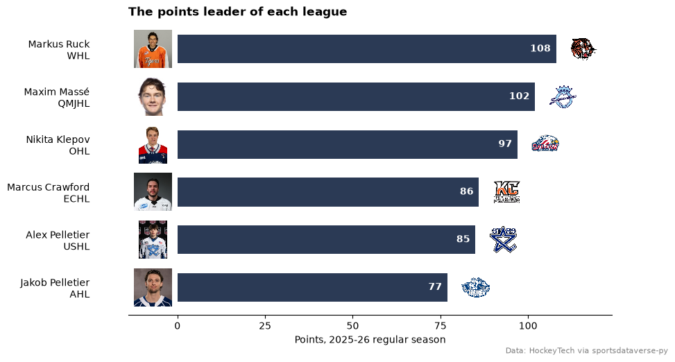
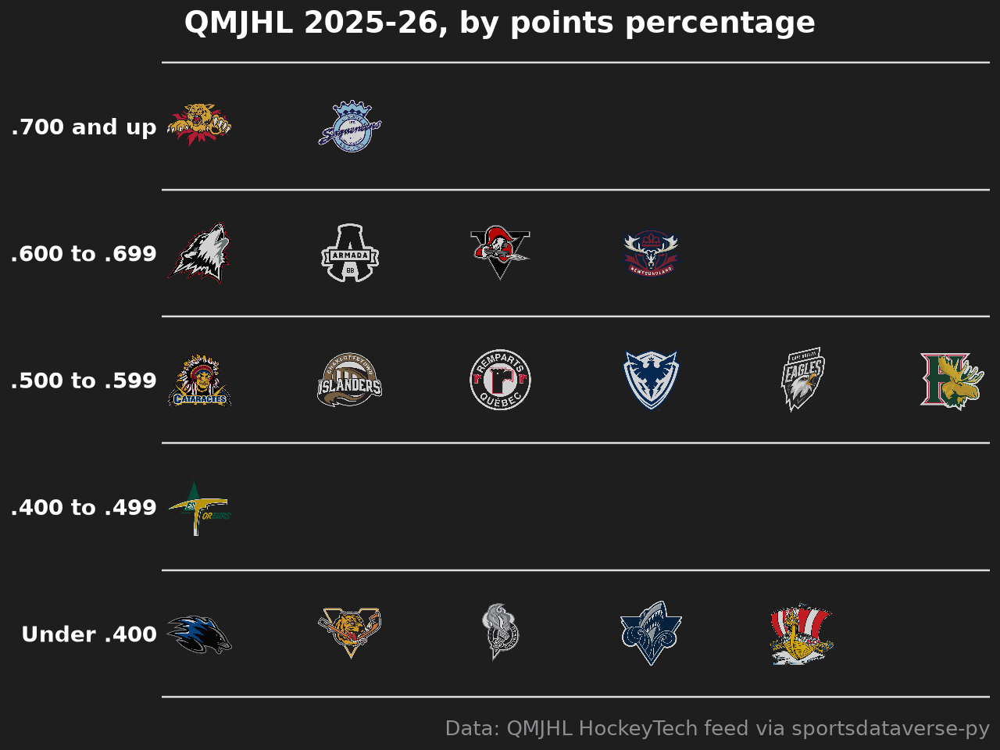

# AHL, ECHL and junior hockey

Eight charts and tables from the 2025-26 seasons of six North American leagues: the AHL and ECHL (the minor leagues
below the NHL), the three Canadian Hockey League circuits (OHL, WHL, QMJHL) and the USHL. All six run on the
HockeyTech stats platform, so sportsdataverse-py reads them with one family of functions
(`sdv.<league>_standings`, `<league>_leaders`, `<league>_schedule`, ...) and sdvplot knows their teams by HockeyTech id
and by name.

```python
import matplotlib.pyplot as plt
import polars as pl
import sportsdataverse as sdv

import sdvplot

SEASON = 2026  # the 2025-26 season, named by the year it ends
LEAGUES = {"ahl": "AHL", "echl": "ECHL", "ohl": "OHL", "whl": "WHL", "qmjhl": "QMJHL", "ushl": "USHL"}
```

## 1. Six leagues, one function each

`season=2026` asks HockeyTech for a season by its name, and for some leagues the first match is an all-star or
prospects event rather than the regular season. Pin each league's 2025-26 regular-season id instead (listed in the
league's own season feed). The standings prefix clinched teams with a marker (`x - Providence Bruins`); strip it and
the names resolve, which also gives each team's HockeyTech id.

```python
SEASON_IDS = {"ahl": 90, "echl": 73, "ohl": 83, "whl": 289, "qmjhl": 211, "ushl": 88}  # 2025-26 regular seasons


def load_standings(league):
    raw = getattr(sdv, f"{league}_standings")(season_id=SEASON_IDS[league])
    table = raw.select(
        pl.lit(league).alias("league"),
        pl.col("team").str.replace(r"^\w+ - ", "").alias("team"),
        pl.col("games_played").cast(pl.Int64).alias("gp"),
        pl.col("wins").cast(pl.Int64).alias("w"),
        pl.col("points").cast(pl.Int64),
        pl.col("goals_for").cast(pl.Int64).alias("gf"),
        pl.col("goals_against").cast(pl.Int64).alias("ga"),
    )
    return table.with_columns(team_id=sdvplot.resolve(table["team"], league, season=SEASON))


standings = pl.concat([load_standings(lg) for lg in LEAGUES]).with_columns(
    pct=pl.col("points") / (2 * pl.col("gp")),  # two points a game available
    gf_pg=pl.col("gf") / pl.col("gp"),
    ga_pg=pl.col("ga") / pl.col("gp"),
)
assert standings["team_id"].null_count() == 0
standings.group_by("league", maintain_order=True).agg(
    pl.len().alias("teams"),
    pl.col("gp").max().alias("games"),
    pl.col("team").sort_by("points", descending=True).first().alias("first_place"),
    pl.col("points").max().alias("points"),
)
```

<div class="sdv-output">

| league | teams | games | first_place           | points |
|--------|-------|-------|-----------------------|--------|
| ahl    | 32    | 72    | Providence Bruins     | 110    |
| echl   | 30    | 72    | Kansas City Mavericks | 115    |
| ohl    | 20    | 68    | Brantford Bulldogs    | 106    |
| whl    | 23    | 68    | Everett Silvertips    | 117    |
| qmjhl  | 18    | 64    | Moncton, Wildcats     | 104    |
| ushl   | 16    | 62    | Youngstown Phantoms   | 91     |

</div>

## 2. The AHL's top twelve

A great_tables standings table of the AHL's best twelve records, with `gt_sdv_logos` on the HockeyTech ids that
`resolve` returned and the Premier League-style `gt_theme_pl`.

```python
from great_tables import GT

from sdvplot.great_tables import gt_sdv_logos, gt_theme_pl

ahl = standings.filter(pl.col("league") == "ahl").sort("pct", "gf", descending=True).head(12)
gt = (
    GT(ahl.select(pl.col("team_id").alias("logo"), "team", "gp", "w", "points", "pct", "gf", "ga"))
    .tab_header("AHL standings, 2025-26", "The twelve best points percentages of the regular season")
    .fmt_number("pct", decimals=3)
    .cols_label(logo="", team="Team", gp="GP", w="W", points="PTS", pct="PTS%", gf="GF", ga="GA")
    .tab_source_note("Data: AHL HockeyTech feed via sportsdataverse-py")
)
gt_theme_pl(gt_sdv_logos(gt, "logo", league="ahl", height=24))
```

<div class="sdv-output">

<iframe class="sdv-frame" src="/outputs/tutorials/leagues/hockeytech/5_0.html" title="HTML output" height="480" loading="lazy"></iframe>

</div>

## 3. The same chart in six leagues

Goals for and against per game, one small multiple per league on shared axes, so the leagues compare directly. One
`add_logos` call per panel, each with its own `league`.

```python
fig, axes = plt.subplots(2, 3, figsize=(10, 6), sharex=True, sharey=True)
for ax, (league, label) in zip(axes.flat, LEAGUES.items(), strict=True):
    d = standings.filter(pl.col("league") == league)
    ax.scatter(d["gf_pg"], d["ga_pg"], alpha=0)
    ax.axline((3, 3), slope=1, color="#cccccc", lw=0.8, zorder=0)
    sdvplot.add_logos(ax, d["gf_pg"], d["ga_pg"], d["team_id"], league=league, season=SEASON, height=0.08)
    ax.set_title(label, fontweight="bold")
axes[0, 0].invert_yaxis()  # shared: flips every panel, so better defenses sit higher
for ax in axes[1]:
    ax.set_xlabel("Goals for per game")
for ax in axes[:, 0]:
    ax.set_ylabel("Goals against per game")
fig.suptitle("Goals for and against per game, 2025-26 regular seasons", fontweight="bold")
fig.text(
    0.99,
    0.005,
    "Above the grey line: more scored than allowed. Data: HockeyTech via sportsdataverse-py",
    ha="right",
    fontsize=8,
    color="grey",
)
plt.show()
```

<div class="sdv-output">



</div>

The AHL's goal differences run from -0.92 to +1.33 a game; the QMJHL's run from -2.25 to +2.67. The junior leagues
spread out about twice as far as the pro ones.

## 4. AHL clubs and their NHL parents

Every AHL club is an NHL team's top affiliate, so a chart can carry two leagues' logos: `axis_logos` with
`league="ahl"` on the y axis, `add_logos` with `league="nhl"` at the end of each bar. The affiliations are not in any
feed; here are the eight clubs of the AHL's Atlantic Division and their 2025-26 parents.

```python
PARENTS = {
    "Providence Bruins": "BOS",
    "Wilkes-Barre/Scranton Penguins": "PIT",
    "Charlotte Checkers": "FLA",
    "Hershey Bears": "WSH",
    "Lehigh Valley Phantoms": "PHI",
    "Springfield Thunderbirds": "STL",
    "Hartford Wolf Pack": "NYR",
    "Bridgeport Islanders": "NYI",
}
atlantic = (
    standings.filter((pl.col("league") == "ahl") & pl.col("team").is_in(list(PARENTS)))
    .with_columns(parent=pl.col("team").replace_strict(PARENTS))
    .sort("pct")
)
assert atlantic.height == len(PARENTS)
fig, ax = plt.subplots(figsize=(8, 5))
ax.barh(atlantic["team_id"], atlantic["pct"], color="#2b3a55", height=0.6)
sdvplot.axis_logos(ax, "y", league="ahl", season=SEASON, height=0.09)
sdvplot.add_logos(
    ax,
    (atlantic["pct"] + 0.045).to_list(),
    list(range(atlantic.height)),
    atlantic["parent"],
    league="nhl",
    season=SEASON,
    height=0.08,
)
for i, p in enumerate(atlantic["pct"]):
    ax.text(p - 0.01, i, f"{p:.3f}", va="center", ha="right", color="white", fontsize=9, fontweight="bold")
ax.set_xlim(0, 0.85)
ax.spines[["top", "right", "left"]].set_visible(False)
ax.set_xlabel("Points percentage")
ax.set_title("AHL Atlantic Division, 2025-26, with each club's NHL parent", loc="left", fontweight="bold")
fig.text(0.99, 0.01, "Data: AHL HockeyTech feed via sportsdataverse-py", ha="right", fontsize=8, color="grey")
plt.show()
```

<div class="sdv-output">



</div>

## 5. The CHL's three leagues on one scale

The OHL, WHL and QMJHL make up the Canadian Hockey League. Each team is a logo on a common points-percentage axis,
one row per league; alternate teams sit a little above and below the line so neighbours do not cover each other.

```python
chl = standings.filter(pl.col("league").is_in(["ohl", "whl", "qmjhl"])).sort("pct")
rows = {"qmjhl": 0, "whl": 1, "ohl": 2}
fig, ax = plt.subplots(figsize=(10, 5))
for league, row in rows.items():
    d = chl.filter(pl.col("league") == league).with_row_index("i")
    y = (row + pl.when(pl.col("i") % 2 == 0).then(0.17).otherwise(-0.17)).alias("y")
    d = d.with_columns(y)
    ax.hlines(row, 0.2, 0.85, color="#dddddd", lw=1, zorder=0)
    sdvplot.add_logos(ax, d["pct"], d["y"], d["team_id"], league=league, season=SEASON, height=0.085)
ax.set_xlim(0.2, 0.85)
ax.set_ylim(-0.6, 2.6)
ax.set_yticks(list(rows.values()), [LEAGUES[k] for k in rows])
ax.tick_params(axis="y", length=0, labelsize=11)
ax.spines[["top", "right", "left"]].set_visible(False)
ax.set_xlabel("Points percentage, 2025-26 regular season")
ax.set_title("Every CHL team on one scale", loc="left", fontweight="bold")
fig.subplots_adjust(bottom=0.15)
fig.text(
    0.99, 0.01, "Data: OHL, WHL and QMJHL HockeyTech feeds via sportsdataverse-py", ha="right", fontsize=8, color="grey"
)
plt.show()
```

<div class="sdv-output">



</div>

The WHL's Everett Silvertips (.860) had the best record in the CHL, ahead of Moncton (.812) in the QMJHL and Brantford
(.779) in the OHL.

## 6. Each league's scoring leader

The `<league>_leaders` feeds carry the top five scorers with a photo URL. One bar per league for its points leader,
the photo drawn with `add_images` and the team logo with `add_logos` (one call per league, since each row is a
different league).

```python
from sdvplot.matplotlib import add_images

tops = []
for league in LEAGUES:
    top = getattr(sdv, f"{league}_leaders")(season_id=SEASON_IDS[league]).filter(pl.col("type_formatted") == "Points")
    tops.append(
        top.sort("rank")
        .head(1)
        .select(
            pl.lit(league).alias("league"),
            "name",
            "team_id",
            "photo",
            pl.col("stat_formatted").cast(pl.Int64).alias("points"),
        )
    )
tops = pl.concat(tops).sort("points")
fig, ax = plt.subplots(figsize=(9, 5.5))
y = list(range(tops.height))
ax.barh(y, tops["points"], color="#2b3a55", height=0.6)
ax.set_yticks(y, [f"{n}\n{LEAGUES[lg]}" for n, lg in zip(tops["name"], tops["league"], strict=True)])
ax.tick_params(axis="y", length=0, pad=40)
ax.set_xlim(-14, tops["points"].max() + 16)
add_images(ax, [-7] * tops.height, y, tops["photo"], height=0.13)
for i, row in enumerate(tops.iter_rows(named=True)):
    sdvplot.add_logos(ax, [row["points"] + 8], [i], [row["team_id"]], league=row["league"], season=SEASON, height=0.1)
    ax.text(row["points"] - 1.5, i, str(row["points"]), va="center", ha="right", color="white", fontweight="bold")
ax.set_xticks([0, 25, 50, 75, 100])
ax.spines[["top", "right", "left"]].set_visible(False)
ax.set_xlabel("Points, 2025-26 regular season")
ax.set_title("The points leader of each league", loc="left", fontweight="bold")
fig.text(0.99, 0.01, "Data: HockeyTech via sportsdataverse-py", ha="right", fontsize=8, color="grey")
plt.show()
```

<div class="sdv-output">



</div>

## 7. The USHL, interactive with Bokeh

The USHL is the top junior league in the United States. Points against goal difference in a Bokeh figure: hover for
the record, zoom and the logos keep their size. `file_html` wraps the figure as a self-contained page.

```python
from bokeh.embed import file_html
from bokeh.models import ColumnDataSource, HoverTool
from bokeh.plotting import figure
from bokeh.resources import CDN
from IPython.display import HTML

ushl = standings.filter(pl.col("league") == "ushl").with_columns(
    diff=pl.col("gf") - pl.col("ga"), record=pl.format("{}-{} ({} pts)", "w", pl.col("gp") - pl.col("w"), "points")
)
p = figure(
    title="USHL 2025-26: points and goal difference",
    x_axis_label="Goal difference",
    y_axis_label="Points",
    width=760,
    frame_height=420,
    toolbar_location="right",
)
dots = p.scatter(
    "diff",
    "points",
    source=ColumnDataSource(ushl.select("team", "diff", "points", "record").to_pandas()),
    size=46,
    alpha=0,
)  # invisible targets for the hover tool, under the logos
p.add_tools(HoverTool(renderers=[dots], tooltips=[("", "@team"), ("Record", "@record"), ("Goal diff", "@diff")]))
sdvplot.add_logos(p, ushl["diff"], ushl["points"], ushl["team_id"], league="ushl", season=SEASON, height=0.1)
HTML(file_html(p, CDN, "USHL 2025-26"))
```

<div class="sdv-output">

<iframe class="sdv-frame" src="/outputs/tutorials/leagues/hockeytech/17_0.html" title="HTML output" height="480" loading="lazy"></iframe>

</div>

## 8. QMJHL tiers

A tier list of the QMJHL by points percentage, drawn with plotnine's `team_tiers`. The tier labels are the
points-percentage bands.

```python
from sdvplot.plotnine import team_tiers

qmjhl = (
    standings.filter(pl.col("league") == "qmjhl")
    .sort("pct", descending=True)
    .with_columns(
        tier_no=pl.when(pl.col("pct") >= 0.7)
        .then(1)
        .when(pl.col("pct") >= 0.6)
        .then(2)
        .when(pl.col("pct") >= 0.5)
        .then(3)
        .when(pl.col("pct") >= 0.4)
        .then(4)
        .otherwise(5)
    )
)
team_tiers(
    qmjhl.select(pl.col("team_id").alias("team"), "tier_no"),
    "qmjhl",
    title="QMJHL 2025-26, by points percentage",
    subtitle=None,
    caption="Data: QMJHL HockeyTech feed via sportsdataverse-py",
    tier_desc={1: ".700 and up", 2: ".600 to .699", 3: ".500 to .599", 4: ".400 to .499", 5: "Under .400"},
)
```

<div class="sdv-output">



</div>

## Run it yourself

<a href="pathname:///notebooks/leagues/hockeytech.ipynb" download>Download the notebook</a> (outputs cleared) or [open it on GitHub](https://github.com/sportsdataverse/sdvplot/blob/main/examples/notebooks/leagues/hockeytech.ipynb).
