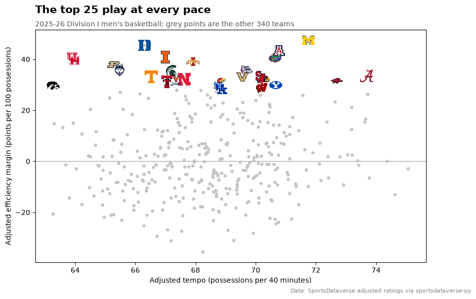
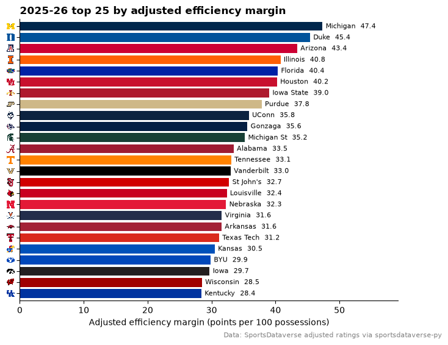
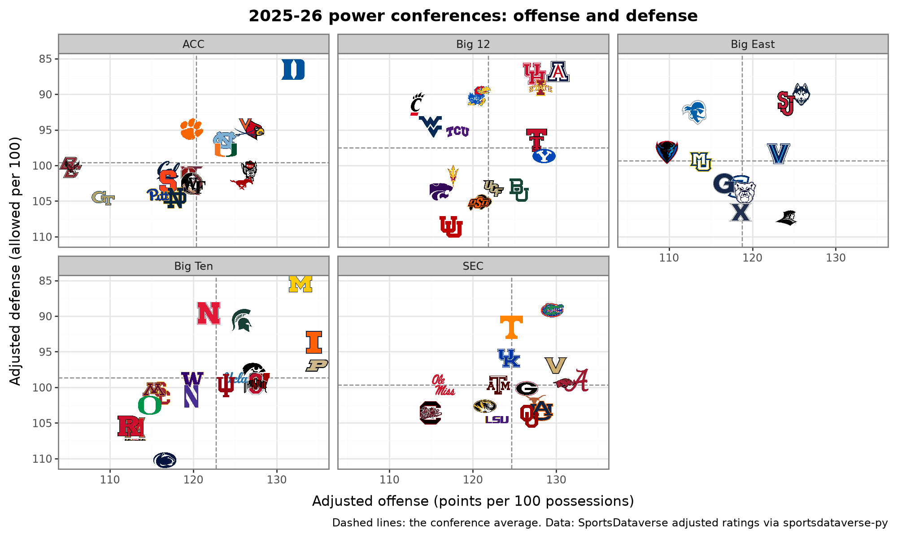
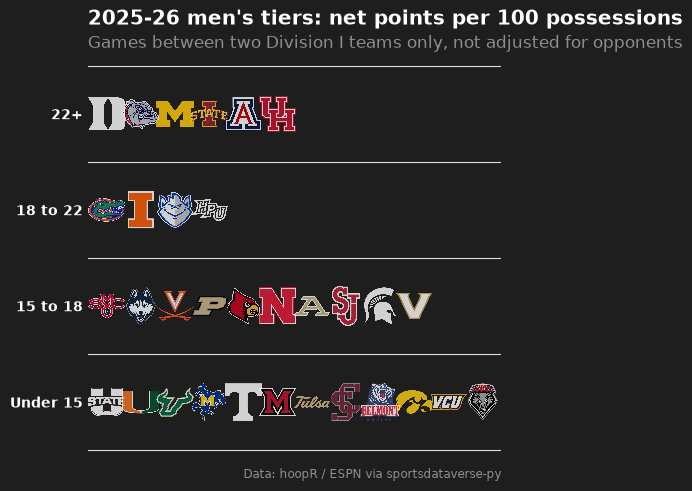
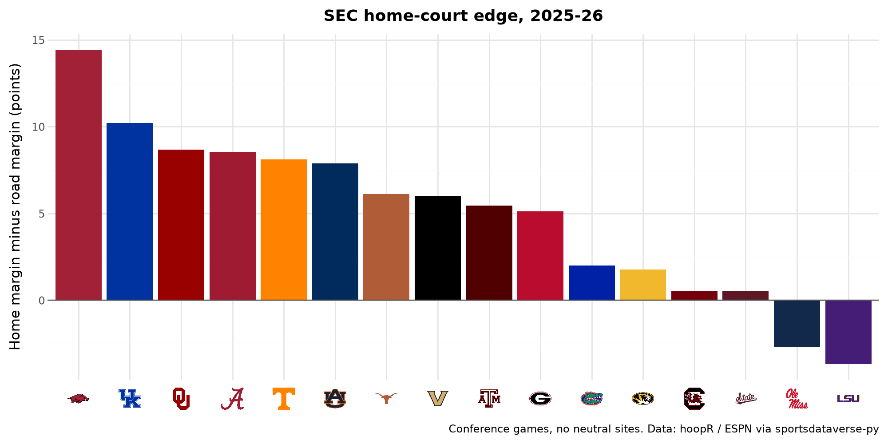
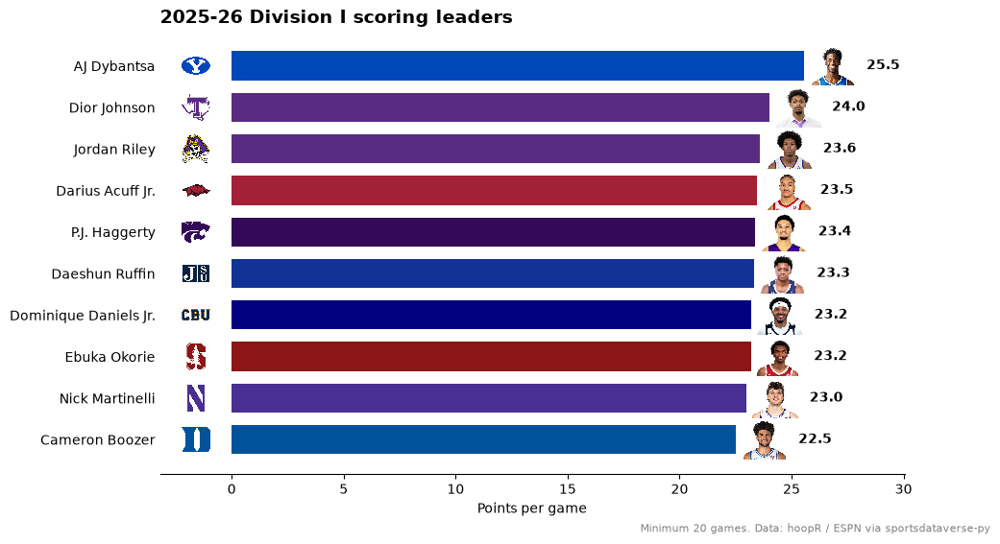

# Men's college basketball

Division I men's basketball has 365 teams in 31 conferences, and the conferences change from one season to the
next. These ten examples chart the 2025-26 season with logos, team colors and headshots: you will resolve ESPN
team ids, keep a 365-team chart legible, take each team's conference from the season's own standings, and finish with
an interactive March chart. The data are hoopR's ESPN box scores, schedules and standings and the
SportsDataverse adjusted ratings, read from GitHub release files by
[sportsdataverse-py](https://py.sportsdataverse.org).

```python
import warnings

import matplotlib.pyplot as plt
import polars as pl
import sportsdataverse.mbb as mbb

import sdvplot

SEASON = 2026  # the 2025-26 season: college seasons are named by the year they end
CAPTION = "Data: hoopR / ESPN via sportsdataverse-py"

ratings = mbb.load_mbb_ratings(SEASON)  # adjusted efficiency, one row per team
box = mbb.load_mbb_team_boxscore(SEASON)  # one row per team per game
standings = mbb.load_mbb_standings(SEASON)  # one row per team, conference and stat
ratings.height, box.height, standings.height
```

<div class="sdv-output">

```text
(727, 12598, 31332)
```

</div>

## 1. ESPN team ids, names and the unknown-team warning

College data carries ESPN team ids, and the index's `team_id` is that id as a string, so ids, abbreviations and
full names all resolve. Short names are where 360+ teams bite: "St. Mary's" matches nothing, so `resolve` gives
`None` with one `SdvplotWarning`, and `suggest` lists the candidates.

```python
values = [130, "MICH", "Michigan Wolverines", "UConn", "St. Mary's"]
with warnings.catch_warnings(record=True) as caught:
    warnings.simplefilter("always")
    print(sdvplot.resolve(values, "mbb"))
print(caught[0].message)
sdvplot.suggest("St. Mary's", "mbb")
```

<div class="sdv-output">

```text
['130', '130', '130', '41', None]
1 value(s) did not resolve to a mbb team: "St. Mary's" (unknown). Use sdvplot.suggest() for candidates, or strict=True to raise.
```

```text
[('2608', "Saint Mary's Gaels"),
 ('116', "Mount St. Mary's Mountaineers"),
 ('2900', 'St. Thomas Tommies'),
 ('2599', "St. John's Red Storm")]
```

</div>

The ratings rate every team that played a Division I team, including 362 non-Division I opponents with one to
three games each. The index holds the Division I programs only, so those ids come back `None` with one warning
for the whole column; dropping them keeps the 365 Division I teams. Each team's 2025-26 conference comes from
that season's standings (the College Basketball Crown is a postseason event, not a conference).

```python
with warnings.catch_warnings(record=True) as caught:
    warnings.simplefilter("always")
    ids = sdvplot.resolve(ratings["team_id"], "mbb")
print(str(caught[0].message)[:110], "...")

conference = (
    standings.filter(pl.col("group_name") != "College Basketball Crown")
    .select(pl.col("team_id").cast(pl.Utf8), conference=pl.col("group_name"))
    .unique()
)
d1 = (
    ratings.with_columns(team_id=ids)
    .drop_nulls("team_id")
    .join(conference, on="team_id", how="left")
    .join(sdvplot.teams("mbb").select("team_id", "short_name"), on="team_id")
    .with_columns(d1_rank=pl.col("adj_em").rank("ordinal", descending=True))
    .sort("d1_rank")
)
d1.select("d1_rank", "team_id", "short_name", "conference", "adj_o", "adj_d", "adj_em", "adj_tempo").head(5)
```

<div class="sdv-output">

```text
362 value(s) did not resolve to a mbb team: '148' (unknown), '2269' (unknown), '2732' (unknown), '144' (unknow ...
```

| d1_rank | team_id | short_name | conference                | adj_o      | adj_d     | adj_em    | adj_tempo |
|---------|---------|------------|---------------------------|------------|-----------|-----------|-----------|
| 1       | 130     | Michigan   | Big Ten Conference        | 132.865514 | 85.512749 | 47.352765 | 71.749339 |
| 2       | 150     | Duke       | Atlantic Coast Conference | 131.941151 | 86.52781  | 45.413341 | 66.292925 |
| 3       | 12      | Arizona    | Big 12 Conference         | 130.221557 | 86.81705  | 43.404507 | 70.777362 |
| 4       | 356     | Illinois   | Big Ten Conference        | 134.467074 | 93.68716  | 40.779914 | 66.999637 |
| 5       | 57      | Florida    | Southeastern Conference   | 129.531633 | 89.168277 | 40.363356 | 70.644167 |

</div>

## 2. Tempo against efficiency, with logos for the top 25

With 365 teams, logos for everyone would be a smear. Draw every team as a grey point and give logos only to the
top 25 by adjusted efficiency margin.

```python
top25 = d1.head(25)

fig, ax = plt.subplots(figsize=(10, 6))
ax.scatter(d1["adj_tempo"], d1["adj_em"], s=14, color="#c4c4c4", zorder=1)
ax.axhline(0, color="#999999", lw=0.8, zorder=0)
sdvplot.add_logos(ax, top25["adj_tempo"], top25["adj_em"], top25["team_id"], league="mbb", height=0.06)
ax.set_xlabel("Adjusted tempo (possessions per 40 minutes)")
ax.set_ylabel("Adjusted efficiency margin (points per 100 possessions)")
ax.set_title("The top 25 play at every pace", loc="left", fontsize=15, fontweight="bold", pad=24)
ax.text(
    0,
    1.015,
    "2025-26 Division I men's basketball; grey points are the other 340 teams",
    transform=ax.transAxes,
    fontsize=10,
    color="#555555",
)
fig.text(
    0.99, 0.01, "Data: SportsDataverse adjusted ratings via sportsdataverse-py", ha="right", fontsize=8, color="grey"
)
plt.show()
```

<div class="sdv-output">



</div>

## 3. A ranked top 25 with logos on the axis

`axis_logos` swaps an axis' team labels for logos, so the bars keep their order and the labels stay short:
plot the `team_id` strings as categories, then replace them.

```python
bars = top25.reverse()  # barh draws from the bottom up

fig, ax = plt.subplots(figsize=(8, 6))
ax.barh(bars["team_id"], bars["adj_em"], color=sdvplot.team_colors(bars["team_id"].to_list(), "mbb"))
for y, (value, name) in enumerate(zip(bars["adj_em"], bars["short_name"], strict=True)):
    ax.text(value + 0.5, y, f"{name}  {value:.1f}", va="center", fontsize=8)
sdvplot.axis_logos(ax, "y", league="mbb", height=0.032)
ax.set_xlim(0, bars["adj_em"].max() * 1.25)
ax.margins(y=0.01)
ax.spines[["top", "right"]].set_visible(False)
ax.set_xlabel("Adjusted efficiency margin (points per 100 possessions)")
ax.set_title("2025-26 top 25 by adjusted efficiency margin", loc="left", fontweight="bold")
fig.text(
    0.99, 0.01, "Data: SportsDataverse adjusted ratings via sportsdataverse-py", ha="right", fontsize=8, color="grey"
)
plt.show()
```

<div class="sdv-output">



</div>

## 4. The power conferences, one panel each (plotnine)

A conference is the natural small multiple: its 11 to 18 logos fit in one panel. `geom_sdv_logos` maps the team as an
aesthetic, so it follows `facet_wrap`, and `geom_mean_lines` draws each conference's own averages. Defense is
points allowed, so its axis is reversed to put good defenses on top.

```python
from plotnine import aes, element_text, facet_wrap, ggplot, labs, scale_y_reverse, theme, theme_bw

from sdvplot.plotnine import geom_mean_lines, geom_sdv_logos

POWER = {
    "Atlantic Coast Conference": "ACC",
    "Big 12 Conference": "Big 12",
    "Big East Conference": "Big East",
    "Big Ten Conference": "Big Ten",
    "Southeastern Conference": "SEC",
}
power = d1.filter(pl.col("conference").is_in(list(POWER))).with_columns(pl.col("conference").replace_strict(POWER))

(
    ggplot(power.to_pandas(), aes("adj_o", "adj_d", team="team_id", x0="adj_o", y0="adj_d"))
    + geom_mean_lines(color="#888888")
    + geom_sdv_logos(league="mbb", height=0.13)
    + facet_wrap("conference", ncol=3)
    + scale_y_reverse()
    + labs(
        x="Adjusted offense (points per 100 possessions)",
        y="Adjusted defense (allowed per 100)",
        title="2025-26 power conferences: offense and defense",
        caption="Dashed lines: the conference average. Data: SportsDataverse adjusted ratings via sportsdataverse-py",
    )
    + theme_bw()
    + theme(figure_size=(10, 6), plot_title=element_text(weight="bold", size=13))
)
```

<div class="sdv-output">



</div>

## 5. Conference realignment, season by season

The index's `conference` column is today's. A past season's conference comes from that season's data. Load
three seasons of standings and follow the twelve teams of the 2023-24 Pac-12: ten left for the ACC, Big 12
and Big Ten in 2024, Oregon State and Washington State spent two seasons in the West Coast Conference, and
the index already lists the rebuilt Pac-12 those two anchor.

```python
from great_tables import GT

from sdvplot.great_tables import gt_sdv_logos, gt_theme_sdv

history = mbb.load_mbb_standings([2024, 2025, 2026])
by_season = (
    history.filter(pl.col("group_name") != "College Basketball Crown")
    .select(
        pl.col("season").cast(pl.Utf8),
        pl.col("team_id").cast(pl.Utf8),  # an integer id, so the string has no ".0"
        pl.col("group_name").str.replace(" Conference$", ""),
    )
    .unique()
    .pivot(on="season", index="team_id", values="group_name")
)
index = sdvplot.teams("mbb").select("team_id", "short_name", today=pl.col("conference").str.replace(" Conference$", ""))
pac12 = (
    by_season.filter(pl.col("2024") == "Pac-12")
    .join(index, on="team_id")
    .select("team_id", "short_name", "2024", "2025", "2026", "today")
    .sort("2025", "short_name")
)

(
    GT(pac12)
    .pipe(gt_sdv_logos, "team_id", league="mbb", height=26)
    .cols_label(
        team_id="",
        short_name="Team",
        **{"2024": "2023-24", "2025": "2024-25", "2026": "2025-26"},
        today="In the index today",
    )
    .tab_header("Where the 2023-24 Pac-12 went", "Conference by season, from each season's ESPN standings")
    .tab_source_note(CAPTION)
    .pipe(gt_theme_sdv)
)
```

<div class="sdv-output">

<iframe class="sdv-frame" src="/outputs/tutorials/leagues/mbb/13_0.html" title="HTML output" height="480" loading="lazy"></iframe>

</div>

## 6. A conference standings table with logos and team colors

The Big Ten's 2025-26 standings: the conference-tournament seed, the conference and overall records, the scoring
margin and the adjusted efficiency margin. `gt_merge_stack_team_color` puts each record under the team name in
the team's color.

```python
from sdvplot.great_tables import gt_color_pills, gt_merge_stack_team_color, gt_theme_ncaa

b10 = standings.filter(pl.col("group_name") == "Big Ten Conference").with_columns(pl.col("team_id").cast(pl.Utf8))
numbers = b10.filter(pl.col("stat_type").is_in(["playoffseed", "pointdifferential", "wins", "losses"])).pivot(
    on="stat_type", index="team_id", values="value"
)
records = b10.filter(pl.col("stat_type").is_in(["total", "vsconf"])).pivot(
    on="stat_type", index="team_id", values="display_value"
)
big_ten = (
    numbers.join(records, on="team_id")
    .join(d1.select("team_id", "short_name", "adj_em", "d1_rank"), on="team_id")
    .select(
        seed=pl.col("playoffseed").cast(pl.Int64),
        team_id="team_id",
        short_name="short_name",
        overall=pl.col("total") + " overall",
        conf="vsconf",
        margin=pl.col("pointdifferential") / (pl.col("wins") + pl.col("losses")),
        adj_em="adj_em",
        d1_rank="d1_rank",
    )
    .sort("seed")
)

(
    GT(big_ten)
    .pipe(gt_merge_stack_team_color, "short_name", "overall", "team_id", league="mbb")
    .pipe(gt_sdv_logos, "team_id", league="mbb", height=30)
    .fmt_number("adj_em", decimals=1, force_sign=True)
    .pipe(gt_color_pills, "margin", digits=1, domain=[-18, 18])
    .cols_label(
        seed="Seed",
        team_id="",
        short_name="Team",
        conf="Big Ten",
        margin="Margin / game",
        adj_em="Adj. EM",
        d1_rank="D-I rank",
    )
    .tab_header("Big Ten standings, 2025-26", "Seeded for the Big Ten tournament")
    .tab_source_note(CAPTION + "; Adj. EM: SportsDataverse adjusted ratings")
    .pipe(gt_theme_ncaa)
)
```

<div class="sdv-output">

<iframe class="sdv-frame" src="/outputs/tutorials/leagues/mbb/15_0.html" title="HTML output" height="480" loading="lazy"></iframe>

</div>

## 7. Team tiers from a rating you compute

Box scores are enough for a simple rating: points scored minus allowed per 100 possessions, counting only games
between two Division I teams. Possessions use the common estimate FGA - OREB + TO + 0.475 x FTA. `team_tiers`
draws the 32 best in tiers on sdvplotR's dark Tiermaker theme.

```python
from sdvplot.matplotlib import team_tiers

d1_ids = d1["team_id"].to_list()
games = box.with_columns(pl.col("team_id", "opponent_team_id").cast(pl.Utf8)).filter(
    pl.col("team_id").is_in(d1_ids) & pl.col("opponent_team_id").is_in(d1_ids)
)
net = (
    games.with_columns(
        poss=pl.col("field_goals_attempted")
        - pl.col("offensive_rebounds")
        + pl.col("total_turnovers")
        + 0.475 * pl.col("free_throws_attempted")
    )
    .group_by("team_id", maintain_order=True)
    .agg(net=100 * (pl.col("team_score").sum() - pl.col("opponent_team_score").sum()) / pl.col("poss").sum())
    .sort("net", descending=True)
    .head(32)
    .with_columns(
        tier_no=pl.when(pl.col("net") >= 22)
        .then(1)
        .when(pl.col("net") >= 18)
        .then(2)
        .when(pl.col("net") >= 15)
        .then(3)
        .otherwise(4)
    )
    .rename({"team_id": "team"})
)

fig = team_tiers(
    net.to_pandas(),
    "mbb",
    title="2025-26 men's tiers: net points per 100 possessions",
    subtitle="Games between two Division I teams only, not adjusted for opponents",
    caption=CAPTION,
    tier_desc={1: "22+", 2: "18 to 22", 3: "15 to 18", 4: "Under 15"},
)
plt.show()
```

<div class="sdv-output">



</div>

## 8. Home-court edge in team colors (plotnine)

A home-court edge is a team's average margin at home minus its average margin on the road. Conference games
only, so home and road opponents come from the same league, and no neutral sites (both flags come from the
schedule, joined on `game_id`). `scale_fill_sdv` fills each bar with the team's color and `axis_logos` labels
the axis. Nine home and nine road games a team are a small sample, so read the order loosely.

```python
from plotnine import geom_col, geom_hline, scale_x_discrete, theme_minimal

from sdvplot.plotnine import axis_logos, scale_fill_sdv

schedule = mbb.load_mbb_schedule(SEASON)
assert box.schema["game_id"] == schedule.schema["game_id"]  # join keys of one dtype
sec = d1.filter(pl.col("conference") == "Southeastern Conference")["team_id"].to_list()
edge = (
    box.join(schedule.select("game_id", "neutral_site", "conference_competition"), on="game_id")
    .filter(pl.col("conference_competition") & ~pl.col("neutral_site"))
    .with_columns(pl.col("team_id").cast(pl.Utf8), margin=pl.col("team_score") - pl.col("opponent_team_score"))
    .filter(pl.col("team_id").is_in(sec))
    .group_by("team_id", maintain_order=True)
    .agg(
        home=pl.col("margin").filter(pl.col("team_home_away") == "home").mean(),
        road=pl.col("margin").filter(pl.col("team_home_away") == "away").mean(),
    )
    .with_columns(edge=pl.col("home") - pl.col("road"))
    .sort(["edge", "team_id"], descending=[True, False])
)

p = (
    ggplot(edge.to_pandas(), aes("team_id", "edge", fill="team_id"))
    + geom_col(show_legend=False)
    + geom_hline(yintercept=0, color="#555555")
    + scale_x_discrete(limits=edge["team_id"].to_list())
    + scale_fill_sdv("mbb")
    + labs(
        x="",
        y="Home margin minus road margin (points)",
        title="SEC home-court edge, 2025-26",
        caption="Conference games, no neutral sites. " + CAPTION,
    )
    + theme_minimal()
    + theme(figure_size=(10, 5), plot_title=element_text(weight="bold", size=13))
)
axis_logos(p, "x", league="mbb", height=0.07)
```

<div class="sdv-output">



</div>

## 9. Scoring leaders with headshots

Player box scores carry ESPN athlete ids, which `add_headshots` turns into headshots; the team logo sits left of
each bar. Leaders need at least 20 games.

```python
players = mbb.load_mbb_player_boxscore(SEASON)
leaders = (
    players.filter(~pl.col("did_not_play"))
    .with_columns(pl.col("team_id", "athlete_id").cast(pl.Utf8))
    .group_by("athlete_id", "athlete_display_name", "team_id", maintain_order=True)
    .agg(games=pl.len(), ppg=pl.col("points").mean())
    .filter((pl.col("games") >= 20) & pl.col("team_id").is_in(d1_ids))
    .sort("ppg", descending=True)
    .head(10)
    .reverse()
)

fig, ax = plt.subplots(figsize=(10, 6))
y = list(range(leaders.height))
ax.barh(y, leaders["ppg"], color=sdvplot.team_colors(leaders["team_id"].to_list(), "mbb"), height=0.7)
sdvplot.add_logos(ax, [-1.6] * leaders.height, y, leaders["team_id"], league="mbb", height=0.07)
sdvplot.add_headshots(ax, leaders["ppg"] + 1.3, y, leaders["athlete_id"], league="mbb", height=0.09)
for yi, ppg in zip(y, leaders["ppg"], strict=True):
    ax.text(ppg + 2.8, yi, f"{ppg:.1f}", va="center", fontsize=10, fontweight="bold")
ax.set_yticks(y, leaders["athlete_display_name"].to_list())
ax.set_xlim(-3.2, leaders["ppg"].max() + 4.5)
ax.spines[["top", "right", "left"]].set_visible(False)
ax.tick_params(axis="y", length=0)
ax.set_xlabel("Points per game")
ax.set_title("2025-26 Division I scoring leaders", loc="left", fontsize=14, fontweight="bold")
fig.text(0.99, 0.01, "Minimum 20 games. " + CAPTION, ha="right", fontsize=8, color="grey")
plt.show()
```

<div class="sdv-output">



</div>

## 10. March: every team's tournament run, interactive (Altair)

The schedule's `notes_headline` names each NCAA tournament game's round, so each team's last round is its exit
(the title-game winner is the champion). An interactive chart can show all 365 teams at once: hover a point for
the team, its conference and how far it went; drag to pan, scroll to zoom. Logos mark the Final Four.

```python
import altair as alt

ROUNDS = ["First Four", "1st Round", "2nd Round", "Sweet 16", "Elite 8", "Final Four", "National Championship"]
ncaa = schedule.filter(pl.col("notes_headline").str.starts_with("NCAA Men's Basketball Championship")).with_columns(
    round_no=pl.col("notes_headline").str.split(" - ").list.last().replace_strict(ROUNDS, list(range(7)))
)
sides = [
    ncaa.select(pl.col(f"{side}_id").cast(pl.Utf8).alias("team_id"), "round_no", won=pl.col(f"{side}_winner"))
    for side in ("home", "away")
]
runs = (
    pl.concat(sides)
    .group_by("team_id", maintain_order=True)
    .agg(pl.col("round_no").max(), champion=pl.col("won").filter(pl.col("round_no") == 6).any())
    .with_columns(
        tournament=pl.when(pl.col("champion"))
        .then(pl.lit("Champion"))
        .otherwise(pl.col("round_no").replace_strict(list(range(7)), ROUNDS[:-1] + ["Runner-up"]))
    )
)
print(runs.height, "teams in the field;", runs.filter(pl.col("champion"))["team_id"].to_list(), "won it")

ORDER = [
    "Champion",
    "Runner-up",
    "Final Four",
    "Elite 8",
    "Sweet 16",
    "2nd Round",
    "1st Round",
    "First Four",
    "Not in the field",
]
COLORS = ["#0d0887", "#5302a3", "#8b0aa5", "#b83289", "#db5c68", "#f48849", "#febd2a", "#2a9d8f", "#dddddd"]
field = d1.join(runs.select("team_id", "tournament"), on="team_id", how="left").with_columns(
    pl.col("tournament").fill_null("Not in the field")
)


def padded(col, pad=2.5):  # a fixed domain with room for the logos at the edges
    return [field[col].min() - pad, field[col].max() + pad]


points = (
    alt.Chart(
        field.to_pandas(),
        title=alt.Title(
            "2025-26: offense, defense and how far each team went",
            subtitle=CAPTION + "; adjusted ratings: SportsDataverse",
        ),
    )
    .mark_circle(size=70, opacity=0.9, stroke="white", strokeWidth=0.5)
    .encode(
        x=alt.X(
            "adj_o",
            title="Adjusted offense (points per 100 possessions)",
            scale=alt.Scale(domain=padded("adj_o"), nice=False),
        ),
        y=alt.Y(
            "adj_d",
            title="Adjusted defense (allowed per 100)",
            scale=alt.Scale(domain=padded("adj_d"), nice=False, reverse=True),
        ),
        color=alt.Color("tournament", title="NCAA tournament", sort=ORDER, scale=alt.Scale(domain=ORDER, range=COLORS)),
        order=alt.Order("adj_em"),
        tooltip=["short_name", "conference", "tournament", alt.Tooltip("adj_em", format="+.1f", title="Adj. EM")],
    )
    .properties(width=620, height=420)
    .interactive()
)
final_four = field.filter(pl.col("tournament").is_in(ORDER[:3]))
sdvplot.add_logos(points, final_four["adj_o"], final_four["adj_d"], final_four["team_id"], league="mbb", height=0.08)
```

<div class="sdv-output">

```text
68 teams in the field; ['130'] won it
```

<iframe class="sdv-frame" src="/outputs/tutorials/leagues/mbb/23_1.html" title="HTML output" height="480" loading="lazy"></iframe>

</div>

## Run it yourself

<a href="pathname:///notebooks/leagues/mbb.ipynb" download>Download the notebook</a> (outputs cleared) or [open it on GitHub](https://github.com/sportsdataverse/sdvplot/blob/main/examples/notebooks/leagues/mbb.ipynb).
