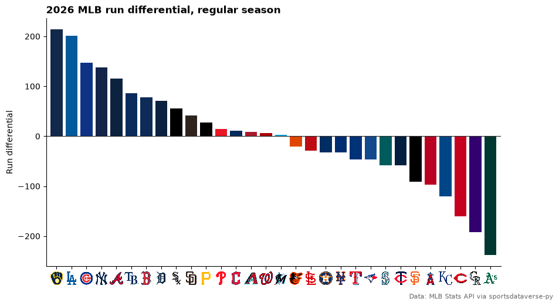
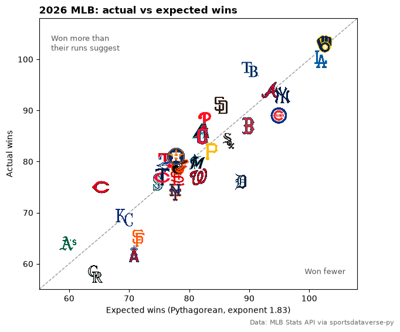
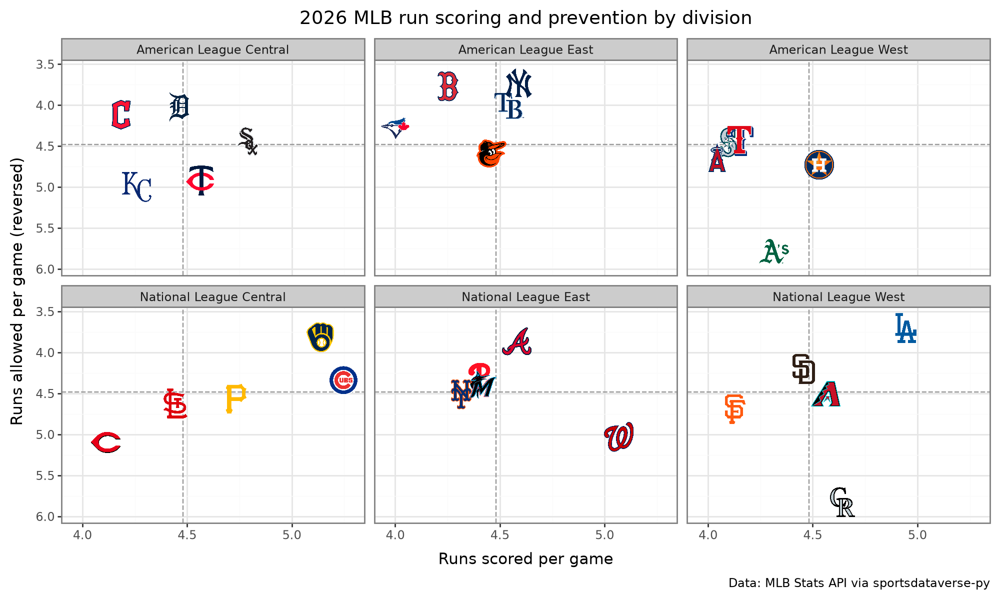
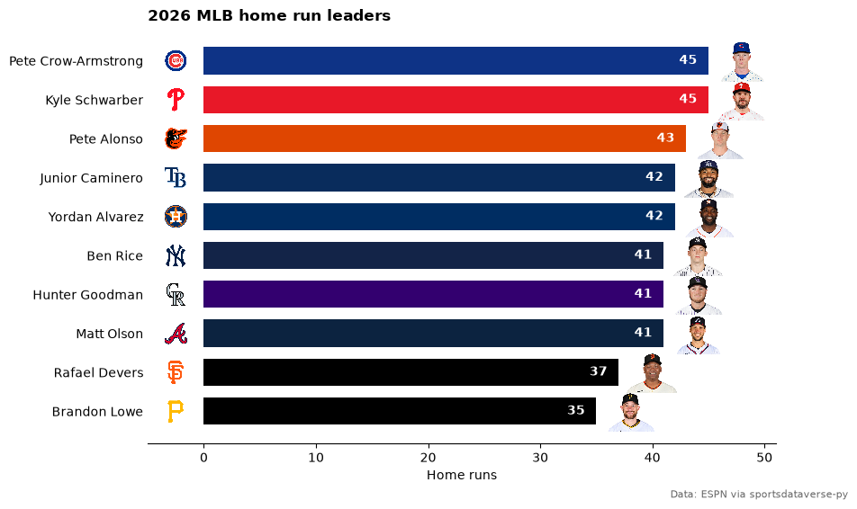
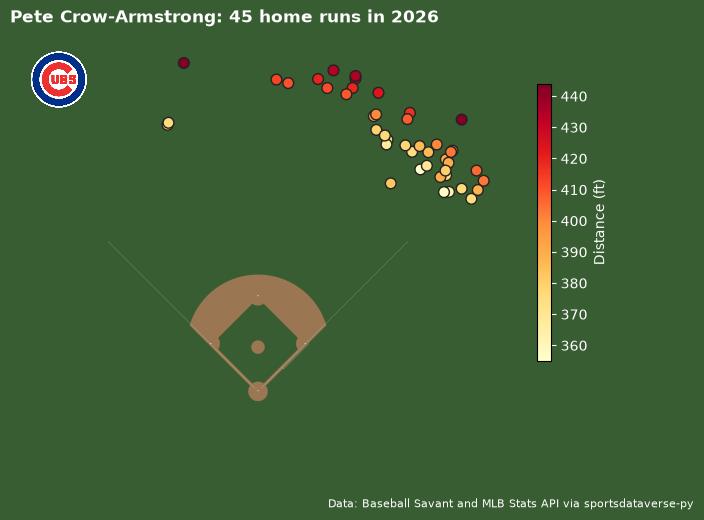
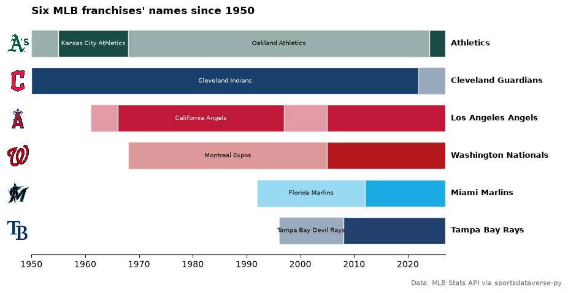
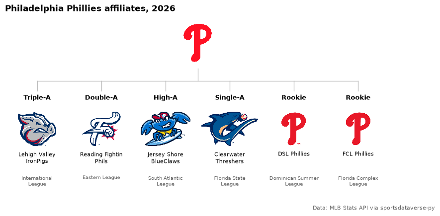
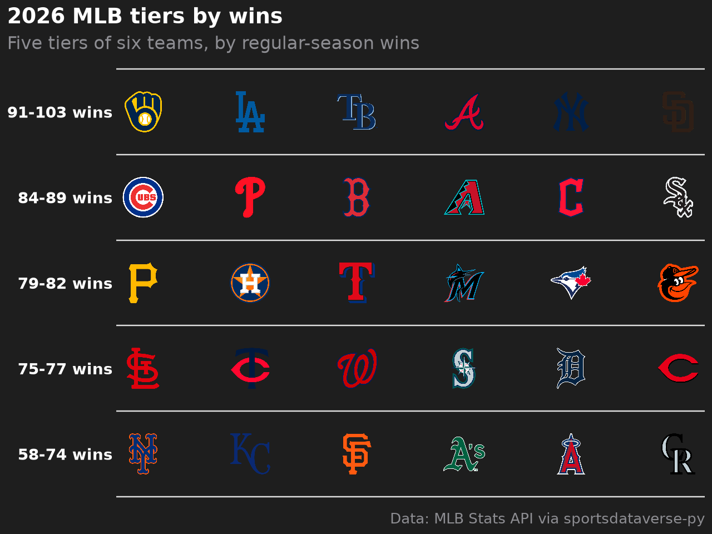

# MLB and MiLB

Ten worked examples on the 2026 MLB regular season: standings and run differential from the MLB Stats API, Statcast
leaderboards and batted balls from Baseball Savant, ESPN leaders with headshots, franchise eras, and one club's
minor-league affiliates. Every dataset comes through [sportsdataverse-py](https://py.sportsdataverse.org/) and needs no
API key.

```python
import matplotlib.pyplot as plt
import polars as pl
import sportsdataverse.mlb as mlb

import sdvplot

SEASON = 2026  # the 2026 regular season is complete
STATS_API = "Data: MLB Stats API via sportsdataverse-py"
```

The standings come from the Stats API with each team's division attached (`hydrate="division"`); the teams endpoint
adds the club abbreviation. Both sides key on the Stats API team id, so check the dtypes before the join.

```python
standings = mlb.parse_mlb_api_standings(mlb.mlb_standings(season=SEASON, hydrate="division"))
clubs = mlb.parse_mlb_api_teams(mlb.mlb_teams(season=SEASON)).select(pl.col("id").alias("team_id"), "abbreviation")
assert standings.schema["team_id"] == clubs.schema["team_id"]

standings = standings.join(clubs, on="team_id").select(
    "team_id",
    "abbreviation",
    "team_name",
    division="standings_division_name",
    rank=pl.col("division_rank").cast(pl.Int64),
    w="wins",
    l="losses",
    pct="winning_percentage",
    gb="games_back",
    rs="runs_scored",
    ra="runs_allowed",
    diff="run_differential",
    strk="streak_streak_code",
)
standings.sort("diff", descending=True).head()
```

<div class="sdv-output">

| team_id | abbreviation | team_name | division                | rank | w   | l  | pct  | gb   | rs  | ra  | diff | strk |
|---------|--------------|-----------|-------------------------|------|-----|----|------|------|-----|-----|------|------|
| 158     | MIL          | Brewers   | National League Central | 1    | 103 | 59 | .636 | -    | 832 | 618 | 214  | W5   |
| 119     | LAD          | Dodgers   | National League West    | 1    | 100 | 62 | .617 | -    | 801 | 600 | 201  | W3   |
| 112     | CHC          | Cubs      | National League Central | 2    | 89  | 73 | .549 | 14.0 | 850 | 703 | 147  | W1   |
| 147     | NYY          | Yankees   | American League East    | 2    | 93  | 68 | .578 | 4.5  | 739 | 601 | 138  | W1   |
| 144     | ATL          | Braves    | National League East    | 1    | 94  | 68 | .580 | -    | 742 | 626 | 116  | L1   |

</div>

## 1. Run differential in team colors

`team_colors` takes the Stats API abbreviations as they come, and `axis_logos` swaps the x tick labels for logos.

```python
rd = standings.sort("diff", descending=True)

fig, ax = plt.subplots(figsize=(10, 5.5))
ax.bar(rd["abbreviation"], rd["diff"], color=sdvplot.team_colors("mlb", rd["abbreviation"].to_list()))
ax.axhline(0, color="#222222", linewidth=0.8)
ax.set_ylabel("Run differential")
ax.margins(x=0.01)
ax.spines[["top", "right"]].set_visible(False)
ax.set_title(f"{SEASON} MLB run differential, regular season", loc="left", fontweight="bold")
fig.text(0.99, 0.01, STATS_API, ha="right", fontsize=8, color="#666666")
sdvplot.axis_logos(ax, "x", league="mlb", height=0.06)
plt.show()
```

<div class="sdv-output">



</div>

## 2. Division standings table

A great_tables table grouped by division, with `gt_sdv_logos` turning the abbreviation column into logos and the
Baseball Savant look from `gt_theme_savant`. The theme goes on first and the run-differential fill after it, so the
theme's styling cannot replace the fill. The theme's row stripes are also switched off (extra keywords go to
`tab_options`): in notebook output great_tables marks its CSS `!important`, so stripes would cover the fill on every
other row.

```python
from great_tables import GT

from sdvplot.great_tables import gt_sdv_logos, gt_theme_savant

table = standings.sort("division", "rank").select(
    "division", "abbreviation", "team_name", "w", "l", "pct", "gb", "rs", "ra", "diff", "strk"
)
gt = gt_theme_savant(
    GT(table, groupname_col="division")
    .cols_label(
        abbreviation="",
        team_name="Team",
        w="W",
        l="L",
        pct="Pct",
        gb="GB",
        rs="RS",
        ra="RA",
        diff="Diff",
        strk="Streak",
    )
    .tab_header(title=f"{SEASON} MLB standings", subtitle="Final regular-season standings by division")
    .tab_source_note(STATS_API),
    row_striping_include_table_body=False,
)
gt = gt_sdv_logos(gt, "abbreviation", league="mlb", height=24)
gt.data_color(columns="diff", palette=["#c84630", "#ffffff", "#2a7ab9"], domain=[-250, 250])
```

<div class="sdv-output">

<iframe class="sdv-frame" src="/outputs/tutorials/leagues/mlb/7_0.html" title="HTML output" height="480" loading="lazy"></iframe>

</div>

## 3. Pythagorean wins: who beat their run differential

Expected wins from runs scored and allowed (the 1.83 exponent) against actual wins. `add_logos` puts each logo at its
point; set the axis limits first, since images do not move the autoscaling.

```python
pyth = standings.with_columns(
    xw=(pl.col("rs") ** 1.83 / (pl.col("rs") ** 1.83 + pl.col("ra") ** 1.83)) * (pl.col("w") + pl.col("l"))
)
lo, hi = 55, 108

fig, ax = plt.subplots(figsize=(7, 6))
ax.plot([lo, hi], [lo, hi], color="#999999", linestyle="--", linewidth=1)
ax.set_xlim(lo, hi)
ax.set_ylim(lo, hi)
ax.set_xlabel("Expected wins (Pythagorean, exponent 1.83)")
ax.set_ylabel("Actual wins")
ax.text(lo + 2, hi - 3, "Won more than\ntheir runs suggest", fontsize=9, color="#555555", va="top")
ax.text(hi - 2, lo + 3, "Won fewer", fontsize=9, color="#555555", ha="right")
ax.set_title(f"{SEASON} MLB: actual vs expected wins", loc="left", fontweight="bold")
fig.text(0.99, 0.01, STATS_API, ha="right", fontsize=8, color="#666666")
sdvplot.add_logos(ax, pyth["xw"], pyth["w"], pyth["abbreviation"], league="mlb", height=0.07)
plt.show()
```

<div class="sdv-output">



</div>

```python
pyth.select("abbreviation", "w", xw=pl.col("xw").round(1), luck=(pl.col("w") - pl.col("xw")).round(1)).sort(
    "luck", descending=True
).head(5)
```

<div class="sdv-output">

| abbreviation | w  | xw   | luck |
|--------------|----|------|------|
| CIN          | 75 | 65.2 | 9.8  |
| TB           | 98 | 90.2 | 7.8  |
| SD           | 91 | 85.3 | 5.7  |
| PHI          | 88 | 82.6 | 5.4  |
| ATH          | 64 | 59.8 | 4.2  |

</div>

## 4. Runs scored and allowed, one panel per division

plotnine with `geom_sdv_logos`: the team aesthetic takes the abbreviation, and `facet_wrap` splits the league into its
six divisions. The y axis is reversed so better run prevention sits higher, and the dashed lines mark the MLB average.

```python
from plotnine import (
    aes,
    facet_wrap,
    geom_hline,
    geom_vline,
    ggplot,
    labs,
    scale_x_continuous,
    scale_y_reverse,
    theme,
    theme_bw,
)

from sdvplot.plotnine import geom_sdv_logos

per_game = standings.with_columns(
    rs_g=pl.col("rs") / (pl.col("w") + pl.col("l")), ra_g=pl.col("ra") / (pl.col("w") + pl.col("l"))
)
(
    ggplot(per_game.to_pandas(), aes("rs_g", "ra_g", team="abbreviation"))
    + geom_vline(xintercept=per_game["rs_g"].mean(), linetype="dashed", color="#999999")
    + geom_hline(yintercept=per_game["ra_g"].mean(), linetype="dashed", color="#999999")
    + geom_sdv_logos(league="mlb", height=0.15)
    + scale_x_continuous(expand=(0.08, 0))
    + scale_y_reverse(expand=(0.12, 0))
    + facet_wrap("division", ncol=3)
    + labs(
        x="Runs scored per game",
        y="Runs allowed per game (reversed)",
        title=f"{SEASON} MLB run scoring and prevention by division",
        caption=STATS_API,
    )
    + theme_bw()
    + theme(figure_size=(10, 6))
)
```

<div class="sdv-output">



</div>

## 5. Statcast: team wOBA against expected wOBA (interactive)

Baseball Savant's expected-statistics leaderboard at the team level (`type="batter-team"`). Its `team_id` column holds
abbreviations, which `resolve` maps like any other. The Plotly adapter adds each logo as a layout image; hover a point
for the numbers.

```python
import plotly.graph_objects as go

xstats = mlb.mlb_statcast_leaderboard_expected_stats(type="batter-team", year=SEASON)
both = pl.concat([xstats["woba"], xstats["est_woba"]])
lo, hi = both.min() - 0.005, both.max() + 0.005

fig = go.Figure(
    go.Scatter(
        x=xstats["est_woba"],
        y=xstats["woba"],
        mode="markers",
        marker={"opacity": 0},
        text=xstats["team"],
        hovertemplate="%{text}<br>xwOBA %{x:.3f}<br>wOBA %{y:.3f}<extra></extra>",
    )
)
fig.add_shape(type="line", x0=lo, y0=lo, x1=hi, y1=hi, line={"color": "#999999", "dash": "dash"})
fig = sdvplot.add_logos(fig, xstats["est_woba"], xstats["woba"], xstats["team_id"], league="mlb", height=0.07)
fig.update_layout(
    title=f"{SEASON} team offense: wOBA vs expected wOBA<br><sup>Data: Baseball Savant via sportsdataverse-py</sup>",
    xaxis={"title": "Expected wOBA (xwOBA)", "range": [lo, hi]},
    yaxis={"title": "Actual wOBA", "range": [lo, hi]},
    width=760,
    height=600,
    template="plotly_white",
)
fig
```

<div class="sdv-output">

<iframe class="sdv-frame" src="/outputs/tutorials/leagues/mlb/14_0.html" title="Interactive Plotly figure" height="480" loading="lazy"></iframe>

</div>

Teams above the dashed line got more from their contact than its quality predicts.

## 6. Home run leaders with headshots

ESPN's leaders endpoint sorted by home runs (`season_type=2` is the regular season). ESPN athlete ids feed
`add_headshots`, and ESPN team abbreviations feed `add_logos`.

```python
raw = mlb.espn_mlb_leaders(season=SEASON, season_type=2, sort="batting.homeRuns:desc", limit=10, return_parsed=False)
labels = next(c["names"] for c in raw["categories"] if c["name"] == "batting")
rows = []
for a in raw["athletes"]:
    batting = next(c for c in a["categories"] if c["name"] == "batting")
    stats = dict(zip(labels, batting["values"], strict=True))
    rows.append(
        {
            "espn_id": a["athlete"]["id"],
            "player": a["athlete"]["displayName"],
            "team": a["athlete"]["teamShortName"],
            "hr": int(stats["homeRuns"]),
        }
    )
leaders = pl.DataFrame(rows).sort("hr")

fig, ax = plt.subplots(figsize=(9, 6))
y = range(leaders.height)
ax.barh(list(y), leaders["hr"], color=sdvplot.team_colors("mlb", leaders["team"].to_list()), height=0.7)
ax.set_yticks(list(y), leaders["player"].to_list())
for i, hr in enumerate(leaders["hr"]):
    ax.text(hr - 1, i, str(hr), ha="right", va="center", color="white", fontweight="bold")
ax.set_xlim(-5, leaders["hr"].max() + 6)
ax.set_xlabel("Home runs")
ax.spines[["top", "right", "left"]].set_visible(False)
ax.tick_params(axis="y", length=0)
ax.set_title(f"{SEASON} MLB home run leaders", loc="left", fontweight="bold")
fig.text(0.99, 0.01, "Data: ESPN via sportsdataverse-py", ha="right", fontsize=8, color="#666666")
sdvplot.add_logos(ax, [-2.5] * leaders.height, list(y), leaders["team"], league="mlb", height=0.06)
sdvplot.add_headshots(ax, (leaders["hr"] + 3).to_list(), list(y), leaders["espn_id"], league="mlb", height=0.1)
plt.show()
```

<div class="sdv-output">



</div>

## 7. A home run spray chart on the field

The Stats API's leaders endpoint gives the top of the home run list, and this takes its first entry; the `person.id` is
the MLBAM id Statcast uses. Baseball Savant's search returns every one of his home runs with hit coordinates.
`surface("mlb")` draws the field, and the usual transform from baseballr's `mlbam_xy_transformation()` puts the
coordinates in feet from home plate.

```python
leader = mlb.mlb_stats_leaders("homeRuns", season=SEASON, limit=1)["leagueLeaders"][0]["leaders"][0]
name, mlbam_id, club_id = leader["person"]["fullName"], leader["person"]["id"], leader["team"]["id"]

homers = (
    mlb.mlb_statcast_search(
        f"{SEASON}-03-01", f"{SEASON}-10-01", chunk_days=240, batters_lookup=mlbam_id, at_bat_result="home_run"
    )
    .filter(pl.col("game_type") == "R")
    .with_columns(x=2.5 * (pl.col("hc_x") - 125.42), y=2.5 * (198.27 - pl.col("hc_y")))
)

ax = sdvplot.surface("mlb")  # sportypy paints the whole figure as the field
fig = ax.figure
fig.set_size_inches(8, 6)
ax.set_xlim(-330, 330)
ax.set_ylim(-30, 480)
dots = ax.scatter(
    homers["x"], homers["y"], c=homers["hit_distance_sc"], cmap="YlOrRd", s=60, edgecolor="#222222", zorder=30
)
bar = fig.colorbar(dots, ax=ax, shrink=0.6)
bar.set_label("Distance (ft)", color="white")
bar.ax.tick_params(colors="white")
ax.set_title(f"{name}: {homers.height} home runs in {SEASON}", loc="left", fontweight="bold", color="white")
fig.text(
    0.98, 0.02, "Data: Baseball Savant and MLB Stats API via sportsdataverse-py", ha="right", fontsize=8, color="white"
)
sdvplot.add_logos(ax, [-265], [415], [club_id], league="mlb", height=0.16)
plt.show()
```

<div class="sdv-output">



</div>

The logo above takes the Stats API team id (`club_id`) directly: under `"auto"`, `resolve` tries the `mlbstats` id
system after ESPN's.

## 8. Franchise eras: renames and relocations

The Stats API's team history records each franchise's name changes by season. The abbreviations change with the eras
(PHA, KCA, OAK, ATH for the Athletics), and `resolve` reads each one in its seasons: KCA is the Athletics through 1967
and the Royals from 1968.

```python
sdvplot.resolve(["PHA", "KCA", "KCA", "OAK", "ATH"], "mlb", season=[1950, 1960, 1990, 2000, 2025])
```

<div class="sdv-output">

```text
['11', '11', '7', '11', '11']
```

</div>

The Stats API team id never changes, so the chart resolves each franchise by its id and labels the row with its
current abbreviation. Era boundaries are the seasons the Stats API gives.

```python
history = (
    mlb.mlb_teams_history(team_ids="114,133,120,146,139,108")  # CLE, ATH, WSH, MIA, TB, LAA today
    .select("id", "season", "name")
    .sort("id", "season")
)
# One row per name: an era runs from its first season to the season before the next name.
eras = history.filter(pl.col("name").ne_missing(pl.col("name").shift().over("id"))).with_columns(
    end=(pl.col("season").shift(-1).over("id") - 1).fill_null(SEASON)
)
ids = (
    eras.group_by("id", maintain_order=True)
    .agg(pl.col("season").min())
    .sort(["season", "id"], descending=[True, False])["id"]
)
rows = pl.DataFrame({"id": ids, "team_id": sdvplot.resolve(ids.to_list(), "mlb")}).join(
    sdvplot.teams("mlb").select("team_id", "abbr"), on="team_id", how="left", maintain_order="left"
)

START = 1950
fig, ax = plt.subplots(figsize=(10, 5))
for k, (franchise, abbr) in enumerate(rows.select("id", "abbr").iter_rows()):
    color = sdvplot.team_colors("mlb", abbr)
    spans = eras.filter(pl.col("id") == franchise).select("season", "end", "name").rows()
    for j, (start, end, name) in enumerate(spans):
        lo, hi = max(start, START), end + 1
        if hi <= lo:
            continue
        dark = j % 2 == 1
        ax.barh(k, hi - lo, left=lo, height=0.72, color=color, alpha=0.9 if dark else 0.4, edgecolor="white")
        if j == len(spans) - 1:  # the current name goes to the right of the bar
            ax.text(SEASON + 2, k, name, va="center", fontsize=9, fontweight="bold", clip_on=False)
        elif hi - lo >= 0.6 * len(name):  # earlier names go inside their era when they fit
            ax.text((lo + hi) / 2, k, name, ha="center", va="center", fontsize=7.5, color="white" if dark else "black")
ax.set_yticks(range(rows.height), rows["abbr"].to_list())
ax.set_xlim(START, SEASON + 1)
ax.spines[["top", "right", "left"]].set_visible(False)
ax.tick_params(axis="y", length=0)
fig.subplots_adjust(right=0.8)
ax.set_title(f"Six MLB franchises' names since {START}", loc="left", fontweight="bold")
fig.text(0.99, 0.01, STATS_API, ha="right", fontsize=8, color="#666666")
sdvplot.axis_logos(ax, "y", league="mlb", height=0.1)
plt.show()
```

<div class="sdv-output">



</div>

## 9. One organization's minor-league affiliates

`mlb_team_affiliates` lists a club's farm system. The affiliates carry Stats API ids, which the `milb` league
(286 teams) resolves directly. MiLB teams have no official colors in the index: `color_source` is `"fallback"`.

```python
ORG = "PHI"
org_id = clubs.filter(pl.col("abbreviation") == ORG)["team_id"].item()
levels = ["Triple-A", "Double-A", "High-A", "Single-A", "Rookie"]
farm = (
    mlb.mlb_team_affiliates(team_ids=org_id, season=SEASON)
    .filter(pl.col("sport_name").is_in(levels))
    .select(pl.col("id").cast(pl.Utf8), "name", level="sport_name", circuit="league_name")
    .sort(pl.col("level").replace_strict(levels, list(range(len(levels)))), "name")
)
farm.join(sdvplot.teams("milb").select(pl.col("team_id").alias("id"), "program", "color_source"), on="id", how="left")
```

<div class="sdv-output">

| id   | name                   | level    | circuit                 | program  | color_source |
|------|------------------------|----------|-------------------------|----------|--------------|
| 1410 | Lehigh Valley IronPigs | Triple-A | International League    | aaa      | fallback     |
| 522  | Reading Fightin Phils  | Double-A | Eastern League          | aa       | fallback     |
| 427  | Jersey Shore BlueClaws | High-A   | South Atlantic League   | high_a   | fallback     |
| 566  | Clearwater Threshers   | Single-A | Florida State League    | single_a | fallback     |
| 623  | DSL Phillies           | Rookie   | Dominican Summer League | rookie   | fallback     |
| 469  | FCL Phillies           | Rookie   | Florida Complex League  | rookie   | fallback     |

</div>

The layout below is a plain matplotlib axes with logos placed by `add_logos`: the parent club from the `mlb` league,
the affiliates from `milb`.

```python
import textwrap

n = farm.height
fig, ax = plt.subplots(figsize=(10, 4.5))
ax.set_xlim(-0.5, n - 0.5)
ax.set_ylim(0, 1)
ax.axis("off")
ax.plot([0, n - 1], [0.62, 0.62], color="#bbbbbb", linewidth=1)
ax.plot([(n - 1) / 2] * 2, [0.62, 0.69], color="#bbbbbb", linewidth=1)
for x, (name, level, circuit) in enumerate(farm.select("name", "level", "circuit").iter_rows()):
    ax.plot([x, x], [0.56, 0.62], color="#bbbbbb", linewidth=1)
    ax.text(x, 0.52, level, ha="center", va="center", fontsize=9, fontweight="bold")
    ax.text(x, 0.21, textwrap.fill(name, 18), ha="center", va="top", fontsize=8)
    ax.text(x, 0.07, textwrap.fill(circuit, 16), ha="center", va="top", fontsize=7, color="#666666")
org_name = sdvplot.teams("mlb").filter(pl.col("abbr") == ORG)["name"].item()
ax.set_title(f"{org_name} affiliates, {SEASON}", loc="left", fontweight="bold")
fig.text(0.99, 0.01, STATS_API, ha="right", fontsize=8, color="#666666")
sdvplot.add_logos(ax, [(n - 1) / 2], [0.84], [ORG], league="mlb", height=0.24)
sdvplot.add_logos(ax, list(range(n)), [0.34] * n, farm["id"], league="milb", height=0.2)
plt.show()
```

<div class="sdv-output">



</div>

## 10. A tier list by wins

`team_tiers` from the plotnine adapter draws a tier list. Here the tiers are the five groups of six teams by wins, and
each tier's label is its win range.

```python
from sdvplot.plotnine import team_tiers

ranked = (
    standings.sort("w", descending=True)
    .with_row_index("i")
    .with_columns(tier_no=pl.col("i") // 6 + 1, tier_rank=pl.col("i") % 6 + 1)
)
ranges = ranked.group_by("tier_no", maintain_order=True).agg(lo=pl.col("w").min(), hi=pl.col("w").max()).sort("tier_no")
team_tiers(
    ranked.select("tier_no", "tier_rank", team="abbreviation"),
    "mlb",
    title=f"{SEASON} MLB tiers by wins",
    subtitle="Five tiers of six teams, by regular-season wins",
    caption=STATS_API,
    tier_desc={t: f"{lo}-{hi} wins" for t, lo, hi in ranges.iter_rows()},
    alpha=1,
)
```

<div class="sdv-output">



</div>

## Run it yourself

<a href="pathname:///notebooks/leagues/mlb.ipynb" download>Download the notebook</a> (outputs cleared) or [open it on GitHub](https://github.com/sportsdataverse/sdvplot/blob/main/examples/notebooks/leagues/mlb.ipynb).
