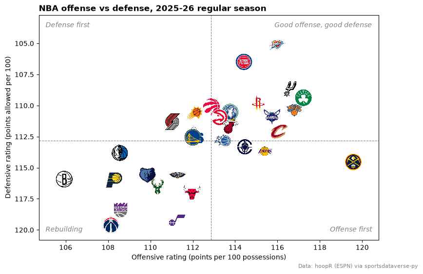
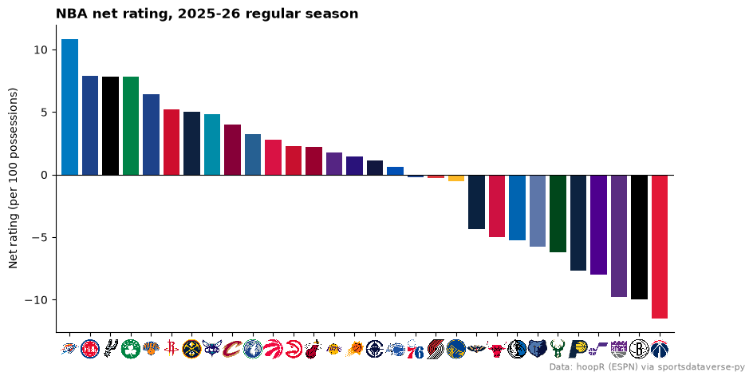
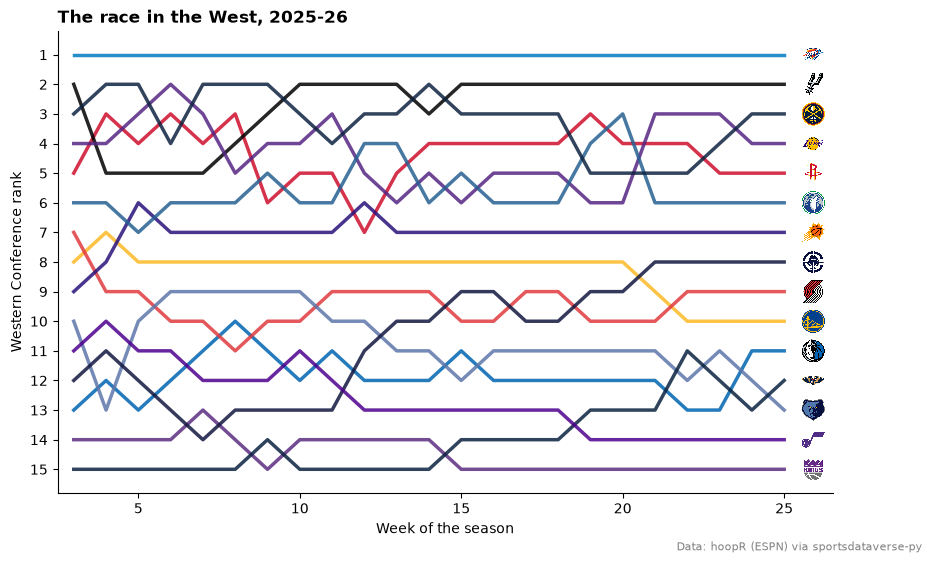
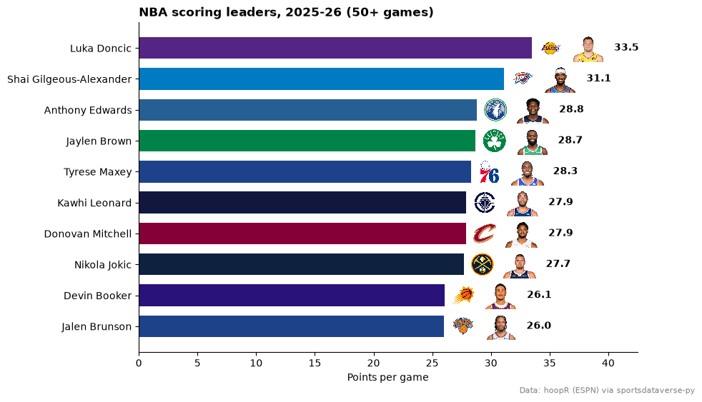
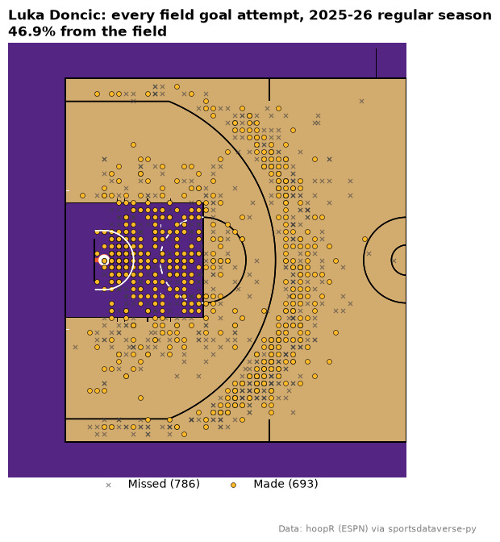
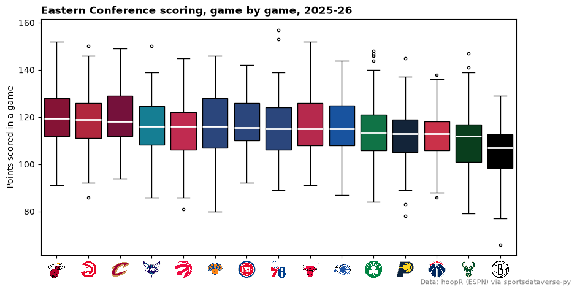
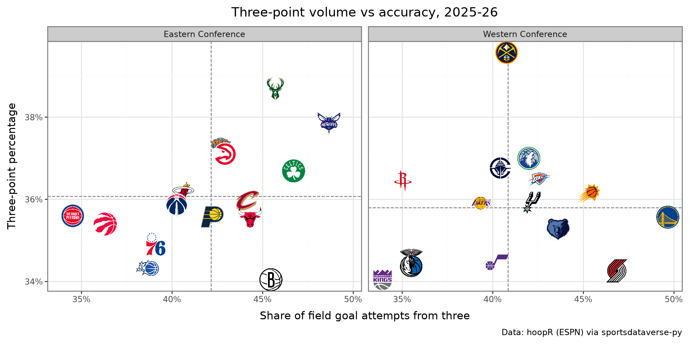
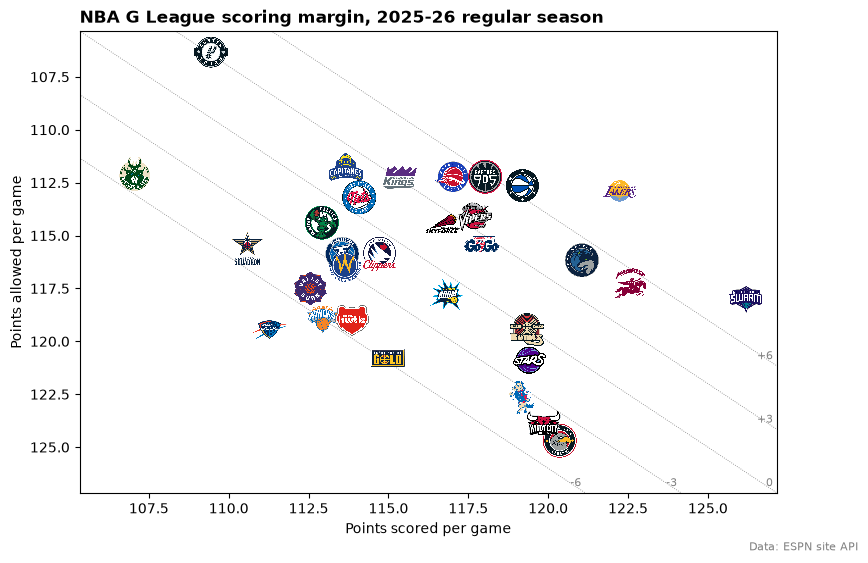

# NBA and G League

Ten charts and tables from one NBA season, built on hoopR's ESPN data that sportsdataverse-py loads from release files
on GitHub (no stats.nba.com calls). You'll make team-rating scatters and bars with logos, a standings bump chart, a
headshot leaderboard, a shot chart on a team-colored court, a standings table and an interactive chart, and finish
with the NBA G League.

```python
import warnings

import matplotlib.pyplot as plt
import polars as pl
import sportsdataverse.nba as nba

import sdvplot

SEASON = 2026  # the 2025-26 season: NBA seasons are named by the year they end
LABEL = f"{SEASON - 1}-{SEASON % 100:02d}"
SOURCE = "Data: hoopR (ESPN) via sportsdataverse-py"
```

The team box score has one row per team per game. `season_type` 2 is the regular season (5 is the play-in, 3 the
playoffs). ESPN files the All-Star Game as a regular-season game too, so `resolve` warns about its three teams; keeping
only the rows that resolve drops it.

```python
box = nba.load_nba_team_boxscore(seasons=[SEASON]).filter(pl.col("season_type") == 2)

with warnings.catch_warnings(record=True) as caught:
    warnings.simplefilter("always")
    team_ids = sdvplot.resolve(box["team_abbreviation"].to_list(), "nba")
print(caught[0].message)

box = box.with_columns(team=pl.Series(team_ids, dtype=pl.String)).filter(pl.col("team").is_not_null())
teams = sdvplot.teams("nba").select("team_id", "conference")
box.select(
    "game_date", "team_abbreviation", "team", "team_score", "opponent_team_abbreviation", "opponent_team_score"
).head()
```

<div class="sdv-output">

```text
3 value(s) did not resolve to a nba team: 'WORLD' (unknown), 'STARS' (unknown), 'STRIPES' (unknown). Use sdvplot.suggest() for candidates, or strict=True to raise.
```

| game_date  | team_abbreviation | team | team_score | opponent_team_abbreviation | opponent_team_score |
|------------|-------------------|------|------------|----------------------------|---------------------|
| 2026-04-12 | ORL               | 19   | 108        | BOS                        | 113                 |
| 2026-04-12 | BOS               | 2    | 113        | ORL                        | 108                 |
| 2026-04-12 | WSH               | 27   | 117        | CLE                        | 130                 |
| 2026-04-12 | CLE               | 5    | 130        | WSH                        | 117                 |
| 2026-04-12 | DET               | 8    | 133        | IND                        | 121                 |

</div>

## 1. Offense vs defense, with logos

Points scored and allowed per 100 possessions put every team on one chart. Possessions are estimated from the box
score (FGA - OREB + TOV + 0.44 x FTA), averaged with the opponent's.

```python
poss = (
    pl.col("field_goals_attempted")
    - pl.col("offensive_rebounds")
    + pl.col("total_turnovers")
    + 0.44 * pl.col("free_throws_attempted")
)
games = box.with_columns(poss=poss)
opponent = games.select("game_id", pl.col("team_id").alias("opponent_team_id"), pl.col("poss").alias("opp_poss"))
assert games.schema["opponent_team_id"] == opponent.schema["opponent_team_id"]
games = games.join(opponent, on=["game_id", "opponent_team_id"]).with_columns(
    game_poss=(pl.col("poss") + pl.col("opp_poss")) / 2
)

ratings = (
    games.group_by("team", "team_abbreviation")
    .agg(
        pace=pl.col("game_poss").mean(),
        ortg=100 * pl.col("team_score").sum() / pl.col("game_poss").sum(),
        drtg=100 * pl.col("opponent_team_score").sum() / pl.col("game_poss").sum(),
        fg3a_rate=pl.col("three_point_field_goals_attempted").sum() / pl.col("field_goals_attempted").sum(),
        fg3_pct=pl.col("three_point_field_goals_made").sum() / pl.col("three_point_field_goals_attempted").sum(),
    )
    .with_columns(net=pl.col("ortg") - pl.col("drtg"))
    .join(teams, left_on="team", right_on="team_id")
    .sort("net", descending=True)
)
ratings.head()
```

<div class="sdv-output">

| team | team_abbreviation | pace       | ortg       | drtg       | fg3a_rate | fg3_pct  | net       | conference         |
|------|-------------------|------------|------------|------------|-----------|----------|-----------|--------------------|
| 25   | OKC               | 102.617805 | 115.988049 | 105.126054 | 0.425756  | 0.364834 | 10.861996 | Western Conference |
| 8    | DET               | 102.930976 | 114.414822 | 106.488601 | 0.345232  | 0.355959 | 7.926221  | Eastern Conference |
| 24   | SA                | 102.72     | 116.576118 | 108.717581 | 0.421285  | 0.359072 | 7.858537  | Western Conference |
| 2    | BOS               | 97.979024  | 117.222701 | 109.368854 | 0.467153  | 0.366898 | 7.853846  | Eastern Conference |
| 18   | NY                | 99.784096  | 116.794332 | 110.394973 | 0.42688   | 0.372833 | 6.399359  | Eastern Conference |

</div>

```python
fig, ax = plt.subplots(figsize=(9, 6))
pad = 1.2
ax.set_xlim(ratings["ortg"].min() - pad, ratings["ortg"].max() + pad)
ax.set_ylim(ratings["drtg"].max() + pad, ratings["drtg"].min() - 2 * pad)  # inverted: better defense is up
ax.axvline(ratings["ortg"].mean(), color="grey", linestyle="--", linewidth=0.8)
ax.axhline(ratings["drtg"].mean(), color="grey", linestyle="--", linewidth=0.8)
sdvplot.add_logos(ax, ratings["ortg"], ratings["drtg"], ratings["team"], league="nba", season=SEASON, height=0.08)

corners = {
    (0.98, 0.97): "Good offense, good defense",
    (0.02, 0.97): "Defense first",
    (0.98, 0.03): "Offense first",
    (0.02, 0.03): "Rebuilding",
}
for (x, y), text in corners.items():
    ax.text(
        x,
        y,
        text,
        transform=ax.transAxes,
        ha="right" if x > 0.5 else "left",
        va="top" if y > 0.5 else "bottom",
        color="grey",
        fontstyle="italic",
    )
ax.set_xlabel("Offensive rating (points per 100 possessions)")
ax.set_ylabel("Defensive rating (points allowed per 100)")
ax.set_title(f"NBA offense vs defense, {LABEL} regular season", loc="left", fontweight="bold")
fig.text(0.99, 0.01, SOURCE, ha="right", va="bottom", fontsize=8, color="grey")
plt.show()
```

<div class="sdv-output">



</div>

## 2. Net rating, ranked, with logos on the axis

`axis_logos` swaps an axis' tick labels for logos. It reads the labels when called, so draw the bars first; the
labels can be the data's own ESPN abbreviations (`GS`, `NO`, `UTAH`).

```python
fig, ax = plt.subplots(figsize=(10, 5))
ax.bar(ratings["team_abbreviation"], ratings["net"], color=sdvplot.team_colors(ratings["team"], "nba", season=SEASON))
ax.axhline(0, color="black", linewidth=0.8)
ax.margins(x=0.01)
ax.set_ylabel("Net rating (per 100 possessions)")
ax.set_title(f"NBA net rating, {LABEL} regular season", loc="left", fontweight="bold")
ax.spines[["top", "right"]].set_visible(False)
sdvplot.axis_logos(ax, "x", league="nba", season=SEASON, height=0.07)
fig.text(0.99, 0.01, SOURCE, ha="right", va="bottom", fontsize=8, color="grey")
plt.show()
```

<div class="sdv-output">



</div>

## 3. A season-long bump chart

Rank each team inside its conference by win percentage at the end of every week, then draw one line per team in its
color with its logo at the finish. Ties are broken arbitrarily here, not by the NBA's tiebreakers.

```python
weekly = (
    box.join(teams, left_on="team", right_on="team_id")
    .with_columns(week=pl.col("game_date").dt.truncate("1w"))
    .group_by("team", "conference", "week")
    .agg(wins=pl.col("team_winner").sum(), games=pl.len())
)
grid = weekly.select("team", "conference").unique().join(weekly.select("week").unique(), how="cross")
bump = (
    grid.join(weekly, on=["team", "conference", "week"], how="left")
    .fill_null(0)
    .sort("week")
    .with_columns(pl.col("wins", "games").cum_sum().over("team"), week_no=pl.col("week").rank("dense"))
    .filter(pl.col("week_no") >= 3)  # skip the first two weeks, when records are a game or two
    .with_columns(rank=(pl.col("wins") / pl.col("games")).rank("ordinal", descending=True).over("conference", "week"))
)

west = bump.filter(pl.col("conference") == "Western Conference")
fig, ax = plt.subplots(figsize=(10, 6))
for (team,), line in west.sort("week").group_by("team"):
    ax.plot(line["week_no"], line["rank"], color=sdvplot.team_colors([team], "nba")[0], linewidth=2.5, alpha=0.85)
final = west.filter(pl.col("week_no") == pl.col("week_no").max())
ax.set_xlim(west["week_no"].min() - 0.5, west["week_no"].max() + 1.5)
ax.set_ylim(15.8, 0.2)
ax.set_yticks(range(1, 16))
sdvplot.add_logos(ax, final["week_no"] + 0.9, final["rank"], final["team"], league="nba", season=SEASON, height=0.055)
ax.set_xlabel("Week of the season")
ax.set_ylabel("Western Conference rank")
ax.set_title(f"The race in the West, {LABEL}", loc="left", fontweight="bold")
ax.spines[["top", "right"]].set_visible(False)
fig.text(0.99, 0.01, SOURCE, ha="right", va="bottom", fontsize=8, color="grey")
plt.show()
```

<div class="sdv-output">



</div>

## 4. A scoring leaderboard with headshots

The player box score carries ESPN athlete ids, which is all `add_headshots` needs. Only games in `box` count, so the
All-Star Game stays out.

```python
players = nba.load_nba_player_boxscore(seasons=[SEASON]).join(box.select("game_id").unique(), on="game_id", how="semi")
leaders = (
    players.filter(~pl.col("did_not_play"))
    .group_by("athlete_id", "athlete_display_name")
    .agg(
        games=pl.len(),
        ppg=pl.col("points").mean(),
        team=pl.col("team_abbreviation").sort_by("game_date").last(),
    )
    .filter(pl.col("games") >= 50)
    .sort("ppg", descending=True)
    .head(10)
    .reverse()  # barh draws bottom-up: the leader goes on top
)

fig, ax = plt.subplots(figsize=(9, 6))
y = list(range(len(leaders)))
ax.barh(y, leaders["ppg"], color=sdvplot.team_colors(leaders["team"], "nba", season=SEASON), height=0.7)
ax.set_yticks(y, leaders["athlete_display_name"])
ax.set_xlim(0, leaders["ppg"].max() + 9)
sdvplot.add_logos(ax, leaders["ppg"] + 1.6, y, leaders["team"], league="nba", season=SEASON, height=0.075)
sdvplot.add_headshots(ax, leaders["ppg"] + 4.8, y, leaders["athlete_id"], league="nba", height=0.085)
for yi, ppg in zip(y, leaders["ppg"], strict=True):
    ax.text(ppg + 7, yi, f"{ppg:.1f}", va="center", fontweight="bold")
ax.set_xlabel("Points per game")
ax.set_title(f"NBA scoring leaders, {LABEL} (50+ games)", loc="left", fontweight="bold")
ax.spines[["top", "right"]].set_visible(False)
fig.text(0.99, 0.01, SOURCE, ha="right", va="bottom", fontsize=8, color="grey")
plt.show()
```

<div class="sdv-output">



</div>

## 5. A shot chart on a team-colored court

`load_nba_shots` holds ESPN's shot locations, which sportsdataverse-py already converts to feet on a center-court
frame: the same frame as sportypy's court, so they plot as they are. (`sdvplot.court_coords` is only for the
stats.nba.com legacy frame, in tenths of a foot around the hoop.) Shots at the right basket are rotated onto the left
one so a half court holds them all.

```python
shots = nba.load_nba_shots(seasons=[SEASON]).join(box.select("game_id").unique(), on="game_id", how="semi")
star = leaders.row(-1, named=True)  # the scoring leader
right = pl.col("coordinate_x") > 0
player = shots.filter(
    (pl.col("athlete_id_1") == star["athlete_id"]) & ~pl.col("type_text").str.contains("Free Throw")
).with_columns(
    x=pl.when(right).then(-pl.col("coordinate_x")).otherwise(pl.col("coordinate_x")),
    y=pl.when(right).then(-pl.col("coordinate_y")).otherwise(pl.col("coordinate_y")),
)
made = player.filter(pl.col("scoring_play"))
missed = player.filter(~pl.col("scoring_play"))

fig, ax = plt.subplots(figsize=(7, 7))
sdvplot.surface("nba", star["team"], season=SEASON, display_range="defense", ax=ax)
ax.scatter(
    missed["x"],
    missed["y"],
    marker="x",
    color="#3d3d3d",
    s=14,
    linewidths=0.8,
    alpha=0.6,
    zorder=20,
    label=f"Missed ({missed.height})",
)
ax.scatter(
    made["x"],
    made["y"],
    color=sdvplot.team_colors([star["team"]], "nba", which="secondary")[0],
    edgecolors="black",
    linewidths=0.4,
    s=18,
    zorder=21,
    label=f"Made ({made.height})",
)
ax.legend(loc="upper center", bbox_to_anchor=(0.5, 0.02), ncols=2, frameon=False)
ax.set_title(
    f"{star['athlete_display_name']}: every field goal attempt, {LABEL} regular season\n"
    f"{made.height / player.height:.1%} from the field",
    loc="left",
    fontweight="bold",
)
fig.text(0.99, 0.01, SOURCE, ha="right", va="bottom", fontsize=8, color="grey")
plt.show()
```

<div class="sdv-output">



</div>

## 6. A team palette for seaborn

`palette` maps the data's own team values to colors, so seaborn can color each box by team. Here: every game's
points scored for the Eastern Conference, highest median first.

```python
import seaborn as sns

east = box.join(teams, left_on="team", right_on="team_id").filter(pl.col("conference") == "Eastern Conference")
order = (east.group_by("team_abbreviation").agg(pl.col("team_score").median()).sort("team_score", descending=True))[
    "team_abbreviation"
].to_list()

fig, ax = plt.subplots(figsize=(10, 5))
sns.boxplot(
    east.to_pandas(),
    x="team_abbreviation",
    y="team_score",
    order=order,
    hue="team_abbreviation",
    palette=sdvplot.palette("nba", teams=east["team_abbreviation"], season=SEASON),
    legend=False,
    medianprops={"color": "white", "linewidth": 2},
    flierprops={"markersize": 3},
    ax=ax,
)
ax.set_xlabel("")
ax.set_ylabel("Points scored in a game")
ax.set_title(f"Eastern Conference scoring, game by game, {LABEL}", loc="left", fontweight="bold")
sdvplot.axis_logos(ax, "x", league="nba", season=SEASON, height=0.08)
fig.text(0.99, 0.01, SOURCE, ha="right", va="bottom", fontsize=8, color="grey")
plt.show()
```

<div class="sdv-output">



</div>

## 7. plotnine: logos faceted by conference

`geom_sdv_logos` is a plotnine layer, so it facets like any other geom, and `geom_mean_lines` draws each panel's own
averages. How often teams shoot threes against how well they make them, East vs West:

```python
from plotnine import aes, facet_wrap, ggplot, labs, scale_x_continuous, scale_y_continuous, theme, theme_bw

from sdvplot.plotnine import geom_mean_lines, geom_sdv_logos

pct = lambda breaks: [f"{b:.0%}" for b in breaks]  # noqa: E731
(
    ggplot(ratings.to_pandas(), aes("fg3a_rate", "fg3_pct", team="team"))
    + geom_mean_lines(aes(x0="fg3a_rate", y0="fg3_pct"), color="grey")
    + geom_sdv_logos(league="nba", season=SEASON, height=0.1)
    + facet_wrap("conference")
    + scale_x_continuous(labels=pct)
    + scale_y_continuous(labels=pct)
    + labs(
        x="Share of field goal attempts from three",
        y="Three-point percentage",
        title=f"Three-point volume vs accuracy, {LABEL}",
        caption=SOURCE,
    )
    + theme_bw()
    + theme(figure_size=(10, 5))
)
```

<div class="sdv-output">



</div>

## 8. A standings table with logos

ESPN's standings come long (one row per team and stat); pivot them wide, then let `gt_sdv_logos` turn the team column
into logos and `gt_cutline` mark the playoff and play-in lines. The Western Conference:

```python
from great_tables import GT

from sdvplot.great_tables import gt_cutline, gt_sdv_logos, gt_theme_athletic

standings = nba.load_nba_standings(seasons=[SEASON])
west_table = (
    standings.filter(pl.col("group_name") == "Western Conference")
    .pivot(on="stat_name", index=["team_abbreviation", "team_display_name"], values="display_value")
    .with_columns(seed=pl.col("playoffSeed").cast(pl.Int32), logo=pl.col("team_abbreviation"))
    .sort("seed")
    .select(
        "seed",
        "logo",
        "team_display_name",
        "wins",
        "losses",
        "winPercent",
        "gamesBehind",
        "Home",
        "Road",
        "Last Ten Games",
        "streak",
        "differential",
    )
)
table = (
    GT(west_table)
    .tab_header(
        title=f"Western Conference standings, {LABEL}", subtitle="Seeds 1-6 make the playoffs; 7-10 the play-in"
    )
    .cols_label(
        seed="",
        logo="",
        team_display_name="Team",
        wins="W",
        losses="L",
        winPercent="Pct",
        gamesBehind="GB",
        **{"Last Ten Games": "L10"},
        streak="Strk",
        differential="Diff",
    )
    .tab_source_note(SOURCE)
)
table = gt_sdv_logos(table, "logo", league="nba", season=SEASON, height=26)
table = gt_theme_athletic(table).cols_align("left", columns="team_display_name")  # theme first: it sets alignment
gt_cutline(table, after=[6, 10], label=["Playoffs", "Play-in"], label_position="above")
```

<div class="sdv-output">

<iframe class="sdv-frame" src="/outputs/tutorials/leagues/nba/20_0.html" title="HTML output" height="480" loading="lazy"></iframe>

</div>

## 9. An interactive Plotly chart

The same logos work on a Plotly figure: hover a logo for the numbers, zoom and the logos scale with the data.
Pace against net rating:

```python
import plotly.graph_objects as go

fig = go.Figure(
    go.Scatter(
        x=ratings["pace"].to_list(),
        y=ratings["net"].to_list(),
        mode="markers",
        marker={"size": 30, "opacity": 0},
        text=ratings["team_abbreviation"].to_list(),
        hovertemplate="%{text}<br>Pace %{x:.1f}<br>Net rating %{y:+.1f}<extra></extra>",
    )
)
sdvplot.add_logos(fig, ratings["pace"], ratings["net"], ratings["team"], league="nba", season=SEASON, height=0.08)
fig.add_hline(y=0, line_dash="dot", line_color="grey")
fig.update_layout(
    title=f"Pace vs net rating, {LABEL} regular season<br><sup>{SOURCE}</sup>",
    xaxis_title="Pace (possessions per game)",
    yaxis_title="Net rating (per 100 possessions)",
    template="plotly_white",
    width=850,
    height=550,
)
fig
```

<div class="sdv-output">

<iframe class="sdv-frame" src="/outputs/tutorials/leagues/nba/22_0.html" title="Interactive Plotly figure" height="480" loading="lazy"></iframe>

</div>

## 10. The G League

sportsdataverse-py has no G League loader, so read ESPN's public standings endpoint for the G League (slug
`nba-development`) with `requests` and keep the two numbers needed: points scored and allowed per game. sdvplot
knows the G League as `nbagl`; its teams resolve by ESPN abbreviation like any other league.

```python
import requests

url = "https://site.api.espn.com/apis/v2/sports/basketball/nba-development/standings"
payload = requests.get(url, params={"season": SEASON}, timeout=30).json()
per_game = {"avgPointsFor": "scored", "avgPointsAgainst": "allowed"}
gleague = pl.DataFrame(
    [
        {"team": entry["team"]["abbreviation"]}
        | {per_game[s["name"]]: s["value"] for s in entry["stats"] if s["name"] in per_game}
        for conference in payload["children"]  # one child per conference
        for entry in conference["standings"]["entries"]
    ]
)

fig, ax = plt.subplots(figsize=(9, 6))
lo = min(gleague["scored"].min(), gleague["allowed"].min()) - 1
hi = max(gleague["scored"].max(), gleague["allowed"].max()) + 1
ax.set_xlim(lo, hi)
ax.set_ylim(hi, lo)  # inverted: fewer points allowed is up
for margin in (-6, -3, 0, 3, 6):  # lines of equal scoring margin: allowed = scored - margin
    ax.plot([lo, hi], [lo - margin, hi - margin], color="grey", linewidth=0.6, linestyle=":")
    exit_point = (hi, hi - margin) if margin > 0 else (hi + margin, hi)  # where the line leaves the plot
    ax.annotate(
        f"{margin:+d}" if margin else "0",
        exit_point,
        xytext=(-3, 3),
        textcoords="offset points",
        ha="right",
        va="bottom",
        color="grey",
        fontsize=8,
    )
sdvplot.add_logos(ax, gleague["scored"], gleague["allowed"], gleague["team"], league="nbagl", height=0.08)
ax.set_xlabel("Points scored per game")
ax.set_ylabel("Points allowed per game")
ax.set_title(f"NBA G League scoring margin, {LABEL} regular season", loc="left", fontweight="bold")
fig.text(0.99, 0.01, "Data: ESPN site API", ha="right", va="bottom", fontsize=8, color="grey")
plt.show()
```

<div class="sdv-output">



</div>

Dotted lines mark equal scoring margins (+6 to -6 per game). Not every G League team has official colors in the index:
check `color_source` before using a color as the team's own.

```python
sdvplot.teams("nbagl").filter(pl.col("color_source") == "fallback").select(
    "abbr", "name", "color_primary", "color_source"
)
```

<div class="sdv-output">

| abbr   | name            | color_primary | color_source |
|--------|-----------------|---------------|--------------|
| GLI    | G League Ignite | #b07aa1       | fallback     |
| RCITY  | Rip City Remix  | #f28e2b       | fallback     |
| VALLEY | Valley Suns     | #b07aa1       | fallback     |

</div>

## Run it yourself

<a href="pathname:///notebooks/leagues/nba.ipynb" download>Download the notebook</a> (outputs cleared) or [open it on GitHub](https://github.com/sportsdataverse/sdvplot/blob/main/examples/notebooks/leagues/nba.ipynb).
