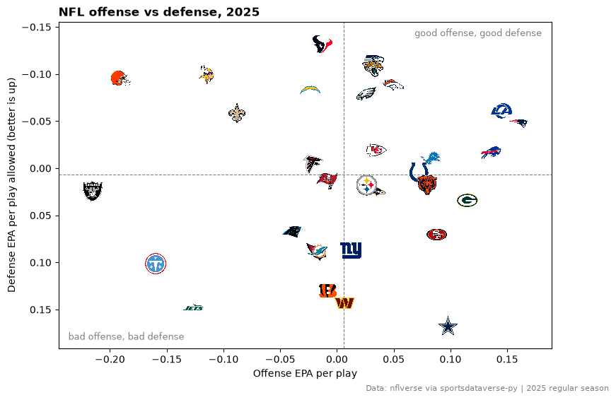
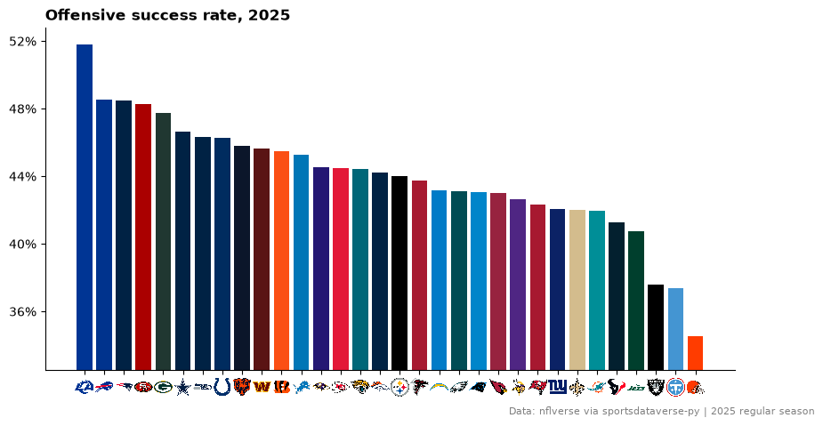
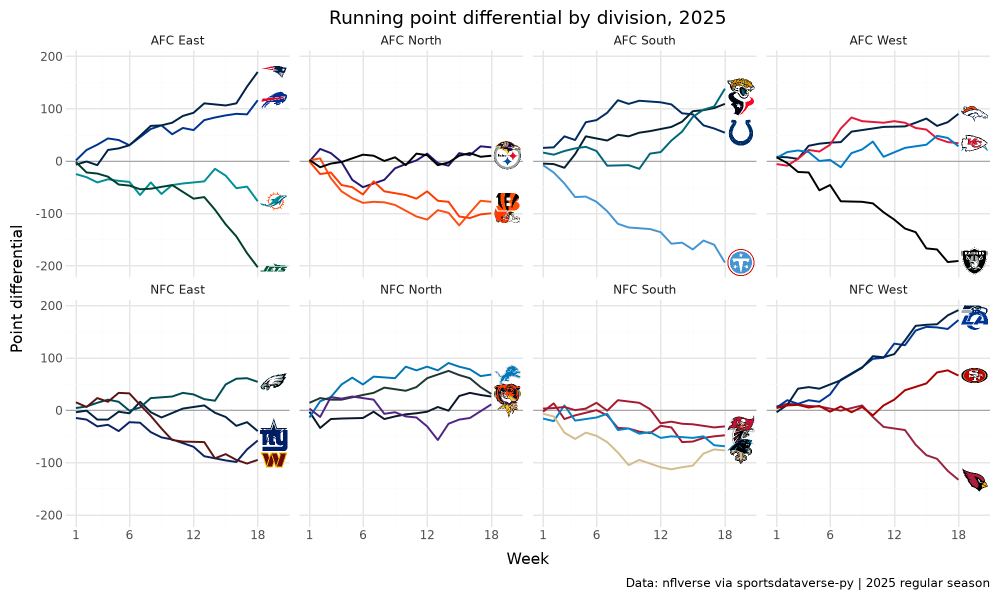
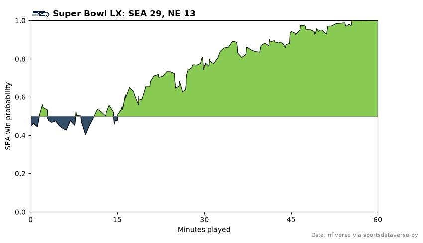
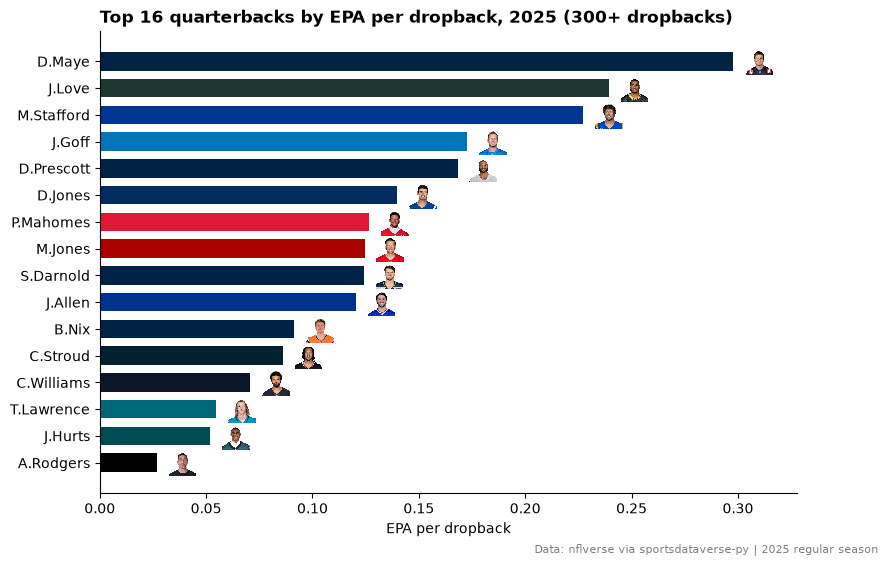
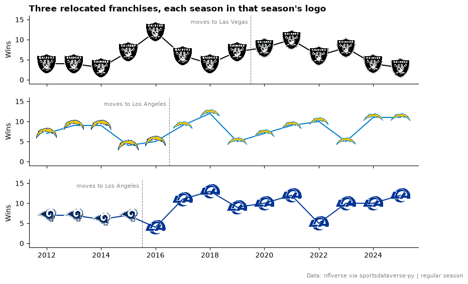
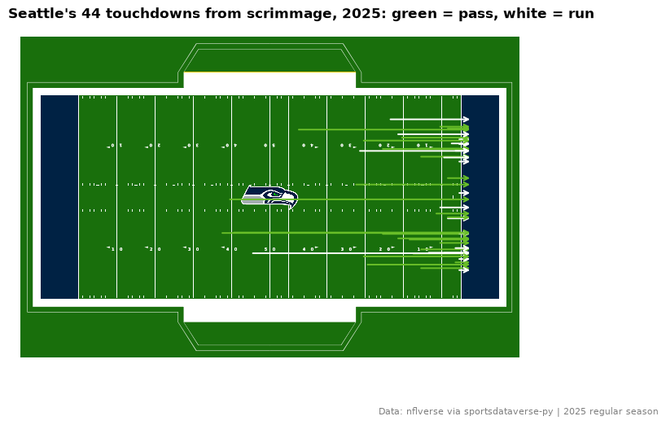
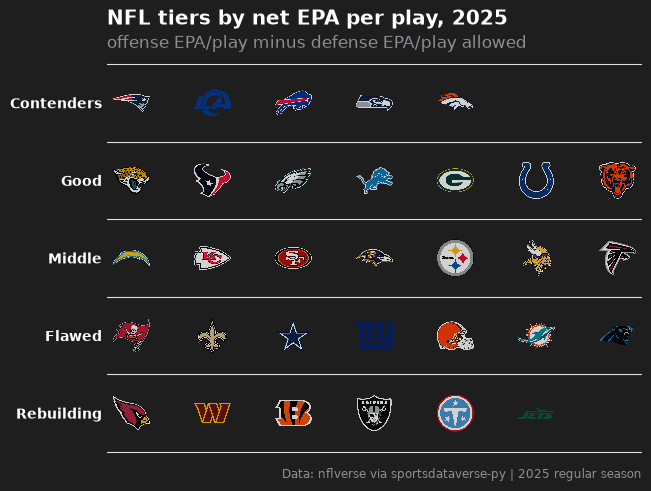

# NFL

Ten charts and tables from one season of nflverse play-by-play: team logos on a scatter, bars in team colors, a
standings table, small multiples, a quarterback headshot chart, relocated franchises, an interactive plot, a field in
team colors and a tier list. The data comes from the nflverse releases through `sportsdataverse.nfl`; sdvplot takes
the abbreviations straight from it.

```python
import matplotlib.pyplot as plt
import polars as pl
import sportsdataverse.nfl as nfl

import sdvplot

SEASON = 2025
CAPTION = f"Data: nflverse via sportsdataverse-py | {SEASON} regular season"

pbp = nfl.load_nfl_pbp([SEASON])
plays = pbp.filter(
    pl.col("season_type") == "REG",
    pl.col("play_type").is_in(["pass", "run"]),
    pl.col("epa").is_not_null(),
)
plays.height
```

<div class="sdv-output">

```text
32941
```

</div>

## 1. Offense vs defense EPA per play

The chart every NFL season ends with: each team's offensive EPA per play against the EPA per play its defense
allowed, with the team's logo as the point. The defense axis is flipped so the good teams sit top right.

```python
offense = plays.group_by("posteam", maintain_order=True).agg(
    off_epa=pl.col("epa").mean(), off_sr=pl.col("success").mean()
)
defense = plays.group_by("defteam", maintain_order=True).agg(
    def_epa=pl.col("epa").mean(), def_sr=pl.col("success").mean()
)
teams = offense.join(defense, left_on="posteam", right_on="defteam").rename({"posteam": "team"})

fig, ax = plt.subplots(figsize=(9, 6))
ax.axvline(teams["off_epa"].mean(), color="grey", lw=0.8, ls="--")
ax.axhline(teams["def_epa"].mean(), color="grey", lw=0.8, ls="--")
ax.scatter(teams["off_epa"], teams["def_epa"], s=0)  # sets the axis limits; the logos are the marks
ax.margins(0.08)
sdvplot.add_logos(ax, teams["off_epa"], teams["def_epa"], teams["team"], league="nfl", season=SEASON, height=0.07)
ax.invert_yaxis()
for x, y, text in [(0.98, 0.98, "good offense, good defense"), (0.02, 0.02, "bad offense, bad defense")]:
    ax.text(
        x,
        y,
        text,
        transform=ax.transAxes,
        ha="right" if x > 0.5 else "left",
        va="top" if y > 0.5 else "bottom",
        color="grey",
        fontsize=9,
    )
ax.set(xlabel="Offense EPA per play", ylabel="Defense EPA per play allowed (better is up)")
ax.set_title(f"NFL offense vs defense, {SEASON}", loc="left", fontweight="bold")
fig.text(0.99, 0.01, CAPTION, ha="right", fontsize=8, color="grey")
plt.show()
```

<div class="sdv-output">



</div>

## 2. A ranked bar chart with logos on the axis

Offensive success rate, sorted, each bar in its team's primary color from `team_colors`, and `axis_logos` swapping
the abbreviations under the bars for logos.

```python
from matplotlib.ticker import MultipleLocator, PercentFormatter

ranked = teams.sort("off_sr", descending=True)

fig, ax = plt.subplots(figsize=(10, 5))
ax.bar(ranked["team"], ranked["off_sr"], color=sdvplot.team_colors("nfl", ranked["team"]).to_list())
ax.set_ylim(ranked["off_sr"].min() - 0.02, ranked["off_sr"].max() + 0.01)
ax.yaxis.set_major_locator(MultipleLocator(0.04))
ax.yaxis.set_major_formatter(PercentFormatter(1, decimals=0))
ax.spines[["top", "right"]].set_visible(False)
sdvplot.axis_logos(ax, "x", league="nfl", season=SEASON, height=0.06)
ax.set_title(f"Offensive success rate, {SEASON}", loc="left", fontweight="bold")
fig.text(0.99, 0.01, CAPTION, ha="right", fontsize=8, color="grey")
plt.show()
```

<div class="sdv-output">



</div>

## 3. Division standings table

Records come from the schedule (`load_nfl_schedule`), divisions from `load_nfl_teams`. great_tables draws the table;
`gt_sdv_logos` turns the abbreviation column into logos, `data_color` shades the point differential and
`gt_theme_sdv` gives it the SportsDataverse look.

```python
from great_tables import GT

from sdvplot.great_tables import gt_sdv_logos, gt_theme_sdv

schedule = nfl.load_nfl_schedule([SEASON]).filter(pl.col("game_type") == "REG")
games = pl.concat(
    [
        schedule.select("week", team="home_team", pf="home_score", pa="away_score"),
        schedule.select("week", team="away_team", pf="away_score", pa="home_score"),
    ]
)
divisions = nfl.load_nfl_teams().select(team="team_abbr", division="team_division")
names = sdvplot.teams("nfl").select("team_id", "name")

records = games.group_by("team", maintain_order=True).agg(
    W=(pl.col("pf") > pl.col("pa")).sum(),
    L=(pl.col("pf") < pl.col("pa")).sum(),
    T=(pl.col("pf") == pl.col("pa")).sum(),
    PF=pl.col("pf").sum(),
    PA=pl.col("pa").sum(),
)
# resolve maps the schedule's abbreviations to sdvplot team ids, which carry the full names
standings = (
    records.with_columns(
        team_id=sdvplot.resolve(records["team"], "nfl"),
        Diff=pl.col("PF") - pl.col("PA"),
        pct=(pl.col("W") + pl.col("T") / 2) / (pl.col("W") + pl.col("L") + pl.col("T")),
    )
    .join(names, on="team_id")
    .join(divisions, on="team")
    .sort(["division", "pct", "Diff"], descending=[False, True, True])
    .select("division", logo="team", Team="name", W="W", L="L", T="T", PF="PF", PA="PA", Diff="Diff")
)
limit = standings["Diff"].abs().max()  # a color scale centered on zero

(
    GT(standings, groupname_col="division")
    .pipe(gt_sdv_logos, "logo", league="nfl", season=SEASON, height=22)
    .cols_label(logo="")
    .data_color(columns="Diff", palette=["#b2182b", "#f7f7f7", "#1b7837"], domain=[-limit, limit])
    .tab_header(title=f"{SEASON} NFL standings", subtitle="Regular season, by division")
    .tab_source_note(CAPTION)
    .pipe(gt_theme_sdv, density="compact")
)
```

<div class="sdv-output">

<iframe class="sdv-frame" src="/outputs/tutorials/leagues/nfl/7_0.html" title="HTML output" height="480" loading="lazy"></iframe>

</div>

## 4. Small multiples by division with plotnine

Each team's running point differential through the season, one panel per division. `scale_color_sdv` colors the
lines by team and `geom_sdv_logos` puts each logo just past the end of its line. The logo layer gets its own data (the last
week per team) with the `division` column, so plotnine draws each logo in its own panel.

```python
from plotnine import aes, facet_wrap, geom_hline, geom_line, ggplot, labs, scale_x_continuous, theme, theme_minimal

from sdvplot.plotnine import geom_sdv_logos, scale_color_sdv

running = (
    games.sort("week")
    .with_columns(diff=(pl.col("pf") - pl.col("pa")).cum_sum().over("team"))
    .join(divisions, on="team")
)
ends = running.group_by("team", maintain_order=True).last().with_columns(week=pl.col("week") + 1.5)

(
    ggplot(running.to_pandas(), aes("week", "diff", color="team"))
    + geom_hline(yintercept=0, color="grey", size=0.3)
    + geom_line(size=0.8)
    + geom_sdv_logos(
        aes("week", "diff", team="team"),
        data=ends.to_pandas(),
        league="nfl",
        season=SEASON,
        height=0.13,
        inherit_aes=False,
    )
    + scale_color_sdv("nfl")
    + scale_x_continuous(breaks=[1, 6, 12, 18], limits=(1, 20))
    + facet_wrap("division", ncol=4)
    + labs(x="Week", y="Point differential", title=f"Running point differential by division, {SEASON}", caption=CAPTION)
    + theme_minimal()
    + theme(figure_size=(10, 6), legend_position="none")
)
```

<div class="sdv-output">



</div>

## 5. A win probability chart with a logo in the title

nflverse's `home_wp` traced through Super Bowl LX. `title_image` sets the title with the winner's logo beside it.
The fills use the teams' colors from `team_colors`; when two primaries are the same, one team switches to its
secondary color.

```python
from sdvplot.matplotlib import title_image

game = nfl.load_nfl_schedule([SEASON]).filter(pl.col("game_type") == "SB").row(0, named=True)
wp = pbp.filter(pl.col("game_id") == game["game_id"], pl.col("home_wp").is_not_null()).select(
    minute=(3600 - pl.col("game_seconds_remaining")) / 60, away_wp=1 - pl.col("home_wp")
)
away, home = game["away_team"], game["home_team"]
away_color, home_color = sdvplot.team_colors("nfl", [away, home])
if away_color == home_color:  # both teams' primary is the same navy: use the away team's second color
    away_color = sdvplot.team_colors("nfl", away, which="secondary")

fig, ax = plt.subplots(figsize=(9, 5))
ax.fill_between(
    wp["minute"], 0.5, wp["away_wp"], where=wp["away_wp"] >= 0.5, color=away_color, alpha=0.8, interpolate=True
)
ax.fill_between(
    wp["minute"], 0.5, wp["away_wp"], where=wp["away_wp"] < 0.5, color=home_color, alpha=0.8, interpolate=True
)
ax.plot(wp["minute"], wp["away_wp"], color="black", lw=0.8)
ax.set(xlim=(0, 60), ylim=(0, 1), xticks=[0, 15, 30, 45, 60], xlabel="Minutes played", ylabel=f"{away} win probability")
ax.axhline(0.5, color="grey", lw=0.6)
winner = away if game["away_score"] > game["home_score"] else home
title_image(
    ax,
    winner,
    f"Super Bowl LX: {away} {game['away_score']}, {home} {game['home_score']}",
    league="nfl",
    season=SEASON,
    height=28,
    loc="left",
    fontweight="bold",
)
fig.text(0.99, 0.01, "Data: nflverse via sportsdataverse-py", ha="right", fontsize=8, color="grey")
plt.show()
```

<div class="sdv-output">



</div>

## 6. A quarterback leaderboard with headshots

nflverse identifies players by gsis id (`passer_player_id`). `add_headshots` takes those ids with
`id_system="gsis"` and looks up each player's headshot through the nflverse player table; the bars take each
quarterback's team color.

```python
qbs = (
    pbp.filter(pl.col("season_type") == "REG", pl.col("passer_player_id").is_not_null(), pl.col("epa").is_not_null())
    .group_by("passer_player_id", maintain_order=True)
    .agg(
        name=pl.col("passer_player_name").first(),
        team=pl.col("posteam").last(),
        plays=pl.len(),
        epa=pl.col("epa").mean(),
    )
    .filter(pl.col("plays") >= 300)
    .sort("epa", descending=True)
    .head(16)
    .reverse()  # barh draws from the bottom up, so the leader ends on top
)

fig, ax = plt.subplots(figsize=(9, 6))
ax.barh(qbs["name"], qbs["epa"], height=0.7, color=sdvplot.team_colors("nfl", qbs["team"]).to_list())
sdvplot.add_headshots(
    ax,
    qbs["epa"] + 0.012,
    list(range(qbs.height)),
    qbs["passer_player_id"],
    league="nfl",
    id_system="gsis",
    height=0.06,
)
ax.set_xlim(0, qbs["epa"].max() + 0.03)
ax.spines[["top", "right"]].set_visible(False)
ax.set_xlabel("EPA per dropback")
ax.set_title(f"Top 16 quarterbacks by EPA per dropback, {SEASON} (300+ dropbacks)", loc="left", fontweight="bold")
fig.text(0.99, 0.01, CAPTION, ha="right", fontsize=8, color="grey")
plt.show()
```

<div class="sdv-output">



</div>

## 7. Relocated franchises and their eras

The schedules use the abbreviation a team had that season: OAK until 2019, SD until 2016, STL until 2015. `resolve`
with one season per row maps every era to the same franchise id, and `add_logos` with one season per point draws the
mark the team wore that year.

```python
history = nfl.load_nfl_schedule(list(range(2012, SEASON + 1))).filter(pl.col("game_type") == "REG")
wins = (
    pl.concat(
        [
            history.select("season", team="home_team", win=pl.col("result") > 0),
            history.select("season", team="away_team", win=pl.col("result") < 0),
        ]
    )
    .filter(pl.col("team").is_in(["OAK", "LV", "SD", "LAC", "STL", "LA"]))
    .group_by("season", "team", maintain_order=True)
    .agg(wins=pl.col("win").sum())
    .sort("season")
)
wins = wins.with_columns(team_id=sdvplot.resolve(wins["team"], "nfl", season=wins["season"]))
wins.group_by("team_id", "team", maintain_order=True).agg(
    first=pl.col("season").min(), last=pl.col("season").max()
).sort("team_id", "first")
```

<div class="sdv-output">

| team_id | team | first | last |
|---------|------|-------|------|
| 13      | OAK  | 2012  | 2019 |
| 13      | LV   | 2020  | 2025 |
| 14      | STL  | 2012  | 2015 |
| 14      | LA   | 2016  | 2025 |
| 24      | SD   | 2012  | 2016 |
| 24      | LAC  | 2017  | 2025 |

</div>

```python
moves = {"13": (2020, "Las Vegas"), "24": (2017, "Los Angeles"), "14": (2016, "Los Angeles")}
fig, axes = plt.subplots(3, 1, figsize=(10, 6), sharex=True, sharey=True)
for ax, (team_id, (moved, city)) in zip(axes, moves.items(), strict=True):
    rows = wins.filter(pl.col("team_id") == team_id)
    ax.plot(rows["season"], rows["wins"], color=sdvplot.team_colors("nfl", team_id), lw=1.5)
    ax.axvline(moved - 0.5, color="grey", lw=0.8, ls="--")
    ax.text(moved - 0.6, 15, f"moves to {city}", fontsize=8, color="grey", va="top", ha="right")
    sdvplot.add_logos(ax, rows["season"], rows["wins"], rows["team"], league="nfl", season=rows["season"], height=0.32)
    ax.set_ylim(-1, 16)
    ax.set_ylabel("Wins")
    ax.spines[["top", "right"]].set_visible(False)
axes[0].set_title("Three relocated franchises, each season in that season's logo", loc="left", fontweight="bold")
axes[-1].set_xticks(range(2012, SEASON + 1, 2))
fig.text(0.99, 0.01, "Data: nflverse via sportsdataverse-py | regular season", ha="right", fontsize=8, color="grey")
plt.show()
```

<div class="sdv-output">



</div>

## 8. An interactive Plotly scatter

Dropback EPA against rushing EPA, with hover text. `add_logos` works on a Plotly figure the same way: a transparent
marker trace carries the hover, and the logos are layout images. The axis ranges are set first, with some
room at the edges, so no logo is cut off.

```python
import plotly.graph_objects as go

split = plays.group_by("posteam", maintain_order=True).agg(
    pass_epa=pl.col("epa").filter(pl.col("play_type") == "pass").mean(),
    rush_epa=pl.col("epa").filter(pl.col("play_type") == "run").mean(),
    pass_rate=(pl.col("play_type") == "pass").mean(),
)

fig = go.Figure(
    go.Scatter(
        x=split["rush_epa"],
        y=split["pass_epa"],
        mode="markers",
        marker={"size": 30, "opacity": 0},
        customdata=split.select("posteam", "pass_rate").rows(),
        hovertemplate="%{customdata[0]}<br>pass EPA %{y:.3f}<br>rush EPA %{x:.3f}"
        "<br>pass rate %{customdata[1]:.0%}<extra></extra>",
    )
)


def padded(values, share=0.08):  # an axis range with room for the logos at the edges
    low, high = values.min(), values.max()
    return [low - share * (high - low), high + share * (high - low)]


fig.update_layout(
    xaxis_range=padded(split["rush_epa"]),
    yaxis_range=padded(split["pass_epa"]),
    title=f"Passing vs rushing EPA per play, {SEASON}",
    xaxis_title="Rushing EPA per play",
    yaxis_title="Dropback EPA per play",
    template="plotly_white",
    width=800,
    height=560,
)
sdvplot.add_logos(fig, split["rush_epa"], split["pass_epa"], split["posteam"], league="nfl", season=SEASON, height=0.08)
fig
```

<div class="sdv-output">

<iframe class="sdv-frame" src="/outputs/tutorials/leagues/nfl/18_0.html" title="Interactive Plotly figure" height="480" loading="lazy"></iframe>

</div>

## 9. A field in team colors

`surface("nfl", team)` draws an NFL field with sportypy, end zones in the team's colors. On top: every Seattle
touchdown from scrimmage in the regular season, from the line of scrimmage to the end zone, placed by the side of the
field the play went to.

```python
import numpy as np

tds = pbp.filter(
    pl.col("season_type") == "REG",
    pl.col("posteam") == "SEA",
    pl.col("td_team") == "SEA",
    pl.col("play_type").is_in(["pass", "run"]),
).with_columns(side=pl.coalesce("pass_location", "run_location"))
lane = {"left": 15.0, "middle": 0.0, "right": -15.0}
rng = np.random.default_rng(1)

fig, ax = plt.subplots(figsize=(10, 5.5))
sdvplot.surface("nfl", "SEA", season=SEASON, ax=ax, center_logo=0.18, display_range="in_bounds_only")
for row in tds.iter_rows(named=True):
    y = lane.get(row["side"], 0.0) + rng.uniform(-6, 6)
    color = "#69be28" if row["play_type"] == "pass" else "#ffffff"
    ax.annotate(
        "",
        xy=(53, y),
        xytext=(50 - row["yardline_100"], y),
        arrowprops={"arrowstyle": "->", "color": color, "lw": 1.4},
        zorder=20,
    )
ax.set_title(
    f"Seattle's {tds.height} touchdowns from scrimmage, {SEASON}: green = pass, white = run",
    loc="left",
    fontweight="bold",
)
fig.text(0.99, 0.01, CAPTION, ha="right", fontsize=8, color="grey")
plt.show()
```

<div class="sdv-output">



</div>

## 10. Team tiers

A tier list from net EPA per play (offense minus defense), drawn by `team_tiers` on sdvplotR's Tiermaker theme.
`tier_no` and `team` are the only columns it needs; the order within each tier comes from the data.

```python
from sdvplot.matplotlib import team_tiers

sizes = [5, 7, 7, 7, 6]  # teams per tier, top to bottom
tier_of_rank = [tier for tier, n in enumerate(sizes, start=1) for _ in range(n)]
tiers = (
    teams.with_columns(net=pl.col("off_epa") - pl.col("def_epa"))
    .sort("net", descending=True)
    .with_columns(tier_no=pl.Series(tier_of_rank))
    .select("tier_no", "team")
)

fig = team_tiers(
    tiers,
    "nfl",
    title=f"NFL tiers by net EPA per play, {SEASON}",
    subtitle="offense EPA/play minus defense EPA/play allowed",
    caption=CAPTION,
    tier_desc={1: "Contenders", 2: "Good", 3: "Middle", 4: "Flawed", 5: "Rebuilding"},
)
plt.show()
```

<div class="sdv-output">



</div>

## Run it yourself

<a href="pathname:///notebooks/leagues/nfl.ipynb" download>Download the notebook</a> (outputs cleared) or [open it on GitHub](https://github.com/sportsdataverse/sdvplot/blob/main/examples/notebooks/leagues/nfl.ipynb).
