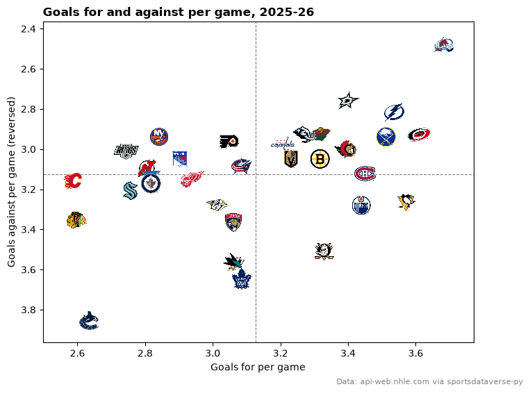
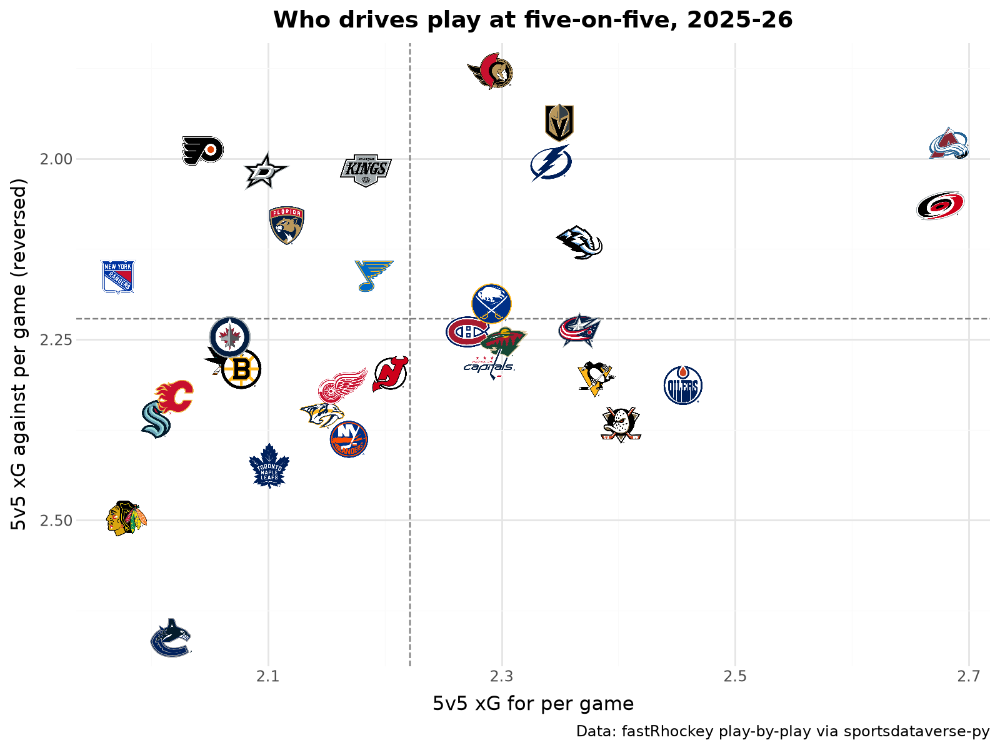
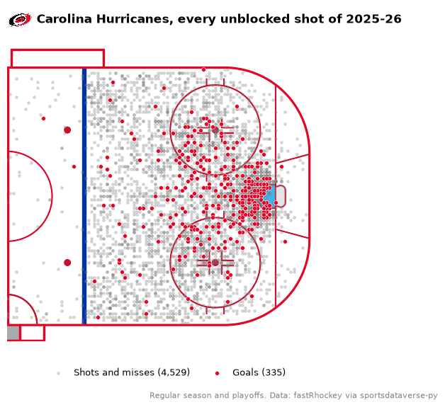
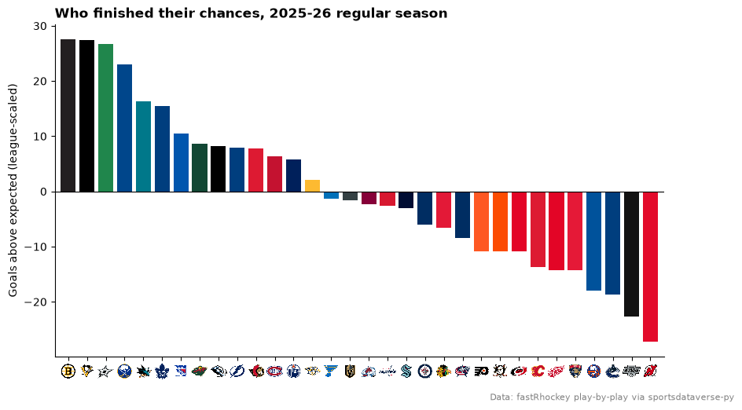
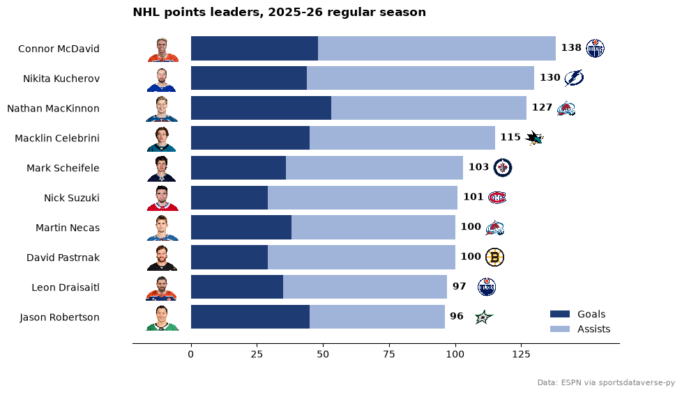
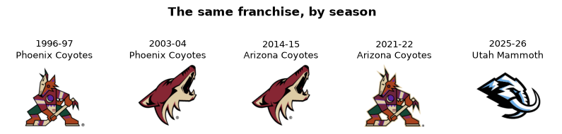
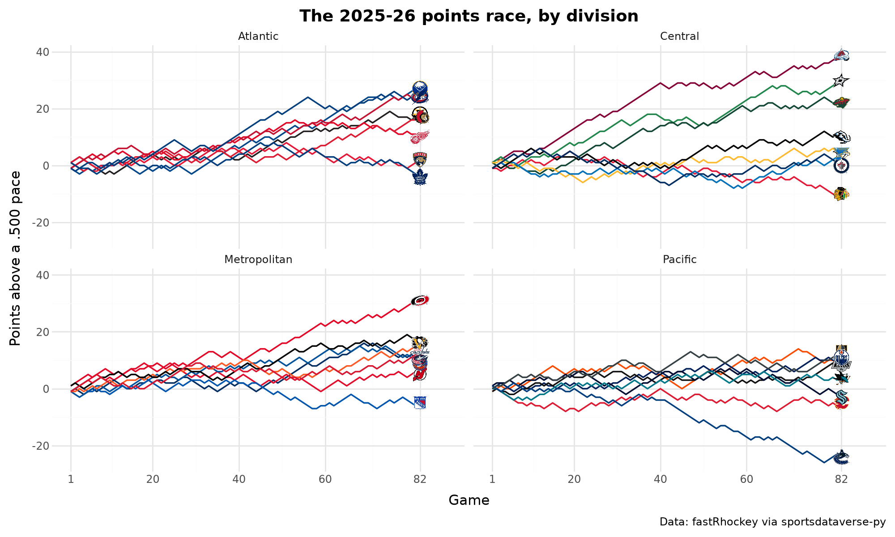
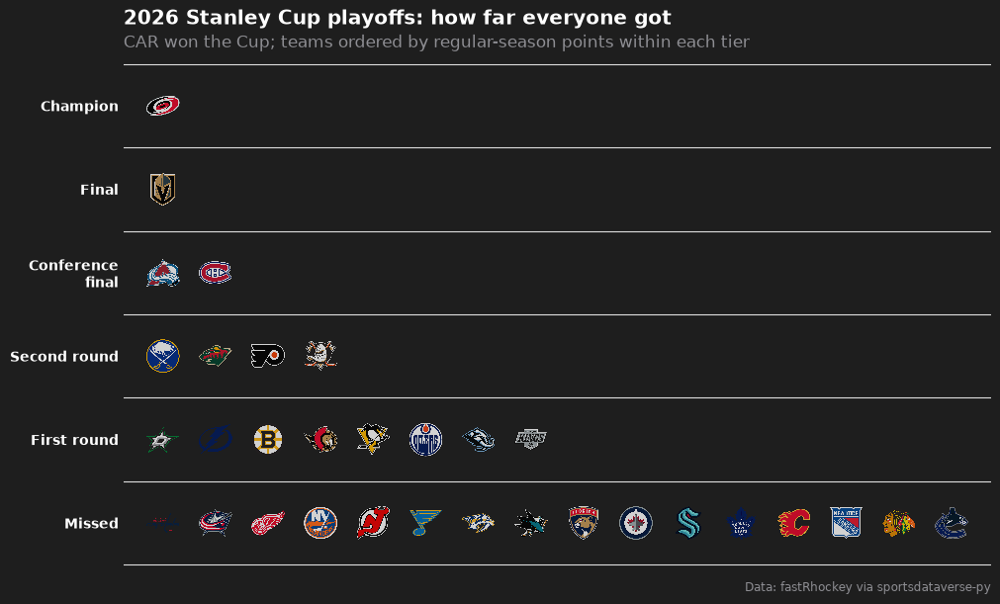

# NHL

Ten charts and tables from the 2025-26 NHL season: standings, expected goals, a shot map on a rink, scoring leaders
with headshots, the Coyotes-to-Utah relocation, a division points race and a playoff tier list. The data is the
fastRhockey release (play-by-play with expected goals, box scores) and the NHL's own api-web.nhle.com feed, both read
through [sportsdataverse-py](https://py.sportsdataverse.org/).

```python
import matplotlib.pyplot as plt
import polars as pl
import sportsdataverse.nhl as nhl

import sdvplot

SEASON = 2026  # the 2025-26 season, named by the year it ends
```

Load the season once. The play-by-play release has every event with rink coordinates and an expected-goals value
(`xg`); the team box scores have one row per team and game; `nhl_standings` reads the final regular-season table from
api-web.nhle.com.

```python
pbp = nhl.load_nhl_pbp_lite(seasons=[SEASON]).select(
    "game_id",
    "season_type",
    "period",
    "event_type",
    "event_team_abbr",
    "event_team_type",
    "strength_state",
    "x_fixed",
    "y_fixed",
    "xg",
)
team_box = nhl.load_nhl_team_box(seasons=[SEASON]).select(
    "game_id",
    "game_date",
    "team_abbrev",
    "goals",
    "goals_against",
    (pl.col("game_id") // 10_000 % 100).alias("game_type"),  # 2025020001: regular season (2); 2025030416: playoffs (3)
)
regular = team_box.filter(pl.col("game_type") == 2)
standings = nhl.nhl_standings("2026-04-16")  # the last day of the regular season
pbp.height, team_box.height, standings.height
```

<div class="sdv-output">

```text
(441052, 2788, 32)
```

</div>

## 1. Final standings with logos

A standings table grouped by division. `gt_sdv_logos` turns the NHL's own team codes (`COL`, `UTA`, ...) into logos;
the codes resolve through the index, so nothing is mapped by hand.

```python
from great_tables import GT

from sdvplot.great_tables import gt_sdv_logos, gt_theme_athletic

table = standings.sort("division_name", "division_sequence").select(
    pl.col("division_name").alias("division"),
    pl.col("team_abbrev_default").alias("logo"),
    pl.col("team_name_default").alias("team"),
    pl.col("games_played").alias("gp"),
    pl.col("wins").alias("w"),
    pl.col("losses").alias("l"),
    pl.col("ot_losses").alias("otl"),
    pl.col("points").alias("pts"),
    pl.col("point_pctg").alias("pts_pct"),
    pl.col("goal_differential").alias("diff"),
)
gt = (
    GT(table, groupname_col="division")
    .tab_header("NHL standings, 2025-26", "Final regular season, grouped by division")
    .fmt_number("pts_pct", decimals=3)
    .cols_align("left", "team")
    .cols_label(logo="", team="Team", gp="GP", w="W", l="L", otl="OTL", pts="PTS", pts_pct="PTS%", diff="DIFF")
    .tab_source_note("Data: api-web.nhle.com via sportsdataverse-py")
)
gt_theme_athletic(gt_sdv_logos(gt, "logo", league="nhl", height=22))
```

<div class="sdv-output">

<iframe class="sdv-frame" src="/outputs/tutorials/leagues/nhl/5_0.html" title="HTML output" height="480" loading="lazy"></iframe>

</div>

## 2. Goals for and against

Goals scored and allowed per game, one logo per team. The y axis is reversed so the good defensive teams sit at the
top: the top-right corner is where you want to be.

```python
gpg = standings.select(
    pl.col("team_abbrev_default").alias("team"),
    (pl.col("goal_for") / pl.col("games_played")).alias("gf"),
    (pl.col("goal_against") / pl.col("games_played")).alias("ga"),
)
fig, ax = plt.subplots(figsize=(8, 6))
ax.scatter(gpg["gf"], gpg["ga"], alpha=0)  # sets the limits; the logos are the points
ax.axvline(gpg["gf"].mean(), color="grey", lw=0.8, ls="--")
ax.axhline(gpg["ga"].mean(), color="grey", lw=0.8, ls="--")
ax.invert_yaxis()
ax.margins(0.08)
sdvplot.add_logos(ax, gpg["gf"], gpg["ga"], gpg["team"], league="nhl", season=SEASON, height=0.07)
ax.set(xlabel="Goals for per game", ylabel="Goals against per game (reversed)")
ax.set_title("Goals for and against per game, 2025-26", loc="left", fontweight="bold")
fig.text(0.99, 0.01, "Data: api-web.nhle.com via sportsdataverse-py", ha="right", fontsize=8, color="grey")
plt.show()
```

<div class="sdv-output">



</div>

Colorado led both ways, scoring 3.68 and allowing 2.48 a game on the way to 121 points; Vancouver allowed 3.85 a game
and finished last with 58.

## 3. Five-on-five expected goals with plotnine

Expected goals (xG) weigh every unblocked shot by its chance of scoring. Summed at five-on-five for and against each
team, they show who drives play, with less luck than goals. `geom_sdv_logos` draws the logos and `geom_mean_lines`
the league averages.

```python
from plotnine import aes, element_text, ggplot, labs, scale_y_reverse, theme, theme_minimal

from sdvplot.plotnine import geom_mean_lines, geom_sdv_logos

shots = pbp.filter((pl.col("season_type") == "R") & (pl.col("strength_state") == "5v5") & pl.col("xg").is_not_null())
games = regular.group_by("team_abbrev").agg(pl.len().alias("gp"))
xg_for = shots.group_by(pl.col("event_team_abbr").alias("team_abbrev")).agg(pl.col("xg").sum().alias("xgf"))
# a shot against a team is a shot by its opponent in the same game
opp = (
    regular.select("game_id", "team_abbrev")
    .join(regular.select("game_id", pl.col("team_abbrev").alias("opponent")), on="game_id")
    .filter(pl.col("team_abbrev") != pl.col("opponent"))
)
shots = shots.with_columns(pl.col("game_id").cast(pl.Int64))  # Int32 in the play-by-play, Int64 in the box scores
assert shots.schema["game_id"] == opp.schema["game_id"]
xg_against = (
    shots.join(opp, left_on=["game_id", "event_team_abbr"], right_on=["game_id", "opponent"])
    .group_by("team_abbrev")
    .agg(pl.col("xg").sum().alias("xga"))
)
xg = (
    xg_for.join(xg_against, on="team_abbrev")
    .join(games, on="team_abbrev")
    .with_columns((pl.col("xgf") / pl.col("gp")).alias("xgf_pg"), (pl.col("xga") / pl.col("gp")).alias("xga_pg"))
)
(
    ggplot(xg.to_pandas(), aes("xgf_pg", "xga_pg", x0="xgf_pg", y0="xga_pg", team="team_abbrev"))
    + geom_mean_lines(color="grey")
    + geom_sdv_logos(league="nhl", season=SEASON, height=0.075)
    + scale_y_reverse()
    + labs(
        x="5v5 xG for per game",
        y="5v5 xG against per game (reversed)",
        title="Who drives play at five-on-five, 2025-26",
        caption="Data: fastRhockey play-by-play via sportsdataverse-py",
    )
    + theme_minimal()
    + theme(figure_size=(8, 6), plot_title=element_text(weight="bold"))
)
```

<div class="sdv-output">



</div>

## 4. A shot map on the rink

`surface("nhl", team)` draws a regulation rink with sportypy, its center line, faceoff circle and boards in the
team's colors. The release's `x_fixed` puts the home team shooting right and the away team left; flipping the away
shots (both x and y) puts every shot in one attacking end.

```python
from sdvplot.matplotlib import title_image

team = "CAR"
mine = (
    pbp.filter(
        (pl.col("event_team_abbr") == team)
        & pl.col("event_type").is_in(["SHOT", "MISSED_SHOT", "GOAL"])
        & pl.col("x_fixed").is_not_null()
    )
    .with_columns(flip=pl.when(pl.col("event_team_type") == "away").then(-1).otherwise(1))
    .with_columns(x=pl.col("x_fixed") * pl.col("flip"), y=pl.col("y_fixed") * pl.col("flip"))
)
goals, others = mine.filter(pl.col("event_type") == "GOAL"), mine.filter(pl.col("event_type") != "GOAL")
color = sdvplot.team_colors(team, "nhl")

fig, ax = plt.subplots(figsize=(8, 6))
sdvplot.surface("nhl", team, ax=ax, display_range="offense")
ax.scatter(
    others["x"], others["y"], s=6, color="grey", alpha=0.25, zorder=20, label=f"Shots and misses ({others.height:,})"
)
ax.scatter(
    goals["x"], goals["y"], s=18, color=color, edgecolor="white", lw=0.4, zorder=21, label=f"Goals ({goals.height})"
)
ax.legend(loc="upper center", bbox_to_anchor=(0.5, 0.0), ncol=2, fontsize=9, frameon=False)
title_image(
    ax,
    team,
    "Carolina Hurricanes, every unblocked shot of 2025-26",
    league="nhl",
    height=26,
    loc="left",
    fontweight="bold",
    pad=10,
)
fig.text(
    0.99,
    0.02,
    "Regular season and playoffs. Data: fastRhockey via sportsdataverse-py",
    ha="right",
    fontsize=8,
    color="grey",
)
plt.show()
```

<div class="sdv-output">



</div>

## 5. Finishing: goals above expected, logos on the axis

Goals minus expected goals, all situations. The release's xG model was fit on earlier seasons and expects more goals
than 2025-26 produced, so first scale every team's xG by the league's goals-to-xG ratio; what is left is finishing
relative to the league. `axis_logos` swaps the team codes on the x axis for their logos.

```python
attempts = pbp.filter(
    (pl.col("season_type") == "R") & pl.col("xg").is_not_null() & (pl.col("period") <= 4)
)  # no shootouts
league_goals, league_xg = (attempts["event_type"] == "GOAL").sum(), attempts["xg"].sum()
print(f"{league_goals:,} goals on {league_xg:,.0f} expected: the model runs {league_xg / league_goals - 1:.0%} high")
finish = (
    attempts.group_by(pl.col("event_team_abbr").alias("team"))
    .agg((pl.col("event_type") == "GOAL").sum().alias("goals"), pl.col("xg").sum().alias("xg"))
    .with_columns((pl.col("goals") - pl.col("xg") * league_goals / league_xg).alias("gax"))
    .sort("gax", descending=True)
)
fig, ax = plt.subplots(figsize=(10, 5.5))
ax.bar(finish["team"], finish["gax"], color=sdvplot.team_colors(finish["team"], "nhl"))
ax.axhline(0, color="black", lw=0.8)
ax.margins(x=0.01)
sdvplot.axis_logos(ax, "x", league="nhl", season=SEASON, height=0.05)
ax.set_ylabel("Goals above expected (league-scaled)")
ax.spines[["top", "right"]].set_visible(False)
ax.set_title("Who finished their chances, 2025-26 regular season", loc="left", fontweight="bold")
fig.text(0.99, 0.01, "Data: fastRhockey play-by-play via sportsdataverse-py", ha="right", fontsize=8, color="grey")
plt.show()
```

<div class="sdv-output">

```text
7,885 goals on 8,867 expected: the model runs 12% high
```



</div>

Boston (+27.5) and Pittsburgh (+27.3) finished best; New Jersey scored 27 fewer goals than its chances were worth.

## 6. Scoring leaders with headshots

ESPN's leaders feed carries ESPN athlete ids, which is what `add_headshots` needs for the NHL. Goals and assists stack
into points; the player's team logo sits at the end of the bar.

```python
raw = nhl.espn_nhl_leaders(season=SEASON, season_type=2, limit=12, return_parsed=False)
names = next(c["names"] for c in raw["categories"] if c["name"] == "offensive")
rows = []
for a in raw["athletes"]:
    stats = dict(zip(names, next(c["values"] for c in a["categories"] if c["name"] == "offensive"), strict=True))
    rows.append(
        {
            "player_id": a["athlete"]["id"],
            "player": a["athlete"]["displayName"],
            "team": a["athlete"]["teamShortName"],
            "goals": stats["goals"],
            "assists": stats["assists"],
            "points": stats["points"],
        }
    )
leaders = pl.DataFrame(rows).sort("points").tail(10)

fig, ax = plt.subplots(figsize=(9, 6))
y = range(leaders.height)
ax.barh(y, leaders["goals"], color="#1f3b73", label="Goals")
ax.barh(y, leaders["assists"], left=leaders["goals"], color="#9fb4d8", label="Assists")
ax.set_yticks(list(y), leaders["player"])
ax.set_xlim(-22, leaders["points"].max() + 24)
ax.tick_params(axis="y", length=0, pad=34)
sdvplot.add_headshots(ax, [-11] * leaders.height, list(y), leaders["player_id"], league="nhl", height=0.085)
sdvplot.add_logos(ax, (leaders["points"] + 15).to_list(), list(y), leaders["team"], league="nhl", height=0.065)
for i, p in enumerate(leaders["points"]):
    ax.text(p + 2, i, f"{p:.0f}", va="center", fontsize=10, fontweight="bold")
ax.spines[["top", "right", "left"]].set_visible(False)
ax.set_xticks([0, 25, 50, 75, 100, 125])
ax.legend(loc="lower right", frameon=False)
ax.set_title("NHL points leaders, 2025-26 regular season", loc="left", fontweight="bold")
fig.text(0.99, 0.01, "Data: ESPN via sportsdataverse-py", ha="right", fontsize=8, color="grey")
plt.show()
```

<div class="sdv-output">



</div>

Connor McDavid led with 138 points, 90 of them assists; Nathan MacKinnon scored the most goals of the ten.

## 7. One franchise, many marks: Phoenix, Arizona, Utah

The Coyotes moved to Salt Lake City in 2024 (the Utah Hockey Club for a season, the Utah Mammoth since). sdvplot
keeps the franchise as one team: the old and new codes resolve to the same `team_id`, and `season` picks the logo of
each era.

```python
sdvplot.resolve(["PHX", "ARI", "UTA"], "nhl", season=[2000, 2020, 2026])
```

<div class="sdv-output">

```text
['129764', '129764', '129764']
```

</div>

```python
eras = {
    1997: "Phoenix Coyotes",
    2004: "Phoenix Coyotes",
    2015: "Arizona Coyotes",
    2022: "Arizona Coyotes",
    2026: "Utah Mammoth",
}
fig, axes = plt.subplots(1, len(eras), figsize=(10, 2.6))
for ax, (season, name) in zip(axes, eras.items(), strict=True):
    ax.imshow(sdvplot.logo_image("UTA", "nhl", season=season, size=240))
    ax.set_title(f"{season - 1}-{str(season)[2:]}\n{name}", fontsize=9)
    ax.axis("off")
fig.suptitle("The same franchise, by season", fontweight="bold")
plt.show()
```

<div class="sdv-output">



</div>

## 8. The points race, by division

Standings points (two for a win, one for an overtime or shootout loss) game by game, measured against a .500 pace of
one point a game, so the lines spread apart instead of all climbing together. The box scores have the score and the
play-by-play says which games went past regulation; the totals match the official standings for every team.
`scale_color_sdv` colors each line by its team and `geom_sdv_logos` labels the line ends in each facet.

```python
from plotnine import facet_wrap, geom_line, scale_x_continuous

from sdvplot.plotnine import scale_color_sdv

last_period = (
    pbp.group_by("game_id")
    .agg(pl.col("period").max().alias("last_period"))
    .with_columns(pl.col("game_id").cast(pl.Int64))
)
assert team_box.schema["game_id"] == last_period.schema["game_id"]
race = (
    regular.join(last_period, on="game_id")
    .with_columns(
        pts=pl.when(pl.col("goals") > pl.col("goals_against"))
        .then(2)
        .when(pl.col("last_period") > 3)
        .then(1)
        .otherwise(0)
    )
    .sort("game_date", "game_id")
    .with_columns(
        game=pl.col("game_id").cum_count().over("team_abbrev"),
        points=pl.col("pts").cum_sum().over("team_abbrev"),
    )
    .join(
        standings.select(
            pl.col("team_abbrev_default").alias("team_abbrev"),
            pl.col("division_name").alias("division"),
            pl.col("points").alias("official"),
        ),
        on="team_abbrev",
    )
    .with_columns(above=pl.col("points") - pl.col("game"))
)
final = race.filter(pl.col("game") == 82)
assert (final["points"] == final["official"]).all()
(
    ggplot(race.to_pandas(), aes("game", "above", color="team_abbrev"))
    + geom_line(size=0.7, show_legend=False)
    + geom_sdv_logos(aes(team="team_abbrev"), data=final.to_pandas(), league="nhl", season=SEASON, height=0.09)
    + scale_color_sdv("nhl", season=SEASON)
    + scale_x_continuous(breaks=[1, 20, 40, 60, 82], limits=(1, 88))
    + facet_wrap("division", ncol=2)
    + labs(
        x="Game",
        y="Points above a .500 pace",
        title="The 2025-26 points race, by division",
        caption="Data: fastRhockey via sportsdataverse-py",
    )
    + theme_minimal()
    + theme(figure_size=(10, 6), plot_title=element_text(weight="bold"))
)
```

<div class="sdv-output">



</div>

## 9. Interactive: expected-goal share against points

The same logos in Plotly, so you can hover for the numbers: five-on-five expected-goal share (from example 3) against
points percentage.

```python
import plotly.graph_objects as go

share = xg.join(
    standings.select(
        pl.col("team_abbrev_default").alias("team_abbrev"), pl.col("team_name_default").alias("name"), "point_pctg"
    ),
    on="team_abbrev",
).with_columns((100 * pl.col("xgf") / (pl.col("xgf") + pl.col("xga"))).alias("xg_share"))
fig = go.Figure(
    go.Scatter(
        x=share["xg_share"],
        y=share["point_pctg"],
        mode="markers",
        marker={"opacity": 0},
        text=share["name"],
        hovertemplate="%{text}<br>5v5 xG share %{x:.1f}%<br>Points %{y:.3f}<extra></extra>",
    )
)
fig = sdvplot.add_logos(
    fig, share["xg_share"], share["point_pctg"], share["team_abbrev"], league="nhl", season=SEASON, height=0.08
)
fig.update_layout(
    title="5v5 expected-goal share and points percentage, 2025-26",
    template="plotly_white",
    xaxis_title="5v5 xG share (%)",
    yaxis_title="Points percentage",
    width=800,
    height=560,
)
fig
```

<div class="sdv-output">

<iframe class="sdv-frame" src="/outputs/tutorials/leagues/nhl/25_0.html" title="Interactive Plotly figure" height="480" loading="lazy"></iframe>

</div>

## 10. Playoff tiers

A tier list of how far each team went in the 2026 playoffs, regular-season points deciding the order within a tier.
The playoff round is the seventh digit of an NHL playoff game id (`2025030416` is round 4, series 1, game 6).

```python
from sdvplot.matplotlib import team_tiers

playoffs = team_box.filter(pl.col("game_type") == 3).with_columns(
    rnd=(pl.col("game_id") // 100 % 10), win=(pl.col("goals") > pl.col("goals_against")).cast(pl.Int32)
)
final_wins = playoffs.filter(pl.col("rnd") == 4).group_by("team_abbrev").agg(pl.col("win").sum())
champion = final_wins.filter(pl.col("win") == 4)["team_abbrev"].item()
reached = playoffs.group_by("team_abbrev").agg(pl.col("rnd").max())
tiers = (
    standings.select(pl.col("team_abbrev_default").alias("team"), "points")
    .join(reached, left_on="team", right_on="team_abbrev", how="left")
    .with_columns(
        tier_no=pl.when(pl.col("team") == champion)
        .then(1)
        .when(pl.col("rnd").is_null())
        .then(6)
        .otherwise(6 - pl.col("rnd"))
    )
    .sort("tier_no", pl.col("points"), descending=[False, True])
)
fig = team_tiers(
    tiers,
    "nhl",
    title="2026 Stanley Cup playoffs: how far everyone got",
    subtitle=f"{champion} won the Cup; teams ordered by regular-season points within each tier",
    caption="Data: fastRhockey via sportsdataverse-py",
    tier_desc={1: "Champion", 2: "Final", 3: "Conference final", 4: "Second round", 5: "First round", 6: "Missed"},
    height=0.07,
)
fig.set_size_inches(10, 6)
plt.show()
```

<div class="sdv-output">



</div>

## Run it yourself

<a href="pathname:///notebooks/leagues/nhl.ipynb" download>Download the notebook</a> (outputs cleared) or [open it on GitHub](https://github.com/sportsdataverse/sdvplot/blob/main/examples/notebooks/leagues/nhl.ipynb).
