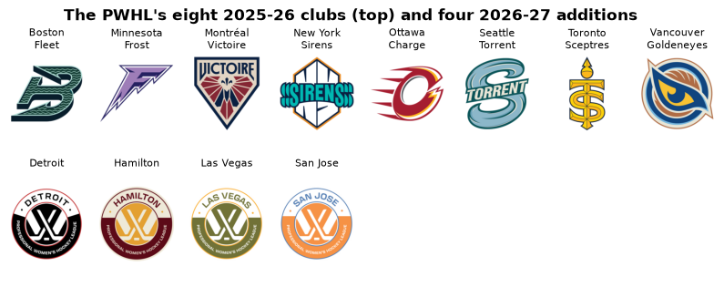
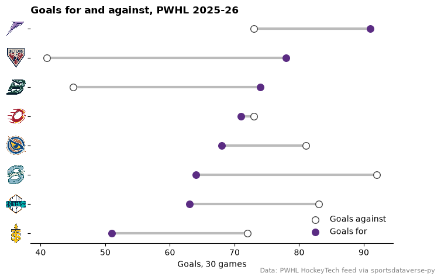
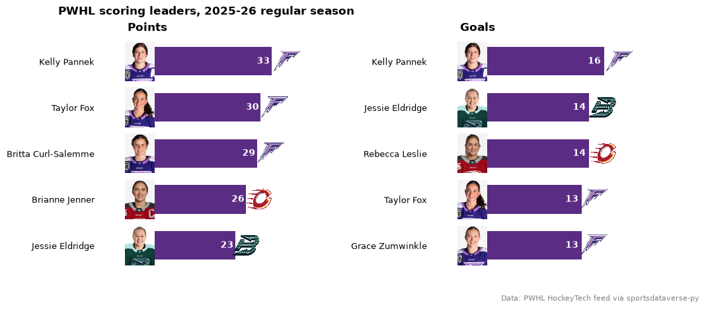
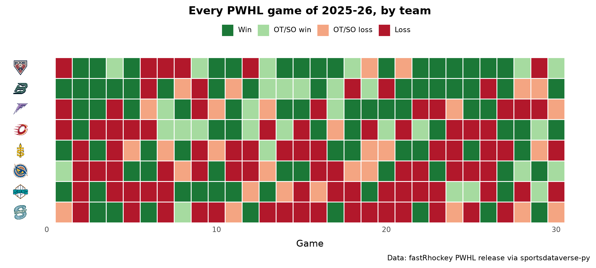
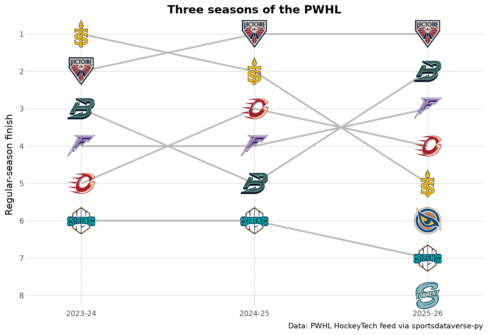
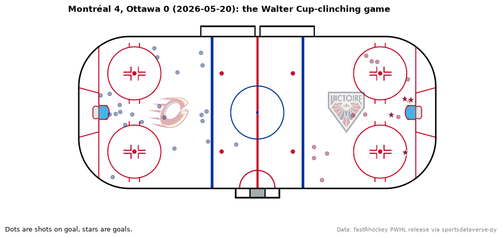
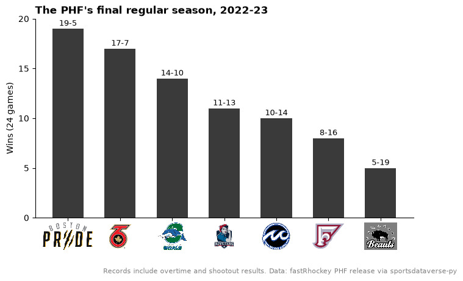

# PWHL

Nine charts and tables from the Professional Women's Hockey League's 2025-26 season, its third: standings, scoring
leaders with their photos, a results grid, three seasons of history, shot quality and a shot map of the game that
decided the Walter Cup, plus the PHF, the league before it. The data comes from the PWHL's HockeyTech feed (live) and
the fastRhockey release, both through [sportsdataverse-py](https://py.sportsdataverse.org/).

```python
import warnings

import matplotlib.pyplot as plt
import polars as pl
import sportsdataverse.pwhl as pwhl

import sdvplot

SEASON = 2026  # the 2025-26 season, named by the year it ends
```

## 1. Team identity: ids resolve, codes do not

sdvplot knows PWHL teams by their HockeyTech team id and by name. The three-letter codes in HockeyTech's tables are
not in the index, so they warn instead of guessing. Join to the league's team list to pick up the id.

```python
teams = pwhl.pwhl_teams(season=SEASON).select("team_id", "team_code", "team_name")
with warnings.catch_warnings(record=True) as caught:
    warnings.simplefilter("always")
    by_code = sdvplot.resolve(teams["team_code"], "pwhl")
print(caught[0].message)
sdvplot.resolve(teams["team_id"], "pwhl").to_list()
```

<div class="sdv-output">

```text
12 value(s) did not resolve to a pwhl team: 'BOS' (unknown), 'MIN' (unknown), 'MTL' (unknown), 'NY' (unknown), 'OTT' (unknown), 'DET' (unknown), 'HAM' (unknown), 'VEG' (unknown), 'SJ' (unknown), 'SEA' (unknown), 'TOR' (unknown), 'VAN' (unknown). Use sdvplot.suggest() for candidates, or strict=True to raise.
```

```text
['1', '2', '3', '4', '5', '10', '11', '12', '13', '8', '6', '9']
```

</div>

The team list already holds the four clubs that join for 2026-27, and every club has a logo. Colors are another
matter: no source publishes PWHL colors, so the index's are read from each club's logo (`color_source` is
`"logo"`), and the charts below lean on the logos themselves.

```python
sdvplot.teams("pwhl").group_by("color_source", maintain_order=True).len()
```

<div class="sdv-output">

| color_source | len |
|--------------|-----|
| logo         | 12  |

</div>

```python
schedule = pwhl.load_pwhl_schedule(seasons=[SEASON])
played = set(schedule["home_team_id"])  # the clubs with a 2025-26 home game
clubs = pwhl.pwhl_teams(season=SEASON).with_columns(new=~pl.col("team_id").is_in(played)).sort("new", "team_name")
fig, axes = plt.subplots(2, 8, figsize=(10, 3.4))
for ax, club in zip(axes.flat, clubs.iter_rows(named=True), strict=False):
    ax.imshow(sdvplot.logo_image(club["team_id"], "pwhl", size=200))
    nickname = "" if club["team_nickname"] == "PWHL" else club["team_nickname"]  # the new clubs have no name yet
    ax.set_title(f"{club['team_label']}\n{nickname}", fontsize=8)
for ax in axes.flat:
    ax.axis("off")
fig.suptitle("The PWHL's eight 2025-26 clubs (top) and four 2026-27 additions", fontweight="bold")
plt.show()
```

<div class="sdv-output">



</div>

## 2. Final standings

The PWHL awards three points for a regulation win, two for an overtime or shootout win and one for an overtime or
shootout loss. HockeyTech prefixes clinched teams with `x -` and eliminated teams with `e -`; split that into its own
column, then join on the code to get the id `gt_sdv_logos` resolves.

```python
from great_tables import GT

from sdvplot.great_tables import gt_sdv_logos, gt_theme_sdv

raw_standings = pwhl.pwhl_standings(season=SEASON)
standings = (
    raw_standings.with_columns(
        status=pl.col("team_code").str.extract(r"^(\w+) - ").replace({"x": "Playoffs", "e": "Out"}),
        team_code=pl.col("team_code").str.replace(r"^\w+ - ", ""),
    )
    .join(teams, on="team_code")
    .select(
        "team_id",
        "team_name",
        pl.col("games_played").cast(pl.Int64).alias("gp"),
        pl.col("regulation_wins").cast(pl.Int64).alias("rw"),
        pl.col("non_reg_wins").cast(pl.Int64).alias("otw"),
        pl.col("non_reg_losses").cast(pl.Int64).alias("otl"),
        pl.col("losses").cast(pl.Int64).alias("l"),
        "points",
        pl.col("goals_for").cast(pl.Int64).alias("gf"),
        pl.col("goals_against").cast(pl.Int64).alias("ga"),
        "status",
    )
    .sort("points", "gf", descending=True)
)
gt = (
    GT(standings.rename({"team_id": "logo"}))
    .tab_header("PWHL standings, 2025-26", "Final regular season: 30 games, 3-2-1-0 points")
    .cols_label(
        logo="",
        team_name="Team",
        gp="GP",
        rw="RW",
        otw="OTW",
        otl="OTL",
        l="L",
        points="PTS",
        gf="GF",
        ga="GA",
        status="",
    )
    .tab_source_note("Data: PWHL HockeyTech feed via sportsdataverse-py")
)
gt_theme_sdv(gt_sdv_logos(gt, "logo", league="pwhl", height=26))
```

<div class="sdv-output">

<iframe class="sdv-frame" src="/outputs/tutorials/leagues/pwhl/8_0.html" title="HTML output" height="480" loading="lazy"></iframe>

</div>

## 3. Goals for and against, as a dumbbell

Each team's line runs from goals allowed (open circle) to goals scored (filled); a filled dot on the right means a
positive goal difference. `axis_logos` puts the logos on the y axis; the axis labels are team ids, which resolve.

```python
d = standings.sort("gf")
fig, ax = plt.subplots(figsize=(8, 5))
ax.hlines(d["team_id"], d["ga"], d["gf"], color="#bbbbbb", lw=3, zorder=1)
ax.scatter(d["ga"], d["team_id"], s=70, facecolor="white", edgecolor="#444444", zorder=2, label="Goals against")
ax.scatter(d["gf"], d["team_id"], s=70, color="#5b2c83", zorder=3, label="Goals for")
sdvplot.axis_logos(ax, "y", league="pwhl", height=0.09)
ax.spines[["top", "right", "left"]].set_visible(False)
ax.legend(loc="lower right", frameon=False)
ax.set_xlabel("Goals, 30 games")
ax.set_title("Goals for and against, PWHL 2025-26", loc="left", fontweight="bold")
fig.text(0.99, 0.01, "Data: PWHL HockeyTech feed via sportsdataverse-py", ha="right", fontsize=8, color="grey")
plt.show()
```

<div class="sdv-output">



</div>

Minnesota scored the most (91) but allowed 73; Montréal and Boston, level on 62 points, allowed the fewest.

## 4. A leaders card with player photos

`add_headshots` covers ESPN leagues; for the PWHL use `add_images`, which draws any image by URL with the same sizing.
HockeyTech's leaders feed has the top five in points and in goals, each with a photo URL.

```python
from sdvplot.matplotlib import add_images

leaders = pwhl.pwhl_leaders(season=SEASON).with_columns(pl.col("stat_formatted").cast(pl.Int64).alias("value"))
fig, axes = plt.subplots(1, 2, figsize=(10, 4.6), gridspec_kw={"wspace": 0.85})
for ax, stat in zip(axes, ("Points", "Goals"), strict=True):
    top = leaders.filter(pl.col("type_formatted") == stat).sort("rank", descending=True)
    y = list(range(top.height))
    ax.barh(y, top["value"], color="#5b2c83", height=0.62)
    ax.set_yticks(y, top["name"], fontsize=9)
    ax.tick_params(axis="y", length=0, pad=36)
    ax.set_xlim(-top["value"].max() * 0.2, top["value"].max() * 1.3)
    add_images(ax, [-top["value"].max() * 0.1] * top.height, y, top["photo"], height=0.17)
    sdvplot.add_logos(ax, (top["value"] * 1.13).to_list(), y, top["team_id"], league="pwhl", height=0.12)
    for i, v in enumerate(top["value"]):
        ax.text(v - 0.4, i, str(v), va="center", ha="right", color="white", fontweight="bold")
    ax.set_xticks([])
    ax.spines[["top", "right", "left", "bottom"]].set_visible(False)
    ax.set_title(stat, loc="left", fontweight="bold")
fig.suptitle("PWHL scoring leaders, 2025-26 regular season", fontweight="bold", x=0.02, ha="left")
fig.text(0.99, 0.01, "Data: PWHL HockeyTech feed via sportsdataverse-py", ha="right", fontsize=8, color="grey")
plt.show()
```

<div class="sdv-output">



</div>

Minnesota's Kelly Pannek led both lists, with 33 points and 16 goals.

## 5. A results grid with plotnine

Every regular-season game as a tile, in date order, one row per team. The release schedule says which games went to
overtime or a shootout (`Final OT`, `Final SO`); the play-by-play has each game's date. `axis_logos` swaps the team
ids on the y axis for logos.

```python
from plotnine import aes, element_blank, element_text, geom_tile, ggplot, labs, scale_fill_manual, theme, theme_minimal

pbp = pwhl.load_pwhl_pbp(seasons=[SEASON])
dates = pbp.group_by("game_id", maintain_order=True).agg(pl.col("game_date").first())
schedule = schedule.with_columns(
    pl.col("game_id").cast(pl.Int64)
)  # a string in the schedule, Int64 in the play-by-play
assert schedule.schema["game_id"] == dates.schema["game_id"]
regular = schedule.filter(pl.col("game_type") == "regular")
sides = [
    regular.select(
        "game_id",
        "game_status",
        pl.col(f"{me}_team_id").alias("team_id"),
        pl.col(f"{me}_score").cast(pl.Int64).alias("gf"),
        pl.col(f"{them}_score").cast(pl.Int64).alias("ga"),
    )
    for me, them in (("home", "away"), ("away", "home"))
]
results = (
    pl.concat(sides)
    .join(dates, on="game_id")
    .with_columns(extra=pl.col("game_status") != "Final")
    .with_columns(
        result=pl.when(pl.col("gf") > pl.col("ga"))
        .then(pl.when(pl.col("extra")).then(pl.lit("OT/SO win")).otherwise(pl.lit("Win")))
        .otherwise(pl.when(pl.col("extra")).then(pl.lit("OT/SO loss")).otherwise(pl.lit("Loss")))
    )
    .sort("game_date", "game_id")
    .with_columns(game=pl.col("game_id").cum_count().over("team_id"))
)
order = standings["team_id"].reverse().to_list()  # best team on top
grid = results.to_pandas()
grid["team_id"] = grid["team_id"].astype("category").cat.set_categories(order)
p = (
    ggplot(grid, aes("game", "team_id", fill="result"))
    + geom_tile(color="white", size=0.6)
    + scale_fill_manual(
        values={"Win": "#1b7837", "OT/SO win": "#a6dba0", "OT/SO loss": "#f4a582", "Loss": "#b2182b"},
        breaks=["Win", "OT/SO win", "OT/SO loss", "Loss"],
    )
    + labs(
        x="Game",
        y="",
        fill="",
        title="Every PWHL game of 2025-26, by team",
        caption="Data: fastRhockey PWHL release via sportsdataverse-py",
    )
    + theme_minimal()
    + theme(
        figure_size=(10, 4.5), panel_grid=element_blank(), legend_position="top", plot_title=element_text(weight="bold")
    )
)
sdvplot.axis_logos(p, "y", league="pwhl", height=0.09)
```

<div class="sdv-output">



</div>

## 6. Three seasons of the PWHL

Each club's regular-season finish in the league's three seasons, as a bump chart. HockeyTech's 2023-24 standings use
placeholder names (`PWHL Toronto`) and the codes do not resolve, so join each season's standings to the team list on
the code, as in example 1. Seattle and Vancouver joined for 2025-26, so they have one point each.

```python
from plotnine import geom_line, scale_x_continuous, scale_y_reverse

from sdvplot.plotnine import geom_sdv_logos

history = (
    pl.concat(
        [pwhl.pwhl_standings(season=s).with_columns(season=pl.lit(s)) for s in (2024, 2025, 2026)],
        how="diagonal_relaxed",
    )
    .with_columns(team_code=pl.col("team_code").str.replace(r"^\w+ - ", ""))
    .join(teams, on="team_code")
    .select("season", "team_id", pl.col("team_rank").alias("finish"))
)
(
    ggplot(history.to_pandas(), aes("season", "finish", group="team_id", team="team_id"))
    + geom_line(color="#bbbbbb", size=1.2)
    + geom_sdv_logos(league="pwhl", height=0.1)
    + scale_x_continuous(breaks=[2024, 2025, 2026], labels=["2023-24", "2024-25", "2025-26"], limits=(2023.8, 2026.2))
    + scale_y_reverse(breaks=list(range(1, 9)))
    + labs(
        x="",
        y="Regular-season finish",
        title="Three seasons of the PWHL",
        caption="Data: PWHL HockeyTech feed via sportsdataverse-py",
    )
    + theme_minimal()
    + theme(figure_size=(8, 5.5), plot_title=element_text(weight="bold"))
)
```

<div class="sdv-output">



</div>

## 7. Shot quality with Altair

HockeyTech marks each shot on goal as a quality chance or not. The share of a team's shots that were quality chances,
as an interactive Altair bar chart; `axis_logos` puts the logos on the y axis of the web chart too.

```python
import altair as alt

quality = (
    pbp.filter(pl.col("event") == "shot")
    .group_by("team_id", maintain_order=True)
    .agg(pl.len().alias("shots"), pl.col("shot_quality").str.starts_with("Quality").mean().alias("quality"))
    .sort("quality", descending=True)
)
bars = (
    alt.Chart(quality.to_pandas(), title="Share of shots on goal that were quality chances, PWHL 2025-26")
    .mark_bar(color="#5b2c83")
    .encode(
        x=alt.X("quality:Q", title="Quality share of shots on goal", axis=alt.Axis(format="%")),
        y=alt.Y("team_id:N", sort=quality["team_id"].to_list(), title=None),
        tooltip=["team_id", "shots", alt.Tooltip("quality:Q", format=".1%")],
    )
    .properties(width=520, height=320)
)
sdvplot.axis_logos(bars, "y", league="pwhl", height=0.09)
```

<div class="sdv-output">

<iframe class="sdv-frame" src="/outputs/tutorials/leagues/pwhl/20_0.html" title="HTML output" height="480" loading="lazy"></iframe>

</div>

## 8. The game that decided the Walter Cup

The last game of the 2026 playoffs, every shot on a rink: `surface("pwhl")` draws the rink, the home team shoots at
the left net and the visitors at the right one (HockeyTech's `x_coord` already fixes that), and each team's logo
sits in its attacking half.

```python
playoffs = schedule.filter(pl.col("game_type") == "playoffs").drop(
    "game_date"
)  # "Wed, May 20": no year, so use the ISO date
last = playoffs.join(dates, on="game_id").sort("game_date").row(-1, named=True)
game = pbp.filter((pl.col("game_id") == last["game_id"]) & pl.col("event").is_in(["shot", "goal"]))
home_id, away_id = last["home_team_id"], last["away_team_id"]
score = f"{last['away_team']} {last['away_score']}, {last['home_team']} {last['home_score']}"

fig, ax = plt.subplots(figsize=(10, 5))
sdvplot.surface("pwhl", ax=ax)
for tid, color in ((home_id, "#1f3b73"), (away_id, "#8c1d40")):
    side = game.filter(pl.col("team_id") == tid)
    shots, goals = side.filter(pl.col("event") == "shot"), side.filter(pl.col("event") == "goal")
    ax.scatter(shots["x_coord"], shots["y_coord"], s=28, color=color, alpha=0.45, zorder=20)
    ax.scatter(goals["x_coord"], goals["y_coord"], s=160, marker="*", color=color, edgecolor="white", zorder=21)
sdvplot.add_logos(ax, [-50, 50], [0, 0], [home_id, away_id], league="pwhl", height=0.22, alpha=0.35, zorder=19)
ax.set_title(f"{score} ({last['game_date']}): the Walter Cup-clinching game", loc="left", fontweight="bold")
fig.text(0.01, 0.02, "Dots are shots on goal, stars are goals.", fontsize=9)
fig.text(0.99, 0.02, "Data: fastRhockey PWHL release via sportsdataverse-py", ha="right", fontsize=8, color="grey")
plt.show()
```

<div class="sdv-output">



</div>

Montréal took the best-of-five final against Ottawa three games to one, and the fourth game was the only shutout of
the series.

## 9. Before the PWHL: the PHF's last season

The Premier Hockey Federation (the NWHL until 2021) played its last season in 2022-23 before the PWHL replaced it. Its
results are in the fastRhockey release; its clubs are in the index by name. The Metropolitan Riveters have two
archive entries, so their name is ambiguous: sdvplot warns rather than picking one.

```python
phf = pwhl.load_phf_schedules(seasons=[2023]).filter(pl.col("game_type") == "Regular Season")
sides = [
    phf.select(
        pl.col(f"{me}_team").alias("team"), pl.col(f"{me}_score").alias("gf"), pl.col(f"{them}_score").alias("ga")
    )
    for me, them in (("home", "away"), ("away", "home"))
]
phf_table = (
    pl.concat(sides)
    .group_by("team", maintain_order=True)
    .agg(pl.len().alias("gp"), (pl.col("gf") > pl.col("ga")).sum().alias("w"), pl.col("gf").sum(), pl.col("ga").sum())
    .with_columns(diff=pl.col("gf") - pl.col("ga"))
    .sort("w", "diff", descending=True)
)
with warnings.catch_warnings(record=True) as caught:
    warnings.simplefilter("always")
    sdvplot.resolve(phf_table["team"], "phf", season=2023)
print(caught[0].message)
sdvplot.suggest("Metropolitan Riveters", "phf")
```

<div class="sdv-output">

```text
1 value(s) did not resolve to a phf team: 'Metropolitan Riveters' (ambiguous: 124984 Metropolitan Riveters or 61636 Metropolitan Riveters); pass season= for a code reused across eras, or id_system= for the id system of the values. Use sdvplot.suggest() for candidates, or strict=True to raise.
```

```text
[('124984', 'Metropolitan Riveters'), ('61636', 'Metropolitan Riveters')]
```

</div>

`marks()` shows the 2022-23 Riveters mark belongs to `124984`, so pass that id for the Riveters and the names for
everyone else.

```python
phf_table = phf_table.with_columns(
    team_key=pl.when(pl.col("team") == "Metropolitan Riveters").then(pl.lit("124984")).otherwise(pl.col("team"))
)
fig, ax = plt.subplots(figsize=(8, 4.8))
ax.bar(phf_table["team_key"], phf_table["w"], color="#3a3a3a", width=0.6)
for i, (w, gp) in enumerate(zip(phf_table["w"], phf_table["gp"], strict=True)):
    ax.text(i, w + 0.3, f"{w}-{gp - w}", ha="center", fontsize=9)
sdvplot.axis_logos(ax, "x", league="phf", season=2023, height=0.14)
ax.spines[["top", "right"]].set_visible(False)
ax.set_yticks(range(0, 21, 5))
ax.set_ylabel(f"Wins ({phf_table['gp'].max()} games)")
ax.set_title("The PHF's final regular season, 2022-23", loc="left", fontweight="bold")
fig.subplots_adjust(bottom=0.2)
fig.text(
    0.99,
    0.01,
    "Records include overtime and shootout results. Data: fastRhockey PHF release via sportsdataverse-py",
    ha="right",
    fontsize=8,
    color="grey",
)
plt.show()
```

<div class="sdv-output">



</div>

Boston had the best record at 19-5, but Toronto won the last Isobel Cup, beating Minnesota 4-3 in the final.

## Run it yourself

<a href="pathname:///notebooks/leagues/pwhl.ipynb" download>Download the notebook</a> (outputs cleared) or [open it on GitHub](https://github.com/sportsdataverse/sdvplot/blob/main/examples/notebooks/leagues/pwhl.ipynb).
