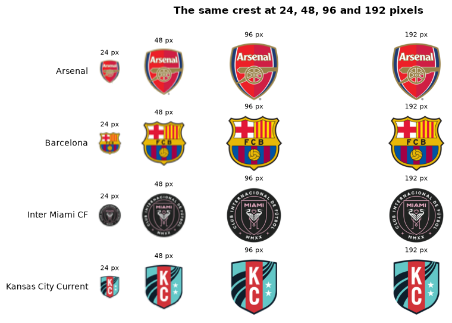
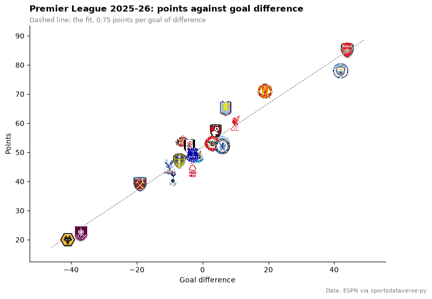
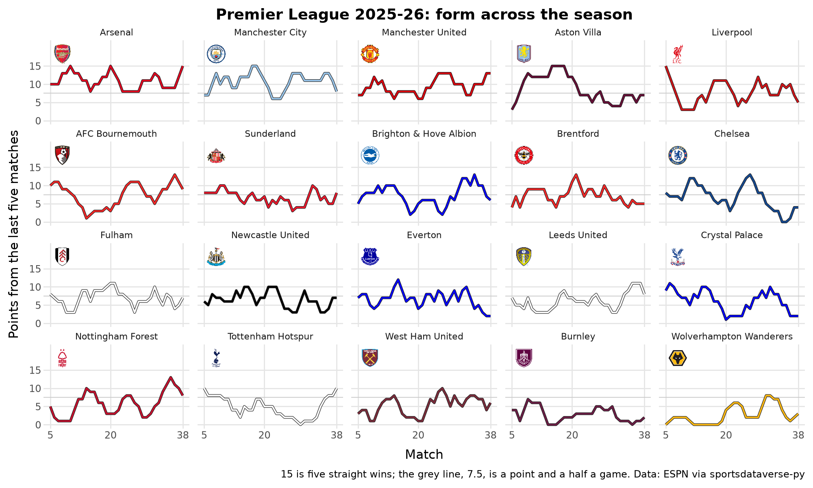
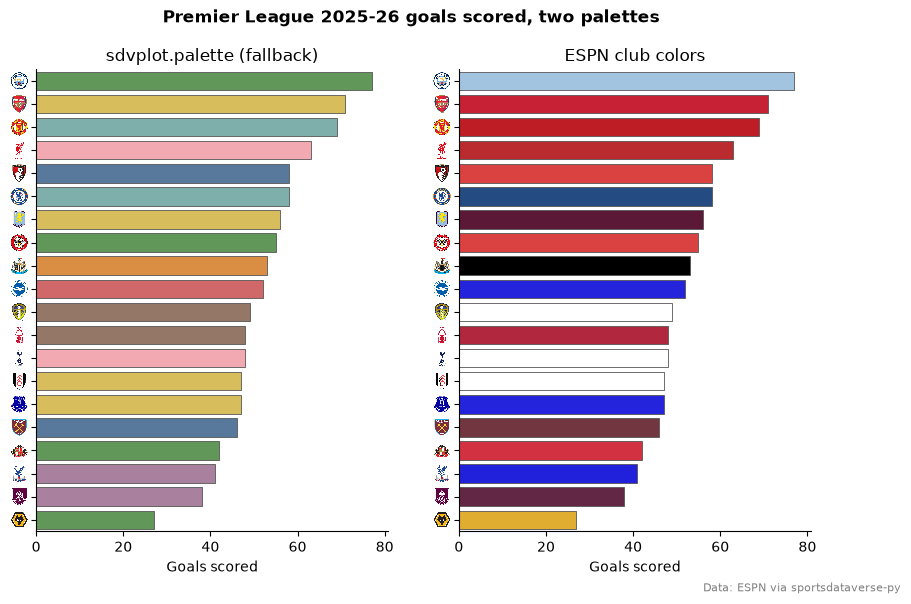
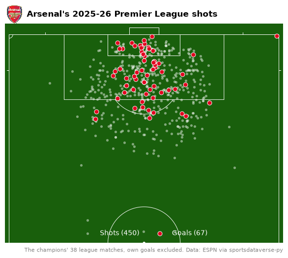
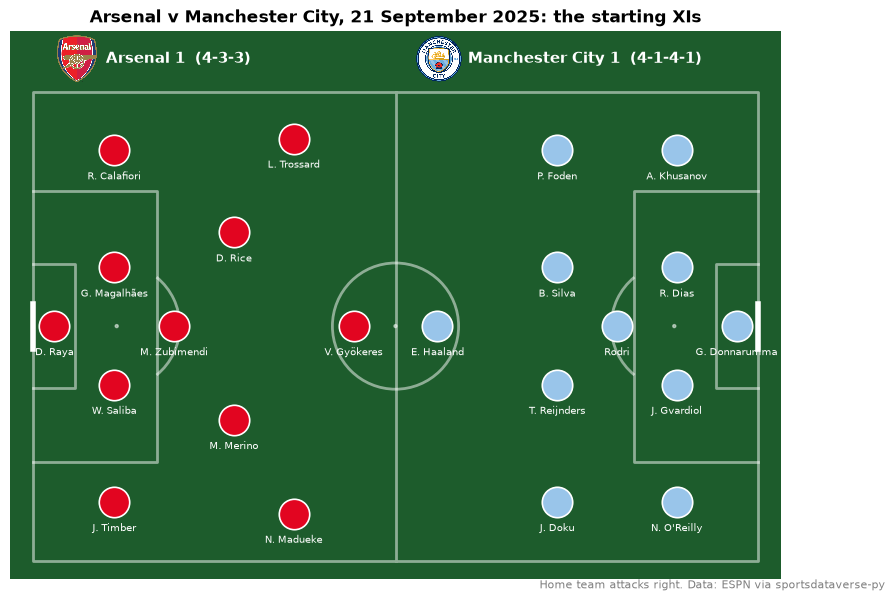
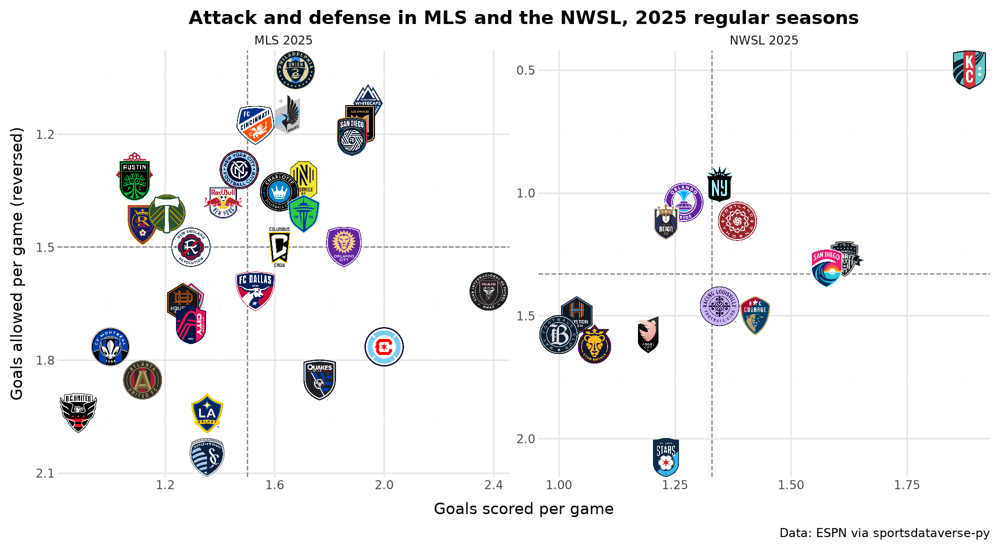

# Soccer

Ten charts and tables from the 2025-26 Premier League, the 2025 MLS and NWSL seasons and the 2025-26 Champions
League: a league table with crests, points against goal difference, every club's form in its own colors, a season of
shots on a pitch, a lineup card, and MLS beside the NWSL. The data is ESPN's soccer feed, read through
[sportsdataverse-py](https://py.sportsdataverse.org/) (`sportsdataverse.soccer`), whose wrappers take ESPN's
competition slug: `eng.1` is the Premier League, `usa.1` MLS, `usa.nwsl` the NWSL and `uefa.champions` the Champions
League. The pitch examples need the `surfaces` extra (`pip install "sdvplot[surfaces]"`).

```python
import warnings

import matplotlib.pyplot as plt
import polars as pl
import sportsdataverse.soccer as soccer

import sdvplot

SEASON = 2025  # ESPN names a season by the year it starts: 2025 is the 2025-26 Premier League, and MLS/NWSL 2025
```

Load the Premier League once: the final table, and every club's 38 league matches from its ESPN schedule. The
schedule payload also carries the club's color, which the charts below use. The points rebuilt from the results
match the official table for all twenty clubs.

```python
table = (
    soccer.espn_soccer_standings("eng.1", season=SEASON)
    .sort("rank")
    .with_columns(
        pl.col(
            "rank",
            "points",
            "games_played",
            "wins",
            "ties",
            "losses",
            "points_for",
            "points_against",
            "point_differential",
        ).cast(pl.Int64)
    )
)
rows, club_colors = [], {}
for team_id in table["team_id"]:
    raw = soccer.espn_soccer_team_schedule("eng.1", team_id=team_id, season=SEASON, return_parsed=False)
    club_colors[team_id] = "#" + raw["team"]["color"]
    for event in raw["events"]:
        us, them = sorted(event["competitions"][0]["competitors"], key=lambda c: c["id"] != team_id)
        rows.append(
            {
                "team_id": team_id,
                "event_id": event["id"],
                "date": event["date"][:10],
                "home_away": us["homeAway"],
                "opponent_id": them["id"],
                "gf": int(us["score"]["value"]),
                "ga": int(them["score"]["value"]),
            }
        )
games = (
    pl.DataFrame(rows)
    .sort("team_id", "date")
    .with_columns(
        pts=pl.when(pl.col("gf") > pl.col("ga")).then(3).when(pl.col("gf") == pl.col("ga")).then(1).otherwise(0),
        match=pl.int_range(1, pl.len() + 1).over("team_id"),
    )
)
check = games.group_by("team_id").agg(pl.col("pts").sum()).join(table.select("team_id", "points"), on="team_id")
assert (check["pts"] == check["points"]).all()
table.height, games.height
```

<div class="sdv-output">

```text
(20, 760)
```

</div>

## 1. One league key, thousands of clubs

sdvplot keeps every club ESPN covers under one league key, `soccer`: men's and women's clubs, youth sides and national
teams from every competition. Names are not unique across that many clubs. "Arsenal" is both the men's club and
Arsenal Women, so a name lookup refuses to guess: it returns `None` with one `SdvplotWarning` and `suggest` lists
the candidates.

```python
clubs = sdvplot.teams("soccer")
print(f"{clubs.height:,} clubs in the soccer index")
with warnings.catch_warnings(record=True) as caught:
    warnings.simplefilter("always")
    print(sdvplot.resolve(["Arsenal", "Liverpool", "Inter Miami CF"], "soccer"))
print(caught[0].message)
sdvplot.suggest("Arsenal", "soccer")
```

<div class="sdv-output">

```text
2,631 clubs in the soccer index
[None, None, '20232']
2 value(s) did not resolve to a soccer team: 'Arsenal' (ambiguous), 'Liverpool' (ambiguous). Use sdvplot.suggest() for candidates, or strict=True to raise.
```

```text
[('19973', 'Arsenal'),
 ('359', 'Arsenal'),
 ('19299', 'Arsenal U21'),
 ('21823', 'Senegal'),
 ('654', 'Senegal')]
```

</div>

ESPN's team ids are the index's `team_id`s, so ids straight from the data resolve one to one, whatever the
competition. Pass them, not names.

```python
ids = sdvplot.resolve(table["team_id"], "soccer")
assert ids.to_list() == table["team_id"].to_list()
clubs.filter(pl.col("team_id").is_in(["359", "19973", "20232", "18206"])).select("team_id", "name")
```

<div class="sdv-output">

| team_id | name           |
|---------|----------------|
| 18206   | Orlando Pride  |
| 19973   | Arsenal        |
| 20232   | Inter Miami CF |
| 359     | Arsenal        |

</div>

## 2. Crests at any size

The soccer crests are 500-pixel PNGs, so `logo_image(size=...)` scales them down cleanly to anything from a table
cell to a poster. `size` is the longest side in pixels.

```python
sizes = [24, 48, 96, 192]
crests = {"359": "Arsenal", "83": "Barcelona", "20232": "Inter Miami CF", "20907": "Kansas City Current"}
fig, axes = plt.subplots(len(crests), len(sizes), figsize=(9, 6), gridspec_kw={"width_ratios": sizes})
for row, (team_id, name) in zip(axes, crests.items(), strict=True):
    for ax, size in zip(row, sizes, strict=True):
        img = sdvplot.logo_image(team_id, "soccer", size=size)
        ax.imshow(img)
        ax.set_title(f"{img.width} px", fontsize=8)
        ax.axis("off")
    row[0].text(-0.4, 0.5, name, transform=row[0].transAxes, ha="right", va="center", fontsize=10)
fig.suptitle("The same crest at 24, 48, 96 and 192 pixels", fontweight="bold")
plt.show()
```

<div class="sdv-output">



</div>

## 3. The Premier League table with crests

A final table in the Premier League's own look: `gt_sdv_logos` turns the ESPN ids into crests, `gt_theme_pl` sets
the league's purple, and `gt_cutline` marks the Champions League places and the drop. Form is each club's last five
results, oldest first.

```python
from great_tables import GT

from sdvplot.great_tables import gt_cutline, gt_sdv_logos, gt_theme_pl

form = (
    games.sort("date")
    .group_by("team_id", maintain_order=True)
    .agg(pl.col("pts").tail(5).replace_strict({3: "W", 1: "D", 0: "L"}, return_dtype=pl.String).str.join(" "))
    .rename({"pts": "form"})
)
pl_table = (
    table.join(form, on="team_id")
    .sort("rank")
    .select(  # a join does not keep row order
        "rank",
        pl.col("team_id").alias("crest"),
        "team",
        pl.col("games_played").alias("p"),
        pl.col("wins").alias("w"),
        pl.col("ties").alias("d"),
        pl.col("losses").alias("l"),
        pl.col("points_for").alias("gf"),
        pl.col("points_against").alias("ga"),
        pl.col("point_differential").alias("gd"),
        pl.col("points").alias("pts"),
        "form",
    )
)
gt = (
    GT(pl_table)
    .tab_header("Premier League 2025-26", "Final table")
    .cols_label(
        rank="", crest="", team="Club", p="P", w="W", d="D", l="L", gf="GF", ga="GA", gd="GD", pts="Pts", form="Last 5"
    )
    .fmt_number("gd", decimals=0, force_sign=True)
    .cols_align("left", ["team", "form"])
    .tab_source_note("Data: ESPN via sportsdataverse-py")
)
gt = gt_theme_pl(gt_sdv_logos(gt, "crest", league="soccer", height=22), density="compact")
gt = gt_cutline(gt, after=5, label="Champions League", label_position="above", color="#37003c")
gt_cutline(gt, after=17, label="Relegation", color="#37003c")
```

<div class="sdv-output">

<iframe class="sdv-frame" src="/outputs/tutorials/leagues/soccer/11_0.html" title="HTML output" height="480" loading="lazy"></iframe>

</div>

## 4. Points against goal difference

Goal difference explains most of a table, so a straight line through it shows who collected more or fewer points
than their goals deserved. The crests are the points; the dashed line is the least-squares fit.

```python
import numpy as np

slope, intercept = np.polyfit(table["point_differential"], table["points"], 1)
fig, ax = plt.subplots(figsize=(9, 6))
ax.scatter(table["point_differential"], table["points"], alpha=0)  # sets the limits; the crests are the points
xs = np.array([table["point_differential"].min() - 5, table["point_differential"].max() + 5])
ax.plot(xs, intercept + slope * xs, color="grey", lw=0.8, ls="--")
ax.margins(0.07)
sdvplot.add_logos(ax, table["point_differential"], table["points"], table["team_id"], league="soccer", height=0.07)
ax.set(xlabel="Goal difference", ylabel="Points")
ax.spines[["top", "right"]].set_visible(False)
ax.set_title("Premier League 2025-26: points against goal difference", loc="left", fontweight="bold", pad=20)
ax.text(
    0,
    1.015,
    f"Dashed line: the fit, {slope:.2f} points per goal of difference",
    transform=ax.transAxes,
    fontsize=9,
    color="grey",
)
fig.text(0.99, 0.01, "Data: ESPN via sportsdataverse-py", ha="right", fontsize=8, color="grey")
plt.show()
```

<div class="sdv-output">



</div>

Aston Villa sit eight points above the line on 65 points from a +7 goal difference, Sunderland seven; Manchester City
(78 points from +42) and Nottingham Forest finished about five below it.

## 5. Form, club by club, in club colors

Points from the last five matches across the season, one panel per club in final-table order. The index has no
colors for soccer clubs yet (every row is `color_source == "fallback"`, see the next example), so the lines use the
color ESPN's schedule carried for each club. A few clubs' ESPN color is white; a dark line under each colored one
keeps them all visible. `geom_sdv_logos` puts the crest in each panel.

```python
from plotnine import (
    aes,
    element_blank,
    element_text,
    facet_wrap,
    geom_hline,
    geom_line,
    ggplot,
    labs,
    scale_color_manual,
    scale_x_continuous,
    scale_y_continuous,
    theme,
    theme_minimal,
)

from sdvplot.plotnine import geom_sdv_logos

order = table["team"].to_list()
names = table.select("team_id", "team")
rolling = (
    games.with_columns(form=pl.col("pts").rolling_sum(5).over("team_id"))
    .drop_nulls("form")
    .join(names, on="team_id")
    .to_pandas()
)
rolling["team"] = rolling["team"].astype("category").cat.set_categories(order)
crest_rows = names.with_columns(match=pl.lit(8), form=pl.lit(18.3)).to_pandas()  # above the lines (15 at most)
crest_rows["team"] = crest_rows["team"].astype("category").cat.set_categories(order)
(
    ggplot(rolling, aes("match", "form"))
    + geom_hline(yintercept=7.5, color="#cccccc", size=0.4)
    + geom_line(color="#222222", size=1.3)
    + geom_line(aes(color="team_id"), size=0.8, show_legend=False)
    + geom_sdv_logos(aes(team="team_id"), data=crest_rows, league="soccer", height=0.24)
    + scale_color_manual(values=club_colors)
    + scale_x_continuous(breaks=[5, 20, 38])
    + scale_y_continuous(breaks=[0, 5, 10, 15], limits=(0, 21))
    + facet_wrap("team", ncol=5)
    + labs(
        x="Match",
        y="Points from the last five matches",
        title="Premier League 2025-26: form across the season",
        caption="15 is five straight wins; the grey line, 7.5, is a point and a half a game. "
        "Data: ESPN via sportsdataverse-py",
    )
    + theme_minimal()
    + theme(
        figure_size=(10, 6),
        plot_title=element_text(weight="bold"),
        strip_text=element_text(size=8),
        panel_grid_minor=element_blank(),
    )
)
```

<div class="sdv-output">



</div>

Arsenal ended the season on five straight wins; Aston Villa's run of 15 is an eight-match winning streak in November
and December, and Chelsea lost six in a row in April and May.

## 6. Club colors for seaborn

`sdvplot.palette` gives seaborn a `{team: color}` dict. For soccer those are the index's fallback colors: a
colorblind-safe set that tells clubs apart but is not theirs. ESPN's own club colors identify the clubs, but six are
shades of red and three are white. Both palettes, side by side, on goals scored; `axis_logos` swaps the team ids on
the y axis for crests.

```python
import seaborn as sns

print(sdvplot.teams("soccer")["color_source"].unique().to_list())
scored = table.sort("points_for", descending=True).select("team_id", "points_for").to_pandas()
fig, axes = plt.subplots(1, 2, figsize=(10, 6), sharex=True)
palettes = {
    "sdvplot.palette (fallback)": sdvplot.palette("soccer", teams=table["team_id"]),
    "ESPN club colors": club_colors,
}
for ax, (title, colors) in zip(axes, palettes.items(), strict=True):
    sns.barplot(
        scored,
        x="points_for",
        y="team_id",
        hue="team_id",
        palette=colors,
        legend=False,
        ax=ax,
        edgecolor="#555555",
        linewidth=0.6,
    )
    sdvplot.axis_logos(ax, "y", league="soccer", height=0.04)
    ax.set(title=title, xlabel="Goals scored", ylabel="")
    ax.spines[["top", "right"]].set_visible(False)
fig.suptitle("Premier League 2025-26 goals scored, two palettes", fontweight="bold")
fig.text(0.99, 0.01, "Data: ESPN via sportsdataverse-py", ha="right", fontsize=8, color="grey")
plt.show()
```

<div class="sdv-output">

```text
['fallback']
```



</div>

## 7. The champions' shots on a pitch

ESPN's match summaries carry a play-by-play commentary, and every shot in it has a location: `fieldPositionX` is the
distance from the goal line as a fraction of half the pitch, `fieldPositionY` the position across it (below 0.5 is
the shooter's left). `surface("soccer")` draws a FIFA pitch with sportypy; sized to 105 x 68 m and rotated so Arsenal
attack upward, those fractions become meters. Shots without a recorded location (a few misses) are dropped, and
own goals are left out because nobody on Arsenal shot them.

```python
from sdvplot.matplotlib import title_image

SHOTS = ("shot-on-target", "shot-off-target", "shot-blocked", "shot-hit-woodwork")
GOALS = ("goal", "goal---header", "goal---volley", "goal---free-kick", "penalty---scored")
plays = []
for event_id in games.filter(pl.col("team_id") == "359")["event_id"]:
    summary = soccer.espn_soccer_summary("eng.1", event_id=event_id, return_parsed=False)
    # commentary plays name the team but carry no team id
    plays += [
        c["play"] for c in summary["commentary"] if c.get("play", {}).get("team", {}).get("displayName") == "Arsenal"
    ]
shots = (
    pl.DataFrame([{"type": p["type"]["type"], "fx": p["fieldPositionX"], "fy": p["fieldPositionY"]} for p in plays])
    .filter(pl.col("type").is_in(SHOTS + GOALS) & ((pl.col("fx") > 0) | (pl.col("fy") > 0)))
    .with_columns(x=(pl.col("fy") - 0.5) * 68, y=52.5 * (1 - pl.col("fx")), goal=pl.col("type").is_in(GOALS))
)
goals, misses = shots.filter(pl.col("goal")), shots.filter(~pl.col("goal"))

fig, ax = plt.subplots(figsize=(8, 5.8))
sdvplot.surface(
    "soccer", ax=ax, display_range="offense", rotation=90, pitch_updates={"pitch_length": 105, "pitch_width": 68}
)
ax.scatter(misses["x"], misses["y"], s=14, color="white", alpha=0.45, lw=0, zorder=20, label=f"Shots ({misses.height})")
ax.scatter(
    goals["x"],
    goals["y"],
    s=42,
    color=club_colors["359"],
    edgecolor="white",
    lw=0.7,
    zorder=21,
    label=f"Goals ({goals.height})",
)
ax.legend(loc="lower center", ncol=2, frameon=False, labelcolor="white", fontsize=10)
title_image(
    ax,
    "359",
    "Arsenal's 2025-26 Premier League shots",
    league="soccer",
    height=28,
    loc="left",
    fontweight="bold",
    pad=10,
)
ax.text(
    1,
    -0.02,
    "The champions' 38 league matches, own goals excluded. Data: ESPN via sportsdataverse-py",
    transform=ax.transAxes,
    ha="right",
    va="top",
    fontsize=8,
    color="grey",
)
plt.show()
```

<div class="sdv-output">



</div>

The goal alone in the top-right corner is where ESPN placed Noni Madueke's goal at Leeds, a shot "from a difficult
angle and long range on the right": the locations are the data provider's, not computed.

## 8. A lineup card with mplsoccer

The same summaries carry both teams' starting XIs, the formation and each starter's `formationPlace`, which is Opta's
position number. mplsoccer's `formation()` knows where each Opta number stands in each formation, so the card needs
no hand-placed coordinates. Here is the title race's first meeting, Arsenal against Manchester City.

```python
from mplsoccer import Pitch

arsenal_home = games.filter((pl.col("team_id") == "359") & (pl.col("home_away") == "home"))
event_id = arsenal_home.filter(pl.col("opponent_id") == "382")["event_id"].item()
summary = soccer.espn_soccer_summary("eng.1", event_id=event_id, return_parsed=False)
score = {t["team"]["id"]: t["score"] for t in summary["header"]["competitions"][0]["competitors"]}

pitch = Pitch(
    pitch_type="opta", pitch_color="#1d5c2c", line_color="white", line_alpha=0.5, pad_top=13, pad_left=5, pad_right=5
)
fig, ax = pitch.draw(figsize=(10, 6))
for side in summary["rosters"]:
    team_id = side["team"]["id"]
    xi = [p for p in side["roster"] if p.get("starter")]
    places = [int(p["formationPlace"]) for p in xi]
    shape = side["formation"].replace("-", "")
    away = side["homeAway"] == "away"
    pitch.formation(
        shape,
        positions=places,
        kind="scatter",
        flip=away,
        half=True,
        ax=ax,
        s=480,
        color=club_colors[team_id],
        edgecolor="white",
        lw=1.2,
        zorder=3,
    )
    pitch.formation(
        shape,
        positions=places,
        kind="text",
        flip=away,
        half=True,
        ax=ax,
        yoffset=-4.5,
        text=[p["athlete"]["shortName"] for p in xi],
        ha="center",
        va="top",
        fontsize=7.5,
        color="white",
        zorder=4,
    )
    left = 53 if away else 3
    sdvplot.add_logos(ax, [left + 3], [107], [team_id], league="soccer", height=0.09)
    ax.text(
        left + 7,
        107,
        f"{side['team']['displayName']} {score[team_id]}  ({side['formation']})",
        va="center",
        color="white",
        fontsize=11,
        fontweight="bold",
    )
ax.set_title("Arsenal v Manchester City, 21 September 2025: the starting XIs", fontweight="bold")
fig.text(0.99, 0.01, "Home team attacks right. Data: ESPN via sportsdataverse-py", ha="right", fontsize=8, color="grey")
plt.show()
```

<div class="sdv-output">



</div>

## 9. MLS beside the NWSL

Both American leagues in one figure: goals scored and allowed per game, one facet per league. The clubs come from
two competitions but the same `soccer` key, so one `geom_sdv_logos` layer draws them all; `geom_mean_lines` marks each
league's averages, and the y axis is reversed so the good defenses sit at the top.

```python
from plotnine import scale_y_reverse

from sdvplot.plotnine import geom_mean_lines

usa = pl.concat(
    [
        soccer.espn_soccer_standings(slug, season=SEASON).with_columns(league=pl.lit(name))
        for slug, name in [("usa.1", "MLS 2025"), ("usa.nwsl", "NWSL 2025")]
    ]
).with_columns(gf=pl.col("points_for") / pl.col("games_played"), ga=pl.col("points_against") / pl.col("games_played"))
(
    ggplot(usa.to_pandas(), aes("gf", "ga", x0="gf", y0="ga", team="team_id"))
    + geom_mean_lines(color="grey")
    + geom_sdv_logos(league="soccer", height=0.1)
    + scale_y_reverse()
    + facet_wrap("league", scales="free")
    + labs(
        x="Goals scored per game",
        y="Goals allowed per game (reversed)",
        title="Attack and defense in MLS and the NWSL, 2025 regular seasons",
        caption="Data: ESPN via sportsdataverse-py",
    )
    + theme_minimal()
    + theme(figure_size=(10, 5.5), plot_title=element_text(weight="bold"))
)
```

<div class="sdv-output">



</div>

The Kansas City Current allowed half a goal a game, the best defense in either league by far; Inter Miami scored 2.38
a game, the most. MLS games averaged three goals, NWSL games 2.7.

## 10. Interactive: the Champions League league phase

Thirty-six clubs from fifteen countries, one league key: the 2025-26 Champions League league phase in Plotly, points
against goal difference. Hover for the club and how it finished.

```python
import plotly.graph_objects as go

ucl = soccer.espn_soccer_standings("uefa.champions", season=SEASON).with_columns(pl.col("note").fill_null("Eliminated"))
fig = go.Figure(
    go.Scatter(
        x=ucl["point_differential"],
        y=ucl["points"],
        mode="markers",
        marker={"opacity": 0},
        text=ucl["team"],
        customdata=ucl["note"],
        hovertemplate="%{text}<br>%{y} points, goal difference %{x:+}<br>%{customdata}<extra></extra>",
    )
)
fig = sdvplot.add_logos(fig, ucl["point_differential"], ucl["points"], ucl["team_id"], league="soccer", height=0.065)
fig.update_layout(
    title="Champions League 2025-26 league phase: points and goal difference",
    template="plotly_white",
    xaxis_title="Goal difference",
    yaxis_title="Points",
    width=800,
    height=560,
)
fig
```

<div class="sdv-output">

<iframe class="sdv-frame" src="/outputs/tutorials/leagues/soccer/29_0.html" title="Interactive Plotly figure" height="480" loading="lazy"></iframe>

</div>

Arsenal won all eight league-phase games; Kairat Almaty and Villarreal took one point each.

## Run it yourself

<a href="pathname:///notebooks/leagues/soccer.ipynb" download>Download the notebook</a> (outputs cleared) or [open it on GitHub](https://github.com/sportsdataverse/sdvplot/blob/main/examples/notebooks/leagues/soccer.ipynb).
