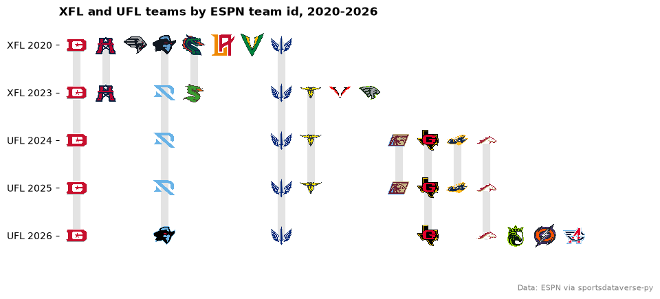
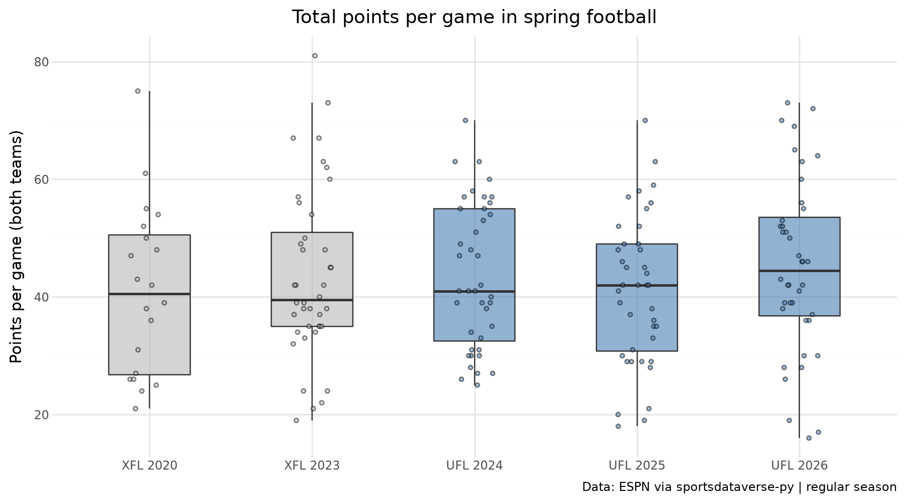
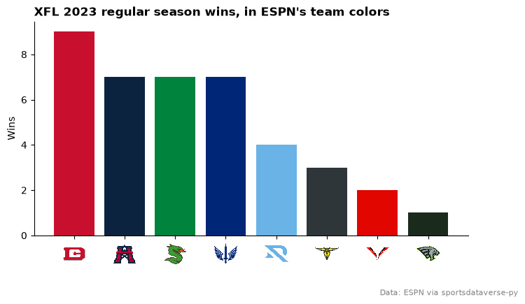
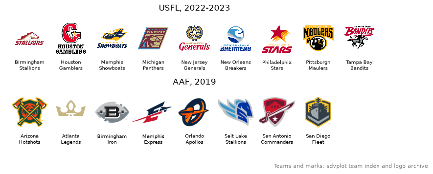

# Spring football

The XFL (2020, 2023), the USFL (2022-23), the AAF (2019) and the UFL that the XFL and USFL merged into in 2024.
These eight examples follow the franchises across leagues, then chart standings, scoring and colors. Game data comes
from ESPN's XFL and UFL feeds through `sportsdataverse.football`; ESPN has no USFL or AAF feed, so those two
leagues appear here through sdvplot's own team index only.

```python
import warnings

import matplotlib.pyplot as plt
import polars as pl
from sportsdataverse.football import ufl, xfl

import sdvplot

CAPTION = "Data: ESPN via sportsdataverse-py"
SEASONS = [("xfl", 2020), ("xfl", 2023), ("ufl", 2024), ("ufl", 2025), ("ufl", 2026)]
SCOREBOARDS = {"xfl": xfl.espn_xfl_scoreboard, "ufl": ufl.espn_ufl_scoreboard}
WEEKS = {2020: 5}  # the 2020 XFL stopped after five weeks; every other season had ten

side = ["id", "display_name", "abbreviation", "color", "score"]
games = pl.concat(
    [
        SCOREBOARDS[league](dates=season, week=week, season_type=2).select(
            pl.lit(league).alias("league"),
            pl.lit(season).alias("season"),
            pl.lit(week).alias("week"),
            *[f"home_{c}" for c in side],
            *[f"away_{c}" for c in side],
        )
        for league, season in SEASONS
        for week in range(1, WEEKS.get(season, 10) + 1)
    ]
).with_columns(pl.col("home_score", "away_score").cast(pl.Int64))

# one row per team per game, from that team's side
teams = pl.concat(
    [
        games.select(
            "league",
            "season",
            "week",
            *[pl.col(f"{a}_{c}").alias(c) for c in side],
            pl.col(f"{b}_score").alias("allowed"),
        )
        for a, b in [("home", "away"), ("away", "home")]
    ]
).rename({"id": "team_id", "display_name": "name"})
records = teams.group_by("league", "season", "team_id", maintain_order=True).agg(
    name=pl.col("name").last(),
    W=(pl.col("score") > pl.col("allowed")).sum(),
    L=(pl.col("score") < pl.col("allowed")).sum(),
    PF=pl.col("score").sum(),
    PA=pl.col("allowed").sum(),
)
records.group_by("league", "season", maintain_order=True).agg(teams=pl.len(), games=pl.col("W").sum())
```

<div class="sdv-output">

| league | season | teams | games |
|--------|--------|-------|-------|
| xfl    | 2020   | 8     | 20    |
| xfl    | 2023   | 8     | 40    |
| ufl    | 2024   | 8     | 40    |
| ufl    | 2025   | 8     | 40    |
| ufl    | 2026   | 8     | 40    |

</div>

## 1. One id per franchise, across three leagues

The scoreboards come week by week (a whole-year request returns only some of the games). ESPN kept its team ids through the merger: the UFL's XFL-side teams carry their XFL ids, and its USFL-side teams the
ids ESPN gave them in the USFL. Each column below is one ESPN id, each row one league season, and `add_logos` with
that row's `season` draws the mark the team used then (the Renegades: Dallas, Arlington, Dallas again).

```python
order = records.unique("team_id", keep="first", maintain_order=True)["team_id"].to_list()
column = {team: i for i, team in enumerate(order)}

fig, ax = plt.subplots(figsize=(10, 4.5))
for team, x in column.items():
    rows = [
        r
        for r, (league, season) in enumerate(SEASONS)
        if team in records.filter(pl.col("league") == league, pl.col("season") == season)["team_id"]
    ]
    ax.plot([x, x], [min(rows), max(rows)], color="#e3e3e3", lw=8, solid_capstyle="round", zorder=1)
for r, (league, season) in enumerate(SEASONS):
    ids = records.filter(pl.col("league") == league, pl.col("season") == season)["team_id"]
    sdvplot.add_logos(ax, [column[t] for t in ids], [r] * len(ids), ids, league=league, season=season, height=0.1)
ax.set(xlim=(-0.6, len(order) - 0.4), ylim=(len(SEASONS) - 0.5, -0.5), xticks=[])
ax.set_yticks(range(len(SEASONS)), [f"{league.upper()} {season}" for league, season in SEASONS])
ax.spines[["top", "right", "bottom", "left"]].set_visible(False)
ax.set_title("XFL and UFL teams by ESPN team id, 2020-2026", loc="left", fontweight="bold")
fig.text(0.99, 0.01, CAPTION, ha="right", fontsize=8, color="grey")
plt.show()
```

<div class="sdv-output">



</div>

One gap shows in the Houston column: ESPN gave the 2024-25 Houston Roughnecks the id of the USFL's Houston Gamblers,
and the logo archive's only mark for that id is the 2026 Gamblers logo, so 2024 and 2025 draw it too.

## 2. Abbreviations or ids, season by season

ESPN's abbreviations changed with the teams (Birmingham was BIR in 2024 and BHAM in 2026; Arlington was ARL).
sdvplot's index dates each one by the seasons ESPN's scoreboards show it, so the data's own abbreviations resolve as
well as its ids.

```python
ufl_2024 = (
    teams.filter(pl.col("league") == "ufl", pl.col("season") == 2024)
    .unique("team_id", keep="first", maintain_order=True)
    .sort("name")
)

ufl_2024.select("name", "abbreviation", "team_id").with_columns(
    by_abbreviation=sdvplot.resolve(ufl_2024["abbreviation"], "ufl", season=2024),
    by_id=sdvplot.resolve(ufl_2024["team_id"], "ufl", season=2024),
)
```

<div class="sdv-output">

| name                  | abbreviation | team_id | by_abbreviation | by_id  |
|-----------------------|--------------|---------|-----------------|--------|
| Arlington Renegades   | ARL          | 112647  | 112647          | 112647 |
| Birmingham Stallions  | BIR          | 126073  | 126073          | 126073 |
| D.C. Defenders        | DC           | 112646  | 112646          | 112646 |
| Houston Roughnecks    | HOU          | 126075  | 126075          | 126075 |
| Memphis Showboats     | MEM          | 129043  | 129043          | 129043 |
| Michigan Panthers     | MIC          | 125957  | 125957          | 125957 |
| San Antonio Brahmas   | SA           | 126746  | 126746          | 126746 |
| St. Louis Battlehawks | STL          | 112651  | 112651          | 112651 |

</div>

A code no UFL team has used, such as the USFL Pittsburgh Maulers' PIT, gives `None` and one warning instead of a
guess.

```python
with warnings.catch_warnings(record=True) as caught:
    warnings.simplefilter("always")
    print(sdvplot.resolve("PIT", "ufl", season=2024))
print(caught[0].message)
```

<div class="sdv-output">

```text
None
1 value(s) did not resolve to a ufl team: 'PIT' (unknown). Use sdvplot.suggest() for candidates, or strict=True to raise.
```

</div>

## 3. A standings table

The 2026 UFL table with great_tables: `gt_sdv_logos` for the logos, `gt_color_pills` for the point differential and
the broadcast-style `gt_theme_scoreboard`.

```python
from great_tables import GT

from sdvplot.great_tables import gt_color_pills, gt_sdv_logos, gt_theme_scoreboard

table = (
    records.filter(pl.col("league") == "ufl", pl.col("season") == 2026)
    .with_columns(Diff=pl.col("PF") - pl.col("PA"))
    .sort(["W", "Diff", "name"], descending=[True, True, False])
    .select(logo="team_id", team="name", W="W", L="L", PF="PF", PA="PA", Diff="Diff")
)
limit = table["Diff"].abs().max()  # pills colored on a scale centered on zero

(
    GT(table)
    .pipe(gt_sdv_logos, "logo", league="ufl", season=2026, height=28)
    .pipe(gt_color_pills, "Diff", digits=0, domain=[-limit, limit])
    .cols_label(logo="", team="")
    .tab_header(title="UFL standings, 2026", subtitle="Regular season")
    .tab_source_note(CAPTION)
    .pipe(gt_theme_scoreboard)
)
```

<div class="sdv-output">

<iframe class="sdv-frame" src="/outputs/tutorials/leagues/spring-football/9_0.html" title="HTML output" height="480" loading="lazy"></iframe>

</div>

## 4. Every UFL season, points for and against

Points scored and allowed per game, one panel per season. `add_logos` takes the panel's season, so the Renegades
change marks between 2025 and 2026 and the 2026 expansion teams appear only in the last panel.

```python
ufl_seasons = records.filter(pl.col("league") == "ufl").with_columns(
    pf=pl.col("PF") / (pl.col("W") + pl.col("L")), pa=pl.col("PA") / (pl.col("W") + pl.col("L"))
)

fig, axes = plt.subplots(1, 3, figsize=(10, 4.2), sharex=True, sharey=True)
for ax, (season, rows) in zip(axes, ufl_seasons.group_by("season", maintain_order=True), strict=True):
    season = season[0]
    ax.axline((20, 20), slope=1, color="#cccccc", lw=0.8, ls="--")
    ax.scatter(rows["pf"], rows["pa"], s=0)
    sdvplot.add_logos(ax, rows["pf"], rows["pa"], rows["team_id"], league="ufl", season=season, height=0.14)
    ax.set_title(str(season), fontweight="bold")
    ax.set_xlabel("Points per game")
axes[0].set_ylabel("Points allowed per game")
axes[0].set(xlim=(12, 30), ylim=(30, 12))  # allowed flipped: better defenses higher
fig.suptitle("UFL scoring and defense by season", x=0.01, ha="left", fontweight="bold")
fig.text(0.99, 0.01, f"{CAPTION} | dashed line: scored = allowed", ha="right", fontsize=8, color="grey")
fig.tight_layout()
plt.show()
```

<div class="sdv-output">



</div>

## 5. Scoring across leagues with plotnine

Total points in every regular-season game, by league season, from the same scoreboards.

```python
from plotnine import (
    aes,
    geom_boxplot,
    geom_jitter,
    ggplot,
    labs,
    scale_fill_manual,
    scale_x_discrete,
    theme,
    theme_minimal,
)

totals = games.with_columns(
    total=pl.col("home_score") + pl.col("away_score"),
    label=pl.format("{} {}", pl.col("league").str.to_uppercase(), pl.col("season")),
)

(
    ggplot(totals.to_pandas(), aes("label", "total", fill="league"))
    + geom_boxplot(outlier_shape="", width=0.5, alpha=0.6)
    + geom_jitter(width=0.12, height=0, size=1.2, alpha=0.5, random_state=1)
    + scale_fill_manual({"xfl": "#b8b8b8", "ufl": "#4a7fb5"})
    + scale_x_discrete(limits=[f"{league.upper()} {season}" for league, season in SEASONS])  # in time order
    + labs(
        x="",
        y="Points per game (both teams)",
        title="Total points per game in spring football",
        caption=f"{CAPTION} | regular season",
    )
    + theme_minimal()
    + theme(figure_size=(9, 5), legend_position="none")
)
```

<div class="sdv-output">


</div>

## 6. An interactive Plotly chart

Each 2026 UFL team's running point differential, in its colors from `team_colors`, with the logos at the end of the
lines and hover text on every week.

```python
import plotly.graph_objects as go

running = (
    teams.filter(pl.col("league") == "ufl", pl.col("season") == 2026)
    .sort("week", "team_id")
    .with_columns(running=(pl.col("score") - pl.col("allowed")).cum_sum().over("team_id"))
)

fig = go.Figure()
for (team_id, name), rows in running.group_by("team_id", "name", maintain_order=True):
    fig.add_trace(
        go.Scatter(
            x=rows["week"],
            y=rows["running"],
            mode="lines+markers",
            name=name,
            line={"color": sdvplot.team_colors("ufl", team_id, season=2026), "width": 2},
            hovertemplate=f"{name}<br>week %{{x}}: %{{y:+d}}<extra></extra>",
        )
    )
fig.update_layout(
    title="UFL 2026: running point differential",
    xaxis={"title": "Week", "range": [0.5, 11.2]},
    yaxis_title="Point differential",
    showlegend=False,
    template="plotly_white",
    width=800,
    height=500,
)
ends = running.group_by("team_id", maintain_order=True).last().sort("running", "team_id")
spots = ends["running"].to_list()
for i in range(1, len(spots)):  # nudge the logos apart where teams finished close together
    spots[i] = max(spots[i], spots[i - 1] + 13)
sdvplot.add_logos(fig, ends["week"] + 0.6, spots, ends["team_id"], league="ufl", season=2026, height=0.085)
fig
```

<div class="sdv-output">

<iframe class="sdv-frame" src="/outputs/tutorials/leagues/spring-football/15_0.html" title="Interactive Plotly figure" height="480" loading="lazy"></iframe>

</div>

## 7. When sdvplot's color comes from a logo

Not every spring-league color in the index is published. ESPN's colors cover the UFL and most XFL teams; the USFL,
the AAF and the other XFL teams take the two dominant colors of their logos (`color_source == "logo"`), which
approximate a team's own. ESPN's scoreboard ships each team's own color (the `color` column loaded above), so this
chart of the 2023 XFL takes its colors from the data and its logos from sdvplot.

```python
sdvplot.teams("xfl").select("team_id", "name", "color_primary", "color_source").head(4)
```

<div class="sdv-output">

| team_id | name                 | color_primary | color_source |
|---------|----------------------|---------------|--------------|
| 112646  | DC Defenders         | #c8102e       | espn         |
| 112647  | Arlington Renegades  | #69b3e7       | espn         |
| 112648  | Houston Roughnecks   | #0c2340       | espn         |
| 112649  | Los Angeles Wildcats | #c20f2f       | logo         |

</div>

```python
xfl_2023 = (
    records.filter(pl.col("league") == "xfl", pl.col("season") == 2023)
    .join(
        teams.filter(pl.col("league") == "xfl", pl.col("season") == 2023)
        .select("team_id", "color")
        .unique("team_id", keep="last", maintain_order=True),
        on="team_id",
    )
    .with_columns(color="#" + pl.col("color"))
    .sort(["W", "name"], descending=[True, False])
)

fig, ax = plt.subplots(figsize=(8, 4.5))
ax.bar(xfl_2023["team_id"], xfl_2023["W"], color=xfl_2023["color"].to_list())
sdvplot.axis_logos(ax, "x", league="xfl", season=2023, height=0.12)
ax.set_ylabel("Wins")
ax.spines[["top", "right"]].set_visible(False)
ax.set_title("XFL 2023 regular season wins, in ESPN's team colors", loc="left", fontweight="bold")
fig.subplots_adjust(bottom=0.2)  # room for the logos under the axis, above the caption
fig.text(0.99, 0.01, CAPTION, ha="right", fontsize=8, color="grey")
plt.show()
```

<div class="sdv-output">



</div>

## 8. The USFL and the AAF: logos without game data

ESPN has no feed for the 2022-23 USFL or the 2019 AAF, and sportsdataverse has no free source for them (its AAF
module reads PFF, which needs a key). sdvplot still knows both leagues' teams and marks, so a chart that brings its
own data can use them; here they are, from `teams` alone.

```python
import textwrap

fig, axes = plt.subplots(2, 1, figsize=(10, 3.6))
for ax, (league, season, title) in zip(
    axes, [("usfl", None, "USFL, 2022-2023"), ("aaf", 2019, "AAF, 2019")], strict=True
):
    index = sdvplot.teams(league).sort("name")
    xs = list(range(index.height))
    sdvplot.add_logos(ax, xs, [0.62] * index.height, index["team_id"], league=league, season=season, height=0.5)
    for x, name in zip(xs, index["name"], strict=True):
        ax.text(x, 0.08, textwrap.fill(name, 11, break_long_words=False), ha="center", va="bottom", fontsize=7)
    ax.set(xlim=(-0.6, 8.6), ylim=(0, 1), title=title)
    ax.axis("off")
fig.text(0.99, 0.01, "Teams and marks: sdvplot team index and logo archive", ha="right", fontsize=8, color="grey")
plt.show()
```

<div class="sdv-output">



</div>

## Run it yourself

<a href="pathname:///notebooks/leagues/spring-football.ipynb" download>Download the notebook</a> (outputs cleared) or [open it on GitHub](https://github.com/sportsdataverse/sdvplot/blob/main/examples/notebooks/leagues/spring-football.ipynb).
