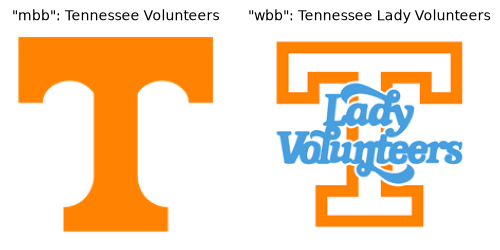
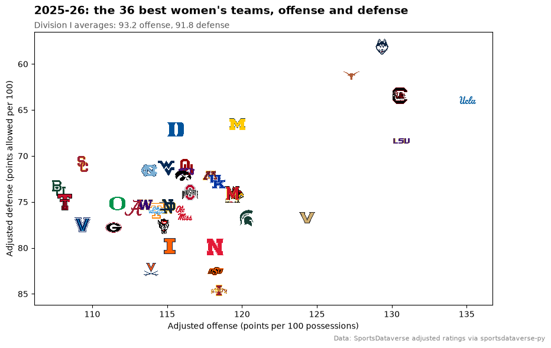
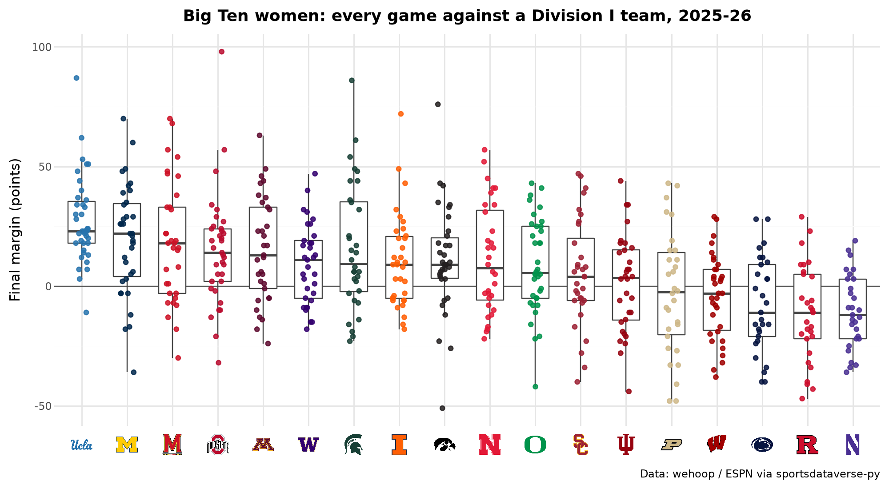
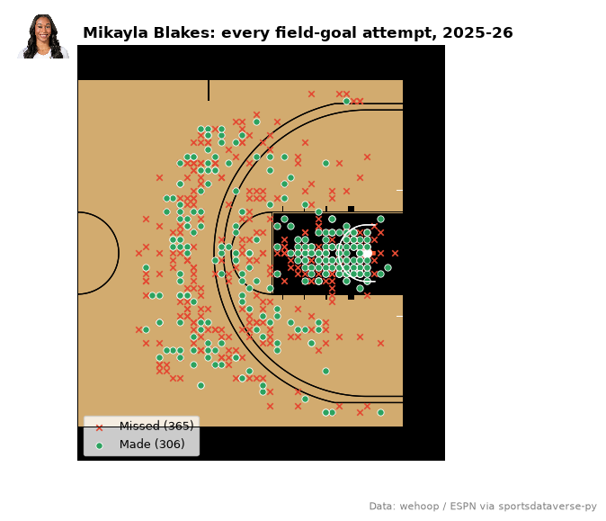
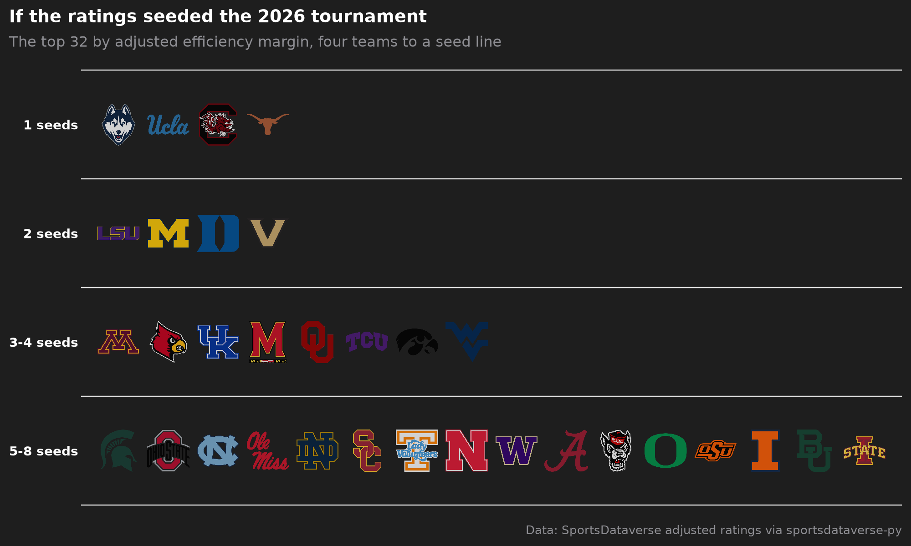
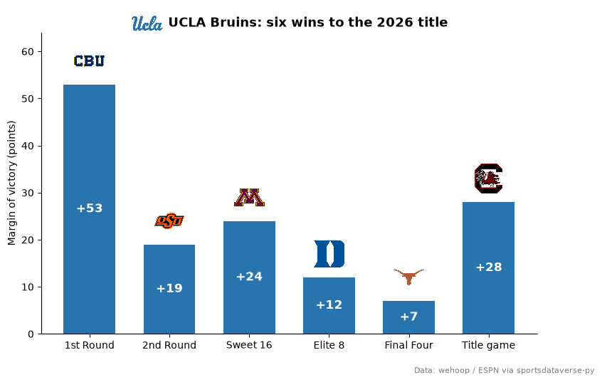
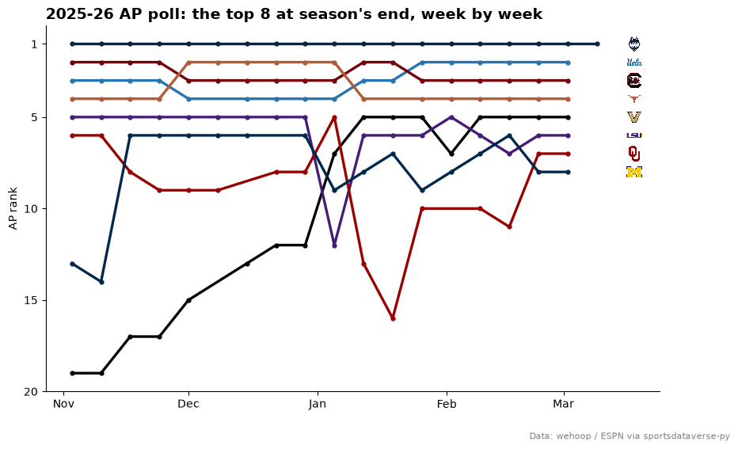

# Women's college basketball

Division I women's basketball has 364 teams, and each shares its ESPN id with the school's men's team.
These ten examples chart the 2025-26 season: names and ids, the efficiency landscape, a conference table, game
margins in team colors, a headshot leaderboard, a shot chart on a college court, an interactive top 25,
seed-line tiers, the champion's tournament run and the AP poll. The data are wehoop's ESPN box scores,
schedules, standings and shots and the SportsDataverse adjusted ratings, read from GitHub release files by
[sportsdataverse-py](https://py.sportsdataverse.org).

```python
import warnings

import matplotlib.pyplot as plt
import polars as pl
import sportsdataverse.wbb as wbb

import sdvplot

SEASON = 2026  # the 2025-26 season: college seasons are named by the year they end
CAPTION = "Data: wehoop / ESPN via sportsdataverse-py"

ratings = wbb.load_wbb_ratings(SEASON)  # adjusted efficiency, one row per team
box = wbb.load_wbb_team_boxscore(SEASON)  # one row per team per game
standings = wbb.load_wbb_standings(SEASON)  # one row per team, conference and stat
schedule = wbb.load_wbb_schedule(SEASON)  # one row per game
ratings.height, box.height, standings.height, schedule.height
```

<div class="sdv-output">

```text
(663, 12058, 30492, 6054)
```

</div>

## 1. One school id, two programs

ESPN gives a school one team id for its men's and women's teams, and sdvplot keeps them as separate leagues,
so the league key picks the program: 2633 is the Tennessee Volunteers in `"mbb"` and the Lady Volunteers in
`"wbb"`, each with its own name and mark.

```python
fig, axes = plt.subplots(1, 2, figsize=(6, 3))
for ax, league in zip(axes, ("mbb", "wbb"), strict=True):
    name = sdvplot.teams(league).filter(pl.col("team_id") == "2633")["name"][0]
    ax.imshow(sdvplot.logo_image(2633, league, size=200))
    ax.set_title(f'"{league}": {name}', fontsize=10)
    ax.axis("off")
plt.show()
```

<div class="sdv-output">



</div>

Names resolve through the index, nicknames do not: "Lady Vols" gives `None` and one `SdvplotWarning`. The box
scores also hold games against 300 non-Division I opponents, which resolve the same way, with one warning for
the whole column. The ratings get the same treatment, and each team's 2025-26 conference comes from that
season's standings.

```python
with warnings.catch_warnings(record=True) as caught:
    warnings.simplefilter("always")
    print(sdvplot.resolve(["UConn", "TENN", "Lady Vols", 2579], "wbb"))
    opponents = sdvplot.resolve(box["opponent_team_id"].cast(pl.Utf8).unique(), "wbb")
    ids = sdvplot.resolve(ratings["team_id"], "wbb")
for w in caught:
    print(str(w.message)[:100], "...")

conference = standings.select(pl.col("team_id").cast(pl.Utf8), conference=pl.col("group_name")).unique()
d1 = (
    ratings.with_columns(team_id=ids)
    .drop_nulls("team_id")
    .join(conference, on="team_id", how="left")
    .join(sdvplot.teams("wbb").select("team_id", "short_name"), on="team_id")
    .with_columns(d1_rank=pl.col("adj_em").rank("ordinal", descending=True))
    .sort("d1_rank")
)
d1_ids = d1["team_id"].to_list()
d1.select("d1_rank", "team_id", "short_name", "conference", "adj_o", "adj_d", "adj_em").head(5)
```

<div class="sdv-output">

```text
['41', '2633', None, '2579']
1 value(s) did not resolve to a wbb team: 'Lady Vols' (unknown). Use sdvplot.suggest() for candidate ...
300 value(s) did not resolve to a wbb team: '100277' (unknown), '2863' (unknown), '502' (unknown), ' ...
300 value(s) did not resolve to a wbb team: '3163' (unknown), '2606' (unknown), '2778' (unknown), '2 ...
```

| d1_rank | team_id | short_name     | conference              | adj_o      | adj_d     | adj_em    |
|---------|---------|----------------|-------------------------|------------|-----------|-----------|
| 1       | 41      | UConn          | Big East Conference     | 129.347367 | 58.12808  | 71.219287 |
| 2       | 26      | UCLA           | Big Ten Conference      | 135.068331 | 63.937368 | 71.130963 |
| 3       | 2579    | South Carolina | Southeastern Conference | 130.53392  | 63.444662 | 67.089258 |
| 4       | 251     | Texas          | Southeastern Conference | 127.303289 | 61.289125 | 66.014163 |
| 5       | 99      | LSU            | Southeastern Conference | 130.648378 | 68.354108 | 62.29427  |

</div>

## 2. The efficiency landscape of the top 36

Another way to keep logos legible: zoom to the teams you care about. Here the axes hold only the 36 best teams
by adjusted efficiency margin, so every logo gets room; the subtitle gives the Division I averages, far
below and left of every logo here. Defense is points allowed, so its axis runs downward to put good defenses on top.

```python
top = d1.head(36)

fig, ax = plt.subplots(figsize=(10, 6))
ax.scatter(top["adj_o"], top["adj_d"], s=0)  # sets the axis limits for the logos
sdvplot.add_logos(ax, top["adj_o"], top["adj_d"], top["team_id"], league="wbb", height=0.065)
ax.invert_yaxis()
ax.margins(0.06)
ax.set_xlabel("Adjusted offense (points per 100 possessions)")
ax.set_ylabel("Adjusted defense (points allowed per 100)")
ax.set_title(
    "2025-26: the 36 best women's teams, offense and defense", loc="left", fontsize=14, fontweight="bold", pad=22
)
ax.text(
    0,
    1.015,
    f"Division I averages: {d1['adj_o'].mean():.1f} offense, {d1['adj_d'].mean():.1f} defense",
    transform=ax.transAxes,
    fontsize=10,
    color="#555555",
)
fig.text(
    0.99, 0.01, "Data: SportsDataverse adjusted ratings via sportsdataverse-py", ha="right", fontsize=8, color="grey"
)
plt.show()
```

<div class="sdv-output">



</div>

## 3. A conference table in The Athletic's style

The SEC's 2025-26 standings, with home and road records and the record against ranked teams. The standings
frame is long (one row per team and stat), so pivot the numbers and the record strings separately.
`gt_color_pills` with a fixed `domain` keeps the margin colors comparable from one table to the next.

```python
from great_tables import GT

from sdvplot.great_tables import gt_color_pills, gt_merge_stack_team_color, gt_sdv_logos, gt_theme_athletic

sec = standings.filter(pl.col("group_name") == "Southeastern Conference").with_columns(pl.col("team_id").cast(pl.Utf8))
numbers = sec.filter(pl.col("stat_type").is_in(["playoffseed", "pointdifferential", "wins", "losses"])).pivot(
    on="stat_type", index="team_id", values="value"
)
records = sec.filter(pl.col("stat_type").is_in(["total", "vsconf", "home", "road", "vsusarankedteams"])).pivot(
    on="stat_type", index="team_id", values="display_value"
)
table = (
    numbers.join(records, on="team_id")
    .join(d1.select("team_id", "short_name"), on="team_id")
    .select(
        seed=pl.col("playoffseed").cast(pl.Int64),
        team_id="team_id",
        short_name="short_name",
        conf=pl.col("vsconf") + " SEC",
        overall="total",
        home="home",
        road="road",
        ranked="vsusarankedteams",
        margin=pl.col("pointdifferential") / (pl.col("wins") + pl.col("losses")),
    )
    .sort("seed")
)

(
    GT(table)
    .pipe(gt_merge_stack_team_color, "short_name", "conf", "team_id", league="wbb")
    .pipe(gt_sdv_logos, "team_id", league="wbb", height=28)
    .pipe(gt_color_pills, "margin", digits=1, domain=[-35, 35])
    .cols_label(
        seed="Seed",
        team_id="",
        short_name="Team",
        overall="Overall",
        home="Home",
        road="Road",
        ranked="vs. ranked",
        margin="Margin",
    )
    .tab_header("SEC women's standings, 2025-26", "Seeded for the SEC tournament; margin is points per game")
    .tab_source_note(CAPTION)
    .pipe(gt_theme_athletic)
)
```

<div class="sdv-output">

<iframe class="sdv-frame" src="/outputs/tutorials/leagues/wbb/9_0.html" title="HTML output" height="480" loading="lazy"></iframe>

</div>

## 4. Every game's margin, in team colors (plotnine)

A box plot shows a season's spread; the points on top are the games, in each team's color from
`scale_color_sdv`. The Big Ten's 18 teams are ordered by their median margin against Division I opponents, and
`axis_logos` labels the axis.

```python
from plotnine import (
    aes,
    element_text,
    geom_boxplot,
    geom_hline,
    geom_jitter,
    ggplot,
    labs,
    scale_x_discrete,
    theme,
    theme_minimal,
)

from sdvplot.plotnine import axis_logos, scale_color_sdv

big_ten = d1.filter(pl.col("conference") == "Big Ten Conference")["team_id"].to_list()
margins = (
    box.with_columns(pl.col("team_id", "opponent_team_id").cast(pl.Utf8))
    .filter(pl.col("team_id").is_in(big_ten) & pl.col("opponent_team_id").is_in(d1_ids))
    .with_columns(margin=pl.col("team_score") - pl.col("opponent_team_score"))
)
order = margins.group_by("team_id").agg(pl.col("margin").median()).sort("margin", descending=True)

p = (
    ggplot(margins.to_pandas(), aes("team_id", "margin"))
    + geom_hline(yintercept=0, color="#555555")
    + geom_boxplot(outlier_shape="", width=0.6, color="#444444", fill="white")
    + geom_jitter(aes(color="team_id"), width=0.15, height=0, size=1.6, alpha=0.85, show_legend=False)
    + scale_x_discrete(limits=order["team_id"].to_list())
    + scale_color_sdv("wbb")
    + labs(
        x="",
        y="Final margin (points)",
        title="Big Ten women: every game against a Division I team, 2025-26",
        caption=CAPTION,
    )
    + theme_minimal()
    + theme(figure_size=(10, 5.5), plot_title=element_text(weight="bold", size=13))
)
axis_logos(p, "x", league="wbb", height=0.06)
```

<div class="sdv-output">



</div>

## 5. A scoring leaderboard with headshots

Player box scores carry ESPN athlete ids: `gt_sdv_headshots` turns them into headshots and `gt_sdv_logos` the
team ids into logos. A light theme keeps dark logos readable. Leaders need at least 20 games.

```python
from sdvplot.great_tables import gt_sdv_headshots, gt_theme_broadsheet

players = wbb.load_wbb_player_boxscore(SEASON)
leaders = (
    players.filter(~pl.col("did_not_play"))
    .group_by("athlete_id", "athlete_display_name", "team_id")
    .agg(
        games=pl.len(),
        ppg=pl.col("points").mean(),
        fg=pl.col("field_goals_made").sum() / pl.col("field_goals_attempted").sum(),
        three=pl.col("three_point_field_goals_made").sum() / pl.col("three_point_field_goals_attempted").sum(),
        ft=pl.col("free_throws_made").sum() / pl.col("free_throws_attempted").sum(),
    )
    .filter(pl.col("games") >= 20)
    .sort("ppg", descending=True)
    .head(10)
)

(
    GT(leaders)
    .pipe(gt_sdv_headshots, "athlete_id", league="wbb", height=40)
    .pipe(gt_sdv_logos, "team_id", league="wbb", height=28)
    .fmt_number("ppg", decimals=1)
    .fmt_percent(["fg", "three", "ft"], decimals=1)
    .cols_label(
        athlete_id="",
        athlete_display_name="Player",
        team_id="Team",
        games="G",
        ppg="PPG",
        fg="FG%",
        three="3P%",
        ft="FT%",
    )
    .tab_header("The 2025-26 Division I scoring leaders", "Points per game, minimum 20 games")
    .tab_source_note(CAPTION)
    .pipe(gt_theme_broadsheet)
)
```

<div class="sdv-output">

<iframe class="sdv-frame" src="/outputs/tutorials/leagues/wbb/13_0.html" title="HTML output" height="480" loading="lazy"></iframe>

</div>

## 6. A shot chart on a college court

ESPN's shot coordinates are feet from center court, the frame sportypy draws, so `surface("wbb", team)` takes
them as they are once both halves are folded onto one basket. Two cleanups first: free throws are placed at
the rim, and a shot with no location carries a placeholder of about 215 million. The court wears the
team's colors and the headshot sits beside the title.

```python
from sdvplot.matplotlib import title_image

star = leaders.row(0, named=True)
shots = wbb.load_wbb_shots(SEASON)
mine = shots.filter(
    (pl.col("athlete_id_1") == star["athlete_id"])
    & (pl.col("type_text") != "MadeFreeThrow")  # placed at the rim, not where they were taken
    & (pl.col("coordinate_x").abs() <= 47)  # drops the no-location sentinel
    & (pl.col("coordinate_y").abs() <= 25)
).with_columns(  # fold the left half onto the right-hand basket
    x=pl.col("coordinate_x").abs(),
    y=pl.when(pl.col("coordinate_x") < 0).then(-pl.col("coordinate_y")).otherwise(pl.col("coordinate_y")),
)
made, missed = mine.filter(pl.col("scoring_play")), mine.filter(~pl.col("scoring_play"))

fig, ax = plt.subplots(figsize=(8, 6))
sdvplot.surface("wbb", star["team_id"], ax=ax, display_range="offense")
ax.scatter(
    missed["x"], missed["y"], marker="x", s=22, lw=1.2, color="#e34a33", zorder=20, label=f"Missed ({missed.height})"
)
ax.scatter(
    made["x"], made["y"], s=28, color="#2ca25f", edgecolor="white", lw=0.6, zorder=21, label=f"Made ({made.height})"
)
ax.legend(loc="lower left", fontsize=9)
title_image(
    ax,
    sdvplot.headshot_url(star["athlete_id"], "wbb"),
    f"{star['athlete_display_name']}: every field-goal attempt, 2025-26",
    height=40,
    fontsize=12,
    fontweight="bold",
)
fig.text(0.98, 0.02, CAPTION, ha="right", fontsize=8, color="grey")
plt.show()
```

<div class="sdv-output">



</div>

## 7. An interactive top 25 (Plotly)

Hover a bar for the team, its conference and its rating. `axis_logos` puts the logos beside a Plotly category
axis; the bars use `team_colors`.

```python
import plotly.graph_objects as go

top25 = d1.head(25).reverse()  # Plotly draws horizontal bars from the bottom up
fig = go.Figure(
    go.Bar(
        x=top25["adj_em"],
        y=top25["team_id"],
        orientation="h",
        marker_color=sdvplot.team_colors(top25["team_id"].to_list(), "wbb"),
        customdata=top25.select("short_name", "conference").rows(),
        hovertemplate="%{customdata[0]} (%{customdata[1]})<br>Adj. EM %{x:+.1f}<extra></extra>",
    )
)
fig.update_layout(
    title="2025-26 women's top 25 by adjusted efficiency margin",
    xaxis_title="Points per 100 possessions better than an average Division I team",
    yaxis_type="category",
    template="plotly_white",
    width=760,
    height=640,
    margin={"l": 70, "t": 60, "b": 60},
)
sdvplot.axis_logos(fig, "y", league="wbb", height=0.03)
```

<div class="sdv-output">

<iframe class="sdv-frame" src="/outputs/tutorials/leagues/wbb/17_0.html" title="Interactive Plotly figure" height="480" loading="lazy"></iframe>

</div>

## 8. Tiers as seed lines (plotnine)

The NCAA tournament seeds four teams to a line, so seed lines make natural tiers: the top four by adjusted
efficiency margin on the 1 line, the next four on the 2 line, then 3-4 and 5-8. The plotnine `team_tiers`
returns a ggplot.

```python
from sdvplot.plotnine import team_tiers

lines = d1.head(32).select(
    team="team_id",
    tier_no=pl.when(pl.col("d1_rank") <= 4)
    .then(1)
    .when(pl.col("d1_rank") <= 8)
    .then(2)
    .when(pl.col("d1_rank") <= 16)
    .then(3)
    .otherwise(4),
)
team_tiers(
    lines.to_pandas(),
    "wbb",
    title="If the ratings seeded the 2026 tournament",
    subtitle="The top 32 by adjusted efficiency margin, four teams to a seed line",
    caption="Data: SportsDataverse adjusted ratings via sportsdataverse-py",
    tier_desc={1: "1 seeds", 2: "2 seeds", 3: "3-4 seeds", 4: "5-8 seeds"},
) + theme(figure_size=(10, 6))
```

<div class="sdv-output">



</div>

## 9. March: the champion's run

The schedule's `notes_headline` names each NCAA tournament game. Find the title game's winner, then chart its
six wins: the margin of each, the opponent's logo on top, the champion's logo beside the title.

```python
ncaa = schedule.filter(pl.col("notes_headline").str.starts_with("NCAA Women's Basketball Championship"))
title_game = ncaa.filter(pl.col("notes_headline").str.ends_with("National Championship")).row(0, named=True)
champ = title_game["home_id"] if title_game["home_winner"] else title_game["away_id"]
run = (
    ncaa.filter((pl.col("home_id") == champ) | (pl.col("away_id") == champ))
    .sort("game_date")
    .with_columns(home=pl.col("home_id") == champ)
    .select(
        round=pl.col("notes_headline").str.split(" - ").list.last().str.replace("National Championship", "Title game"),
        opponent=pl.when("home").then("away_id").otherwise("home_id"),
        margin=pl.when("home")
        .then(pl.col("home_score") - pl.col("away_score"))
        .otherwise(pl.col("away_score") - pl.col("home_score")),
    )
)
champ_name = sdvplot.teams("wbb").filter(pl.col("team_id") == str(champ))["name"][0]

fig, ax = plt.subplots(figsize=(9, 5.5))
x = list(range(run.height))
ax.bar(x, run["margin"], color=sdvplot.team_colors(champ, "wbb"), width=0.65)
sdvplot.add_logos(ax, x, run["margin"] + 5, run["opponent"], league="wbb", height=0.11)
for xi, m in zip(x, run["margin"], strict=True):
    ax.text(xi, m / 2, f"+{m}", ha="center", va="center", color="white", fontsize=12, fontweight="bold")
ax.set_xticks(x, run["round"].to_list())
ax.set_ylim(0, run["margin"].max() + 11)
ax.set_ylabel("Margin of victory (points)")
ax.spines[["top", "right"]].set_visible(False)
title_image(
    ax, champ, f"{champ_name}: six wins to the 2026 title", league="wbb", height=34, fontsize=13, fontweight="bold"
)
fig.text(0.99, 0.01, CAPTION, ha="right", fontsize=8, color="grey")
plt.show()
```

<div class="sdv-output">



</div>

## 10. The AP poll, week by week

Each game row carries both teams' AP ranks that week (99 means unranked), so the schedule holds the whole
poll. Take each ranked team's rank per week, keep the top 8 of the last regular-season poll, and draw a bump chart
in team colors with the logos at the finish.

```python
import matplotlib.dates as mdates

polls = (
    pl.concat(
        schedule.select(
            "game_date", "season_type", team_id=pl.col(f"{side}_id").cast(pl.Utf8), rank=f"{side}_current_rank"
        )
        for side in ("home", "away")
    )
    .filter((pl.col("rank") < 99) & (pl.col("season_type") == 2))  # ranked, regular season
    .group_by("team_id", week=pl.col("game_date").dt.truncate("1w"))
    .agg(pl.col("rank").min().cast(pl.Int64))
    .sort("week")
)
final = polls.group_by("team_id").agg(pl.col("rank").last(), pl.col("week").last()).sort("rank").head(8)
colors = sdvplot.palette("wbb", teams=final["team_id"])

fig, ax = plt.subplots(figsize=(10, 6))
for team in final["team_id"]:
    weeks = polls.filter(pl.col("team_id") == team)
    ax.plot(weeks["week"], weeks["rank"], color=colors[team], lw=2.4, marker="o", ms=3.5)
finish = mdates.date2num(polls["week"].max()) + 9  # one x for every logo, just past the last poll
sdvplot.add_logos(ax, [finish] * final.height, final["rank"], final["team_id"], league="wbb", height=0.045)
ax.invert_yaxis()
ax.set_yticks([1, 5, 10, 15, 20])
ax.set_ylim(polls.filter(pl.col("team_id").is_in(final["team_id"].to_list()))["rank"].max() + 1, 0)
ax.set_xlim(right=finish + 6)  # images do not widen the axes, so make room
ax.xaxis.set_major_locator(mdates.MonthLocator())
ax.xaxis.set_major_formatter(mdates.DateFormatter("%b"))
ax.set_ylabel("AP rank")
ax.spines[["top", "right"]].set_visible(False)
ax.set_title("2025-26 AP poll: the top 8 at season's end, week by week", loc="left", fontsize=14, fontweight="bold")
fig.text(0.99, 0.01, CAPTION, ha="right", fontsize=8, color="grey")
plt.show()
```

<div class="sdv-output">



</div>

## Run it yourself

<a href="pathname:///notebooks/leagues/wbb.ipynb" download>Download the notebook</a> (outputs cleared) or [open it on GitHub](https://github.com/sportsdataverse/sdvplot/blob/main/examples/notebooks/leagues/wbb.ipynb).
