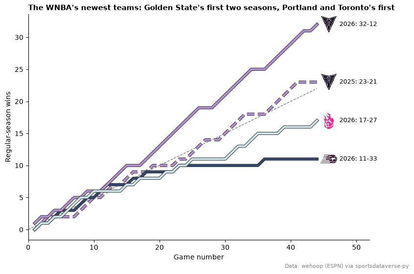
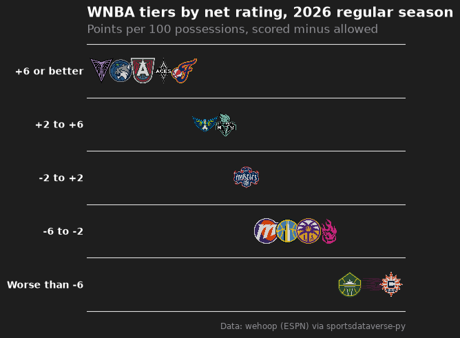
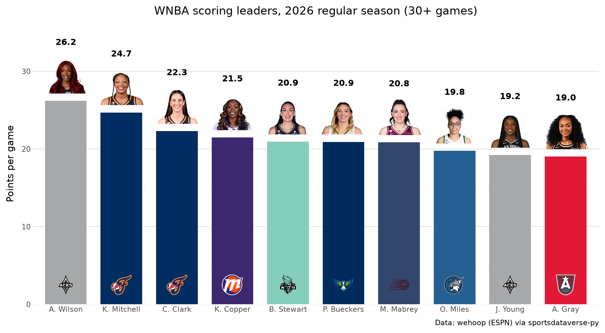
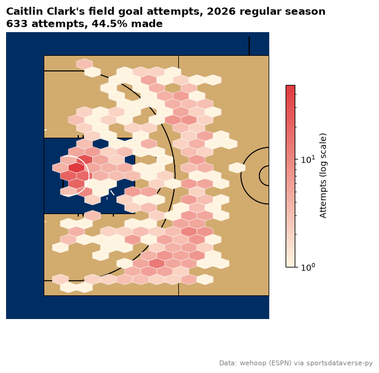
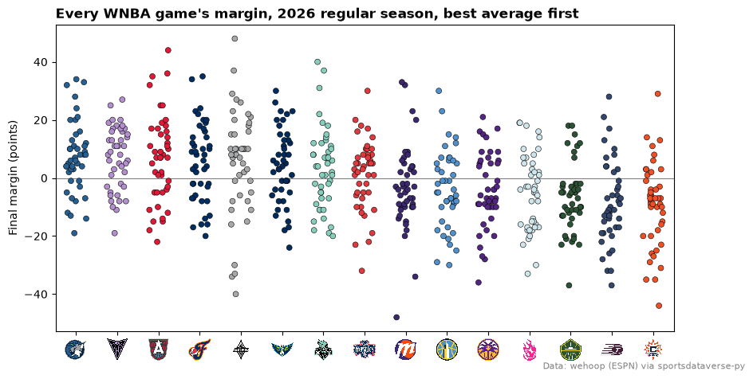
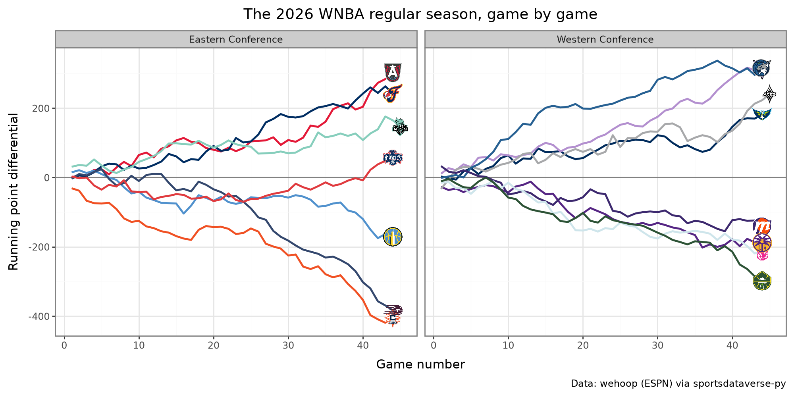
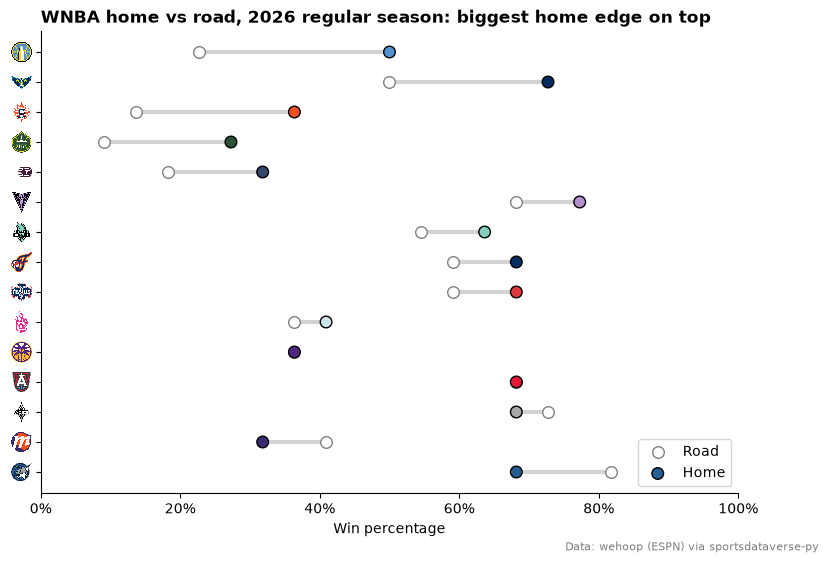

# WNBA

Nine charts and tables from the 2026 WNBA regular season, the league's first with 15 teams, built on wehoop's ESPN
data that sportsdataverse-py loads from release files on GitHub (no stats.wnba.com calls). You'll follow the three
newest franchises, rank teams in tiers, chart the scoring leaders with headshots, draw a shot chart, and build a
standings table and an interactive Altair chart.

```python
import warnings

import matplotlib.pyplot as plt
import polars as pl
import sportsdataverse.wnba as wnba

import sdvplot

SEASON = 2026
SOURCE = "Data: wehoop (ESPN) via sportsdataverse-py"
```

Everything below uses the regular season (`season_type` 2), which is final; 2025 is loaded too for Golden State's
first season. ESPN files each All-Star Game as a regular-season game (Team Collier vs Team Clark in 2025, Team Coop vs
Team Spoon in 2026), so `resolve` warns about those four teams, and dropping the rows it could not resolve removes the
games. The Commissioner's Cup final is filed the same way, which is why Las Vegas and New York show 45 games; it
stays in the box scores but does not count in the standings.

```python
box = wnba.load_wnba_team_boxscore(seasons=[SEASON - 1, SEASON]).filter(pl.col("season_type") == 2)

with warnings.catch_warnings(record=True) as caught:
    warnings.simplefilter("always")
    team_ids = sdvplot.resolve(box["team_abbreviation"].to_list(), "wnba")
for w in caught:
    print(w.message)

box = box.with_columns(team=pl.Series(team_ids, dtype=pl.String)).filter(pl.col("team").is_not_null())
current = box.filter(pl.col("season") == SEASON)
current.group_by("team_abbreviation", maintain_order=True).agg(games=pl.len()).sort(
    ["games", "team_abbreviation"], descending=[True, False]
).head(3)
```

<div class="sdv-output">

```text
4 value(s) did not resolve to a wnba team: 'COL' (unknown), 'CLA' (unknown), 'SPO' (unknown), 'COOP' (unknown). Use sdvplot.suggest() for candidates, or strict=True to raise.
```

| team_abbreviation | games |
|-------------------|-------|
| LV                | 45    |
| NY                | 45    |
| ATL               | 44    |

</div>

## 1. The expansion teams, game by game

Golden State joined in 2025, Portland and Toronto in 2026. Cumulative wins by game number put all four seasons on
one chart; the grey line is a .500 pace. Portland's primary color is a pale ice blue, so every line gets a dark
outline to stay visible on white.

```python
import matplotlib.patheffects as pe

expansion = (pl.col("team_abbreviation") == "GS") | (
    (pl.col("season") == SEASON) & pl.col("team_abbreviation").is_in(["POR", "TOR"])
)
runs = (
    box.filter(expansion)
    .sort("game_date")
    .with_columns(
        game_no=pl.int_range(1, pl.len() + 1).over("team", "season"),
        wins=pl.col("team_winner").cast(pl.Int32).cum_sum().over("team", "season"),
    )
)

fig, ax = plt.subplots(figsize=(9, 6))
ax.plot([0, 44], [0, 22], color="grey", linewidth=1, linestyle="--")
for (team, season), run in runs.group_by("team", "season", maintain_order=True):
    color = sdvplot.team_colors([team], "wnba", season=season)[0]
    ax.plot(
        run["game_no"],
        run["wins"],
        color=color,
        linewidth=3,
        linestyle="--" if season == 2025 else "-",
        path_effects=[pe.Stroke(linewidth=4.5, foreground="#333333"), pe.Normal()],
    )
ends = runs.group_by("team", "season", maintain_order=True).agg(pl.all().last())
sdvplot.add_logos(
    ax, ends["game_no"] + 1.8, ends["wins"], ends["team"], league="wnba", season=ends["season"], height=0.08
)
for row in ends.iter_rows(named=True):
    ax.annotate(
        f"{row['season']}: {row['wins']}-{row['game_no'] - row['wins']}",
        (row["game_no"] + 3.4, row["wins"]),
        va="center",
        fontsize=9,
    )
ax.set_xlim(0, 52)
ax.set_xlabel("Game number")
ax.set_ylabel("Regular-season wins")
ax.set_title(
    "The WNBA's newest teams: Golden State's first two seasons, Portland and Toronto's first",
    loc="left",
    fontsize=11,
    fontweight="bold",
)
ax.spines[["top", "right"]].set_visible(False)
fig.text(0.99, 0.01, SOURCE, ha="right", va="bottom", fontsize=8, color="grey")
plt.show()
```

<div class="sdv-output">



</div>

## 2. Offense vs defense, interactive with Altair

Points per 100 possessions (FGA - OREB + TOV + 0.44 x FTA, averaged with the opponent's), as an Altair chart: hover a
logo for the numbers. `add_logos` returns a new layered chart, so add the reference lines after it.

```python
import altair as alt

poss = (
    pl.col("field_goals_attempted")
    - pl.col("offensive_rebounds")
    + pl.col("total_turnovers")
    + 0.44 * pl.col("free_throws_attempted")
)
games = current.with_columns(poss=poss)
opponent = games.select("game_id", pl.col("team_id").alias("opponent_team_id"), pl.col("poss").alias("opp_poss"))
assert games.schema["opponent_team_id"] == opponent.schema["opponent_team_id"]
ratings = (
    games.join(opponent, on=["game_id", "opponent_team_id"])
    .with_columns(game_poss=(pl.col("poss") + pl.col("opp_poss")) / 2)
    .group_by("team", "team_abbreviation", "team_display_name", maintain_order=True)
    .agg(
        ortg=100 * pl.col("team_score").sum() / pl.col("game_poss").sum(),
        drtg=100 * pl.col("opponent_team_score").sum() / pl.col("game_poss").sum(),
    )
    .with_columns(net=pl.col("ortg") - pl.col("drtg"))
    .sort("net", descending=True)
)

points = (
    alt.Chart(ratings.to_pandas())
    .mark_circle(size=900, opacity=0)
    .encode(
        x=alt.X("ortg:Q", scale=alt.Scale(zero=False, padding=30), title="Offensive rating (per 100 possessions)"),
        y=alt.Y(
            "drtg:Q",
            scale=alt.Scale(zero=False, reverse=True, padding=30),
            title="Defensive rating (allowed per 100, better is up)",
        ),
        tooltip=[
            "team_display_name",
            alt.Tooltip("ortg:Q", format=".1f"),
            alt.Tooltip("drtg:Q", format=".1f"),
            alt.Tooltip("net:Q", format="+.1f"),
        ],
    )
    .properties(
        width=600,
        height=420,
        title=alt.TitleParams(f"WNBA offense vs defense, {SEASON} regular season", subtitle=SOURCE),
    )
)
chart = sdvplot.add_logos(points, ratings["ortg"], ratings["drtg"], ratings["team"], league="wnba", height=0.1)
means = alt.Chart().mark_rule(strokeDash=[4, 4], color="grey")
chart + means.encode(x=alt.datum(ratings["ortg"].mean())) + means.encode(y=alt.datum(ratings["drtg"].mean()))
```

<div class="sdv-output">

<iframe class="sdv-frame" src="/outputs/tutorials/leagues/wnba/7_0.html" title="HTML output" height="480" loading="lazy"></iframe>

</div>

## 3. Team tiers

`team_tiers` draws a tier list from a frame with `tier_no` and `team`. Here the tiers are cut from net rating, best
first within each tier.

```python
from sdvplot.matplotlib import team_tiers

tiers = ratings.with_columns(
    tier_no=pl.col("net").cut([-6, -2, 2, 6], labels=["5", "4", "3", "2", "1"]).cast(pl.String).cast(pl.Int32),
    tier_rank=pl.col("net").rank("ordinal", descending=True),
)
fig = team_tiers(
    tiers.select("tier_no", "team", "tier_rank"),
    "wnba",
    title=f"WNBA tiers by net rating, {SEASON} regular season",
    subtitle="Points per 100 possessions, scored minus allowed",
    caption=SOURCE,
    tier_desc={1: "+6 or better", 2: "+2 to +6", 3: "-2 to +2", 4: "-6 to -2", 5: "Worse than -6"},
)
plt.show()
```

<div class="sdv-output">



</div>

## 4. Scoring leaders with headshots, in plotnine

`geom_sdv_headshots` takes ESPN athlete ids, which the player box score carries, and `scale_fill_sdv` colors each bar
by team. Players need 30 games to qualify.

```python
from plotnine import (
    aes,
    element_blank,
    geom_col,
    geom_text,
    ggplot,
    labs,
    scale_x_discrete,
    scale_y_continuous,
    theme,
    theme_minimal,
)

from sdvplot.plotnine import geom_sdv_headshots, geom_sdv_logos, scale_fill_sdv

players = wnba.load_wnba_player_boxscore(seasons=[SEASON]).join(
    current.select("game_id").unique(), on="game_id", how="semi"
)
leaders = (
    players.filter(~pl.col("did_not_play"))
    .group_by("athlete_id", "athlete_short_name", maintain_order=True)
    .agg(
        games=pl.len(),
        ppg=pl.col("points").mean(),
        team=pl.col("team_abbreviation").sort_by("game_date").last(),
    )
    .filter(pl.col("games") >= 30)
    .sort("ppg", descending=True)
    .head(10)
    .with_columns(label=pl.col("ppg").round(1).cast(pl.String), logo_y=pl.lit(2.5))
)
(
    ggplot(leaders.to_pandas(), aes("athlete_short_name", "ppg"))
    + geom_col(aes(fill="team"), width=0.75)
    + geom_sdv_logos(aes(y="logo_y", team="team"), league="wnba", height=0.08)
    + geom_sdv_headshots(aes(y="ppg + 3.3", player_id="athlete_id"), league="wnba", height=0.13)
    + geom_text(aes(y="ppg + 7.6", label="label"), fontweight="bold", size=10)
    + scale_fill_sdv("wnba", guide=None)
    + scale_x_discrete(limits=leaders["athlete_short_name"].to_list())  # keep the ppg order
    + scale_y_continuous(limits=(0, leaders["ppg"].max() + 10), expand=(0, 0))
    + labs(
        x="", y="Points per game", title=f"WNBA scoring leaders, {SEASON} regular season (30+ games)", caption=SOURCE
    )
    + theme_minimal()
    + theme(figure_size=(10, 5.5), panel_grid_major_x=element_blank())
)
```

<div class="sdv-output">



</div>

## 5. A shot chart on a team-colored court

`load_wnba_shots` holds ESPN's shot locations, already in feet on a center-court frame, the same frame as sportypy's
court, so `sdvplot.court_coords` (for the stats.wnba.com legacy frame) is not needed. Fold the right-basket shots onto
the left one, then bin them: where Caitlin Clark shot from, on Indiana's court.

```python
from matplotlib.colors import LinearSegmentedColormap

shots = wnba.load_wnba_shots(seasons=[SEASON]).join(current.select("game_id").unique(), on="game_id", how="semi")
right = pl.col("coordinate_x") > 0
clark = shots.filter(
    (pl.col("athlete_name_1") == "Caitlin Clark") & ~pl.col("type_text").str.contains("Free Throw")
).with_columns(
    x=pl.when(right).then(-pl.col("coordinate_x")).otherwise(pl.col("coordinate_x")),
    y=pl.when(right).then(-pl.col("coordinate_y")).otherwise(pl.col("coordinate_y")),
)
made = clark.filter(pl.col("scoring_play")).height

fig, ax = plt.subplots(figsize=(7, 6.5))
sdvplot.surface("wnba", "IND", display_range="defense", ax=ax)
red = sdvplot.team_colors(["IND"], "wnba", which="secondary")[0]
cmap = LinearSegmentedColormap.from_list("indiana", ["#fff4e0", red])
hexes = ax.hexbin(
    clark["x"],
    clark["y"],
    gridsize=(14, 15),
    extent=(-47, 0, -25, 25),
    mincnt=1,
    bins="log",
    cmap=cmap,
    edgecolors="white",
    linewidths=0.4,
    zorder=20,
)
fig.colorbar(hexes, ax=ax, shrink=0.6, label="Attempts (log scale)")
ax.set_title(
    f"Caitlin Clark's field goal attempts, {SEASON} regular season\n"
    f"{clark.height} attempts, {made / clark.height:.1%} made",
    loc="left",
    fontweight="bold",
)
fig.text(0.99, 0.01, SOURCE, ha="right", va="bottom", fontsize=8, color="grey")
plt.show()
```

<div class="sdv-output">



</div>

## 6. A standings table with logos

ESPN's standings come long (one row per team and stat); pivot them wide. The top eight records make the playoffs
whatever the conference, so one league-wide table with a cut line after eighth tells the story.

```python
from great_tables import GT

from sdvplot.great_tables import gt_cutline, gt_sdv_logos, gt_theme_sdv

standings = (
    wnba.load_wnba_standings(seasons=[SEASON])
    .pivot(on="stat_name", index=["group_name", "team_abbreviation", "team_display_name"], values="display_value")
    .with_columns(
        logo=pl.col("team_abbreviation"),
        conf=pl.col("group_name").str.replace(" Conference", ""),
        wins_n=pl.col("wins").cast(pl.Int32),
    )
    .sort("wins_n", descending=True)
    .select(
        "logo",
        "team_display_name",
        "conf",
        "wins",
        "losses",
        "winPercent",
        "Home",
        "Road",
        "Last Ten Games",
        "streak",
        "differential",
    )
)
table = (
    GT(standings)
    .tab_header(title=f"WNBA standings, {SEASON} regular season", subtitle="The top eight records make the playoffs")
    .cols_label(
        logo="",
        team_display_name="Team",
        conf="Conf",
        wins="W",
        losses="L",
        winPercent="Pct",
        **{"Last Ten Games": "L10"},
        streak="Strk",
        differential="Diff",
    )
    .cols_align("left", columns="team_display_name")
    .tab_source_note(SOURCE)
)
table = gt_theme_sdv(gt_sdv_logos(table, "logo", league="wnba", height=26))
gt_cutline(table, after=8, label="Playoff line")
```

<div class="sdv-output">

<iframe class="sdv-frame" src="/outputs/tutorials/leagues/wnba/15_0.html" title="HTML output" height="480" loading="lazy"></iframe>

</div>

## 7. A team palette for seaborn

`palette` maps the data's own abbreviations to colors for seaborn. Every game's final margin, one strip per team,
sorted by average margin; a thin black edge keeps the pale colors (Portland, New York) visible.

```python
import numpy as np
import seaborn as sns

margins = current.with_columns(margin=pl.col("team_score") - pl.col("opponent_team_score"))
order = (
    margins.group_by("team_abbreviation", maintain_order=True)
    .agg(pl.col("margin").mean())
    .sort("margin", descending=True)
)

fig, ax = plt.subplots(figsize=(10, 5))
ax.axhline(0, color="grey", linewidth=0.8)
np.random.seed(2026)  # seaborn jitters from numpy's global random state: a seed keeps the chart the same
sns.stripplot(
    margins.to_pandas(),
    x="team_abbreviation",
    y="margin",
    order=order["team_abbreviation"].to_list(),
    hue="team_abbreviation",
    palette=sdvplot.palette("wnba", teams=margins["team_abbreviation"]),
    legend=False,
    jitter=0.25,
    size=5,
    edgecolor="black",
    linewidth=0.4,
    ax=ax,
)
ax.set_xlabel("")
ax.set_ylabel("Final margin (points)")
ax.set_title(f"Every WNBA game's margin, {SEASON} regular season, best average first", loc="left", fontweight="bold")
sdvplot.axis_logos(ax, "x", league="wnba", height=0.08)
fig.text(0.99, 0.01, SOURCE, ha="right", va="bottom", fontsize=8, color="grey")
plt.show()
```

<div class="sdv-output">



</div>

## 8. plotnine: the season as a running point differential, by conference

Running point differential through the season, one line per team in its color (`scale_color_sdv`), faceted by
conference, with `geom_sdv_logos` marking where each team finished.

```python
from plotnine import facet_wrap, geom_hline, geom_line, theme_bw

from sdvplot.plotnine import scale_color_sdv

conferences = sdvplot.teams("wnba").select("team_id", "conference")
running = (
    current.join(conferences, left_on="team", right_on="team_id")
    .sort("game_date")
    .with_columns(
        game_no=pl.int_range(1, pl.len() + 1).over("team"),
        diff=(pl.col("team_score") - pl.col("opponent_team_score")).cum_sum().over("team"),
    )
)
finish = running.group_by("team", maintain_order=True).agg(pl.all().last())

(
    ggplot(running.to_pandas(), aes("game_no", "diff", color="team_abbreviation"))
    + geom_hline(yintercept=0, color="grey")
    + geom_line(size=1)
    + geom_sdv_logos(aes(team="team"), data=finish.to_pandas(), league="wnba", height=0.075)
    + facet_wrap("conference")
    + scale_color_sdv("wnba", guide=None)
    + labs(
        x="Game number",
        y="Running point differential",
        title=f"The {SEASON} WNBA regular season, game by game",
        caption=SOURCE,
    )
    + theme_bw()
    + theme(figure_size=(10, 5))
)
```

<div class="sdv-output">



</div>

## 9. Home and road, as a dumbbell with logos on the axis

Home and road win percentages from the standings, one row per team, sorted by the home edge. `axis_logos` reads the
y tick labels, so set them to the teams' abbreviations first.

```python
record = lambda col: pl.col(col).str.split("-").list.eval(pl.element().cast(pl.Int32))  # noqa: E731
split = (
    wnba.load_wnba_standings(seasons=[SEASON])
    .pivot(on="stat_name", index="team_abbreviation", values="display_value")
    .with_columns(
        home=record("Home").list.first() / record("Home").list.sum(),
        road=record("Road").list.first() / record("Road").list.sum(),
    )
    .with_columns(edge=pl.col("home") - pl.col("road"))
    .sort("edge")
)

fig, ax = plt.subplots(figsize=(9, 6))
y = list(range(split.height))
ax.hlines(y, split["road"], split["home"], color="lightgrey", linewidth=3, zorder=1)
ax.scatter(split["road"], y, color="white", edgecolors="grey", s=70, zorder=2, label="Road")
ax.scatter(
    split["home"],
    y,
    color=sdvplot.team_colors(split["team_abbreviation"], "wnba"),
    edgecolors="black",
    s=70,
    zorder=3,
    label="Home",
)
ax.set_yticks(y, split["team_abbreviation"])
ax.set_xlim(0, 1)
ax.xaxis.set_major_formatter(lambda v, _: f"{v:.0%}")
ax.legend(loc="lower right")
ax.set_xlabel("Win percentage")
ax.set_title(f"WNBA home vs road, {SEASON} regular season: biggest home edge on top", loc="left", fontweight="bold")
ax.spines[["top", "right"]].set_visible(False)
sdvplot.axis_logos(ax, "y", league="wnba", height=0.05)
fig.text(0.99, 0.01, SOURCE, ha="right", va="bottom", fontsize=8, color="grey")
plt.show()
```

<div class="sdv-output">



</div>

## Run it yourself

<a href="pathname:///notebooks/leagues/wnba.ipynb" download>Download the notebook</a> (outputs cleared) or [open it on GitHub](https://github.com/sportsdataverse/sdvplot/blob/main/examples/notebooks/leagues/wnba.ipynb).
